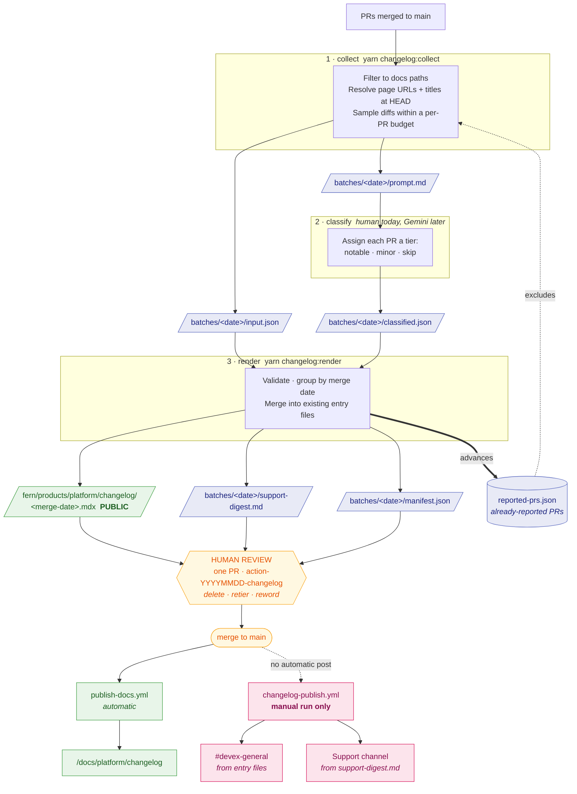

# Changelog pipeline state

**Nothing in this directory is published.** It is the changelog pipeline's internal
state and its non-public outputs.

The customer-facing changelog lives at `fern/products/platform/changelog/` — the
pipeline reads this location from `scripts/changelog/config.js`, the one place it
is defined. Fern requires
that folder to be named exactly `changelog`, which is why this one is
`changelog-state` — the two are otherwise easy to confuse, and only one ships.

## How a batch flows



Reading it: everything blue is state in this directory, green is customer-facing, amber is
the human gate, pink is manual-only today. The ledger is the one file that both gates the
input and gets advanced by the output — that loop is what makes re-runs safe.

## Layout

```
reported-prs.json          the ledger — see below
batches/<batch-date>/
├── prompt.md              generated prompt (gitignored: rebuilt from input.json)
├── classified.json        the reply, one tiering decision per PR
├── input.json             collected PR data — the record render validates against
├── support-digest.md      internal Support digest — source for the Support Slack post
└── manifest.json          which entry files belong to this batch
```

One folder per batch, so a batch's date appears once instead of in several filenames.

## reported-prs.json

The idempotency ledger: which PRs have been reported, and in which batch. **PR number,
not date, is the identity of a change.** Because of this file, re-running `collect` over
a window that overlaps an earlier one reports nothing twice — which is what makes
on-demand runs safe alongside a scheduled one.

It is committed by the same PR that publishes the entries, so the watermark advances
atomically with publication. Abandon a draft PR and its PRs correctly come back next run.

Deriving the watermark from published entry dates instead does not work: entries only
exist for `notable` changes, so a week of nothing but corrections never advances it and
re-reports those corrections forever. The ledger is therefore written even for a batch
where every PR was skipped.

## manifest.json

Which entry files belong to a batch, plus the `##` headings in each that were already
reported earlier. The Slack digests read this to scope themselves to what is new.

Adding a manifest is also what triggers the Slack posts once `changelog-publish.yml` is
switched back to its push trigger. Today that workflow is manual, so nothing is sent
unless someone runs it.

## Regenerating

`support-digest.md`, `manifest.json`, and the entry files are derived: re-run
`yarn changelog:render` for the batch and they come back byte-identical.

`prompt.md` is not committed. It is exactly `buildPrompt(input.prs, input.window)` — the
same PR data a second time, and the largest thing a batch writes at ~80KB a week. Rebuild
it with `yarn changelog:prompt --date <date>`; `collect` also writes it locally, so
running the pipeline by hand needs no extra step.

`input.json` **is** committed, because it is only *approximately* reproducible: `collect`
resolves page titles and URLs at `HEAD` and reads PR bodies as they stand now, so
re-running it weeks later yields a similar file, not the same one. It is the record of
what the classifier saw, and `render` validates against it. The draft PR body prints the
exact command that produced it.

`classified.json` is not reproducible at all — it holds judgment, not derivation. Do not
delete it.

## Related

- `scripts/changelog/` — the collect / render / slack-digest scripts
- `.github/scripts/changelog-criteria.cjs` — the tiering rubric; **edit this** when the
  digests are too noisy or too quiet
- `.github/scripts/changelog-prompt.cjs` — the prompt builder, shared by the human path
  and the (not yet enabled) automated one
