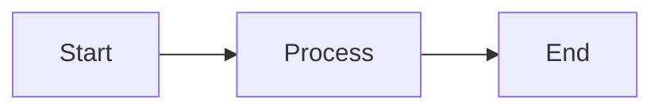

# CLAUDE.md - Project Instructions for Claude Code

## Project Overview

This repository contains the Fern documentation configuration for SignalWire.
Content is being migrated from a Docusaurus-based documentation site to Fern.

## Shared Memories (Serena)

Additional project context and session notes are stored in `.serena/memories/`.
These memories are version-controlled and shared with the team.

To access these memories programmatically,
ask the user to install the [Serena MCP plugin](https://github.com/oraios/serena).
Preferably, install the plugin via Claude's `/plugin` command.
Once installed, you can use Serena tools like `list_memories` and `read_memory` to retrieve stored context.

## Directory Structure

```
fern/
├── docs.yml           # Main docs configuration
├── docs/              # Shared documentation components
├── images/            # All images (use /images/ paths)
├── openapi-specs/     # OpenAPI specifications
└── products/          # Product-specific documentation
    ├── home/
    ├── platform/
    ├── swml/
    └── ...

tools/scripts/         # Migration scripts
.serena/memories/      # Session notes and migration logs
```

## Docusaurus to Fern Migration Patterns

When migrating MDX content from Docusaurus to Fern,
apply these conversions:

### Global Replacements

| Docusaurus | Fern |
|------------|------|
| `className=` | `class=` |
| `<Tooltips>` | `<Tooltip>` |

### Remove Docusaurus Imports

Delete all import lines for:
- `import ... from '@site/...'`
- `import ... from 'react-icons/...'`
- `import ... from '@theme/...'`

### Component Migration

**Has Fern equivalent:**
| Docusaurus | Fern |
|------------|------|
| `<APIField>` | `<ParamField>` |
| `<Admonition>` | `<Note>`, `<Tip>`, `<Warning>`, etc. |
| `<CodeBlock>` | Fenced code blocks or `<CodeBlock>` in `<CodeBlocks>` |
| `<Tabs>` with `<TabItem>` | `<Tabs>` with `<Tab title="...">` |
| `<details>` | `<Accordion title="...">` |
| `<Subtitle>` | Frontmatter `subtitle:` field |

**TabItem → Tab conversion:**
```jsx
// BEFORE (Docusaurus)
<Tabs>
  <TabItem value="js" label="JavaScript" default>
    Content here
  </TabItem>
</Tabs>

// AFTER (Fern)
<Tabs>
  <Tab title="JavaScript">
    Content here
  </Tab>
</Tabs>
```

**Fern-specific components:**
- `<Steps>` with `<Step>` — numbered sequential steps
- `<Cards>` — Wrapper for multiple `<Card>` components (note plural)
- `<Accordion>` / `<AccordionGroup>` — Collapsible sections
- `<Frame>` — Image wrapper with captions
- `<Indent>` — Visual indentation for nested parameters

**No Fern equivalent (rewrite or remove):**
- `<InstallHero>` — rewrite as static content
- `<GuidesList>` / `<GuidesListMirror>` — rewrite as manual Card links
- `<UseCaseLinks>` / `<UseCaseView>` — rewrite as static content or Cards
- `<DocCardList />` — rewrite as explicit Card links
- `<ReleaseCard>` — rewrite as static content
- `<Sigmond>` — remove or rewrite
- `<Tables>` — use standard Markdown tables
- `<Slideshow>` — rewrite as static images or remove

### Image Paths

Images from the old Docusaurus site were bulk migrated to `/fern/images/`.

In Docusaurus, images could be referenced via:
- `@image/` shorthand (pointed to the images directory)
- `/img/` paths (pointed to Docusaurus' `/static/img/` directory, rarely used)

In Fern, all images live in `/fern/images/` and are referenced via `/images/...`:

```md
// BEFORE (Docusaurus)


// AFTER (Fern)


```

When migrating new content,
ensure the referenced images exist in `/fern/images/`.
If not, copy them from the source and update paths accordingly.

### Admonition / Callout Syntax

Docusaurus uses `:::type` to open and `:::` to close admonitions.
Both must be replaced with Fern callout components:

```md
// BEFORE (Docusaurus)
:::tip
This is a tip.
:::

// AFTER (Fern)
<Tip>
This is a tip.
</Tip>
```

Type mappings:
| Docusaurus | Fern |
|------------|------|
| `:::tip` / `:::` | `<Tip>` / `</Tip>` |
| `:::note` / `:::` | `<Note>` / `</Note>` |
| `:::warning` / `:::` | `<Warning>` / `</Warning>` |
| `:::info` / `:::` | `<Info>` / `</Info>` |
| `:::caution` / `:::` | `<Warning>` / `</Warning>` |

**All Fern callout types:** `<Info>`, `<Warning>`, `<Success>`, `<Error>`, `<Note>`, `<Launch>`, `<Tip>`, `<Check>`

**React-style Admonitions:**
Docusaurus also supports `<Admonition>` components.
Convert these by mapping the `type` attribute to the corresponding Fern component.
Fern callouts support `title` and `icon` properties:

```jsx
// BEFORE (Docusaurus)
<Admonition type="info" title="Fun fact">
This simple YAML/JSON document is a complete calling application!
</Admonition>

// AFTER (Fern)
<Info title="Fun fact">
This simple YAML/JSON document is a complete calling application!
</Info>
```

Fern callout properties:
- `title` (string) - Optional title for the callout
- `icon` (string) - Optional Font Awesome icon name (e.g., `icon="skull-crossbones"`)

### Code Blocks with Tabs (andJSON)

Docusaurus SWML docs used a custom `andJSON` tag to auto-generate a companion JSON tab:

````md
// BEFORE (Docusaurus) - auto-generated JSON tab
```yaml andJSON
version: 1.0.0
sections:
  main:
    - answer: {}
```
````

Fern has no auto-generation.
Use `<CodeBlocks>` with explicit `<CodeBlock title="...">` for each language:

````jsx
// AFTER (Fern) - explicit YAML and JSON tabs
<CodeBlocks>
<CodeBlock title="YAML">
```yaml
version: 1.0.0
sections:
  main:
    - answer: {}
```
</CodeBlock>
<CodeBlock title="JSON">
```json
{
  "version": "1.0.0",
  "sections": {
    "main": [
      { "answer": {} }
    ]
  }
}
```
</CodeBlock>
</CodeBlocks>
````

When migrating `andJSON` blocks, you must manually write the JSON equivalent.

### Cards and CardGroups

Fern supports `<Card>` and `<CardGroup>` components with different properties than Docusaurus.

**Key differences from Docusaurus:**
- Remove React icon imports — use Font Awesome icon names or SVG paths instead
- Remove `description` prop — use card body content instead
- `icon` accepts: Font Awesome name (e.g., `"regular droplet"`), SVG path, or `` element

```jsx
// BEFORE (Docusaurus)
import { FaRobot } from "react-icons/fa"
<Card icon={<FaRobot />} description="Build AI apps">

// AFTER (Fern)
<Card title="Agents SDK" icon="regular robot" href="/sdks/agents-sdk">
  Build AI apps
</Card>
```

**CardGroup:** Use `cols={N}` for column count (JSX expression, not string):

```jsx
<CardGroup cols={2}>
  <Card title="First" href="/first">Description</Card>
  <Card title="Second" href="/second">Description</Card>
</CardGroup>
```

**Card properties:**
- `title` (string) - Card title
- `icon` (string | img) - Font Awesome icon (e.g., `"brands python"`), SVG path, or `` element
- `href` (string) - Makes card clickable
- `iconPosition` (`"top"` | `"left"`) - Icon placement
- `src` (string) - Image URL for image cards
- `imagePosition` (`"top"` | `"left"` | `"right"` | `"bottom"`) - Image placement

### Dynamic JSX to Static Content

Convert `.map()` iterations to static markup:

```jsx
// BEFORE (Docusaurus)
export const items = [{ name: "Foo", link: "/foo" }, ...]
<CardGroup>
  {items.map(item => <Card title={item.name} href={item.link} />)}
</CardGroup>

// AFTER (Fern)
<CardGroup cols={2}>
  <Card title="Foo" href="/foo">
    Description here
  </Card>
</CardGroup>
```

### Heading Anchors

Convert Docusaurus `{#anchor}` syntax to Fern `[#anchor]` syntax:

```md
// BEFORE (Docusaurus)
### My Heading {#my-anchor}

// AFTER (Fern)
### My Heading [#my-anchor]
```

### HTML Comments

Remove all HTML comments — they can cause MDX parse errors:

```md
// REMOVE these
<!-- This is a comment -->
<!-- TODO: fix this later -->
```

### Badge and Parameter Span Classes

Docusaurus uses custom span classes for styling. Convert to Fern equivalents:

```jsx
// BEFORE (Docusaurus)
<span className="badge badge--warning">BETA</span>
<span className="badge badge--danger">DEPRECATED</span>
<span className="optional-arg">optional</span>
<span className="required-arg">required</span>

// AFTER (Fern)
// For badges, use inline styling or remove
**BETA** or <span class="badge">BETA</span>

// For parameters, use ParamField required prop instead
<ParamField path="name" type="string" required={true}>...</ParamField>
<ParamField path="name" type="string" required={false}>...</ParamField>
```

### Relative Links

Always convert relative links to absolute slugs:

```md
// BEFORE (Docusaurus) - relative paths
[See details](./other-page.mdx)
[Reference](../folder/page.mdx#section)

// AFTER (Fern) - absolute slugs
[See details](/category/other-page)
[Reference](/category/folder/page#section)
```

### Mermaid Diagrams

Mermaid diagrams work as-is in Fern. No conversion needed:

````md

````

### Frontmatter

**Remove:** `sidebar_position:` (Fern uses YAML navigation files instead)

**Convert `<Subtitle>` to frontmatter:**
```yaml
---
title: Page Title
subtitle: This was previously a <Subtitle> component
---
```

## Fern Components Reference

Full documentation: https://buildwithfern.com/learn/docs/writing-content/components/overview

### Frame

Container for images with optional captions and backgrounds.

```jsx
<Frame caption="Description of image" background="subtle">
  
</Frame>
```

Props: `caption` (string), `background` (`"subtle"` | `"default"`)

### Code Blocks

Fern code blocks support many features beyond basic syntax highlighting:

````md
```js Title Here {2-4} focus={5-6} maxLines=15 wordWrap
// Line highlighting with {lines}, focusing with focus={lines}
// maxLines limits visible lines (default 20, 0 to disable)
// wordWrap wraps long lines instead of scrolling
```
````

**Embed from files** with `<Code>`:
```jsx
<Code src="snippets/example.js" title="Example" language="js" />
<Code src="https://raw.githubusercontent.com/..." title="Remote file" />
```

**Tabbed code blocks** with `<CodeBlocks>`:
```jsx
<CodeBlocks>
  ```python title="Python"
  print("hello")
  ```
  ```typescript title="TypeScript"
  console.log("hello");
  ```
</CodeBlocks>
```

Code blocks with the same language auto-sync across the page.

### Steps

Sequential numbered steps for tutorials:

```jsx
<Steps>
  <Step title="First step">
    Content for step 1
  </Step>
  <Step title="Second step">
    Content for step 2
  </Step>
</Steps>
```

Props on `<Steps>`: `toc` (boolean) — include in table of contents
Props on `<Step>`: `title` (string), `id` (string)

### Accordion

Collapsible sections for FAQs or optional content:

```jsx
<AccordionGroup>
  <Accordion title="Question 1" defaultOpen={true}>
    Answer 1 (open by default)
  </Accordion>
  <Accordion title="Question 2">
    Answer 2
  </Accordion>
</AccordionGroup>
```

Props: `title` (required), `defaultOpen` (boolean), `id` (string)

### Tabs

Tabbed content panels:

```jsx
<Tabs>
  <Tab title="First Tab">
    Content 1
  </Tab>
  <Tab title="Second Tab">
    Content 2
  </Tab>
</Tabs>
```

### Indent

Visual indentation with guide lines for nested parameters:

```jsx
<ParamField path="config" type="object">Config object</ParamField>
<Indent>
  <ParamField path="config.host" type="string">Hostname</ParamField>
  <ParamField path="config.port" type="number">Port</ParamField>
</Indent>
```

### Tables

Standard markdown tables work. For long tables, use `<StickyTable>`:

```jsx
<StickyTable>
| Header 1 | Header 2 |
|----------|----------|
| Cell 1   | Cell 2   |
</StickyTable>
```

### Tooltip

Hover tooltips for definitions:

```jsx
The <Tooltip tip="Explanation text">term</Tooltip> is important.
```

Props: `tip` (string | ReactNode), `side` (`"top"` | `"right"` | `"bottom"` | `"left"`)

## Common Issues to Fix

- Mismatched tags (e.g., `<Info>` opened but `</Tip>` closed)
- Unclosed `:::` admonition blocks
- Windows line endings (`\r`)
- HTML comments that should be removed
- Blank lines inside JSX components that cause parse errors

## Commands

```bash
# Preview docs locally
fern docs dev

# Check links
fern check
fern check --strict-broken-links

# Run migration script on a single file
./tools/scripts/convert-docusaurus-to-fern.sh <input.mdx> <output.mdx>
```

## Testing Changes

Always run `fern docs dev` after migrations to catch:
- MDX parse errors
- Missing images
- Broken internal links
