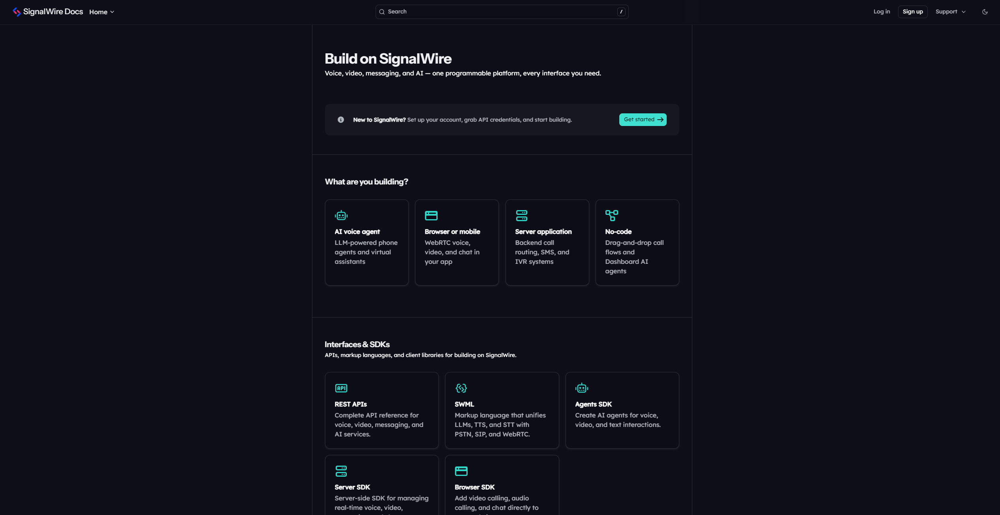

<!-- Header -->
<div align="center">
    <a href="https://signalwire.com">
        
    </a>
    <h1>SignalWire Docs</h1>
    <p><strong>Developer documentation for the SignalWire communications platform.</strong><br/>Voice, video, messaging, and AI -- all programmable through a single API.</p>
    <p><i>Built with <a href="https://buildwithfern.com/">Fern</a></i></p>
</div>

<!-- Badges -->
<p align="center">
    <a href="https://signalwire.com/docs"></a>
    <a href="https://discord.com/invite/F2WNYTNjuF"></a>
    <a href="LICENSE"></a>
    <a href="https://github.com/signalwire/docs"></a>
</p>

<!-- Quick Links -->
<p align="center">
    <a href="https://signalwire.com/docs"><b>Get Started</b></a> &nbsp;&middot;&nbsp;
    <a href="https://signalwire.com/docs/apis"><b>API Reference</b></a> &nbsp;&middot;&nbsp;
    <a href="https://signalwire.com/docs/swml"><b>SWML</b></a> &nbsp;&middot;&nbsp;
    <a href="https://signalwire.com/docs/agents-sdk"><b>Agents SDK</b></a> &nbsp;&middot;&nbsp;
    <a href="https://github.com/signalwire/docs/issues/new/choose"><b>Report an Issue</b></a>
</p>

<br/>
<div align="center">
    <a href="https://signalwire.com/docs">
        <picture>
            
        </picture>
    </a>
</div>

---

## Overview

This is the source repository for [signalwire.com/docs](https://signalwire.com/docs) -- the developer documentation for the SignalWire platform. The site is built with [Fern](https://buildwithfern.com/) and auto-deployed on every merge to `main`.

### Products

<table>
<tr>
<td width="33%" valign="top">

**Products**

| | Product | Description |
|---|---|---|
| | [Platform](https://signalwire.com/docs/platform) | Dashboard, configuration & administration |
| | [Call Flow Builder](https://signalwire.com/docs/call-flow-builder) | Drag-and-drop call flows and AI agents |

</td>
<td width="33%" valign="top">

**SDKs**

| | Product | Description |
|---|---|---|
| | [Agents SDK](https://signalwire.com/docs/agents-sdk) | Build AI-powered voice agents |
| | [Server SDK](https://signalwire.com/docs/server-sdk) | Control communications in real time |
| | [Browser SDK](https://signalwire.com/docs/browser-sdk) | Voice, video & chat in the browser |

</td>
<td width="33%" valign="top">

**APIs & Languages**

| | Product | Description |
|---|---|---|
| | [REST APIs](https://signalwire.com/docs/apis) | SMS, calls & account management |
| | [SWML](https://signalwire.com/docs/swml) | Markup language for communication apps |
| | [Compatibility API](https://signalwire.com/docs/compatibility-api) | Drop-in migration from TwiML |

</td>
</tr>
</table>

### Structure

```
signalwire-fern-config/
├── fern/
│   ├── products/          # Guides, quickstarts, and reference docs by product
│   ├── apis/              # Generated OpenAPI specs (consumed by Fern)
│   ├── assets/            # Images, icons, and static assets
│   ├── snippets/          # Reusable MDX snippets
│   └── docs.yml           # Top-level Fern config (nav, theme, layout)
├── specs/                 # TypeSpec source files → compile to OpenAPI
├── scripts/               # Build and CI utilities
└── lychee.toml            # Link checker configuration
```

### License

Available under the Creative Commons **CC BY-NC-SA 4.0** license. See [LICENSE](LICENSE) for full terms.

---

## Contribute

Whether you're fixing a typo, reporting missing information, or submitting new content -- all contributions are welcome.

1. [Fork the repository](https://docs.github.com/en/get-started/quickstart/fork-a-repo).
2. Follow the [Usage](#usage) instructions to set up local development.
3. Make your changes and [submit a pull request](https://docs.github.com/en/pull-requests/collaborating-with-pull-requests/proposing-changes-to-your-work-with-pull-requests/creating-a-pull-request).

> [!IMPORTANT]
> Contributions to the API reference or SWML schema require additional workflows.
> Spec source lives in `specs/` as [TypeSpec](https://typespec.io/docs) (`.tsp`) and compiles to OpenAPI / JSON Schema in `fern/apis/` and `specs/swml/**/tsp-output/`.
> See the [TypeSpec documentation](https://typespec.io/docs) for guidance on editing spec files.

### API specifications

The [`specs/`](specs/) workspace holds three sibling TypeSpec projects. Each one declares its own `tspconfig.yaml` and emits a different downstream artifact:

| Project | Source | Emits | Powers |
|---|---|---|---|
| **SignalWire REST API** | [`specs/signalwire-rest/`](specs/signalwire-rest/) | `fern/apis/signalwire-rest/openapi.yaml` (OpenAPI 3.1) | The [`/docs/apis`](https://signalwire.com/docs/apis) reference |
| **Compatibility API** | [`specs/compatibility-api/`](specs/compatibility-api/) | `fern/apis/compatibility/openapi.yaml` (OpenAPI 3.1) | The [`/docs/compatibility-api`](https://signalwire.com/docs/compatibility-api) reference |
| **SWML** | [`specs/swml/`](specs/swml/) | `specs/swml/**/tsp-output/.../SWMLObject.json` (JSON Schema) | SWML editor + runtime validator tooling |

Shared building blocks live in [`specs/_shared/`](specs/_shared/): repo-wide scalars (`uuid`, `jwt`), status-code aliases, and a custom `@webhook(...)` decorator that emits OpenAPI 3.1 `webhooks:` entries for outbound payloads SignalWire sends to your servers.

```bash
yarn build:specs       # Compile every TypeSpec project → OpenAPI + JSON Schema
yarn format:specs      # tsp format every .tsp file in the workspace
```

> [!NOTE]
> Generated files (`fern/apis/*/openapi.yaml` and `specs/swml/**/tsp-output/`) are committed but **not** hand-edited. Always change the TypeSpec source, then rebuild — Fern and the SWML tooling read the generated artifacts directly.

---

## Usage

**Prerequisites:** [Node.js](https://nodejs.org/en) (v22+) and [Yarn](https://classic.yarnpkg.com/) (v1).

```bash
# 1. Clone and install
git clone https://github.com/signalwire/docs.git
cd docs
yarn install

# 2. Start local dev server (live reload)
yarn start:dev

# 3. Build (compiles specs + generates Fern preview)
yarn build
```

> `yarn start` runs `fern check` before launching the dev server -- use this to validate configuration.

### Link checking

Automated link checking via [Lychee](https://lychee.cli.rs/) runs on every PR (results posted as a comment) and daily against production (Slack alerts on failure).

<details>
<summary><b>Run locally</b></summary>

```bash
# Install Lychee
brew install lychee          # macOS
cargo install lychee         # Linux

# Check production sitemap
yarn check-links

# Check a preview deployment
node scripts/check-links.js --sitemap https://preview-xxx.docs.buildwithfern.com/sitemap.xml

# Skip GitHub verification for faster checks
node scripts/check-links.js --skip-github
```

Configuration: `lychee.toml`

</details>

---

## Contact and Support

The SignalWire Docs are maintained by the **Developer Experience** team.

| | |
|---|---|
| Questions & feedback | devex@signalwire.com |
| Support portal | [support.signalwire.com](https://support.signalwire.com/hc/en-us) |
| Community | [Discord](https://discord.com/invite/F2WNYTNjuF) |
