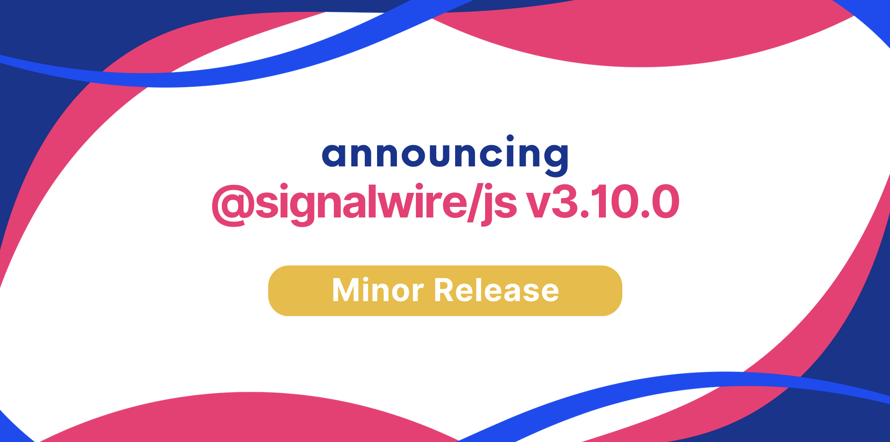

We are happy to announce **JavaScript SDK 3.10.0**.

Upgrading is straightforward with our release process, which adheres to [Semantic Versioning](https://semver.org/).
Minor versions are guaranteed to not have breaking changes, so you can upgrade with confidence.




{/* truncate */}

Version 3.10 of the JavaScript SDK is out! Here are the main highlights.

## Highlights

### Positions

We have introduced the concept of *positions*. Every video layout now has a set of predetermined positions (e.g. _reserved-1_, _standard-1_, _off-cavas_), to which you can assign members. For example:

```js
await roomSession.setMemberPosition({
  memberId: "1bf4d4fb-a3e4-4d46-80a8-3ebfdceb2a60",
  position: "off-canvas"
})
```

Other methods have been updated to support positions. For example, to share the screen while changing layout:
```js
await roomSession.startScreenShare({
  audio: true,
  video: true,
  layout: "screen-share",
  positions: {
    "self": "reserved-1"
  }
})
```

## New

 - Exposed `setMeta` and `setMemberMeta` methods on the `RoomSession` (#452)

## Improvements

 - Updated default screenShare audio constraints (#457)

## Bug fixes

 - Fixed issue with local video overlay when user is video muted (#455)
 - Fixed Chat methods that required the underlay client to be connected (#469)
 - Fixed getDisplayMedia signature (#463)