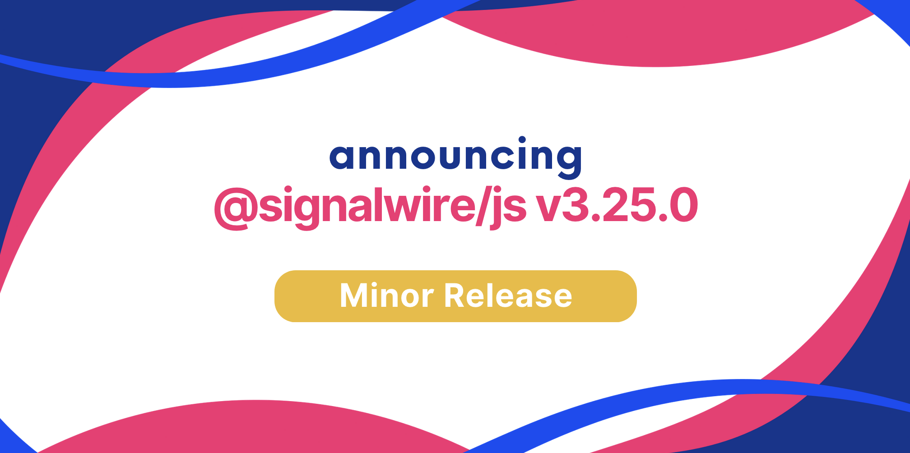

We are happy to announce **JavaScript SDK 3.25.0**.

Upgrading is straightforward with our release process, which adheres to [Semantic Versioning](https://semver.org/).
Minor versions are guaranteed to not have breaking changes, so you can upgrade with confidence.




{/* truncate */}

## Added

- The Browser SDK for Video RoomSession objects now includes a new function, `sendDigits`, which enables users to transmit DTMF (Dual-Tone Multi-Frequency) tones within a RoomSession. This enhancement allows for the sending of specific tone signals, akin to those produced by telephone key presses, directly within the video session environment.

```js
 room.sendDigits('1')
```

- The `hand-raise API` is a new feature added to Video SDKs for both real-time and browser-based applications. It introduces a visual cue around a participant's video when they 'raise their hand', enhancing interaction in virtual meetings. This API lets participants indicate their wish to speak without interrupting the session. Key features include the ability for participants to raise or lower their hands, and for moderators to prioritize those who have raised their hands, thereby improving the management and structure of participation in online group sessions.

```js
// `room` is an instance of a RoomSession
// 'member' is an instance of RoomSessionMember


// Raise hand (browser only)
await room.setRaisedHand()

// Lower hand (browser only)
await room.setRaisedHand({ raised: false })

// Raise hand for a specific member
await room.setRaisedHand({ memberId: '...' })

// Lower hand for a specific member
await room.setRaisedHand({ raised: false, memberId: '...' })

// Enable/disable handraise prioritization
await room.setPrioritizeHandraise(true)

// Raise or lower this member's hand.
await member.setRaisedHand()

// check if a member's hand is raised
console.log(member.handraised)
```

---

## Fixes

- Updated dependencies
- Resolve `CallCollect.ended()` only when `state` is NOT `collecting` and `final` is either `undefined` or `true`, and `result.type` is a valid `END_STATE`
