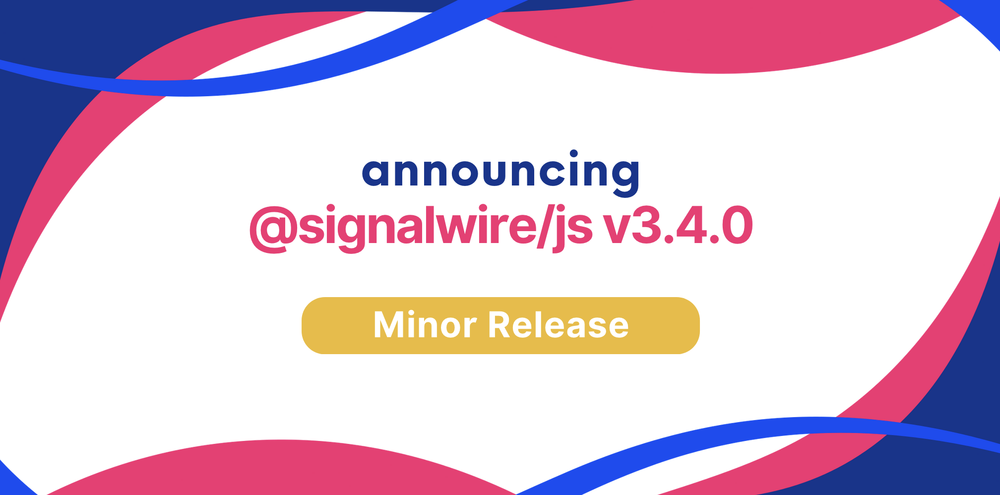

We are happy to announce **JavaScript SDK 3.4.0**.

Upgrading is straightforward with our release process, which adheres to [Semantic Versioning](https://semver.org/).
Minor versions are guaranteed to not have breaking changes, so you can upgrade with confidence.




{/* truncate */}

We are excited to announce the latest release of the JavaScript SDK. This is a small release that focuses on the **Playback** feature.

## Highlights

You can use the Playback feature to play a video stream inside a room session. For example:

```typescript
const url = 'rtmp://...'
const playback = await roomSession.play({ url, volume: 10 })

await playback.pause()
await playback.stop()
```

At the moment, the supported formats are:
 - RTMP (rtmp:// and rtmps://)
 - HLS (.m3u8, application/x-mpegurl)
 - MPEG-DASH (.mpd, application/dash+xml)

To use this feature, make sure to enable the `room.playback` permission when generating the Video Room Token. You will also receive the following RoomSession events:

 - `playback.started`: a playback has started
 - `playback.updated`: a playback has been updated
 - `playback.ended`: a playback has ended