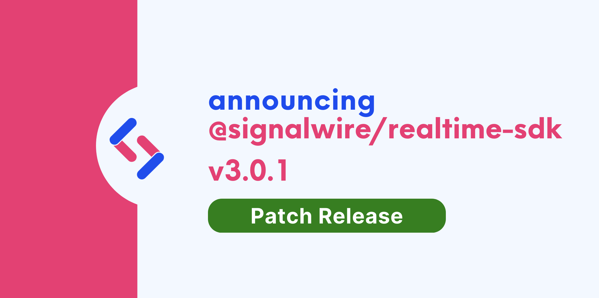

We are happy to announce **Realtime-API SDK 3.0.1**.

Upgrading is straightforward with our release process, which adheres to [Semantic Versioning](https://semver.org/).
Minor versions are guaranteed to not have breaking changes, so you can upgrade with confidence.

{/* truncate */}

This is a maintenance release that contains a couple of minor fixes and improvements.

## Fixes
- Fix `task.received` handler on the Task namespace. (#553) 47ed1712

## Improvements
- Add `layoutName` to the RoomSession interface. (#542) 875b2bb8