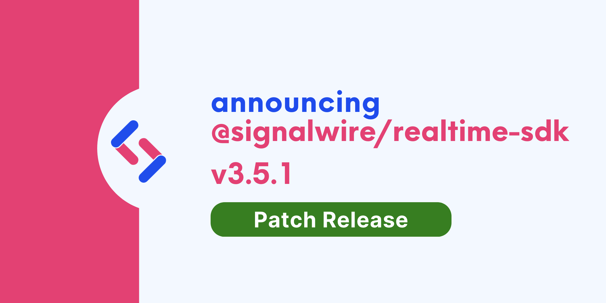

We are happy to announce **Realtime-API SDK 3.5.1**.

Upgrading is straightforward with our release process, which adheres to [Semantic Versioning](https://semver.org/).
Minor versions are guaranteed to not have breaking changes, so you can upgrade with confidence.

{/* truncate */}

Version 3.5.1 is a minor release that contains a couple of fixes.

## Fixes

We have updated the objects returned by `getRecordings`, `getPlaybacks`, and `getStreams` to ensure they include `room_session_id`. [50f2e07](https://github.com/signalwire/signalwire-js/commit/50f2e07f2e51a11b202d30b38cd37bc0d2270dc6)

We fixed a race condition on auto-connect Clients. [31af820](https://github.com/signalwire/signalwire-js/commit/31af820961f6c1cdc810b3b42a4dcf543610fcb4)

