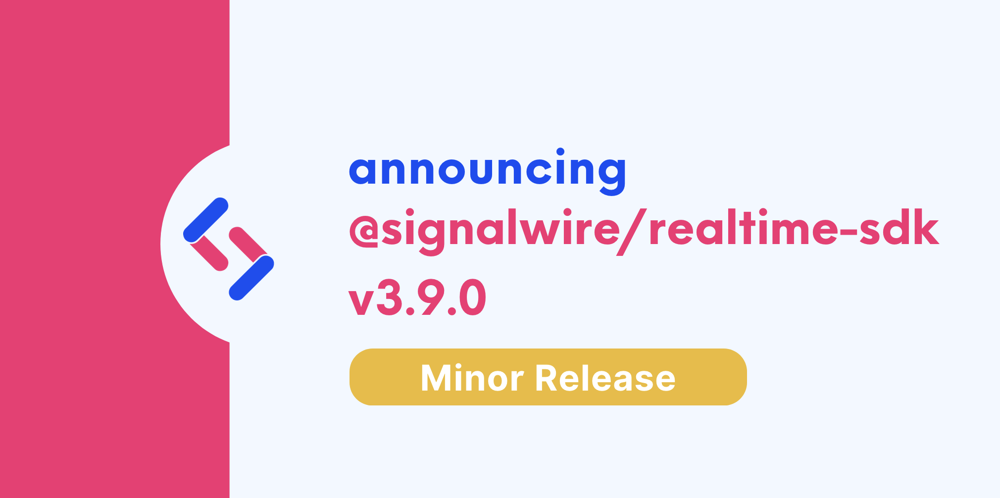

We are happy to announce **Realtime-API SDK 3.9.0**.


Upgrading is straightforward with our release process, which adheres to [Semantic Versioning](https://semver.org/).
Minor versions are guaranteed to not have breaking changes, so you can upgrade with confidence.




{/* truncate */}

Version 3.9 of the RELAY Realtime SDK includes a couple of improvements for Voice calls.

## Highlights

### Enhanced Speech Recognition

Enhanced speech recognition is now available for speech collection. `Prompt` and `Collect` methods use a speech configuration object to specify how to collect speech. The new optional key `model` enables enhanced speech recognition at an added cost with any of three possible values: `enhanced`, `enhanced.phone_call`, or `enhanced.video`. `phone_call` optimizes speech recognition for phone calls at an 8khz sample rate. `video` optimizes speech recognition for video calls at a 16khz sample rate. The value `enhanced` will automatically detect whether to optimize with the phone call or video setting. [`4e8e5b0d`](https://github.com/signalwire/signalwire-js/commit/4e8e5b0d859733b9c7455150cd837e42e851ef29)

```javascript
const collect = await call.collect({
  speech: {
    endSilenceTimeout: 1,
    speechTimeout: 60,
    model: "enhanced",
    hints: ["one", "two", "three", "four", "five"]
  },
});
const result = await collect.ended();
```

See our [Voice pricing page](https://signalwire.com/pricing/voice) for pricing information on advanced features.

### Set a Maximum Price per Minute

The parameter `maxPricePerMinute` has been added to `call.dial` and `call.connect` methods to allow users to set a maximum price limit for a call to be created. If the rate for the call is greater than this value, the call will not be created. [`aa31e1a0`](https://github.com/signalwire/signalwire-js/commit/aa31e1a0307e7c1f3927d985ecd48ec06b9a1312)

```javascript
try {
  const call = await client.dialPhone({
    from: "+YYYYYYYYYY",
    to: "+XXXXXXXXXX",
    timeout: 30,
    maxPricePerMinute: 0.0075,
  });
} catch (e) {
  console.log("Call not completed.");
}
```

The cost of a call can vary by rate center and call features. In the example above, if the call charge is greater than $0.0075, the call is not created, and a 30010 error will be returned with the message, "MaxPricePerMinute was exceeded. This call's cost is XX."