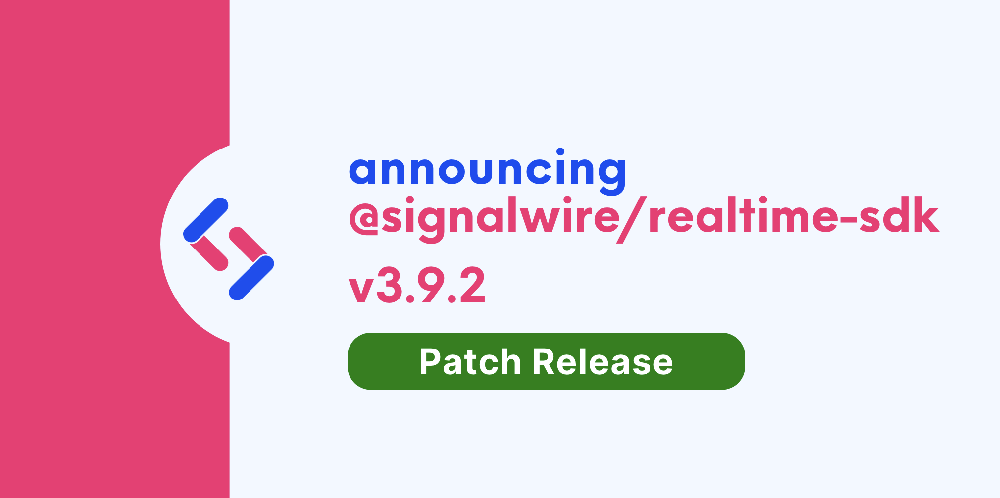

We are happy to announce **Realtime-API SDK 3.9.2**.


Upgrading is straightforward with our release process, which adheres to [Semantic Versioning](https://semver.org/).
Minor versions are guaranteed to not have breaking changes, so you can upgrade with confidence.




{/* truncate */}

## Improvements

- We now support call state webhook callbacks with `callStateUrl` and `callStateEvents` parameters on `dial` and `connect` Voice Call methods. [`4e1116b6`](https://github.com/signalwire/signalwire-js/commit/4e1116b606ad41dc649c44eccf4f8b28d0dfa7d8)

Call states you may specify with `callStateEvents` include `created`, `ringing`, `answered`, `ending`, and `ended`.

If `callStateUrl` and `callStateEvents` parameters are included when creating or connecting a call:

```js
      const call = await client.dialPhone({
        to: '+123456',
        from: '+19876',
        timeout: 30,
        callStateUrl: 'http://mydomain.com/hook',
        callStateEvents: ['ended', 'answered']
      })
```

the RELAY system will make a request to the specified webhook with the following payload:

```js
"params": {
  "event_type": "calling.call.state",
  "event_channel": "signalwire_...",
  "timestamp": 123457.1234,
  "space_id": "<UUID>",
  "project_id": "<UUID>",
  "params": {
    "node_id": "<UUID>",
    "call_id": "<UUID>",
    "tag": "<ID>",
    "device": {
      "type": "phone",
      "params": {
          "from_number": "+15551231234",
          "to_number": "+15553214321"
      }
    },
    "parent": {
      "node_id": "<UUID>",
      "call_id": "<UUID>",
      "device_type": "phone"
    },
    "peer": {
      "node_id": "<UUID>",
      "call_id": "<UUID>"
    },
    "call_state": "ended",
    "start_time": <time in ms>,
    "answer_time": <time in ms>,
    "end_time": <time in ms>,
    "created_by": "dial"
  }
}
```
