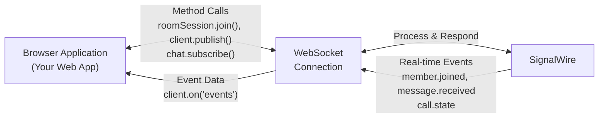
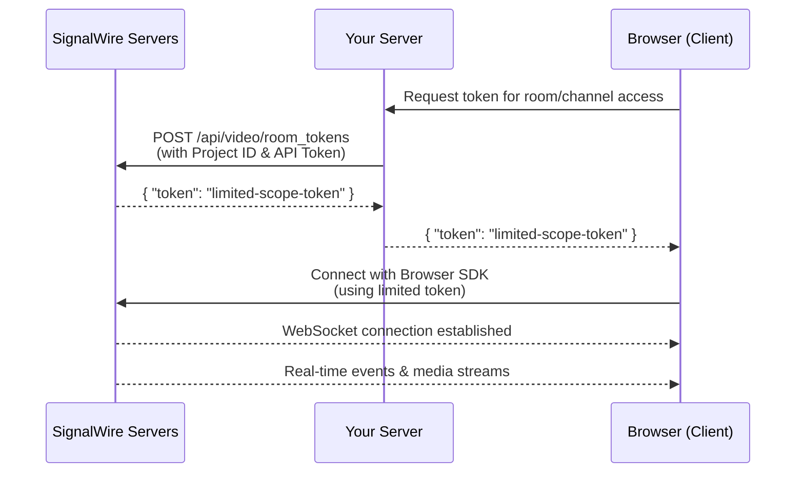

The SignalWire Browser SDK provides a comprehensive JavaScript interface for real-time communication services in web browsers.

## Core Concepts

### WebSocket Event Architecture

The SDK operates on a bidirectional WebSocket connection between your browser application and SignalWire's servers. This enables real-time communication through a structured event system:



When you call a method like `roomSession.join()`, the SDK sends your request over the WebSocket connection and SignalWire processes it and responds immediately. These method calls follow a request-response pattern - the returned promise resolves with the result data, such as joining a video room or publishing a message.

The `.on()` methods handle a different communication pattern: real-time event notifications. These are asynchronous events triggered by external actions - like when someone joins your video room (`member.joined`), sends you a message (`message.received`), or when device states change (`call.state`). Unlike method responses, these events arrive whenever the triggering action occurs, not as a direct response to your code.

### Authentication and Access Control

Browser SDK clients use token-based authentication for security. Since web browsers are untrusted environments where secrets can be exposed, API tokens must be kept on your server and used to generate limited-scope tokens for client use.

#### Server-to-Browser Authentication Flow



#### Token Types by Namespace

Different namespaces require specific token types:

```javascript
// Video Room Session - requires Room Token
const roomSession = new SignalWire.Video.RoomSession({
  token: "room-token-from-rest-api",        // Get from /api/video/room_tokens
  rootElement: document.getElementById("video-container")
});

// Chat Client - requires Chat Token  
const chatClient = new SignalWire.Chat.Client({
  token: "chat-token-from-rest-api"         // Get from /api/chat/tokens
});

// PubSub Client - requires PubSub Token
const pubSubClient = new SignalWire.PubSub.Client({
  token: "pubsub-token-from-rest-api"       // Get from /api/fabric/subscriber_tokens
});
```

#### Server-Side Token Generation

Your server uses Project ID and API Token to generate limited-scope tokens:

```javascript
// Example: Generate a Video Room Token
const response = await fetch('https://<YOUR_SPACE>.signalwire.com/api/video/room_tokens', {
  method: 'POST',
  headers: {
    'Authorization': 'Basic ' + btoa('<PROJECT_ID>:<API_TOKEN>'),
    'Content-Type': 'application/json'
  },
  body: JSON.stringify({
    room_name: "my_room",
    user_name: "John Smith",
    permissions: ["room.self.audio_mute", "room.self.video_mute"]
  })
});

const { token } = await response.json();
// Send this token to your browser client
```

This approach ensures your project credentials never expose to client-side code while providing scoped access to specific rooms, channels, or resources.


## Available Namespaces

<GuidesList />

## Classes

- [SignalWire Client](/sdks/browser-sdk/tech-ref/SignalWire%20Client)