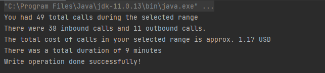

## Overview

This snippet will show how you can utilize the List Calls Endpoint to pull detailed call reports within a specific date range! The results will include some helpful summary stats about total calls, inbound vs outbound, total cost, and total duration. We will also export further detail on a per-call record basis to a CSV for record-keeping or extra review. 


import Tabs from '@theme/Tabs';
import TabItem from '@theme/TabItem';

<details>
  <summary>Full code example: How to Get Price Summaries for Voice</summary>

<Tabs>

<TabItem value="python" label="Python">

```python
from datetime import datetime
from signalwire.rest import Client as signalwire_client
import pandas as pd

client = signalwire_client("ProjectID", "AuthToken", signalwire_space_url='EXAMPLE.signalwire.com')

calls = client.calls.list(start_time_after=datetime(2022, 4, 1), start_time_before=datetime(2022, 4, 30))


d = []
direction = []

for record in calls:
    d.append((record.from_, record.to, record.start_time, record.sid, record.price, record.direction, record.duration))
    direction.append(record.direction)

total_inbound=int(direction.count("inbound"))
total_outbound=int(direction.count("outbound"))

df = pd.DataFrame(d, columns=('From', 'To', 'Date', 'Call SID',  'Price', 'Call Direction', 'Call Duration (s)'))
print(df)
df.to_csv('AprilCalls.csv', index=False, encoding='utf-8')

totalCalls = len(df)
totalCost = df['Price'].sum()
formattedCost = "${:,.2f}".format(totalCost)
totalDuration = round((df['Call Duration (s)'].sum())/60, 2)

print("You had " + str(totalCalls) + " total calls during your selected date range.")
print("There were " + str(total_inbound) + " inbound calls and " + str(total_outbound) + " outbound calls.")
print("The total cost of calls in your selected date range is approximately " + formattedCost + " USD.")
print("there was a total duration of " + str(totalDuration) + " minutes.")
```

</TabItem>

<TabItem value="java" label="Java">

```java
import com.google.gson.Gson;
import com.mashape.unirest.http.HttpResponse;
import com.mashape.unirest.http.JsonNode;
import com.mashape.unirest.http.Unirest;
import com.mashape.unirest.http.exceptions.UnirestException;

import java.io.File;
import java.io.IOException;
import java.io.PrintWriter;
import java.nio.file.Paths;
import java.util.ArrayList;
import java.util.List;
import java.util.Objects;
import java.util.stream.Collectors;
import java.util.stream.Stream;

public class CallPriceSummary {
    static String PROJECT_ID = "<ENTER-PROJECT-ID>";

    static String API_TOKEN = "<ENTER-API-TOKEN>";

    static String SPACE_NAME = "<ENTER-SPACE-NAME>";

    static ArrayList<String[]> dataLines = new ArrayList<>();

    static JsonNode loadCalls(String spaceName, String projectId, String apiToken) {
        String BASE_URL = String.format("https://%s.signalwire.com/api/laml/2010-04-01/Accounts/%s/Calls", spaceName, projectId);

        try {
            HttpResponse<JsonNode> response = Unirest.get(BASE_URL)
                    .basicAuth(projectId, apiToken)
                    .header("accept", "application/json")
                    .asJson();

            if (response.getStatus() == 200) return response.getBody();

        } catch (UnirestException e) {
            e.printStackTrace();
            return null;
        }

        return null;
    }

    public static void main(String[] args) {
        try {

            dataLines.add(new String[]{"From", "To", "Date", "Call Sid", "Price", "Call direction", "Call duration (secs)"});

            Gson gson = new Gson();

            int totalCalls = 0;
            double totalCost = 0d;
            int totalDuration = 0;
            int inbound = 0;
            int outbound = 0;

            JsonNode request = loadCalls(SPACE_NAME, PROJECT_ID, API_TOKEN);

            if (request != null) {
                SummaryResponse response = gson.fromJson(request.toString(), SummaryResponse.class);

                for (Call call : response.calls) {
                    dataLines.add(new String[]{call.from, call.to, call.date_created, call.sid, String.valueOf(call.price), call.direction, String.valueOf(call.duration)});
                    totalCalls = totalCalls + 1;
                    totalCost = totalCost + call.price;
                    totalDuration = totalDuration + call.duration;

                    if (Objects.equals(call.direction, "inbound")) {
                        inbound++;
                    } else {
                        outbound++;
                    }
                }

                System.out.println("You had " + totalCalls + " total calls during the selected range");
                System.out.println("There were " + inbound + " inbound calls and " + outbound + " outbound calls.");
                System.out.println("The total cost of calls in your selected range is approx. " + String.format("%.2f USD", totalCost));
                System.out.println("There was a total duration of " + (totalDuration / 60) + " minutes");
                createAndPopulateCSV();
            }

        } catch (Exception exception) {
            exception.printStackTrace();
        }
    }

    public static String convertToCsv(String[] data) {
        return Stream.of(data)
                .map(CallPriceSummary::escapeSpecialCharacters)
                .collect(Collectors.joining(","));
    }

    public static void createAndPopulateCSV() throws IOException {

        // Auto-generate the name of the file
        String filename = "call_summary" + System.currentTimeMillis();

        // Get the absolute path to the folder you would like to create in the project directory
        File file = new File(Paths.get("csv").toAbsolutePath().toUri());

        // if file doesn't exist. create a new folder
        if (!file.exists()) {
            boolean isFolder = file.mkdir();
            if (isFolder) {
                System.out.println("New folder created!");
            } else {
                System.out.println("Couldn\'t create folder");
            }
        }

        // create new csv file with the autogenerated name
        File csvOutputFile = new File(Paths.get("csv").toAbsolutePath() + "\\" + filename);
        try (PrintWriter printWriter = new PrintWriter(csvOutputFile)) {
            dataLines.stream()
                    .map(CallPriceSummary::convertToCsv)
                    .forEach(printWriter::println); // Write item into the CSV file
            System.out.println("Write operation done successfully!");
        }

    }


    public static String escapeSpecialCharacters(String data) {

        if (data != null) {
            String escapeData = data.replace("\\R", " ");
            if (data.contains(",") || data.contains("\"")) {
                data = data.replace("\"", "\"\"");
                escapeData = "\"" + data + "\"";
            }
            return escapeData;
        }
        return "null column";
    }

    static class SummaryResponse {
        public String uri;
        public String first_page_uri;
        public String next_page_uri;
        public String previous_page_uri;
        public int page;
        public int page_size;
        public List<Call> calls;

        public SummaryResponse(String uri, String first_page_uri, String next_page_uri, String previous_page_uri, int page, int page_size, List<Call> calls) {
            this.uri = uri;
            this.first_page_uri = first_page_uri;
            this.next_page_uri = next_page_uri;
            this.previous_page_uri = previous_page_uri;
            this.page = page;
            this.page_size = page_size;
            this.calls = calls;
        }
    }

    static class Call {
        public String account_sid;
        public String annotation;
        public String answered_by;
        public String api_version;
        public String caller_name;
        public String date_created;
        public String date_updated;
        public String direction;
        public int duration;
        public String end_time;
        public String forwarded_from;
        public String from;
        public String formatted_from;
        public String parent_call_sid;
        public String phone_number_sid;
        public double price;
        public String price_unit;
        public String sid;
        public String start_time;
        public String status;
        public String to;
        public String formatted_to;
        public String uri;

        public Call(String account_sid, String annotation, String answered_by, String api_version, String caller_name, String date_created, String date_updated, String direction, int duration, String end_time, String forwarded_from, String from, String formatted_from, String parent_call_sid, String phone_number_sid, int price, String price_unit, String sid, String start_time, String status, String to, String formatted_to, String uri) {
            this.account_sid = account_sid;
            this.annotation = annotation;
            this.answered_by = answered_by;
            this.api_version = api_version;
            this.caller_name = caller_name;
            this.date_created = date_created;
            this.date_updated = date_updated;
            this.direction = direction;
            this.duration = duration;
            this.end_time = end_time;
            this.forwarded_from = forwarded_from;
            this.from = from;
            this.formatted_from = formatted_from;
            this.parent_call_sid = parent_call_sid;
            this.phone_number_sid = phone_number_sid;
            this.price = price;
            this.price_unit = price_unit;
            this.sid = sid;
            this.start_time = start_time;
            this.status = status;
            this.to = to;
            this.formatted_to = formatted_to;
            this.uri = uri;
        }
    }

}
```

</TabItem>

</Tabs>

</details>

Python
------

### What do I need to run this code?

For the following code to work, you will need to have pandas, DateTime, and the SignalWire Python SDK installed. 

Read about the different ways to [install pandas](https://pandas.pydata.org/docs/getting_started/install.html).

Read about DateTime and how to [install using pip](https://pypi.org/project/DateTime/).

Read about the [SignalWire Python SDK and how to install it](/compatibility-api/sdks).

The API also requires that you authenticate yourself using your Project ID, API Token, and Space URL. If you do not know where to find these values, check out our guide to [Navigating your SignalWire Space](/platform/dashboard/get-started/explore).

### Step by Step Code Walkthrough

The first step, as always, will involve importing the required libraries and authenticating our SignalWire client using the authentication variables mentioned above. We will use `datetime` and `pandas` to enhance our results in this snippet. We will also use the [List Calls endpoint](/rest/compatibility-api/endpoints/list-all-calls) with date range filters to narrow down our results to a particular month, although you can narrow down your results by many other factors too!

```python
from datetime import datetime
from signalwire.rest import Client as signalwire_client
import pandas as pd

client = signalwire_client("ProjectID", "AuthToken", signalwire_space_url='EXAMPLE.signalwire.com')
calls = client.calls.list(start_time_after=datetime(2022, 4, 1), start_time_before=datetime(2022, 4, 30))
```

In the next section, we will create two empty lists to store our overall call data for exporting as well as directional data for some summary statistics. We will loop through each call record in `calls` and append the direction to `direction` and all the other data to `d`. To finish up this section, we will store the number of total inbound calls and total outbound calls in their own variables to be used later. 

```python
d = []
direction = []

for record in calls:
    d.append((record.from_, record.to, record.start_time, record.sid, record.price, record.direction, record.duration))
    direction.append(record.direction)

total_inbound=int(direction.count("inbound"))
total_outbound=int(direction.count("outbound"))
```

Next, we will create a Pandas dataframe with column headers and add the data stored in `d` to the dataframe. This will let us export to CSV for easier record keeping and review! 

```python
df = pd.DataFrame(d, columns=('From', 'To', 'Date', 'Call SID',  'Price', 'Call Direction', 'Call Duration (s)'))
print(df)
df.to_csv('MarchCalls.csv', index=False, encoding='utf-8')
```

In this last section, we will use the data above to create some quick summary stats to provide an overview of how the call traffic looked during this particular date range. Pandas provides an easy way to sum the total duration and cost columns while Python reformats the results to look more readable.

```python
totalCalls = len(df)
totalCost = df['Price'].sum()
formattedCost = "${:,.2f}".format(totalCost)
totalDuration = round((df['Call Duration (s)'].sum())/60, 2)

print("You had " + str(totalCalls) + " total calls during your selected date range.")
print("There were " + str(total_inbound) + " inbound calls and " + str(total_outbound) + " outbound calls.")
print("The total cost of calls in your selected date range is approximately " + formattedCost + " USD.")
print("there was a total duration of " + str(totalDuration) + " minutes.")
```

Java
----

### What do I need to run this code?

We will need the following libraries (click their names to get instructions on how to install them):

- Java Environment
- [A Maven project using JetBrain](https://www.jetbrains.com/help/idea/delegate-build-and-run-actions-to-maven.html)
- [Gson](https://github.com/google/gson)
- [Unirest](https://github.com/Kong/unirest-java#installing)

The API also requires that you authenticate yourself using your Project ID, API Token, and Space URL. if you do not know where to find these values, check out our guide to [Navigate your SignalWire Space](/platform/dashboard/get-started/explore)

### Step by Step Code Walkthrough

First, we need to import the necessary resources. 

```java
import com.google.gson.Gson;
import com.mashape.unirest.http.HttpResponse;
import com.mashape.unirest.http.JsonNode;
import com.mashape.unirest.http.Unirest;
import com.mashape.unirest.http.exceptions.UnirestException;

import java.io.File;
import java.io.IOException;
import java.io.PrintWriter;
import java.nio.file.Paths;
import java.util.ArrayList;
import java.util.List;
import java.util.Objects;
import java.util.stream.Collectors;
import java.util.stream.Stream;

public class CallPriceSummary {
    static String PROJECT_ID = "<ENTER-PROJECT-ID>";

    static String API_TOKEN = "<ENTER-API-TOKEN>";

    static String SPACE_NAME = "<ENTER-SPACE-NAME>";

    static ArrayList<String[]> dataLines = new ArrayList<>();
```

Next, we need to create a static helper method that would be used to make calls to an endpoint, return a response that contains calls, and display them in the provided space. 
We will be using the [SignalWire Calls endpoint](/rest/compatibility-api/endpoints/list-all-calls)
on the Compatibility API to list all the calls made on a SignalWire Space. 

The method `loadCalls` takes the parameters `spaceName`, `projectId`, and `apiToken`. 

```java
static JsonNode loadCalls(String spaceName, String projectId, String apiToken) {
        String BASE_URL = String.format("https://%s.signalwire.com/api/laml/2010-04-01/Accounts/%s/Calls", spaceName, projectId);

try {
            HttpResponse<JsonNode> response = Unirest.get(BASE_URL)
                    .basicAuth(projectId, apiToken)
                    .header("accept", "application/json")
                    .asJson();

            if (response.getStatus() == 200) return response.getBody();

        } catch (UnirestException e) {
            e.printStackTrace();
            return null;
        }
        return null;
}
```

Now, we need to set the header of our CSV using a list that takes String[ ] values. The variable holding data to be exported to CSV would be called `dataLines`. After fetching the calls using the helper method, we would convert the JSON response to a class object Result which you can find inside the full code using Gson. Now we can loop through our result and call another helper method. 

```java
public static void main(String[] args) {
    try {
      dataLines.add(new String[]{"From", "To", "Date", "Call Sid", "Price", "Call direction", "Call duration (secs)"});

            Gson gson = new Gson();

            int totalCalls = 0;
            double totalCost = 0d;
            int totalDuration = 0;
            int inbound = 0;
            int outbound = 0;

            JsonNode request = loadCalls(SPACE_NAME, PROJECT_ID, API_TOKEN);

            if (request != null) {
                SummaryResponse response = gson.fromJson(request.toString(), SummaryResponse.class);

                for (Call call : response.calls) {
                    dataLines.add(new String[]{call.from, call.to, call.date_created, call.sid, String.valueOf(call.price), call.direction, String.valueOf(call.duration)});
                    totalCalls = totalCalls + 1;
                    totalCost = totalCost + call.price;
                    totalDuration = totalDuration + call.duration;

                    if (Objects.equals(call.direction, "inbound")) {
                        inbound++;
                    } else {
                        outbound++;
                    }
                }

                System.out.println("You had " + totalCalls + " total calls during the selected range");
                System.out.println("There were " + inbound + " inbound calls and " + outbound + " outbound calls.");
                System.out.println("The total cost of calls in your selected range is approx. " + String.format("%.2f USD", totalCost));
                System.out.println("There was a total duration of " + (totalDuration / 60) + " minutes");
                createAndPopulateCSV();
            }

        } catch (Exception exception) {
            exception.printStackTrace();
        }
    }
```

In the above section, we will use the result of the data from `loadCalls` to create some quick summary stats to provide an overview of the call traffic during a particular date range.

As a result, we get the below screenshot:



{/* <figure>
  
</figure> */}

Wrap up
-------

This easy snippet shows how you can utilize SignalWire's APIs with some additional libraries to get even better reports built on your call traffic. Keep reading other voice snippets to find out how you can utilize our APIs in creative ways! 

Sign Up Here
------------

If you would like to test this example out, [create a SignalWire account and Space](https://m.signalwire.com/signups/new?s=1).

Please feel free to reach out to us on our [Community Discord](https://discord.com/invite/F2WNYTNjuF) or create a Support ticket in your SignalWire Space if you need guidance!
