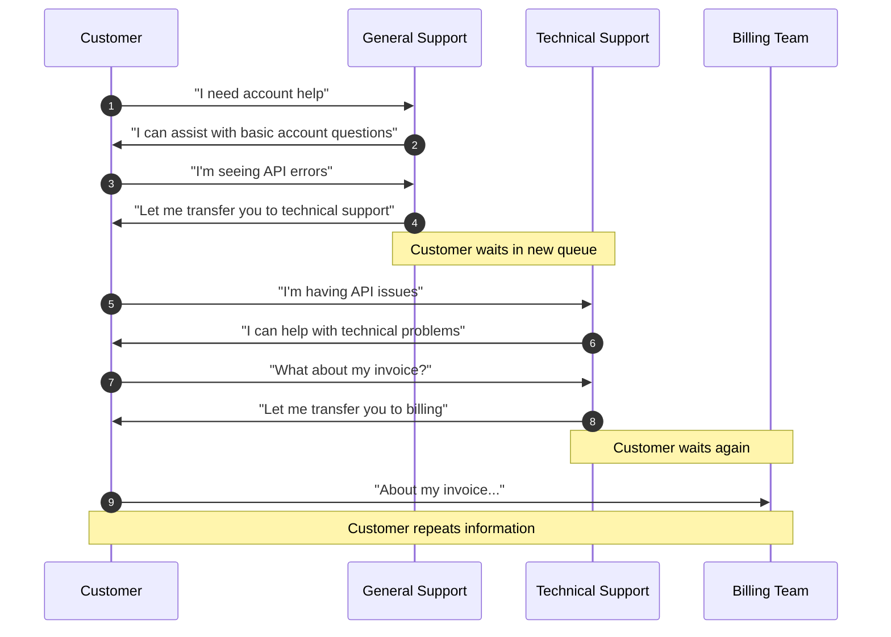

```mermaid
sequenceDiagram
    autonumber
    participant C as Customer
    participant G as General Support
    participant T as Technical Support
    participant B as Billing Team
    
    C->>G: "I need account help"
    G->>C: "I can assist with basic account questions"
    C->>G: "I'm seeing API errors"
    G->>C: "Let me transfer you to technical support"
    Note over G,T: Customer waits in new queue
    C->>T: "I'm having API issues"
    T->>C: "I can help with technical problems"
    C->>T: "What about my invoice?"
    T->>C: "Let me transfer you to billing"
    Note over T,B: Customer waits again
    C->>B: "About my invoice..."
    Note over C,B: Customer repeats information
```