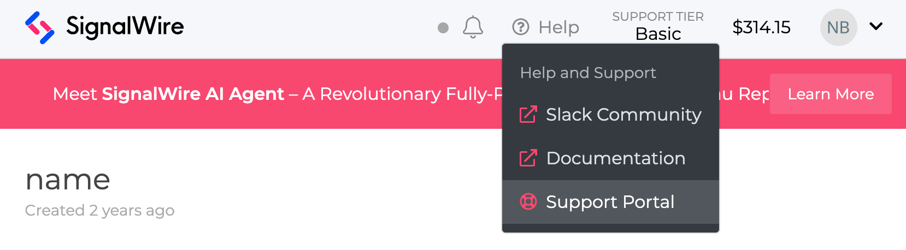

To close a SignalWire Space, please sign in to the Space and contact the SignalWire support team
by [creating a new support request](https://support.signalwire.com/hc/en-us/requests/new).

A support request can be created through the Space by clicking on the "Help" button located on the top navigation bar of the Dashboard.
Then, click on <b>Support Portal</b> within the drop-down menu.

On the Support Portal page, click on
[Submit a request](https://support.signalwire.com/hc/en-us/requests/new)
on the top banner of the page. Simply fill out the from and state that you'd like
your Space closed.

 

:::warning Space Closure Warning!

When the SignalWire Space is closed, most items you bought, held, or created,
will be released. This includes, but is not limited to:

- all **phone numbers** you bought
- AI agents
- Call flows
- contents of **SWML and LAML bins**
- [and so on](/platform/call-fabric/resources#types)

:::

## Reopening a closed account

If you closed your account and would like to reopen it,
please sign into your Space using your login credentials.
Then, from the dashboard,
[create a new support request](https://support.signalwire.com/hc/en-us/requests/new),
and let the support team know that you'd like to reinstate your account.

:::info

If you want your SignalWire Space and all associated data to be deleted, and
not accessible after being closed, please mention this in your support request.

:::
