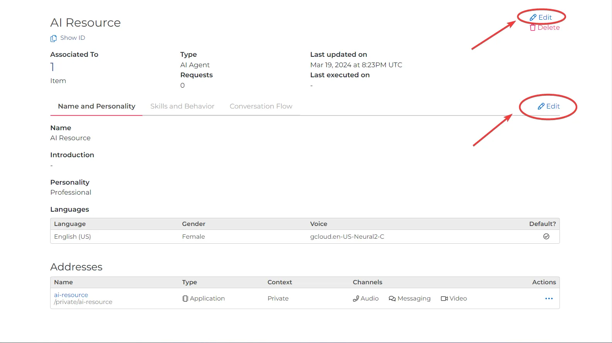

import ResourceAddresses from '/docs/_common/call-fabric/resource-addresses.md'
import ResourceContexts from '/docs/_common/call-fabric/resource-contexts.md'
import ResourceSubscribers from '/docs/_common/call-fabric/resource-subscribers.md'

# Resources

Resources are the primary entities for communication within the Call Fabric ecosystem.
They are the building blocks of the system, representing the various communication elements
that can be used to interact with [subscribers](#subscribers). 

<Frame caption="The Resource selection menu.">
  
</Frame>

---

## Actions

### Create {#create}

To create a Resource in your SignalWire Space, click on the `Resources` tab in the left-hand navigation menu.
From there, you can select the type of Resource you would like to create by clicking on the <kbd>+ Add</kbd> button.

<Frame 

  caption="Create a new Resource from the Dashboard">

  

</Frame>

After selecting a Resource, 
enter the details for the Resource on a new page,
and select <kbd>Create</kbd> to confirm.

### Modify or delete

From the Resources page in your SignalWire Dashboard, select the desired Resource to open a detailed view.
Here, by selecting the `Edit` button, you can alter the specifics of the Resource.

<Frame>
  
</Frame>

---

## Addresses

<ResourceAddresses />

---

## Contexts {#contexts}

<ResourceContexts />

---

## **Resource types** {#types}

### Subscribers {#subscribers}

<ResourceSubscribers />

A subscriber Resource will have the following details:

| Detail       | Value                                                                                                                                |
|:-------------|:-------------------------------------------------------------------------------------------------------------------------------------|
| Email        | The email address of the subscriber.                                                                                                 |
| Password     | The password for the subscriber.                                                                                                     |
| First Name   | The First name of the subscriber.                                                                                                    |
| Last Name    | The Last name of the subscriber.                                                                                                     |
| Display Name | The display name of the subscriber.                                                                                                  |
| Job Title    | The job title of the subscriber.                                                                                                     |
| Company Name | The company name of the subscriber.                                                                                                  |
| Time Zone    | The timezone of the subscriber, in [TZ database name format](https://en.wikipedia.org/wiki/List_of_tz_database_time_zones).          |
| Country      | The country of the subscriber.                                                                                                       |
| Region       | The region of the subscriber.                                                                                                        |
| Address      | The Resource Address of the subscriber. The format of the Address is as follows: `/<Context>/<Name>` (E.g. `/private/Lenny`) |

Create a Subscriber from the Resources pane of your SignalWire Space using [these instructions](#create).

### SWML Scripts {#swml}

The SWML Resource type is used to create and manage SWML scripts.
SWML allows you to write Relay applications using simple statements in a YAML or JSON document.

A SWML Resource will have the following details:

| Detail       | Value                                                     |
|:-------------|:----------------------------------------------------------|
| SWML Content | The configuration of the SWML script.                     |
| ID           | The alphanumeric ID assigned to the Resource on creation. |

<figure>
  
  <figcaption>SWML Script Details</figcaption>
</figure>

For more information on SWML, please refer to the [SWML documentation](/swml).

### AI Agents {#ai}

Use this section of the Dashboard to create, configure, and manage AI Agents.
For more information on AI Agents, please refer to the 
[AI Agent Documentation](/ai/get-started/).

<Frame 
  caption="AI Agents in the Dashboard">

  

</Frame>

### Relay Application {#relay-application}

A Relay Application Resource will have the following details:

| Detail    | Value                                                                                                                                                                                                                                                                |
|:----------|:---------------------------------------------------------------------------------------------------------------------------------------------------------------------------------------------------------------------------------------------------------------------|
| Name      | The name of the Relay application.                                                                                                                                                                                                                                   |
| Reference | The reference (previously known as Context) of the Relay application. A given phone number can be configured with the desired Reference (E.g., "office"). That then assigns incoming calls to that number to be forwarded to the matching Relay application. |

<figure>
  
  <figcaption>Relay App Details</figcaption>
</figure>

For more information on Relay, please refer to the 
[Relay documentation](/sdks/overview/what-is-relay).

### Video Room {#video-room}

The Video Room Resource type is used to create and manage Video Rooms.

For more information on Video Rooms, please refer to the [Programmable API Video Documentation](/video/getting-started/managing-rooms-with-apis)
and [Pre-built Video Conferencing Documentation](/video/conference).

<figure>
    
    <figcaption>The Video Room creation menu</figcaption>
</figure>

When creating a new Video Room Resource, select from two options: **UI Included** and **Build From Scratch**.
A Video Room Resource will have the following details depending upon your selection:

**UI Included Option**

| Tab        | Detail            | Value                                                                                                                                    |
|:-----------|:------------------|------------------------------------------------------------------------------------------------------------------------------------------|
| Settings   | Between           | The Starting time and date of the video room.                                                                                            |
|            | Until             | The Ending time and date of the video room.                                                                                              |
|            | Name              | The name of the video room.                                                                                                              |
|            | Video Quality     | Select 1080p or 720p video quality.                                                                                                      |
|            | Layout            | The layout of the video room, including grid-responsive, highlight-1-responsive, 1x1, 2x1, 2x2, 5up, 3x3, 4x4, 5x5, 6x6, 8x8, and 10x10. |
|            | Audience Size     | Small (max 10), Medium (max 50), and Large (max 300) audience size limits.                                                               |
|            | Automatic Options | Toggles to enable Room Previews, Record on Start, and Chat for the room.                                                                 |
| Appearance | *All options*     | *All settings in this section include a color selector for both light and dark themes, as well as a live theme preview.*                 |
|            | Background        | Main background color of the video room for light and dark themes.                                                                       |
|            | Foreground        | Main foreground color of the video room.                                                                                                 |
|            | Primary           | Color for CTA buttons and selected items.                                                                                                |
|            | Success           | Color for success messages and notifications.                                                                                            |
|            | Negative          | Color for error messages and notifications.                                                                                              |
| Streaming  | Stream URL        | The streaming interface, in which a URL to send the stream can be set using the RTMP and RTMPS protocols.                                |

<figure>
  
  <figcaption>Details of a Video Room (UI included)</figcaption>
</figure>

**Built From Scratch Option**

| Tab      | Detail            | Value                                                                                                                                    |
|:---------|:------------------|------------------------------------------------------------------------------------------------------------------------------------------|
| Settings | Name              | The name of the video room.                                                                                                              |
|          | Between           | The Starting time and date of the video room.                                                                                            |
|          | Until             | The Ending time and date of the video room.                                                                                              |
|          | Video Quality     | Select 1080p or 720p video quality.                                                                                                      |
|          | Layout            | The layout of the video room, including grid-responsive, highlight-1-responsive, 1x1, 2x1, 2x2, 5up, 3x3, 4x4, 5x5, 6x6, 8x8, and 10x10. |
|          | Automatic Options | Toggle Room Previews and Record on Start.                                                                                                |

<figure>
  
  <figcaption>Details of a Video Room using the Build From Scratch option</figcaption>
</figure>

### FreeSWITCH Connector {#freeswitch-connector}

The FreeSWITCH Connector Resource type is used to create and manage FreeSWITCH Connectors.

A FreeSWITCH Connector Resource will have the following details:

| Detail | Value                                  |
|:-------|:---------------------------------------|
| Name   | The name of the FreeSWITCH Connector.  |
| Token  | The token of the FreeSWITCH Connector. |

<figure>
  
  <figcaption>FreeSWITCH Connector Details</figcaption>
</figure>

For more information on FreeSWITCH Connectors, please refer to the 
[FreeSWITCH Connector Documentation](/platform/integrations/freeswitch/installing-freeswitch-or-freeswitch-advantage).

### Compatibility XML (LaML Webhook/Application) {#compatibility-xml}

The Compatibility XML (_cXML_) Resource type is used to create and manage LaML Webhook/Applications.

A cXML Resource has a single text box where the cXML script should be input.

<figure>
  
  <figcaption>cXML Details</figcaption>
</figure>

For more information on Compatibility XML, please refer to the 
[cXML API Documentation](/compatibility-api/cxml).

### Dialogflow Agent {#dialogflow-agent}

The Dialogflow Agent Resource type is used to create and manage Dialogflow Agents.

<figure>
    
    <figcaption>Importing a Dialogflow Agent</figcaption>
</figure>

For more information on Dialogflow Agents, please refer to the 
[Dialogflow Agent Documentation](/platform/integrations/dialogflow/dialogflow-agents/).

A Dialogflow Agent will be imported from the DialogFlow Console. 
You can learn more about this process 
[here](https://signalwire.com/resources/guides/dialogflow-integration?x-craft-preview=Pf1n9sLgPn&x-craft-preview=GycqMWdsUN&x-craft-preview=7S4KoPCcLT&x-craft-preview=ymLvN3CqO1&x-craft-preview=BhzWPl7Ntk&x-craft-preview=rHg5bUKLTk&x-craft-preview=rHg5bUKLTk&x-craft-preview=8rBwlgtYiq&utm_source=google&utm_medium=ads&utm_campaign=us_search_brand&utm_content=testing&gad_source=1&gclid=Cj0KCQiAuqKqBhDxARIsAFZELmLpkRL3cC2CMMtFig2QqUyk9m9Ty_on-7WaRZPbLmZNlV41gQmd204aAkoKEALw_wcB).
