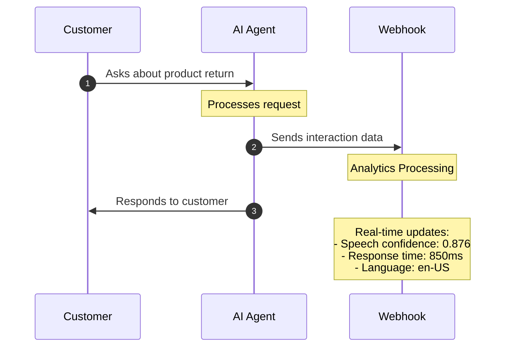
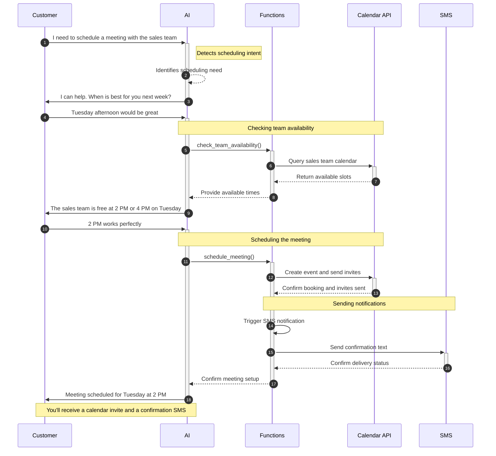
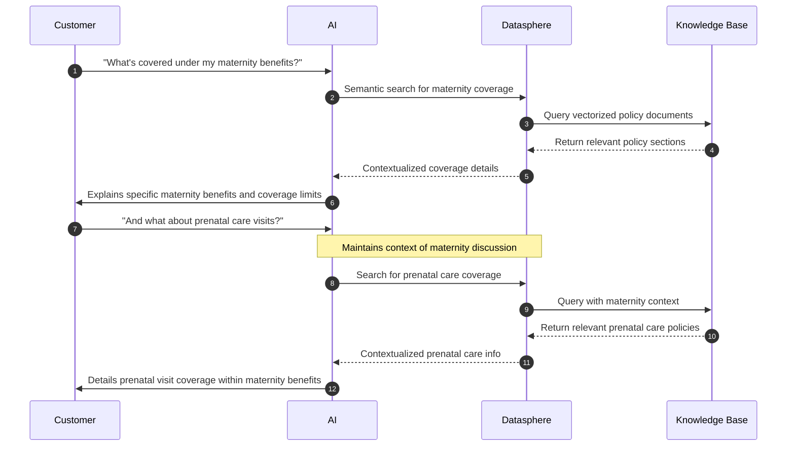

import TraditionalIVRFlow from './_mermaid/traditional-ivr-flow.mdx';
import AIVRFlow from './_mermaid/ai-ivr-flow.mdx';
import TraditionalSupportFlow from './_mermaid/traditional-support-flow.mdx';
import AISupportFlow from './_mermaid/ai-support-flow.mdx';

## Introduction

SignalWire's AI platform is a unified system for building and deploying conversational AI solutions. The platform combines:

- A single platform to orchestrate voice, video, and messaging channels
- Native integrations with leading LLM, Text-to-Speech, and Speech-to-Text providers
- Serverless functions that execute with minimal latency during live conversations
- Multi-threaded architecture for parallel, asynchronous function execution
- Global edge network with points of presence in every major region
- Enterprise-grade security, compliance, logging and analytics

You can use SignalWire AI as a complete agent development platform or as an orchestration layer for your existing AI solutions.

---

## Core capabilities

### Voice technology

SignalWire's voice technology gives you control over how your AI agents sound and understand speech:

- Choose from multiple Text-to-Speech providers and fine-tune voice parameters to match your brand
- Add natural speech <Tooltips tip="A user can define what words or phrases to say during pauses in the conversation. These pauses can occur from function calls or speech down time.">fillers</Tooltips> to maintain conversation flow during processing pauses
- Process incoming audio in real-time with noise filtering and accent handling

### Conversation intelligence

SignalWire AI helps you build agents that can handle complex conversations naturally. Unlike traditional IVR systems that follow rigid decision trees, your agents can:

- Stay on task and maintain their assigned role
- Keep track of multiple conversation threads
- Interface with multiple backend systems while maintaining natural dialogue
- Handle unexpected topic changes without losing context

Let's compare how a customer might schedule a medical appointment:


<PreviewCardGroup columns={2}>
  <PreviewCard title="Traditional IVR Flow" description="A detailed diagram of a traditional IVR system.">
    <TraditionalIVRFlow />
  </PreviewCard>
  <PreviewCard title="AI IVR Flow" description="A detailed diagram of an AI-powered IVR system.">
    <AIVRFlow />
  </PreviewCard>
</PreviewCardGroup>


For example, when a caller asks "What about the premium version?", the AI understands this refers to a product discussed
earlier in the conversation. This context awareness extends across different topics and requests within the same interaction, allowing for natural conversation
flows like:

"I'd like to schedule an appointment" → "What time works for you?" → "Actually, before we do that, what's your cancellation policy?"

The AI handles these context switches seamlessly while maintaining the original intent to schedule an appointment.

### Dynamic context switching

One powerful way to structure conversations is through "contexts" - specialized mini-agents with their own skills, prompts, permissions, and access to tools. Instead of transferring callers between departments like a traditional system, your AI agent switches contexts internally to handle different parts of the conversation.

Each context has:
- Specific prompts and instructions
- Defined permissions and access levels
- Specialized tools and integrations
- Its own conversation memory

This approach lets you:
- Route each task to the most appropriate specialized context
- Control what information passes between contexts
- Maintain natural conversation flow while switching roles
- Implement security boundaries for sensitive operations

Let's compare how a complex support interaction works:


<PreviewCardGroup columns={2}>
<PreviewCard title="Traditional Support Flow" description="This diagram showcases what a support call looks like in a traditional IVR system.">
  <TraditionalSupportFlow />
</PreviewCard>
<PreviewCard title="AI Support Flow" description="This diagram showcases what a support call looks like in an AI-powered IVR system.">
  <AISupportFlow />
</PreviewCard>
</PreviewCardGroup>


Each context operates independently with:
- Its own specialized prompt
- Fresh conversation memory
- Focused expertise (technical, billing, sales)
- Strict information boundaries

This approach ensures:
- Specialized knowledge stays within appropriate contexts
- No information bleeds between different roles
- Clear compliance and security boundaries
- Purpose-built responses for each domain

For example, when a customer moves from technical support to billing questions, the AI creates a fresh agent focused solely on financial matters, leaving technical details in the previous context. This isolation maintains security while ensuring each interaction benefits from specialized expertise.

### Real-time analytics and monitoring

Use comprehensive analytics to understand and optimize how your AI agents perform. The platform captures data about:

- Conversation flow and role adherence
- Speech recognition accuracy
- Response timing and latency
- Voice quality metrics
- Integration performance

This data flows through a robust webhook system that lets you:

- Monitor conversations in real-time
- Track key performance metrics
- Enable human supervision when needed
- Optimize agent behavior

Here's how this works in a customer support scenario:



#### Webhook data and metrics

Here's an example of the data you receive during an AI interaction:

```json
{
  "call_info": {
    "project_id": "b08dacad...",
    "content_type": "text/json",
    "call_id": "b3f4e4e1..."
  },
  "conversation_add": {
    "role": "assistant",
    "content": "...",
    "lang": "en-US",
    "tokens": 53,
    "latency": 836,
    "utterance_latency": 934,
    "audio_latency": 1106
  },
  "webhook_reply": {
    "status": "OK",
    "request_id": "341de258...",
    "parameters": {
      "query": "...",
    },
    "data": {...}
  }
}
```


#### Management tools

The real-time data enables you to:

- **Monitor Live Conversations:** 
  - Watch high-value interactions in real-time
  - Get alerts for critical situations
  - Step in when human help is needed

- **Improve Performance:** 
  - Adjust AI behavior based on metrics
  - Update routing rules
  - Fine-tune response patterns

- **Ensure Quality:**
  - Catch and fix issues quickly
  - Meet compliance requirements
  - Track service quality

The webhook system uses standard JSON formats and includes retry mechanisms for reliable delivery to your analytics tools.

---

## Integration & architecture

### External service integration

SignalWire AI connects with your business systems through its function framework. When your agent needs to perform an action - like checking inventory or booking an appointment - it can call functions that interact with your databases and services while keeping the conversation natural.

Here's an example of scheduling a meeting:



The process works like this:

1. Your agent recognizes when a request needs external data or actions
2. It calls the appropriate function
3. The function handles the technical work with your systems
4. Your agent incorporates the results naturally into the conversation

This lets you automate complex processes without exposing the technical details to your users.

### SignalWire's RAG stack integration - Datasphere

[Datasphere](/rest/signalwire-rest/endpoints/datasphere/documents) is SignalWire's built-in system for giving your AI agents access to your organization's knowledge. It helps your agents:

- Find and use relevant information during conversations
- Keep responses accurate and up-to-date
- Back answers with your official documentation

Here's how it works in practice:



Key benefits include:

- **Always Current:** Your agents automatically use the latest information as you update your documentation

- **Smart Information Use:** 
  - Combines conversation context with document searches
  - References specific sources
  - Maintains natural dialogue while using detailed info

- **Flexible Organization:**
  - Tag documents for easy finding
  - Choose how to break up information
  - Search using natural language

- **High Accuracy:**
  - Grounds responses in your actual documents
  - Provides sources for information
  - Keeps responses consistent

To learn more about using Datasphere, see our [Use Datasphere with curl](/rest/signalwire-rest/guides/datasphere/curl-usage) guide.


---

## Real-world applications

### Customer service

SignalWire AI helps you build customer service agents that can:

- Handle complex questions that need multiple steps
- Remember context across topic changes
- Use your knowledge base to give accurate answers
- Connect to your systems to solve problems
- Transfer to humans when needed

### Process automation

The platform excels at automating multi-step processes while keeping interactions natural. For example, an appointment scheduling agent can:

- Understand complex time and date requests
- Check multiple calendar systems
- Handle schedule conflicts
- Send confirmations
- Make changes when needed

All while maintaining a natural conversation flow.

---

## Security and compliance

SignalWire's AI platform includes built-in security features:

- Encrypted communications
- PII detection and protection
- Compliance tools for HIPAA and GDPR
- Detailed audit logging
- Access controls and permissions

These features let you automate sensitive communications while maintaining regulatory compliance.
