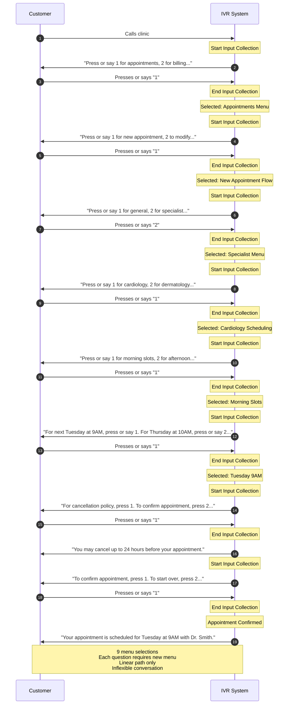
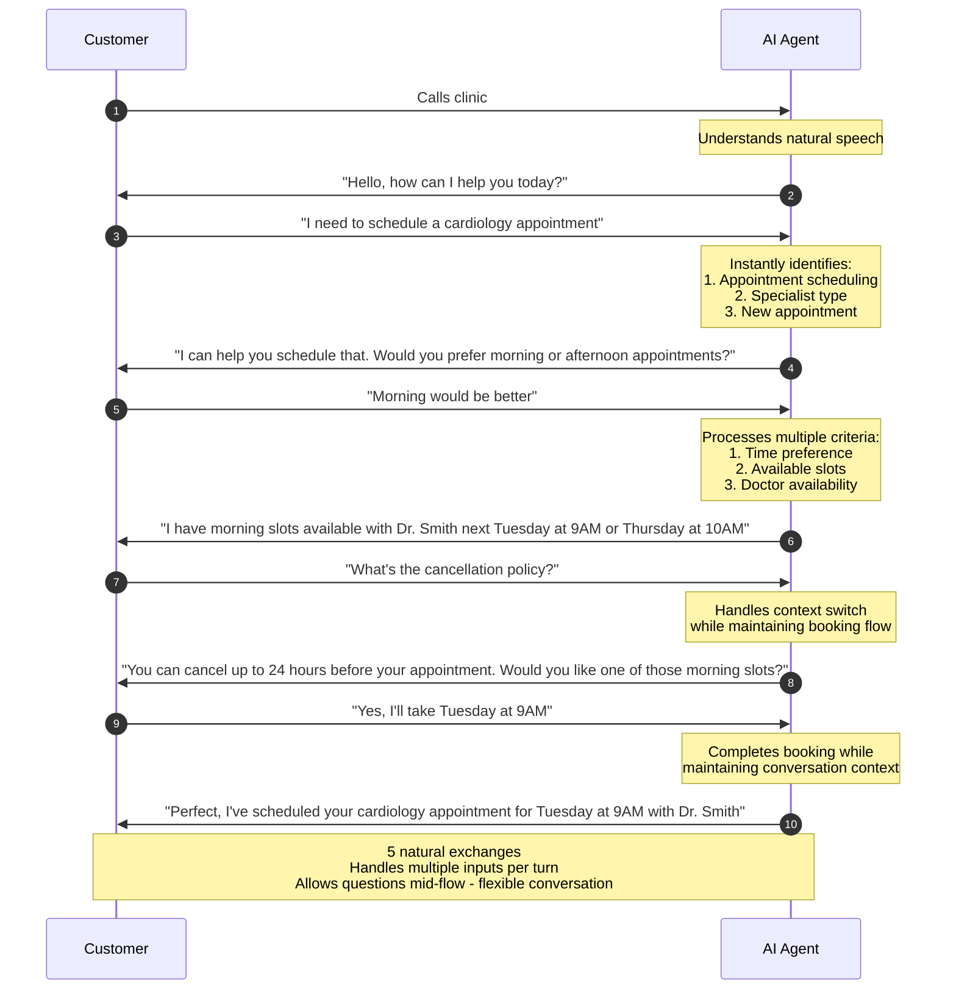
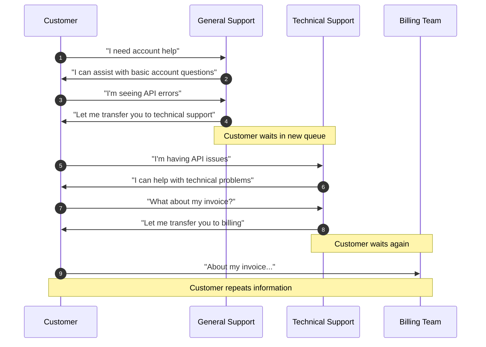
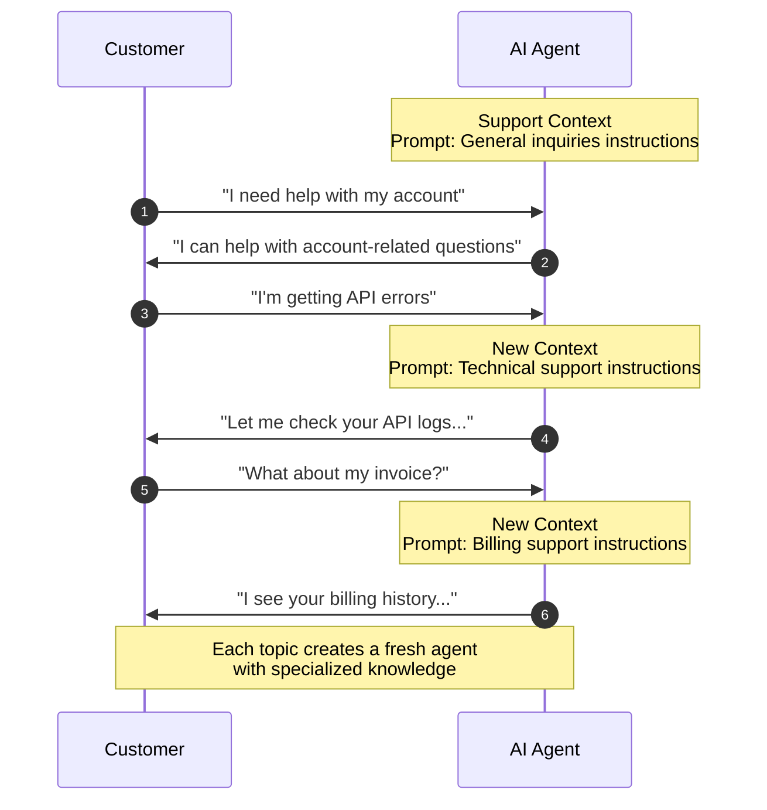
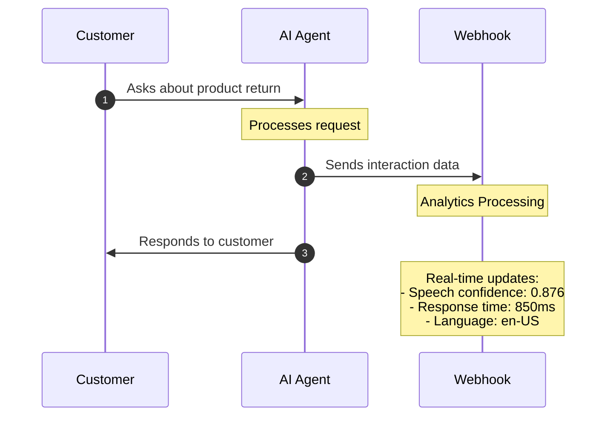
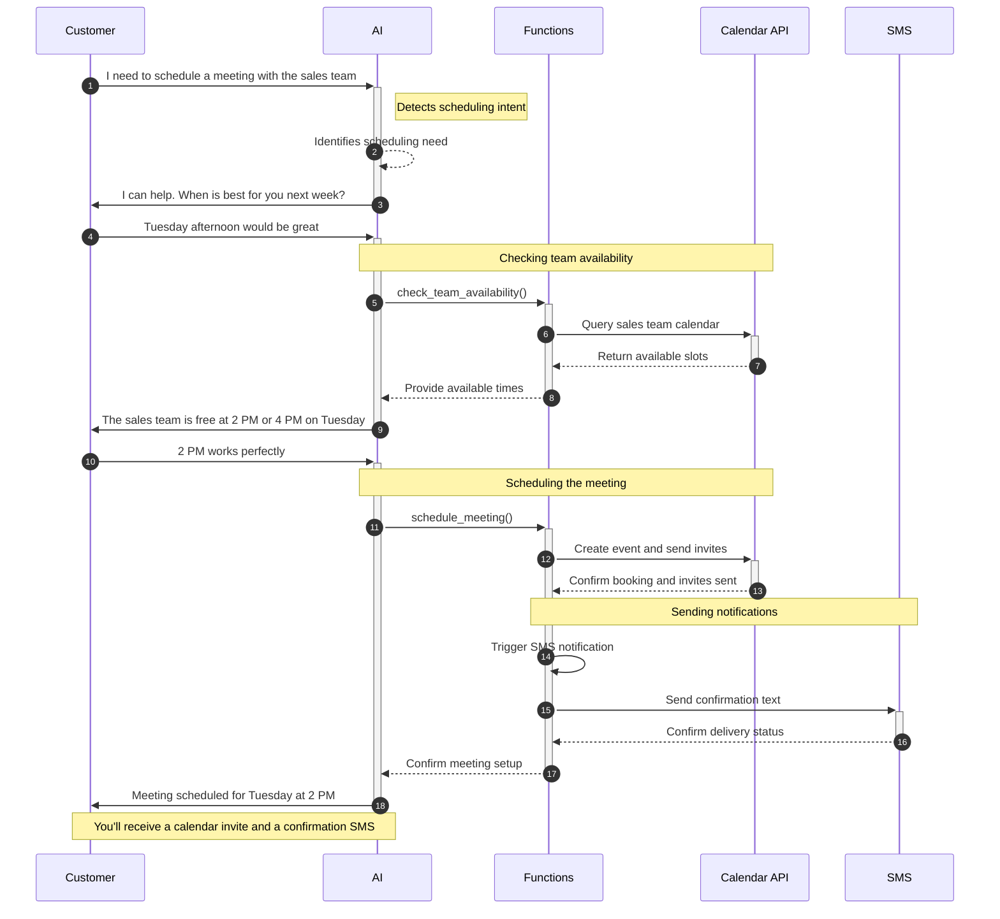
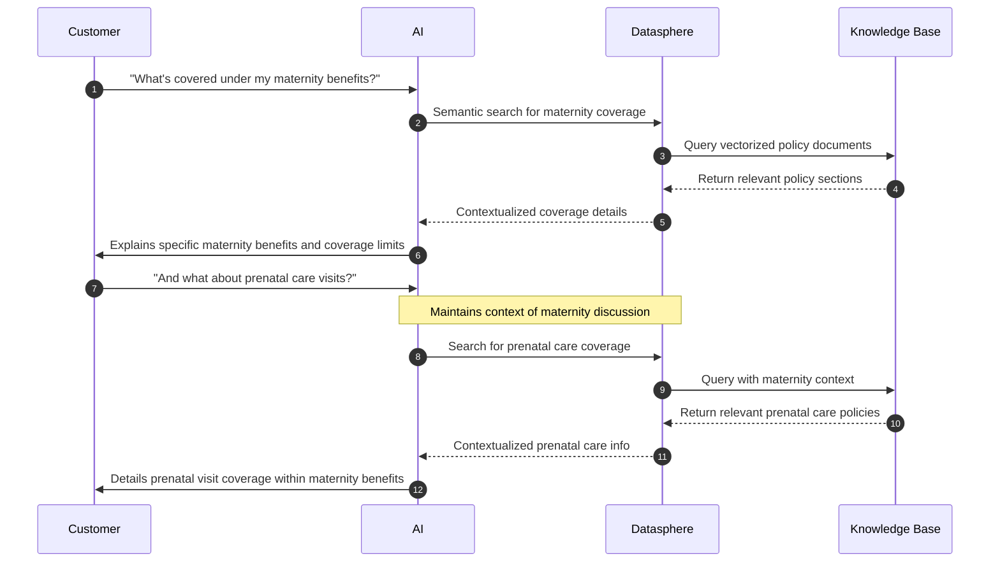

## Introduction

SignalWire's AI platform represents a new paradigm in communications technology, seamlessly blending artificial intelligence with enterprise-grade telecommunications infrastructure. This platform transforms traditional communication channels into intelligent, context-aware interactions that adapt to your business needs.

Key differentiators of our platform include:
- Natural language understanding and generation
- Real-time processing and response
- Multi-channel communication capabilities
- Enterprise-grade security and compliance
- Seamless integration with existing systems

## Core Capabilities

### Voice Technology

SignalWire's voice technology combines two critical elements: natural speech synthesis and intelligent speech understanding. 
The platform uses advanced voice synthesis through multiple TTS providers to generate natural-sounding speech that can be customized for your brand.
Voice parameters can be fine-tuned to match your needs:

- Ability to select from multiple TTS providers - some of which have more parameters to fine-tune the voice.
- Fillers for function calls and general speech fillers - helps with filling in the void during pauses making the flow of conversation more natural.
- Language and accent options allow for authentic multilingual communication

The speech understanding system processes incoming audio in real-time, handling various accents and dialects while filtering out background noise. This enables clear communication even in challenging environments like busy offices or public spaces.

### Conversation Intelligence

The foundation of SignalWire's AI capabilities lies in its ability to understand and maintain natural conversations. 
Unlike traditional IVR systems that follow rigid decision trees, SignalWire AI engages in fluid, context-aware dialogues. The system maintains conversation history,
understands context, and can reference previous parts of the conversation naturally.

Let's compare how a customer might try to schedule a medical appointment:

<Tabs lazy>
<TabItem value="Traditional IVR Flow">
**Traditional IVR Flow:**

</TabItem>

<TabItem value="SignalWire AI Flow">
**SignalWire AI Flow:**

</TabItem>
</Tabs>

For example, when a caller asks "What about the premium version?", the AI understands this refers to a product discussed
earlier in the conversation. This context awareness extends across different topics and requests within the same interaction, allowing for natural conversation
flows like:

"I'd like to schedule an appointment" → "What time works for you?" → "Actually, before we do that, what's your cancellation policy?"

The AI handles these context switches seamlessly while maintaining the original intent to schedule an appointment.

### Dynamic Context Switching

Unlike traditional systems that maintain a single conversation thread, SignalWire's AI platform enables specialized contexts for different types of interactions. Each context switch creates a fresh AI agent with its own prompt and memory space, ensuring focused expertise and strict information boundaries.

Let's compare how a complex support interaction typically works:

<Tabs lazy>
<TabItem value="Traditional Support Flow">
**Traditional Support Flow:**

</TabItem>

<TabItem value="SignalWire AI Flow">
**SignalWire AI Flow:**

</TabItem>
</Tabs>

Each context operates independently with:
- Its own specialized prompt
- Fresh conversation memory
- Focused expertise (technical, billing, sales)
- Strict information boundaries

This approach ensures:
- Specialized knowledge stays within appropriate contexts
- No information bleeds between different roles
- Clear compliance and security boundaries
- Purpose-built responses for each domain

For example, when a customer moves from technical support to billing questions, the AI creates a fresh agent focused solely on financial matters, leaving technical details in the previous context. This isolation maintains security while ensuring each interaction benefits from specialized expertise.

### Real-Time Analytics and Monitoring

Understanding how your AI interactions perform is crucial for maintaining high-quality customer experiences. SignalWire's platform provides comprehensive analytics and monitoring capabilities that go beyond basic metrics. Our system captures every aspect of AI conversations - from speech recognition quality to response timing - enabling you to:

- Monitor conversations as they happen
- Measure and optimize AI performance
- Ensure quality customer interactions
- Enable human supervision when needed
- Track system health and reliability

The platform achieves this through a robust webhook integration system that transforms conversations into actionable intelligence. Let's see how this works in a customer support scenario:



#### Webhook Data and Metrics

Below is an example webhook payload showing the comprehensive data captured during an AI interaction:

```json
{
  "call_info": {
    "project_id": "b08dacad...",
    "content_type": "text/json",
    "call_id": "b3f4e4e1..."
  },
  "conversation_add": {
    "role": "assistant",
    "content": "...",
    "lang": "en-US",
    "tokens": 53,
    "latency": 836,
    "utterance_latency": 934,
    "audio_latency": 1106
  },
  "webhook_reply": {
    "status": "OK",
    "request_id": "341de258...",
    "parameters": {
      "query": "...",
    },
    "data": {...}
  }
}
```

This data provides real-time visibility into:
- Natural conversation flow and context maintenance
- Speech recognition confidence scores
- Response timing and latency measurements
- Voice quality metrics
- Processing and decision-making speeds
- Integration response times

#### Management Capabilities

The real-time data enables powerful operational control through:

- **Proactive Supervision:** 
  - Monitor high-value conversations in real-time
  - Receive instant alerts for critical situations
  - Enable supervisor intervention when needed

- **Dynamic Optimization:** 
  - Fine-tune AI behavior based on performance data
  - Adjust routing rules for different inquiry types
  - Optimize response patterns for better outcomes

- **Quality Assurance:**
  - Identify and address issues in real-time
  - Maintain compliance with industry standards
  - Track and improve service quality metrics

The platform delivers this data through a robust integration system featuring JSON-formatted payloads, consistent schemas, and reliable delivery mechanisms with retry capabilities, enabling seamless integration with your existing analytics tools and monitoring systems.

---

## Integration & Architecture

### External Service Integration

SignalWire AI seamlessly integrates with external services and APIs through its function system. When the AI identifies specific intents or triggers during a conversation, it can execute functions that interact with your business systems, databases, or third-party services - all while maintaining natural conversation flow.

Here's how it works in practice:



The AI acts as an intelligent orchestrator, seamlessly connecting various services:

1. **Intent Recognition**: The AI identifies when a user's request requires external service interaction
2. **Function Triggers**: Based on recognized intents, the AI triggers appropriate functions
3. **Service Integration**: Functions handle the complex interaction with external services
4. **Response Management**: The AI maintains context and provides natural responses while background processes complete

For example, in a meeting scheduling scenario:
- The AI recognizes scheduling intent from natural language
- Triggers calendar availability checks
- Manages meeting creation across platforms
- All while maintaining a natural conversation flow

This integration capability enables complex business processes to be handled through natural conversation, without exposing the underlying technical complexity to the user.

### SignalWire's RAG Stack Integration - Datasphere

SignalWire's AI platform becomes even more powerful when combined with [Datasphere](/rest/signalwire-rest/endpoints/datasphere/documents), our built-in Retrieval-Augmented Generation (RAG) stack. This integration enables AI agents to access and leverage your organization's knowledge base in real-time during conversations.

Here's how Datasphere enhances AI interactions:

- **Dynamic Knowledge Access**: AI agents can pull relevant information from your documented knowledge base during live conversations, providing accurate and contextual responses based on your organization's specific content.

- **Intelligent Document Processing**: 
  - Automatically processes and vectorizes documents using various chunking strategies
  - Maintains semantic understanding of content
  - Enables natural language queries across your knowledge base

For example, in a healthcare policy inquiry scenario:



The combination provides several key advantages:

- **Always Up-to-Date Information**: As your documentation and knowledge base evolve, Datasphere automatically indexes and makes new information available to AI agents.

- **Context-Aware Responses**: 
  - Combines conversation history with knowledge base queries
  - Provides responses that reference specific documentation
  - Maintains conversation flow while incorporating detailed information

- **Flexible Knowledge Organization**:
  - Tag-based organization for efficient information retrieval
  - Multiple chunking strategies for optimal information storage
  - Semantic search capabilities for natural language queries

- **Enhanced Accuracy**:
  - Reduces hallucination by grounding responses in your actual documentation
  - Provides verifiable sources for information
  - Maintains consistency across all AI interactions

This powerful combination ensures that your AI agents not only engage in natural conversations but also provide accurate,
documented information specific to your organization's needs. To learn more about using Datasphere, check out our
[Use Datasphere with curl](/rest/signalwire-rest/guides/datasphere/curl-usage) guide.

---

## Real-World Applications

### Intelligent Customer Service

SignalWire AI transforms customer service operations by providing consistent, 24/7 support capability. The system can:

- **Handle Complex Inquiries:** Unlike simple chatbots, the AI can manage sophisticated conversations, understanding context and maintaining thread across multiple questions. For example, a customer asking about product features, then pricing, then compatibility will experience a coherent conversation where each answer builds on previous context.

- **Manage Intentions:** You can define intentions for your AI in your prompt and the AI will intelligently respond to those intentions. For example, you can define an intention for the AI to transfer to a human when the customer requests a human.

### Process Automation

The platform excels at automating routine business processes while maintaining a natural interaction experience. Take appointment scheduling as an example:

The AI doesn't just book appointments - it manages the entire scheduling ecosystem. It understands complex requests ("I need an appointment next week, preferably Tuesday afternoon but Wednesday morning would work too"), checks availability, sends confirmations, and handles changes. It can even proactively manage schedule conflicts and suggest alternatives.


---

## Security and Compliance

SignalWire's AI platform is built with security and compliance at its core. All communications are encrypted, and the system includes sophisticated PII (Personally Identifiable Information) detection and protection mechanisms. This allows businesses to automate sensitive communications while maintaining compliance with regulations like HIPAA and GDPR.
