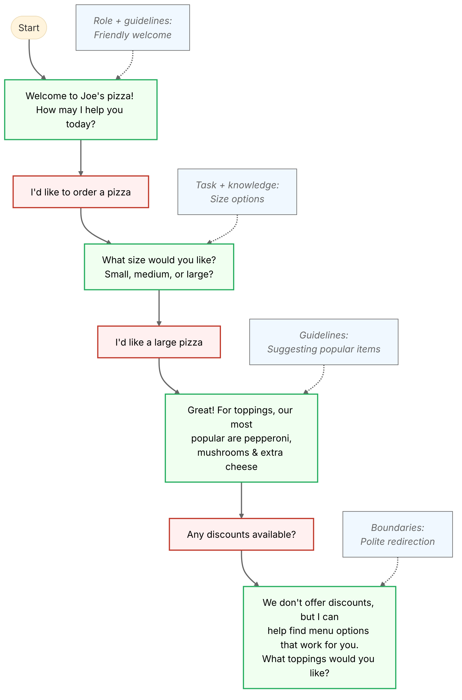

```mermaid
%%{init: { 'theme': 'base', 'themeVariables': { 'fontFamily': 'Inter' } }}%%
flowchart TD
    %% Define styles
    classDef customer fill:#fff0f0,stroke:#c0392b,stroke-width:2px,color:#000000,fontFamily:Inter
    classDef assistant fill:#f0fff0,stroke:#27ae60,stroke-width:2px,color:#000000,fontFamily:Inter
    classDef note fill:#f0f8ff,stroke:#666,stroke-width:1px,color:#666,font-style:italic,fontFamily:Inter

    Start([Start])
    Start --> R1["Welcome to Joe's pizza! How may I help you today?"]
    R1 --> Q1["I'd like to order a pizza"]
    Q1 --> R2["What size would you like?<br/>Small, medium, or large?"]
    R2 --> Q2["I'd like a large pizza"]
    Q2 --> R3["Great! For toppings, our most<br/>popular are pepperoni,<br/>mushrooms & extra cheese"]
    R3 --> Q3["Any discounts available?"]
    Q3 --> R4["We don't offer discounts, but I can<br/>help find menu options that work for you.<br/>What toppings would you like?"]
    
    %% Add notes showing prompt influence
    Note1["Role + guidelines:<br/>Friendly welcome"]:::note
    Note2["Task + knowledge:<br/>Size options"]:::note
    Note3["Guidelines:<br/>Suggesting popular items"]:::note
    Note4["Boundaries:<br/>Polite redirection"]:::note

    %% Connect notes to conversation with dotted lines
    Note1 -.-> R1
    Note2 -.-> R2
    Note3 -.-> R3
    Note4 -.-> R4

    %% Apply styles
    class Q1,Q2,Q3 customer
    class R1,R2,R3,R4 assistant

    %% Style for links - using a blue-gray color for better visibility
    linkStyle default stroke:#666666,stroke-width:2px,color:#666666
``` 