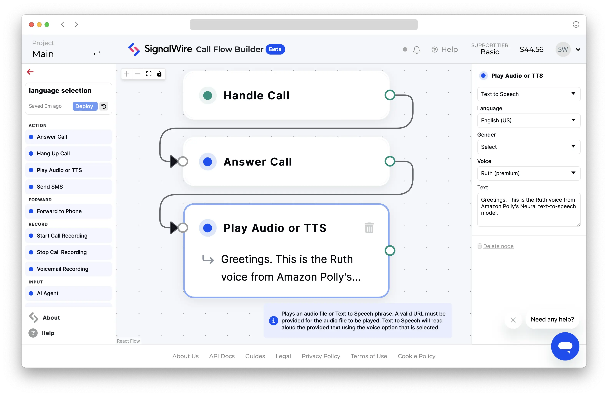

import CodeBlock from '@theme/CodeBlock';
import Admonition from '@theme/Admonition';
import AzureVoices from './_azure-voices.mdx';

# Supported Voices and Languages

SignalWire's cloud platform integrates with leading third-party text-to-speech (TTS) providers.
This guide describes supported engines, voices, and languages.
Refer to each provider's documentation for up-to-date model details and service information.

## **Compare providers and models**

SignalWire's TTS providers offer a wide range of voice engines optimized for various applications.
Select a provider, model, and voice according to the following considerations:

**Cost:** 
When cost-efficiency is the top priority, select a Standard-tier voice from 
[Google Cloud](#google-cloud) or [Amazon Polly](#amazon-polly). 
Review our [pricing information](#pricing) to learn more.

**Language support:** 
[Amazon Polly](#amazon-polly), [ElevenLabs](#elevenlabs), [Google Cloud](#google-cloud), and [OpenAI](#openai) 
offer a wide range of supported languages.
In addition, all [ElevenLabs](#elevenlabs) and [OpenAI](#openai) voices are fully multilingual.

**Model quality and realism:** All four supported providers offer high-quality engines: 
[Google Cloud](#google-cloud)'s WaveNet and Neural2, 
[Amazon Polly](#amazon-polly) Neural,
 ElevenLabs' [Multilingual v2](#elevenlabs), 
and Deepgram's [Aura](#deepgram)
are all optimized for voice quality.

**SSML support:** Google Cloud and Amazon Polly support 
[SSML](/docs/compatibility-api/cxml/voice/say.mdx#speech-synthesis-markup-language-ssml) 
(Speech Synthesis Markup Language) as a string wrapped in `<speak>` tags. 
Consult [Google Cloud's SSML docs](https://cloud.google.com/text-to-speech/docs/ssml) for details.
Refer to the Amazon Polly docs for more information on 
[using SSML](https://docs.aws.amazon.com/polly/latest/dg/ssml.html)
and [supported SSML tags.](https://docs.aws.amazon.com/polly/latest/dg/supportedtags.html)

## **Use voice identifier strings**

Compose voice identifier strings using the `<engine>.<voice id>` format.

First, select your engine using the `gcloud`, `polly`, `elevenlabs`, or `deepgram` identifier. 
Append a period (`.`), followed by the specific **voice ID** from the TTS provider.

:::tip Case insensitivity

Voice identifier strings are **case insensitive**.
For example,
`gcloud.en-US-Neural2-A`,
`gcloud.en-us-neural2-a`, and
`GCLOUD.EN-US-NEURAL2-A` are equivalent.
:::

For detailed instructions for each provider, consult the voice ID references linked in the **Usage** column of the below table.

| TTS provider    | Engine code  | Sample voice ID string                          | Usage                                |
| :-------------- | :----------- | :---------------------------------------------- | ------------------------------------ |
| Amazon Polly    | `polly`      | `polly.Joanna-Neural`                           | [Reference](#amazon-polly-voice-ids) |
| Cartesia        | `cartesia`   | `cartesia.a167e0f3-df7e-4d52-a9c3-f949145efdab` | [Reference](#cartesia-voice-ids)     |
| Deepgram        | `deepgram`   | `deepgram.aura-asteria-en`                      | [Reference](#deepgram-voice-ids)     |
| ElevenLabs      | `elevenlabs` | `elevenlabs.thomas`                             | [Reference](#elevenlabs-voice-ids)   |
| Google Cloud    | `gcloud`     | `gcloud.en-US-Casual-K`                         | [Reference](#google-cloud-voice-ids) |
| Microsoft Azure | `azure`      | `en-US-AvaNeural`                               | [Reference](#      )                 |
| OpenAI          | `openai`     | `openai.alloy`                                  | [Reference](#openai-voice-ids)       |

<br/>

---

## **TTS providers**

### Amazon Polly

Amazon Web Services' Polly TTS engine includes several models to accommodate different use cases.
SignalWire supports the Standard, Neural, and Generative models:

- [Standard](https://docs.aws.amazon.com/polly/latest/dg/standard-voices.html)
is a traditional, cost-effective, and reliable TTS model.
It is less natural-sounding but more budget-friendly than Polly Neural. Example voice identifier string: `polly.Emma`
- [Neural](https://docs.aws.amazon.com/polly/latest/dg/neural-voices.html)
is an advanced model designed to produce speech that is more natural and closer to human-like pronunciation and intonation. Example voice identifier string: `polly.Emma-Neural`

{/**
*- [Generative](https://docs.aws.amazon.com/polly/latest/dg/generative-voices.html)
*is a very large English-language model offering Polly's most human-like, emotionally engaged, and *adaptive conversational voices.
*/}

#### Set language for Amazon Polly voices

Most Amazon Polly voices support a single language.
Select a language by choosing from the [list of supported voices](https://docs.aws.amazon.com/polly/latest/dg/available-voices.html).

All Amazon Polly voices support [accented bilingual pronunciation](https://docs.aws.amazon.com/polly/latest/dg/bilingual-voices.html#accented-bilingual)
through the use of the SSML `lang` tag.

Amazon Polly also offers some [fully bilingual voices](https://docs.aws.amazon.com/polly/latest/dg/bilingual-voices.html#true-bilingual)
designed to fluently speak two languages.

#### Amazon Polly voice IDs

Polly voices are identified by the voice name (like `Amy`, `Matthew`, `Mia`, `Zhiyu`, etc ) only,
except when the voice exists in multiple models. 
In that case, append a code after a dash `-` to specify variations of the model, like `neural` or `generative`.
If no model code is specified, the Standard model will be used.

| Example string         | Model used |
| :--------------------- | :--------- |
| `polly.Amy`            | Standard   |
| `polly.Amy-Neural`     | Neural     |
| `polly.Amy-Generative` | Generative |

<details>
<summary>**Use Amazon Polly voices on the SignalWire platform**</summary>

<Tabs>
<TabItem value="swml" label="SWML">
Use the
[**`languages`**](/swml/methods/ai/languages#use-voice-strings)
SWML method to set one or more voices for an [AI agent](/swml/methods/ai).
```yaml
version: 1.0.0
sections:
  main:
  - ai:
      prompt:
        text: Have an open-ended conversation about flowers.
      languages:
        - name: English
          code: en-US
          voice: polly.Ruth-Neural
```
Alternatively, use the [**`say_voice`** parameter](/swml/methods/play#parameters) 
of the [**`play`**](/swml/methods/play)
SWML method to select a voice for basic TTS.
```yaml
version: 1.0.0
sections:
  main:
  - set:
      say_voice: "polly.Ruth-Neural"
  - play: "say:Greetings. This is the Ruth voice from Amazon Polly's Neural text-to-speech model."
```
</TabItem>
<TabItem value="relay" label="RELAY Realtime SDK">
```javascript
// This example uses the Node.js SDK for SignalWire's RELAY Realtime API.
const playback = await call.playTTS({ 
    text: "Greetings. This is the Ruth voice from Amazon Polly's Neural text-to-speech model.",
    voice: "polly.Ruth-Neural",
});
await playback.ended();
```
</TabItem>
<TabItem value="cfb" label="Call Flow Builder">

</TabItem>
<TabItem value="cxml" label="cXML">
```xml
<?xml version="1.0" encoding="UTF-8"?>
<Response>
<Say voice="polly.Ruth-Neural">
    Greetings. This is the Ruth voice from Amazon Polly's Neural text-to-speech model.
</Say>
</Response>
```
</TabItem>
</Tabs>

</details>

---

### Cartesia

Cartesia offers a wide selection of fully multilingual voices with very low latency.

Consult [Cartesia's Text-to-Speech documentation](https://docs.cartesia.ai/getting-started/available-models)
for more information and audio samples for available voices.
[Create a Cartesia Account](https:play.cartesia.ai) to browse and test voices in the Cartesia Playground.

#### Cartesia voice IDs

Copy the voice ID from the below table:

<div style={{"display":"inline-block","max-height":"70vh","overflow-y":"auto"}}>

| Voice name                       | Voice ID                                                    |
| :------------------------------- | :---------------------------------------------------------- |
| German Conversational Woman      | <CodeBlock>3f4ade23-6eb4-4279-ab05-6a144947c4d5</CodeBlock> |
| Nonfiction Man                   | <CodeBlock>79f8b5fb-2cc8-479a-80df-29f7a7cf1a3e</CodeBlock> |
| Friendly Sidekick                | <CodeBlock>e00d0e4c-a5c8-443f-a8a3-473eb9a62355</CodeBlock> |
| French Conversational Lady       | <CodeBlock>a249eaff-1e96-4d2c-b23b-12efa4f66f41</CodeBlock> |
| French Narrator Lady             | <CodeBlock>8832a0b5-47b2-4751-bb22-6a8e2149303d</CodeBlock> |
| German Reporter Woman            | <CodeBlock>119e03e4-0705-43c9-b3ac-a658ce2b6639</CodeBlock> |
| Indian Lady                      | <CodeBlock>3b554273-4299-48b9-9aaf-eefd438e3941</CodeBlock> |
| British Reading Lady             | <CodeBlock>71a7ad14-091c-4e8e-a314-022ece01c121</CodeBlock> |
| British Narration Lady           | <CodeBlock>4d2fd738-3b3d-4368-957a-bb4805275bd9</CodeBlock> |
| Japanese Children Book           | <CodeBlock>44863732-e415-4084-8ba1-deabe34ce3d2</CodeBlock> |
| Japanese Woman Conversational    | <CodeBlock>2b568345-1d48-4047-b25f-7baccf842eb0</CodeBlock> |
| Japanese Male Conversational     | <CodeBlock>e8a863c6-22c7-4671-86ca-91cacffc038d</CodeBlock> |
| Reading Lady                     | <CodeBlock>15a9cd88-84b0-4a8b-95f2-5d583b54c72e</CodeBlock> |
| Newsman                          | <CodeBlock>d46abd1d-2d02-43e8-819f-51fb652c1c61</CodeBlock> |
| Child                            | <CodeBlock>2ee87190-8f84-4925-97da-e52547f9462c</CodeBlock> |
| Meditation Lady                  | <CodeBlock>cd17ff2d-5ea4-4695-be8f-42193949b946</CodeBlock> |
| Maria                            | <CodeBlock>5345cf08-6f37-424d-a5d9-8ae1101b9377</CodeBlock> |
| 1920's Radioman                  | <CodeBlock>41534e16-2966-4c6b-9670-111411def906</CodeBlock> |
| Newslady                         | <CodeBlock>bf991597-6c13-47e4-8411-91ec2de5c466</CodeBlock> |
| Calm Lady                        | <CodeBlock>00a77add-48d5-4ef6-8157-71e5437b282d</CodeBlock> |
| Helpful Woman                    | <CodeBlock>156fb8d2-335b-4950-9cb3-a2d33befec77</CodeBlock> |
| Mexican Woman                    | <CodeBlock>5c5ad5e7-1020-476b-8b91-fdcbe9cc313c</CodeBlock> |
| California Girl                  | <CodeBlock>b7d50908-b17c-442d-ad8d-810c63997ed9</CodeBlock> |
| Korean Narrator Woman            | <CodeBlock>663afeec-d082-4ab5-827e-2e41bf73a25b</CodeBlock> |
| Russian Calm Lady                | <CodeBlock>779673f3-895f-4935-b6b5-b031dc78b319</CodeBlock> |
| Russian Narrator Man 1           | <CodeBlock>2b3bb17d-26b9-421f-b8ca-1dd92332279f</CodeBlock> |
| Russian Narrator Man 2           | <CodeBlock>da05e96d-ca10-4220-9042-d8acef654fa9</CodeBlock> |
| Russian Narrator Woman           | <CodeBlock>642014de-c0e3-4133-adc0-36b5309c23e6</CodeBlock> |
| Hinglish Speaking Lady           | <CodeBlock>95d51f79-c397-46f9-b49a-23763d3eaa2d</CodeBlock> |
| Italian Narrator Woman           | <CodeBlock>0e21713a-5e9a-428a-bed4-90d410b87f13</CodeBlock> |
| Polish Narrator Woman            | <CodeBlock>575a5d29-1fdc-4d4e-9afa-5a9a71759864</CodeBlock> |
| Chinese Female Conversational    | <CodeBlock>e90c6678-f0d3-4767-9883-5d0ecf5894a8</CodeBlock> |
| Pilot over Intercom              | <CodeBlock>36b42fcb-60c5-4bec-b077-cb1a00a92ec6</CodeBlock> |
| Chinese Commercial Man           | <CodeBlock>eda5bbff-1ff1-4886-8ef1-4e69a77640a0</CodeBlock> |
| French Narrator Man              | <CodeBlock>5c3c89e5-535f-43ef-b14d-f8ffe148c1f0</CodeBlock> |
| Spanish Narrator Man             | <CodeBlock>a67e0421-22e0-4d5b-b586-bd4a64aee41d</CodeBlock> |
| Reading Man                      | <CodeBlock>f146dcec-e481-45be-8ad2-96e1e40e7f32</CodeBlock> |
| New York Man                     | <CodeBlock>34575e71-908f-4ab6-ab54-b08c95d6597d</CodeBlock> |
| Friendly French Man              | <CodeBlock>ab7c61f5-3daa-47dd-a23b-4ac0aac5f5c3</CodeBlock> |
| Barbershop Man                   | <CodeBlock>a0e99841-438c-4a64-b679-ae501e7d6091</CodeBlock> |
| Indian Man                       | <CodeBlock>638efaaa-4d0c-442e-b701-3fae16aad012</CodeBlock> |
| Australian Customer Support Man  | <CodeBlock>41f3c367-e0a8-4a85-89e0-c27bae9c9b6d</CodeBlock> |
| Friendly Australian Man          | <CodeBlock>421b3369-f63f-4b03-8980-37a44df1d4e8</CodeBlock> |
| Wise Man                         | <CodeBlock>b043dea0-a007-4bbe-a708-769dc0d0c569</CodeBlock> |
| Friendly Reading Man             | <CodeBlock>69267136-1bdc-412f-ad78-0caad210fb40</CodeBlock> |
| Customer Support Man             | <CodeBlock>a167e0f3-df7e-4d52-a9c3-f949145efdab</CodeBlock> |
| Dutch Confident Man              | <CodeBlock>9e8db62d-056f-47f3-b3b6-1b05767f9176</CodeBlock> |
| Dutch Man                        | <CodeBlock>4aa74047-d005-4463-ba2e-a0d9b261fb87</CodeBlock> |
| Hindi Reporter Man               | <CodeBlock>bdab08ad-4137-4548-b9db-6142854c7525</CodeBlock> |
| Italian Calm Man                 | <CodeBlock>408daed0-c597-4c27-aae8-fa0497d644bf</CodeBlock> |
| Italian Narrator Man             | <CodeBlock>029c3c7a-b6d9-44f0-814b-200d849830ff</CodeBlock> |
| Swedish Narrator Man             | <CodeBlock>38a146c3-69d7-40ad-aada-76d5a2621758</CodeBlock> |
| Polish Confident Man             | <CodeBlock>3d335974-4c4a-400a-84dc-ebf4b73aada6</CodeBlock> |
| Spanish-speaking Storyteller Man | <CodeBlock>846fa30b-6e1a-49b9-b7df-6be47092a09a</CodeBlock> |
| Kentucky Woman                   | <CodeBlock>4f8651b0-bbbd-46ac-8b37-5168c5923303</CodeBlock> |
| Chinese Commercial Woman         | <CodeBlock>0b904166-a29f-4d2e-bb20-41ca302f98e9</CodeBlock> |
| Middle Eastern Woman             | <CodeBlock>daf747c6-6bc2-4083-bd59-aa94dce23f5d</CodeBlock> |
| Hindi Narrator Woman             | <CodeBlock>c1abd502-9231-4558-a054-10ac950c356d</CodeBlock> |
| Sarah                            | <CodeBlock>694f9389-aac1-45b6-b726-9d9369183238</CodeBlock> |
| Sarah Curious                    | <CodeBlock>794f9389-aac1-45b6-b726-9d9369183238</CodeBlock> |
| Laidback Woman                   | <CodeBlock>21b81c14-f85b-436d-aff5-43f2e788ecf8</CodeBlock> |
| Reflective Woman                 | <CodeBlock>a3520a8f-226a-428d-9fcd-b0a4711a6829</CodeBlock> |
| Helpful French Lady              | <CodeBlock>65b25c5d-ff07-4687-a04c-da2f43ef6fa9</CodeBlock> |
| Pleasant Brazilian Lady          | <CodeBlock>700d1ee3-a641-4018-ba6e-899dcadc9e2b</CodeBlock> |
| Customer Support Lady            | <CodeBlock>829ccd10-f8b3-43cd-b8a0-4aeaa81f3b30</CodeBlock> |
| British Lady                     | <CodeBlock>79a125e8-cd45-4c13-8a67-188112f4dd22</CodeBlock> |
| Wise Lady                        | <CodeBlock>c8605446-247c-4d39-acd4-8f4c28aa363c</CodeBlock> |
| Australian Narrator Lady         | <CodeBlock>8985388c-1332-4ce7-8d55-789628aa3df4</CodeBlock> |
| Indian Customer Support Lady     | <CodeBlock>ff1bb1a9-c582-4570-9670-5f46169d0fc8</CodeBlock> |
| Swedish Calm Lady                | <CodeBlock>f852eb8d-a177-48cd-bf63-7e4dcab61a36</CodeBlock> |
| Spanish Narrator Lady            | <CodeBlock>2deb3edf-b9d8-4d06-8db9-5742fb8a3cb2</CodeBlock> |
| Salesman                         | <CodeBlock>820a3788-2b37-4d21-847a-b65d8a68c99a</CodeBlock> |
| Yogaman                          | <CodeBlock>f114a467-c40a-4db8-964d-aaba89cd08fa</CodeBlock> |
| Movieman                         | <CodeBlock>c45bc5ec-dc68-4feb-8829-6e6b2748095d</CodeBlock> |
| Wizardman                        | <CodeBlock>87748186-23bb-4158-a1eb-332911b0b708</CodeBlock> |
| Australian Woman                 | <CodeBlock>043cfc81-d69f-4bee-ae1e-7862cb358650</CodeBlock> |
| Korean Calm Woman                | <CodeBlock>29e5f8b4-b953-4160-848f-40fae182235b</CodeBlock> |
| Friendly German Man              | <CodeBlock>fb9fcab6-aba5-49ec-8d7e-3f1100296dde</CodeBlock> |
| Announcer Man                    | <CodeBlock>5619d38c-cf51-4d8e-9575-48f61a280413</CodeBlock> |
| Wise Guide Man                   | <CodeBlock>42b39f37-515f-4eee-8546-73e841679c1d</CodeBlock> |
| Midwestern Man                   | <CodeBlock>565510e8-6b45-45de-8758-13588fbaec73</CodeBlock> |
| Kentucky Man                     | <CodeBlock>726d5ae5-055f-4c3d-8355-d9677de68937</CodeBlock> |
| Brazilian Young Man              | <CodeBlock>5063f45b-d9e0-4095-b056-8f3ee055d411</CodeBlock> |
| Chinese Call Center Man          | <CodeBlock>3a63e2d1-1c1e-425d-8e79-5100bc910e90</CodeBlock> |
| German Reporter Man              | <CodeBlock>3f6e78a8-5283-42aa-b5e7-af82e8bb310c</CodeBlock> |
| Confident British Man            | <CodeBlock>63ff761f-c1e8-414b-b969-d1833d1c870c</CodeBlock> |
| Southern Man                     | <CodeBlock>98a34ef2-2140-4c28-9c71-663dc4dd7022</CodeBlock> |
| Classy British Man               | <CodeBlock>95856005-0332-41b0-935f-352e296aa0df</CodeBlock> |
| Polite Man                       | <CodeBlock>ee7ea9f8-c0c1-498c-9279-764d6b56d189</CodeBlock> |
| Mexican Man                      | <CodeBlock>15d0c2e2-8d29-44c3-be23-d585d5f154a1</CodeBlock> |
| Korean Narrator Man              | <CodeBlock>57dba6ff-fe3b-479d-836e-06f5a61cb5de</CodeBlock> |
| Turkish Narrator Man             | <CodeBlock>5a31e4fb-f823-4359-aa91-82c0ae9a991c</CodeBlock> |
| Turkish Calm Man                 | <CodeBlock>39f753ef-b0eb-41cd-aa53-2f3c284f948f</CodeBlock> |
| Hindi Calm Man                   | <CodeBlock>ac7ee4fa-25db-420d-bfff-f590d740aeb2</CodeBlock> |
| Hindi Narrator Man               | <CodeBlock>7f423809-0011-4658-ba48-a411f5e516ba</CodeBlock> |
| Polish Narrator Man              | <CodeBlock>4ef93bb3-682a-46e6-b881-8e157b6b4388</CodeBlock> |
| Polish Young Man                 | <CodeBlock>82a7fc13-2927-4e42-9b8a-bb1f9e506521</CodeBlock> |
| Alabama Male                     | <CodeBlock>40104aff-a015-4da1-9912-af950fbec99e</CodeBlock> |
| Australian Male                  | <CodeBlock>13524ffb-a918-499a-ae97-c98c7c4408c4</CodeBlock> |
| Anime Girl                       | <CodeBlock>1001d611-b1a8-46bd-a5ca-551b23505334</CodeBlock> |
| Japanese Man Book                | <CodeBlock>97e7d7a9-dfaa-4758-a936-f5f844ac34cc</CodeBlock> |
| Sweet Lady                       | <CodeBlock>e3827ec5-697a-4b7c-9704-1a23041bbc51</CodeBlock> |
| Commercial Lady                  | <CodeBlock>c2ac25f9-ecc4-4f56-9095-651354df60c0</CodeBlock> |
| Teacher Lady                     | <CodeBlock>573e3144-a684-4e72-ac2b-9b2063a50b53</CodeBlock> |
| Princess                         | <CodeBlock>8f091740-3df1-4795-8bd9-dc62d88e5131</CodeBlock> |
| Commercial Man                   | <CodeBlock>7360f116-6306-4e9a-b487-1235f35a0f21</CodeBlock> |
| ASMR Lady                        | <CodeBlock>03496517-369a-4db1-8236-3d3ae459ddf7</CodeBlock> |
| Professional Woman               | <CodeBlock>248be419-c632-4f23-adf1-5324ed7dbf1d</CodeBlock> |
| Tutorial Man                     | <CodeBlock>bd9120b6-7761-47a6-a446-77ca49132781</CodeBlock> |
| Calm French Woman                | <CodeBlock>a8a1eb38-5f15-4c1d-8722-7ac0f329727d</CodeBlock> |
| New York Woman                   | <CodeBlock>34bde396-9fde-4ebf-ad03-e3a1d1155205</CodeBlock> |
| Spanish-speaking Lady            | <CodeBlock>846d6cb0-2301-48b6-9683-48f5618ea2f6</CodeBlock> |
| Midwestern Woman                 | <CodeBlock>11af83e2-23eb-452f-956e-7fee218ccb5c</CodeBlock> |
| Sportsman                        | <CodeBlock>ed81fd13-2016-4a49-8fe3-c0d2761695fc</CodeBlock> |
| Storyteller Lady                 | <CodeBlock>996a8b96-4804-46f0-8e05-3fd4ef1a87cd</CodeBlock> |
| Spanish-speaking Man             | <CodeBlock>34dbb662-8e98-413c-a1ef-1a3407675fe7</CodeBlock> |
| Doctor Mischief                  | <CodeBlock>fb26447f-308b-471e-8b00-8e9f04284eb5</CodeBlock> |
| Spanish-speaking Reporter Man    | <CodeBlock>2695b6b5-5543-4be1-96d9-3967fb5e7fec</CodeBlock> |
| Young Spanish-speaking Woman     | <CodeBlock>db832ebd-3cb6-42e7-9d47-912b425adbaa</CodeBlock> |
| The Merchant                     | <CodeBlock>50d6beb4-80ea-4802-8387-6c948fe84208</CodeBlock> |
| Stern French Man                 | <CodeBlock>0418348a-0ca2-4e90-9986-800fb8b3bbc0</CodeBlock> |
| Madame Mischief                  | <CodeBlock>e13cae5c-ec59-4f71-b0a6-266df3c9bb8e</CodeBlock> |
| German Storyteller Man           | <CodeBlock>db229dfe-f5de-4be4-91fd-7b077c158578</CodeBlock> |
| Female Nurse                     | <CodeBlock>5c42302c-194b-4d0c-ba1a-8cb485c84ab9</CodeBlock> |
| German Conversation Man          | <CodeBlock>384b625b-da5d-49e8-a76d-a2855d4f31eb</CodeBlock> |
| Friendly Brazilian Man           | <CodeBlock>6a16c1f4-462b-44de-998d-ccdaa4125a0a</CodeBlock> |
| German Woman                     | <CodeBlock>b9de4a89-2257-424b-94c2-db18ba68c81a</CodeBlock> |
| Southern Woman                   | <CodeBlock>f9836c6e-a0bd-460e-9d3c-f7299fa60f94</CodeBlock> |
| British Customer Support Lady    | <CodeBlock>a01c369f-6d2d-4185-bc20-b32c225eab70</CodeBlock> |
| Chinese Woman Narrator           | <CodeBlock>d4d4b115-57a0-48ea-9a1a-9898966c2966</CodeBlock> |

</div><br /><br />

Prepend `cartesia.` and the string is ready for use.
For example: `cartesia.a167e0f3-df7e-4d52-a9c3-f949145efdab`

<details>
<summary>**Use Cartesia voices on the SignalWire platform**</summary>

<Tabs>
<TabItem value="swml" label="SWML">
Use the
[**`languages`**](/swml/methods/ai/languages#use-voice-strings)
SWML method to set one or more voices for an [AI agent](/swml/methods/ai).
```yaml
version: 1.0.0
sections:
  main:
  - ai:
      prompt:
        text: Have an open-ended conversation about flowers.
      languages:
        - name: English
          code: en-US
          voice: cartesia.a167e0f3-df7e-4d52-a9c3-f949145efdab
```
Alternatively, use the [**`say_voice`** parameter](/swml/methods/play#parameters) 
of the [**`play`**](/swml/methods/play)
SWML method to select a voice for basic TTS.
```yaml
version: 1.0.0
sections:
  main:
  - set:
      say_voice: "cartesia.a167e0f3-df7e-4d52-a9c3-f949145efdab"
  - play: "say:Greetings. This is the Customer Support Man voice from Cartesia's Sonic text-to-speech model."
```
</TabItem>
<TabItem value="relay" label="RELAY Realtime SDK">
```javascript
// This example uses the Node.js SDK for SignalWire's RELAY Realtime API.
const playback = await call.playTTS({ 
    text: "Greetings. This is the Customer Support Man voice from Cartesia's Sonic text-to-speech model.",
    voice: "cartesia.a167e0f3-df7e-4d52-a9c3-f949145efdab",
});
await playback.ended();
```
</TabItem>
<TabItem value="cfb" label="Call Flow Builder">
OpenAI voices are not yet supported in Call Flow Builder.
</TabItem>
<TabItem value="cxml" label="CXML">
```xml
<?xml version="1.0" encoding="UTF-8"?>
<Response>
<Say voice="cartesia.a167e0f3-df7e-4d52-a9c3-f949145efdab">
    Greetings. This is the Customer Support Man voice from Cartesia's Sonic text-to-speech model.
</Say>
</Response>
```
</TabItem>
</Tabs>

</details>

---

### Deepgram

Deepgram offers a range of **English-speaking** voices for its text-to-speech API, each designed to produce
natural-sounding speech output in an array of different accents and speaking styles.

Deepgram's voices are promised to have human-like tones, rhythm, and emotion, lower than 250 ms
latency, and are optimized for high-throughput applications.

Consult Deepgram's [TTS models guide](https://developers.deepgram.com/docs/tts-models) 
for more information and samples for supported voices.

#### Deepgram voice IDs

Copy the voice ID from the **Values** column of Deepgram's
[Voice Selection](https://developers.deepgram.com/docs/tts-models) reference.
Prepend `deepgram.` and the string is ready for use.
For example: `deepgram.aura-athena-en`

<details>
<summary>**Use Deepgram voices on the SignalWire platform**</summary>

<Tabs>
<TabItem value="swml" label="SWML">
Use the
[**`languages`**](/swml/methods/ai/languages#use-voice-strings)
SWML method to set one or more voices for an [AI agent](/swml/methods/ai).
```yaml
version: 1.0.0
sections:
  main:
  - ai:
      prompt:
        text: Have an open-ended conversation about flowers.
      languages:
        - name: English
          code: en-US
          voice: deepgram.aura-asteria-en
```
Alternatively, use the [**`say_voice`** parameter](/swml/methods/play#parameters) 
of the [**`play`**](/swml/methods/play)
SWML method to select a voice for basic TTS.
```yaml
version: 1.0.0
sections:
  main:
  - set:
      say_voice: "deepgram.aura-asteria-en"
  - play: "say:Greetings. This is the Asteria voice from Deepgram's Aura text-to-speech model."
```
</TabItem>
<TabItem value="relay" label="RELAY Realtime SDK">
```javascript
// This example uses the Node.js SDK for SignalWire's RELAY Realtime API.
const playback = await call.playTTS({ 
    text: "Greetings. This is the Asteria voice from Deepgram's Aura text-to-speech model.",
    voice: "deepgram.aura-asteria-en",
});
await playback.ended();
```
</TabItem>
<TabItem value="cfb" label="Call Flow Builder">
Deepgram voices are not yet supported in Call Flow Builder.
</TabItem>
<TabItem value="cxml" label="cXML">
```xml
<?xml version="1.0" encoding="UTF-8"?>
<Response>
<Say voice="deepgram.aura-asteria-en">
    Greetings. This is the Asteria voice from Deepgram's Aura text-to-speech model.
</Say>
</Response>
```
</TabItem>
</Tabs>

</details>

---

### ElevenLabs

ElevenLabs voices offer expressive, human-like pronunciation and an extensive list of supported languages.
SignalWire supports the following voices in the `Multilingual v2` model:

| Voices                                                                                                                                                                                                                                                                                                                                                                                                                                                                                                                         | Languages                                                                                                                                                                                                                                                                                                                                                                                                                                                                                                                                                                                                                      |
| ------------------------------------------------------------------------------------------------------------------------------------------------------------------------------------------------------------------------------------------------------------------------------------------------------------------------------------------------------------------------------------------------------------------------------------------------------------------------------------------------------------------------------ | :----------------------------------------------------------------------------------------------------------------------------------------------------------------------------------------------------------------------------------------------------------------------------------------------------------------------------------------------------------------------------------------------------------------------------------------------------------------------------------------------------------------------------------------------------------------------------------------------------------------------------- |
| **`rachel`**, **`clyde`**, **`domi`**, **`dave`**, **`fin`**, **`antoni`**, **`thomas`**, **`charlie`**, **`emily`**, **`elli`**, **`callum`**, **`patrick`**, **`harry`**, **`liam`**, **`dorothy`**, **`josh`**, **`arnold`**, **`charlotte`**, **`matilda`**, **`matthew`**, **`james`**, **`joseph`**, **`jeremy`**, **`michael`**, **`ethan`**, **`gigi`**, **`freya`**, **`grace`**, **`daniel`**, **`serena`**, **`adam`**, **`nicole`**, **`jessie`**, **`ryan`**, **`sam`**, **`glinda`**, **`giovanni`**, **`mimi`** | 🇺🇸 English (USA), 🇬🇧 English (UK), 🇦🇺 English (Australia), 🇨🇦 English (Canada), 🇯🇵 Japanese, 🇨🇳 Chinese, 🇩🇪 German, 🇮🇳 Hindi, 🇫🇷 French (France), 🇨🇦 French (Canada), 🇰🇷 Korean, 🇧🇷 Portuguese (Brazil), 🇵🇹 Portuguese (Portugal), 🇮🇹 Italian, 🇪🇸 Spanish (Spain), 🇲🇽 Spanish (Mexico), 🇮🇩 Indonesian, 🇳🇱 Dutch, 🇹🇷 Turkish, 🇵🇭 Filipino, 🇵🇱 Polish, 🇸🇪 Swedish, 🇧🇬 Bulgarian, 🇷🇴 Romanian, 🇸🇦 Arabic (Saudi Arabia), 🇦🇪 Arabic (UAE), 🇨🇿 Czech, 🇬🇷 Greek, 🇫🇮 Finnish, 🇭🇷 Croatian, 🇲🇾 Malay, 🇸🇰 Slovak, 🇩🇰 Danish, 🇮🇳 Tamil, 🇺🇦 Ukrainian, 🇷🇺 Russian |

#### Language selection with ElevenLabs voices

Multilingual v2 voices are designed to be interchangeably compatible with all supported languages.
Rather than enforcing language selection with language `code`,
this TTS model automatically uses the appropriate language of the input text.

Consult ElevenLabs' [supported languages resource](https://help.elevenlabs.io/hc/en-us/articles/13313366263441-What-languages-do-you-support)
for an up-to-date list of supported languages.

#### ElevenLabs voice IDs

Copy the voice ID from our [list of supported ElevenLabs voices](#elevenlabs).
Prepend `elevenlabs.` and the string is ready for use.
For example: `elevenlabs.sam`

<details>
<summary>**Use ElevenLabs voices on the SignalWire platform**</summary>

<Tabs>
<TabItem value="swml" label="SWML">
Use the
[**`languages`**](/swml/methods/ai/languages#use-voice-strings)
SWML method to set one or more voices for an [AI agent](/swml/methods/ai).
```yaml
version: 1.0.0
sections:
  main:
  - ai:
      prompt:
        text: Have an open-ended conversation about flowers.
      languages:
        - name: English
          code: en-US
          voice: elevenlabs.rachel
```
Alternatively, use the [**`say_voice`** parameter](/swml/methods/play#parameters) 
of the [**`play`**](/swml/methods/play)
SWML method to select a voice for basic TTS.
```yaml
version: 1.0.0
sections:
  main:
  - set:
      say_voice: "elevenlabs.rachel"
  - play: "say:Greetings. This is the Rachel voice, speaking in English, from ElevenLabs' Multilingual v2 text-to-speech model."
```
</TabItem>
<TabItem value="relay" label="RELAY Realtime SDK">
```javascript
// This example uses the Node.js SDK for SignalWire's RELAY Realtime API.
const playback = await call.playTTS({ 
    text: "Greetings. This is the Rachel voice, speaking in English, from ElevenLabs' Multilingual v2 text-to-speech model.",
    voice: "elevenlabs.rachel",
});
await playback.ended();
```
</TabItem>
<TabItem value="cfb" label="Call Flow Builder">
ElevenLabs voices are not yet supported in Call Flow Builder.
</TabItem>
<TabItem value="cxml" label="cXML">
```xml
<?xml version="1.0" encoding="UTF-8"?>
<Response>
<Say voice="elevenlabs.rachel">
    Greetings. This is the Rachel voice, speaking in English, from ElevenLabs' Multilingual v2 text-to-speech model.
</Say>
</Response>
```
</TabItem>
</Tabs>

</details>

---

### Google Cloud

Google Cloud offers a number of robust text-to-speech
[voice models](https://cloud.google.com/text-to-speech/docs/voice-types).
SignalWire supports all Google Cloud voices in both General Availability and Preview 
[launch stages](https://cloud.google.com/products?hl=en#product-launch-stages),
except for the Studio model.

- [Standard](https://cloud.google.com/text-to-speech/docs/voice-types#standard_voices)
is a basic, reliable, and budget-friendly text-to-speech model.
The Standard model is less natural-sounding than WaveNet and Neural2, but more cost-effective.
- [WaveNet](https://cloud.google.com/text-to-speech/docs/voice-types#wavenet_voices)
is powered by deep learning technology and offers more natural and lifelike speech output.
- [Neural2](https://cloud.google.com/text-to-speech/docs/voice-types#neural2_voices)
is based on the same technology used to create 
[Custom Voices](https://cloud.google.com/text-to-speech/custom-voice/docs)
and prioritizes natural and human-like pronunciation and intonation.
- [Polyglot](https://cloud.google.com/text-to-speech/docs/polyglot?hl=en#overview)
voices have variants in multiple languages. For example, at time of writing,
the `polyglot-1` voice has variants for English (Australia), English (US), French, German, Spanish (Spain), and Spanish (US).

#### Set language for Google Cloud voices

Sample all available voices with
[Google's supported voices and languages reference](https://cloud.google.com/text-to-speech/docs/voices).
Copy the voice identifier string in whole from the **Voice name** column.

Unlike the other supported engines, Google Cloud voice identifier strings include both voice and language keys,
following the pattern `<language>-<model>-<variant>`.
For example:

- English (UK) WaveNet female voice: `en-GB-Wavenet-A`
- Spanish (Spain) Neural2 male voice: `es-ES-Neural2-B`
- Mandarin Chinese Standard female voice: `cmn-CN-Standard-D`

#### Google Cloud voice IDs

Copy the voice ID in whole from the **Voice name** column of Google's table of 
[supported voices](https://cloud.google.com/text-to-speech/docs/voices).
Google Cloud voice IDs encode language and model information, so no modification is needed to make these selections.
Prepend `gcloud.` and the string is ready for use.
For example: `gcloud.en-GB-Wavenet-A`

{/* Refer to the [Types of voices](https://cloud.google.com/text-to-speech/docs/voice-types#studio_voices) 
guide for information regarding SSML compatibility, product release status, and audio quality. */}

<details>
<summary>**Use Google Cloud voices on the SignalWire platform**</summary>

<Tabs>
<TabItem value="swml" label="SWML">
Use the
[**`languages`**](/swml/methods/ai/languages#use-voice-strings)
SWML method to set one or more voices for an [AI agent](/swml/methods/ai).
```yaml
version: 1.0.0
sections:
  main:
  - ai:
      prompt:
        text: Have an open-ended conversation about flowers.
      languages:
        - name: English
          code: en-US
          voice: gcloud.en-US-Neural2-A
```
Alternatively, use the [**`say_voice`** parameter](/swml/methods/play#parameters) 
of the [**`play`**](/swml/methods/play)
SWML method to select a voice for basic TTS.
```yaml
version: 1.0.0
sections:
  main:
  - set:
      say_voice: "gcloud.en-US-Neural2-A"
  - play: "say:Greetings. This is the 2-A US English voice from Google Cloud's Neural2 text-to-speech model."
```
</TabItem>
<TabItem value="relay" label="RELAY Realtime SDK">
```javascript
// This example uses the Node.js SDK for SignalWire's RELAY Realtime API.
const playback = await call.playTTS({ 
    text: "Greetings. This is the 2-A US English voice from Google Cloud's Neural2 text-to-speech model.",
    voice: "gcloud.en-US-Neural2-A",
});
await playback.ended();
```
</TabItem>
<TabItem value="cfb" label="Call Flow Builder">

</TabItem>
<TabItem value="cxml" label="cXML">
```xml
<?xml version="1.0" encoding="UTF-8"?>
<Response>
<Say voice="gcloud.en-US-Neural2-A">
    Greetings. This is the 2-A Neural2 English voice from Google Cloud.
</Say>
</Response>
```
</TabItem>
</Tabs>

</details>

---

### Microsoft Azure

Microsoft's Azure platform offers an impressive array of high-quality, multilingual voices in its Neural model.

#### Set language for Azure voices

Azure Neural voices are interchangeably compatible with all supported languages.
Rather than setting language with the language `code`,
simply provide input text in the desired language.

Consult the Azure 
[supported languages resource](https://learn.microsoft.com/en-us/azure/ai-services/speech-service/language-support?tabs=tts)
for an up-to-date list of supported languages.

#### Azure voice IDs

<div style={{"display":"inline-block","max-height":"70vh","overflow-y":"auto"}}>

  <AzureVoices />

</div><br/><br/>

### OpenAI

OpenAI offers versatile multilingual voices balancing low latency and good quality.
While voices are optimized for English, they perform well across all [supported languages](https://platform.openai.com/docs/guides/text-to-speech/supported-languages).

Consult [OpenAI's Text-to-Speech documentation](https://platform.openai.com/docs/guides/text-to-speech/overview)
for more information and audio samples for available voices.

#### OpenAI voice IDs

Copy the voice ID from OpenAI's [Voice Options](https://platform.openai.com/docs/guides/text-to-speech/voice-options) reference.

Prepend `openai.` and the string is ready for use.
For example: `openai.alloy`

<details>
<summary>**Use OpenAI voices on the SignalWire platform**</summary>

<Tabs>
<TabItem value="swml" label="SWML">
Use the
[**`languages`**](/swml/methods/ai/languages#use-voice-strings)
SWML method to set one or more voices for an [AI agent](/swml/methods/ai).
```yaml
version: 1.0.0
sections:
  main:
  - ai:
      prompt:
        text: Have an open-ended conversation about flowers.
      languages:
        - name: English
          code: en-US
          voice: openai.alloy
```
Alternatively, use the [**`say_voice`** parameter](/swml/methods/play#parameters) 
of the [**`play`**](/swml/methods/play)
SWML method to select a voice for basic TTS.
```yaml
version: 1.0.0
sections:
  main:
  - set:
      say_voice: "openai.alloy"
  - play: "say:Greetings. This is the Alloy voice from OpenAI's text-to-speech model."
```
</TabItem>
<TabItem value="relay" label="RELAY Realtime SDK">
```javascript
// This example uses the Node.js SDK for SignalWire's RELAY Realtime API.
const playback = await call.playTTS({ 
    text: "Greetings. This is the Alloy voice from OpenAI's text-to-speech model.",
    voice: "openai.alloy",
});
await playback.ended();
```
</TabItem>
<TabItem value="cfb" label="Call Flow Builder">
OpenAI voices are not yet supported in Call Flow Builder.
</TabItem>
<TabItem value="cxml" label="cXML">
```xml
<?xml version="1.0" encoding="UTF-8"?>
<Response>
<Say voice="openai.alloy">
    Greetings. This is the Alloy voice from OpenAI's text-to-speech model.
</Say>
</Response>
```
</TabItem>
</Tabs>

</details>

---

## **Pricing**

Voices are priced according to model in three tiers.
Consult our [Voice API Pricing](https://signalwire.com/pricing/voice) for up-to-date pricing information.

**Standard** 

- Google Cloud Standard
- Amazon Polly Standard

**Premium**

- Google Cloud Neural2, WaveNet, and Journey
- Amazon Polly Neural and Generative
- Deepgram Aura

**ElevenLabs** voices have their own tier.