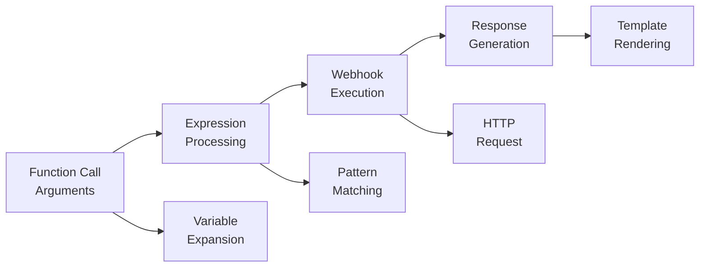
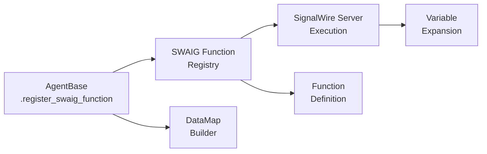

# SignalWire AI Agents SDK Architecture

## Overview

The SignalWire AI Agents SDK provides a Python framework for building, deploying, and managing AI agents as microservices. These agents are self-contained web applications that expose HTTP endpoints to interact with the SignalWire platform. The SDK simplifies the creation of custom AI agents by handling common functionality like HTTP routing, prompt management, and tool execution.

## Core Components

### Class Hierarchy

The SDK is built around a clear class hierarchy:

- **SWMLService**: The foundation class providing SWML document creation and HTTP service capabilities
  - **AgentBase**: Extends SWMLService with AI agent-specific functionality
    - **Custom Agent Classes**: User implementations like SimpleAgent
    - **Prefab Agents**: Ready-to-use agent types for common scenarios

### Key Components

1. **SWML Document Management**
   - Schema validation for SWML documents
   - Dynamic SWML verb creation and validation
   - Document rendering and serving

2. **Prompt Object Model (POM)**
   - Structured format for defining AI prompts
   - Section-based organization (Personality, Goal, Instructions, etc.)
   - Programmatic prompt construction and manipulation

3. **SWAIG Function Framework**
   - Tool definition and registration system
   - Parameter validation using JSON schema
   - Security tokens for function execution
   - Handler registry for function execution

4. **HTTP Routing**
   - FastAPI-based web service
   - Endpoint routing for SWML, SWAIG, and other services
   - Custom routing callbacks for dynamic endpoint handling
   - SIP request routing for voice applications
   - Basic authentication

5. **State Management**
   - Session-based state tracking
   - Persistence options (file system, memory)
   - State lifecycle hooks (startup, hangup)

6. **Prefab Agents**
   - Ready-to-use agent implementations
   - Customizable configurations
   - Extensible designs for common use cases

7. **Skills System**
   - Modular skill architecture for extending agent capabilities
   - Automatic skill discovery from directory structure
   - Parameter-configurable skills for customization
   - Dependency validation (packages and environment variables)
   - Built-in skills (web_search, datetime, math)

## DataMap Tools

The DataMap system provides a declarative approach to creating SWAIG tools that integrate with REST APIs without requiring custom webhook infrastructure. DataMap tools execute on SignalWire's server infrastructure, simplifying deployment and eliminating the need to expose webhook endpoints.

### Architecture Overview

DataMap tools follow a pipeline execution model on the SignalWire server:



### Core Components

1. **Builder Pattern**: Fluent interface for constructing data_map configurations
   ```python
   tool = (DataMap('function_name')
       .description('Function purpose')
       .parameter('param', 'string', 'Description', required=True)
       .webhook('GET', 'https://api.example.com/endpoint')
       .output(SwaigFunctionResult('Response template'))
   )
   ```

2. **Processing Pipeline**: Ordered execution with early termination
   - **Expressions**: Pattern matching against arguments
   - **Webhooks**: HTTP API calls with variable substitution
   - **Foreach**: Array iteration for response processing
   - **Output**: Final response generation using SwaigFunctionResult

3. **Variable Expansion**: Dynamic substitution using `${variable}` syntax
   - Function arguments: `${args.parameter_name}`
   - API responses: `${response.field.nested_field}`
   - Array elements: `${foreach.item_field}`
   - Global data: `${global_data.key}`
   - Metadata: `${meta_data.call_id}`

### Tool Types

The system supports different tool patterns:

1. **API Integration Tools**: Direct REST API calls
   ```python
   weather_tool = (DataMap('get_weather')
       .webhook('GET', 'https://api.weather.com/v1/current?q=${location}')
       .output(SwaigFunctionResult('Weather: ${response.current.condition}'))
   )
   ```

2. **Expression-Based Tools**: Pattern matching without API calls
   ```python
   control_tool = (DataMap('file_control')
       .expression(r'start.*', SwaigFunctionResult().add_action('start', True))
       .expression(r'stop.*', SwaigFunctionResult().add_action('stop', True))
   )
   ```

3. **Array Processing Tools**: Handle list responses
   ```python
   search_tool = (DataMap('search_docs')
       .webhook('GET', 'https://api.docs.com/search')
       .foreach('${response.results}')
       .output(SwaigFunctionResult('Found: ${foreach.title}'))
   )
   ```

### Integration with Agent Architecture

DataMap tools integrate seamlessly with the existing agent architecture:



1. **Registration**: DataMap tools are registered as SWAIG functions
2. **Execution**: Tools run on SignalWire infrastructure, not agent servers
3. **Response**: Results are returned to the agent as function responses

### Configuration Architecture

DataMap configurations use a hierarchical structure:

```json
{
  "function": "tool_name",
  "description": "Tool description", 
  "parameters": {
    "type": "object",
    "properties": {},
    "required": []
  },
  "data_map": {
    "expressions": [],
    "webhooks": [], 
    "foreach": "path",
    "output": {},
    "error_keys": []
  }
}
```

This structure separates:
- **Function Metadata**: Name, description, parameters
- **Processing Logic**: Expressions, webhooks, array handling
- **Output Definition**: Response templates and actions

### Benefits and Trade-offs

**Benefits:**
- No webhook infrastructure required
- Simplified deployment model
- Built-in authentication and error handling
- Server-side execution (no agent load)
- Automatic variable expansion

**Trade-offs:**
- Limited to REST API patterns
- No complex processing logic 