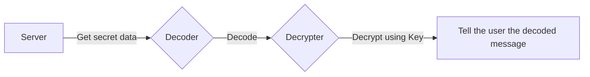

{/*

This is a really excellent example. 
`back_to_back_functions` has been soft deprecated, 
but this guide should be kept and adapted to a general-purpose example
of using multiple SWAIG functions.

See https://github.com/signalwire/signalwire-docs/issues/943

*/}

# Using `back_to_back_functions`

The `back_to_back_functions` property of a SWAIG function, when set to `true`, tells the AI that
it is allowed to invoke another function directly after a function has finished executing. It is
`false` by default.

Being able to explicitly tell the AI to invoke another function with the results of the current function
is very useful in certain situations. It makes composing multiple SWAIG functions extremely simple.
The AI is usually smart enough to decide what function to use, and whether to use it or not, based on
the intermediate results it gets.

## Usage

Whether you're using a SWAIG data map's expression or a webhook, the `back_to_back_functions` feature
can be enabled inside the `action` block of the function.

```yaml andJson
functions:
  - function: getIntermediateValue
    purpose: Get some information from server
    data_map:
      webhooks:
        - url: example.com/intermediate
          method: GET
          output:
            response: 'process the intermediate `%{value}` using the `finalStep` function.'
            action:
              - back_to_back_functions: true
```

With `back_to_back_functions` set to `true`, AI will automatically invoke the `finalStep` function with required arguments.

## Example

Consider the following pipeline, where you are querying for a piece of data from a certain server,
decoding it, then decrypting it with a separate SWAIG function.



This pipeline can be realised with the following SWML:

```yaml andJson
version: 1.0.0
sections:
  main:
    - answer
    - ai:
        prompt:
          text: Say "Hi".
            1. Get the secret message using the `getSecretMessage` function.
            2. Decode it using the `decode` function.
            3. Decrypt it using the `decrypt` function. The key is 'blue'.
            4. Say the decrypted message, then hang up.

        params:
          swaig_allow_swml: true
        SWAIG:
          functions:
            - function: getSecretMessage
              purpose: Get the secret message from the server
              data_map:
                webhooks:
                  - url: https://<NGROK UUID>.ngrok-free.app/secret_information
                    method: GET
                    output:
                      response:
                        'The secret data was acquired. It is `%{b64}`. Decode it using the
                        `decode` function.'
                      action:
                        - back_to_back_functions: true

            - function: decode
              purpose: Decode the given message
              argument:
                type: object
                properties:
                  encoded_message:
                    type: string
                    description: The encoded message to decode
              data_map:
                webhooks:
                  - url: 'https://<NGROK UUID>.ngrok-free.app/decode?enc=%{args.encoded_message}'
                    method: GET
                    output:
                      response: 'The decoded message is `%{decoded_message}`. Use the `decrypt` function to decrypt it.'
                      action:
                        - toggle_functions:
                            - active: true
                              function: decrypt
                        - back_to_back_functions: true

            - function: decrypt
              active: false
              purpose: Decrypt the given message
              argument:
                type: object
                properties:
                  encrypted_message:
                    type: string
                    description: The encrypted message to decrypt
                  key:
                    type: string
                    description: The key used for decoding
              data_map:
                webhooks:
                  - url: 'https://<NGROK UUID>.ngrok-free.app/decrypt?enc=%{args.encrypted_message}&key=%{args.key}'
                    method: GET
                    output:
                      response: 'The decrypted message is %{original}'
```

There are a few things to note in the example above:

1. Only the functions `getSecretMessage` and `decode` have the `back_to_back_functions` flag set to `true`.
   We only intend those two functions to call the next function in the pipeline. The `decrypt` function is
   the end of the chain.

2. We use the [`toggle_functions`](./toggle_functions.mdx) mechanism to keep the `decrypt` function
   disabled unless the `decode` function has been called. This is to make sure that the AI doesn't ever
   jump straight from fetching the secret data to attempting to decrypt it without decoding it.

A minimal server for this SWML script can be written as follows:

```javascript
const express = require("express");
const app = express();
const crypto = require("crypto");

app.use(express.json());

// Function to decrypt text with AES using a key
function decrypt(encryptedText, key) {
  const decipher = crypto.createDecipher("aes-256-cbc", key);
  let decrypted = decipher.update(encryptedText, "hex", "utf8");
  decrypted += decipher.final("utf8");
  return decrypted;
}

app.get("/secret_information", (req, res) => {
  res.json({
    b64: "MDIwMTUyMWNjZWRiMmJmY2JmNDllOTFkMTI5NzQyMzYwYTA5YWU1NmZhNDFiYTljZGUzNDU5NTBiNzQ1YjExYQ==",
  });
});

app.get("/decode", (req, res) => {
  const { enc } = req.query;
  const decoded_message = Buffer.from(enc, "base64").toString("utf-8");
  res.json({ decoded_message });
});

app.get("/decrypt", (req, res) => {
  const { key, enc } = req.query;
  const original = decrypt(enc, key);
  res.json({ original });
});

const port = 6000;
app.listen(port, () => {
  console.log(`Server is running on port ${port}`);
});
```

This server (running on `localhost`) can be made accessible to the wider web (and thus this SWML script) using forwarding tools like `ngrok`.
You can follow our [Testing webhooks with ngrok](https://developer.signalwire.com/platform/basics/guides/technical-troubleshooting/how-to-test-webhooks-with-ngrok) guide to learn how.

## Conclusion

You can use the `back_to_back_functions` mechanism to create very complex interactions all managed by an intelligent agent.
If you're looking for more examples, the [`set_meta_data`](./set_meta_data.mdx) tutorial also
demonstrates the use of `back_to_back_functions`.
