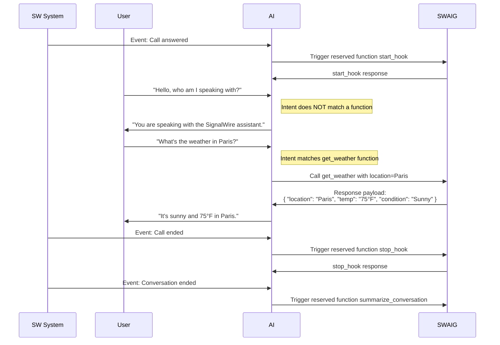

[reserved-functions]: #reserved-functions
[post-prompt]: /swml/methods/ai/post_prompt

An array of JSON objects to define functions that can be executed during the interaction with the AI.

| Name                                                      | Type       | Default | Description                                                                     |
|:----------------------------------------------------------|:-----------|:--------|:--------------------------------------------------------------------------------|
| `functions`<span className="optional-arg">Optional</span> | `object[]` | -       | An array of JSON objects that accept the [`functions Parameters`](#parameters). |


## **functions Parameters** {#parameters}

| Parameter                                                                                 | Type                    | Default           | Description                                                                                                                                                                                                                                                                                                                                                                                      |
| :---------------------------------------------------------------------------------------- | :---------------------- | :---------------- | :----------------------------------------------------------------------------------------------------------------------------------------------------------------------------------------------------------------------------------------------------------------------------------------------------------------------------------------------------------------------------------------------- |
| `description` <span className="required-arg">Required</span>                              | `string`                | -                 | A description of the context and purpose of the function, to explain to the agent when to use it.                                                                                                                                                                                                                                                                                                |
| `function` <span className="required-arg">Required</span>                                 | `string`                | -                 | A unique name for the function. This can be any user-defined string or can reference a reserved function. Reserved functoins are SignalWire functions that will be executed at certain points in the conversation. To learn more about reserved functions, see [Reserved Functions][reserved-functions].                                                                                                                                                           |
| `active` <span className="optional-arg">Optional</span>                                   | `boolean`               | `true`            | Whether the function is active.                                                                                                                                                                                                                                                                                                                                                                  |
| [`data_map`](./ai_swaig.data_map/index.mdx)<span className="optional-arg">Optional</span> | `object`                | -                 | An object containing properties to process or validate the input, perform actions based on the input, or connect to external APIs or services in a serverless fashion.                                                                                                                                                                                                                           |
| [`parameters`](./parameters/index.mdx) <span className="optional-arg">Optional</span>     | `object`                | -                 | A JSON object that defines the expected user input parameters and their validation rules for the function.                                                                                                                                                                                                                                                             |
| [`fillers`](./fillers.mdx) <span className="optional-arg">Optional</span>                                 | `object`                | -                 | A JSON object defining the fillers that should be played when calling a `swaig function`. This helps the AI break silence between responses. The filler is played asynchronously during the function call.                                                                                                                                                                                                                                                              | 
| `skip_fillers` <span className="optional-arg">Optional</span>                      | `boolean`               | `false`           | Skips the top-level fillers specified in [`ai.languages`](/swml/methods/ai/ai_languages) (which includes `speech_fillers` and `function_fillers`). When set to `true`, only function-specific fillers defined directly on [`SWAIG.functions.fillers`](/swml/methods/ai/swaig/functions/fillers) will play. |
| `meta_data` <span className="optional-arg">Optional</span>                                | `object`                | -                 | A powerful and flexible environmental variable which can accept arbitrary data that is set initially in the SWML script or from the SWML [`set_meta_data` action](./ai_swaig.data_map/data_map.output.mdx#actions). This data can be referenced **locally** to the function. All contained information can be accessed and expanded within the prompt - for example, by using a template string. |
| `meta_data_token` <span className="optional-arg">Optional</span>                          | `string`                | Set by SignalWire | Scoping token for `meta_data`. If not supplied, metadata will be scoped to function's `web_hook_url`.                                                                                                                                                                                                                                                                                            |
| `wait_file` <span className="optional-arg">Optional</span>                                | `string`                | -                 | A file to play while the function is running. `wait_file_loops` can specify the amount of times that files should continously play.                                                                                                                                                                                                                                                              |
| `wait_file_loops` <span className="optional-arg">Optional</span>                          | `string`   \| `integer` | -                 | The amount of times that `wait_file` should continuously play/loop.                                                                                                                                                                                                                                                                                                                              |
| `wait_for_fillers` <span className="optional-arg">Optional</span>                      | `boolean`               | `false`           | Whether to wait for fillers to finish playing before continuing with the function.                                                                                                                                                                                                                                                                                                               |
| `web_hook_url` <span className="optional-arg">Optional</span>                             | `string`                | -                 | Function-specific URL to send status callbacks and reports to. Takes precedence over a default setting. Authentication can also be set in the url in the format of `username:password@url`. See [Callback Parameters](./functions.web_hook_url.mdx) for details on the request body.                                                                                                             |
| <span className="deprecated-arg">`purpose`</span>                                         | `string`                | -                 | <span className="deprecated-desc">Deprecated. Use `description` instead.</span>                                                                                                                                                                                                                                                                                                                  |
| <span className="deprecated-arg">`argument`</span>                                        | `object`                | -                 | <span className="deprecated-desc">Deprecated. Use `parameters` instead.</span>                                                                                                                                                                                                                                                                                                                   |


## **Reserved Functions** {#reserved-functions}

Reserved functions are special SignalWire functions that are automatically triggered at specific points during a conversation.
You define them just like any other SWAIG function, but their names correspond to built-in logic on the SignalWire platform,
allowing them to perform specific actions at the appropriate time.

:::warning Function name conflicts
Do not use reserved function names for your own SWAIG functions unless you want to use the reserved function's built-in behavior.
Otherwise, your function may not work as expected.
:::

### List of Reserved Functions

| Function Name            | Purpose                                                                                                                                                                                                                   |
|:------------------------ |:--------------------------------------------------------------------------------------------------------------------------------------------------------------------------------------------------------------------------|
| `start_hook`             | Triggered when the call is answered. Sends the set properties of the function to the defined `web_hook_url`.                                                                       |
| `stop_hook`              | Triggered when the call is ended. Sends the set properties of the function to the defined `web_hook_url`.                                                                          |
| `summarize_conversation` | Triggered when the call is ended. The [`post_prompt`][post-prompt] must be defined for this function to be triggered. Provides a summary of the conversation and any set properties to the defined `web_hook_url`. |

:::important Where are my function properties?
If the AI is not returning the properties you set in your SWAIG function, it may be because a reserved function was triggered before
those properties were available. To ensure your function receives all necessary information, make sure the AI has access to the
required property values before the reserved function is called. Any property missing at the time the reserved function runs will
not be included in the data sent back.
:::


## Diagram examples {#diagrams}




## SWML **Examples** {#examples}

### Using SWAIG Functions

```yaml andJson
version: 1.0.0
sections:
  main:
    - ai:
        post_prompt_url: "https://example.com/my-api"
        prompt:
          text: |
            You are a helpful assistant that can provide information to users about a destination.
            At the start of the conversation, always ask the user for their name.
            You can use the appropriate function to get the phone number, address,
            or weather information.
        post_prompt:
          text: "Summarize the conversation."
        SWAIG:
          includes:
            - functions:
                - get_phone_number
                - get_address
              url: https://example.com/functions
              user: me
              pass: secret
          defaults:
            web_hook_url: https://example.com/my-webhook
            web_hook_auth_user: me
            web_hook_auth_pass: secret
          functions:
            - function: get_weather
              description: To determine what the current weather is in a provided location.
              parameters:
                properties:
                  location:
                    type: string
                    description: The name of the city to find the weather from.
                type: object
            - function: summarize_conversation
              description: Summarize the conversation.
              parameters:
                type: object
                properties:
                  name:
                    type: string
                    description: The name of the user.
```
