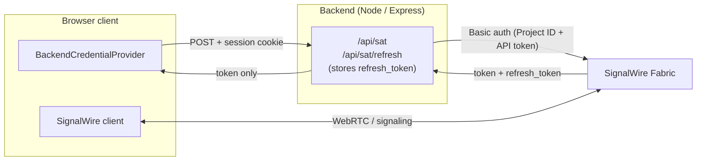

A Zoom-style multi-party video conference built on the Browser SDK: a backend that mints tokens, a lobby with device selection, multi-party video, in-call controls, screen share, server-side layouts, a participant roster, and chat.

The app has two parts — a small **backend** that exchanges your API token for short-lived user tokens, and a **browser client** that does everything else. Every piece of the client is driven by [RxJS observables][rxjs] on the SDK: nothing polls, everything subscribes and reacts to state the SDK pushes.

<Info>
**Before you start.** You'll need a SignalWire Space, a project (Project ID + API token), and a [user][users] the backend can issue tokens for. Mic and camera access requires an HTTPS origin (`localhost` is the development exception).
</Info>

## Architecture



The browser **never sees your API token**, and refresh tokens **never reach the browser** — they live server-side, keyed by a session cookie, and rotate on every refresh. The client authenticates by calling the backend, gets a short-lived [Subscriber Access Token][auth] (SAT), and lets the SDK schedule its own refresh through the same backend.

## Project layout

The full runnable app lives alongside this guide:

<Files>
  <Folder name="video-conference-app" defaultOpen>
    <Folder name="server" defaultOpen>
      <File name="index.ts" href="https://github.com/signalwire/docs/blob/main/fern/products/browser-sdk/pages/v4/guides/examples/video-conference-app/server/index.ts" comment="SAT mint + refresh proxy (Express)" />
    </Folder>
    <Folder name="src" defaultOpen>
      <File name="credentials.ts" href="https://github.com/signalwire/docs/blob/main/fern/products/browser-sdk/pages/v4/guides/examples/video-conference-app/src/credentials.ts" comment="CredentialProvider that talks to the backend" />
      <File name="main.ts" href="https://github.com/signalwire/docs/blob/main/fern/products/browser-sdk/pages/v4/guides/examples/video-conference-app/src/main.ts" comment="Client setup, lobby, devices, directory, inbound calls" />
      <File name="room.ts" href="https://github.com/signalwire/docs/blob/main/fern/products/browser-sdk/pages/v4/guides/examples/video-conference-app/src/room.ts" comment="In-room orchestration: media, status, roster, layouts, chat, call info" />
      <File name="controls.ts" href="https://github.com/signalwire/docs/blob/main/fern/products/browser-sdk/pages/v4/guides/examples/video-conference-app/src/controls.ts" comment="Self-participant controls: mute, camera, hand, deaf, audio processing, volumes" />
      <File name="dialpad.ts" href="https://github.com/signalwire/docs/blob/main/fern/products/browser-sdk/pages/v4/guides/examples/video-conference-app/src/dialpad.ts" comment="DTMF dialpad" />
      <File name="quality.ts" href="https://github.com/signalwire/docs/blob/main/fern/products/browser-sdk/pages/v4/guides/examples/video-conference-app/src/quality.ts" comment="Connection quality + resilience telemetry" />
      <File name="dom.ts" href="https://github.com/signalwire/docs/blob/main/fern/products/browser-sdk/pages/v4/guides/examples/video-conference-app/src/dom.ts" comment="Tiny querySelector helper" />
      <File name="style.css" href="https://github.com/signalwire/docs/blob/main/fern/products/browser-sdk/pages/v4/guides/examples/video-conference-app/src/style.css" comment="Layout and spacing only — everything else is browser defaults" />
    </Folder>
    <File name="index.html" href="https://github.com/signalwire/docs/blob/main/fern/products/browser-sdk/pages/v4/guides/examples/video-conference-app/index.html" comment="Lobby + conference markup" />
    <File name=".env.example" href="https://github.com/signalwire/docs/blob/main/fern/products/browser-sdk/pages/v4/guides/examples/video-conference-app/.env.example" comment="Environment template" />
    <File name="package.json" href="https://github.com/signalwire/docs/blob/main/fern/products/browser-sdk/pages/v4/guides/examples/video-conference-app/package.json" comment="Dependencies and dev scripts" />
    <File name="vite.config.ts" href="https://github.com/signalwire/docs/blob/main/fern/products/browser-sdk/pages/v4/guides/examples/video-conference-app/vite.config.ts" comment="Dev proxy: /api to backend" />
  </Folder>
</Files>

## Run it

<Steps>

### Configure your environment

Copy `.env.example` to `.env` and fill in your Space, project credentials, and the user the backend issues tokens for:

```bash
cp .env.example .env
```

```bash title=".env"
SW_SPACE=example.signalwire.com
SW_PROJECT_ID=...
SW_API_TOKEN=...
SW_SUBSCRIBER_REFERENCE=...
SW_SUBSCRIBER_PASSWORD=...
```

### Install and start

```bash
npm install
npm run dev
```

`npm run dev` starts the backend on port `3001` and the Vite dev server on `5173`. Vite proxies `/api/*` to the backend, so the browser only ever talks to one origin. Open `http://localhost:5173`, click **Sign in** to come online, pick your devices, and **Join** the default room (`/public/test-room`).

</Steps>

## How it works

### The backend mints tokens

`server/index.ts` exposes two endpoints. `POST /api/sat` exchanges your API token (sent as HTTP Basic auth) for a fresh SAT, stashes the returned `refresh_token` in memory keyed by a session cookie, and returns **only** the `token` and `expires_at` to the browser:

```ts title="server/index.ts"
app.post('/api/sat', async (req, res) => {
  const r = await fetch(`${FABRIC_BASE}/subscribers/tokens`, {
    method: 'POST',
    headers: {
      'Content-Type': 'application/json',
      Authorization: `Basic ${BASIC_AUTH}`
    },
    body: JSON.stringify({
      reference: SW_SUBSCRIBER_REFERENCE,
      password: SW_SUBSCRIBER_PASSWORD
    })
  });

  const { token, refresh_token, expires_at } = await r.json();
  refreshTokens.set(req.sid, refresh_token); // server-side only
  res.json({ token, expires_at });            // browser sees this
});
```

`POST /api/sat/refresh` swaps the stored `refresh_token` for a new SAT **and** a new `refresh_token`, then persists the rotation. Because the refresh token rotates on every call, a leaked one only works once.

<Note>
The demo issues SATs for one hardcoded user and uses an in-memory `Map` keyed by a session cookie that proves nothing. A real app gates `/api/sat` behind your existing user auth and stores refresh tokens in an encrypted, per-user column. See [Authentication][auth].
</Note>

### The client plugs in a credential provider

The SDK accepts a custom [`CredentialProvider`][cred-providers]: an object with `authenticate()` and `refresh()`. `src/credentials.ts` implements both by calling the backend with the session cookie attached, and converts SignalWire's seconds-based `expires_at` into the SDK's ms-based `expiry_at`:

```ts title="src/credentials.ts"
export class BackendCredentialProvider implements CredentialProvider {
  async authenticate(_context?: AuthenticateContext) {
    return fetchSat('/api/sat');
  }

  // The SDK calls this shortly before the current token expires.
  async refresh() {
    return fetchSat('/api/sat/refresh');
  }
}

async function fetchSat(path: string) {
  const r = await fetch(path, { method: 'POST', credentials: 'include' });
  const { token, expires_at } = await r.json();
  return { token, expiry_at: expires_at * 1000 }; // seconds → ms
}
```

### Connecting and placing calls

`src/main.ts` builds the client with that provider and calls [`register()`][register] — without it, inbound calls never arrive even when someone dials this user:

```ts title="src/main.ts"
client = new SignalWire(new BackendCredentialProvider());
await client.register();

bindDevicePickers(client);
bindIncomingCalls(client);
bindDirectory(client);
```

**Device pickers.** The client owns the *currently selected* device for the whole session. The lobby `<select>` elements populate from the device observables, and changing one hot-swaps the active track mid-call without renegotiating:

```ts title="src/main.ts"
c.audioInputDevices$.subscribe((devs) => populate(audioInSelect, devs));
c.videoInputDevices$.subscribe((devs) => populate(videoInSelect, devs));

audioInSelect.onchange = () => {
  const d = c.audioInputDevices.find((x) => x.deviceId === audioInSelect.value);
  if (d) c.selectAudioInputDevice(d);
};
```

**Outbound calls.** [`client.dial()`][dial] joins a room or reaches another user, returning a [`Call`][call]:

```ts title="src/main.ts"
const call = await client.dial(destInput.value.trim(), {
  audio: audioOpt.checked,
  video: videoOpt.checked,
  receiveAudio: true,
  receiveVideo: true
});
enterConference(call);
```

**Inbound calls.** `client.session.incomingCalls$` emits the *current list* of ringing calls every time it changes — not one event per call — so the handler picks the first ringing call it hasn't shown yet. A native `<dialog>` supplies the modal and backdrop; when it closes we either `answer()` or `reject()`, and a `status$` subscription drops the dialog if the caller gives up first:

```ts title="src/main.ts"
c.session.incomingCalls$.subscribe((calls) => {
  const ringing = calls.find((call) => call.status === 'ringing');
  if (!ringing || ringing === shown) return;
  shown = ringing;
  showIncomingCall(ringing);
});

// in showIncomingCall(ringing):
incoming.showModal();
incoming.onclose = () =>
  incoming.returnValue === 'accept'
    ? (ringing.answer({ audio: true, video: true }), enterConference(ringing))
    : ringing.reject();
```

**Directory.** `client.directory` is a paginated collection of the addresses this user can reach. Click one to dial its `defaultChannel`:

```ts title="src/main.ts"
directory.addresses$.subscribe((addresses) => {
  // render one button per address; on click → placeCall(address.defaultChannel)
});
directory.hasMore$.subscribe((hasMore) => (more.hidden = !hasMore));
more.onclick = () => directory.loadMore();
directory.loadMore(); // initial page
```

See [outbound calls][outbound], [inbound calls][inbound], [device management][devices], and the [address book][address-book].

### Inside the room

Once a call is connected, `src/room.ts` orchestrates the conference — it wires media, status, the roster, layouts, chat, and the read-only call-info panel, and hands the rest to focused modules: `controls.ts` (self-participant controls), `dialpad.ts` (DTMF), and `quality.ts` (telemetry). Everything below is a subscription to an observable on the [`Call`][call] or on a [participant][participant].

```ts title="src/room.ts"
export function joinRoom(client, call) {
  bindMedia(call);
  bindStatus(call);
  bindRoster(call);
  bindLayouts(call);
  bindChat(call);
  bindCallInfo(call);
  bindControls(client, call); // controls.ts
  bindDialpad(call);          // dialpad.ts
  bindQuality(call);          // quality.ts
}
```

**Media.** SignalWire composes every participant's video into a single server-side stream, so the page needs just one `<video>` for the room plus one for the local preview:

```ts title="src/room.ts"
call.localStream$.subscribe((stream) => { if (stream) local.srcObject = stream; });
call.remoteStream$.subscribe((stream) => { if (stream) remote.srcObject = stream; });
```

**Roster.** `participants$` emits the full list whenever anyone joins or leaves. The app diffs that list against rows it has already built, then wires each [participant][participant]'s own observables so its badges update reactively:

```ts title="src/room.ts"
call.participants$.subscribe((participants) => {
  count.textContent = String(participants.length);
  // ...add rows for new participants, remove rows for those who left
});

function bindParticipantRow(p: CallParticipant, row: HTMLElement) {
  p.name$.subscribe((n) => set('.name', n || 'Unknown'));
  p.type$.subscribe((t) => set('.type', t));
  p.audioMuted$.subscribe((m) => toggle('.mic', !m));
  p.videoMuted$.subscribe((m) => toggle('.cam', !m));
  p.handraised$.subscribe((h) => toggle('.hand', h));
  p.isTalking$.subscribe((t) => toggle('.talking', t));
  p.deaf$.subscribe((d) => toggle('.deaf', d));
  p.visible$.subscribe((v) => toggle('.hidden-flag', !v));
}
```

**Controls.** Mic, camera, hand-raise, deafen, and screen share all act on the [self participant][self] — the one representing this client. `self$` may emit `null` briefly before the room confirms the join, so the click handlers read a live `self` reference and no-op until it's set; the reactive subscriptions relabel each button from the matching observable:

```ts title="src/controls.ts"
let self: CallSelfParticipant | null = null;
call.self$.subscribe((s) => { self = s; /* sync button labels from s.*$ */ });

mic.onclick   = () => self?.toggleMute();
cam.onclick   = () => self?.toggleMuteVideo();
hand.onclick  = () => self?.toggleHandraise();
deaf.onclick  = () => self?.toggleDeaf();
share.onclick = () =>
  self?.screenShareStatus === 'started' ? self.stopScreenShare() : self?.startScreenShare();

// remove() drops just this participant; end() tears the room down for everyone.
removeSelf.onclick = () => self?.remove();
endCall.onclick    = () => self?.end();
```

**Audio processing.** The self participant also exposes server-side audio toggles and level controls. Each toggle flips a boolean; the sliders push an integer and echo the live value back from the observable:

```ts title="src/controls.ts"
echo.onclick  = () => self?.toggleEchoCancellation();
gain.onclick  = () => self?.toggleAudioInputAutoGain();
noise.onclick = () => self?.toggleNoiseSuppression();

s.inputVolume$.subscribe((v) => (inputVolume.value = String(v)));
inputVolume.onchange = () => self?.setAudioInputVolume(parseInt(inputVolume.value, 10));
// likewise setAudioOutputVolume() and setAudioInputSensitivity()
```

**Dialpad.** Each pad button sends one DTMF tone through the call — useful for IVRs and conference PINs:

```ts title="src/dialpad.ts"
pad.querySelectorAll('button[data-digit]').forEach((button) => {
  button.onclick = () => call.sendDigits(button.dataset.digit);
});
```

**Layouts.** Available layouts come from the server. Switching reshapes the composite stream for *everyone* in the room, not just the local viewer:

```ts title="src/room.ts"
call.layouts$.subscribe((layouts) => { /* repopulate <select> */ });
call.layout$.subscribe((current) => { if (current) select.value = current; });
select.onchange = () => call.setLayout(select.value, {});
```

**Chat.** Each call's `address` exposes a `textMessages$` collection. Sending goes through `address.sendText()`; receiving comes from the collection's `values$`, which always emits the full ordered list:

```ts title="src/room.ts"
address.textMessages$.subscribe((collection) => {
  collection?.values$.subscribe((messages) => {
    log.innerHTML = '';
    for (const m of messages) { /* render m.text */ }
  });
});

form.onsubmit = (e) => { e.preventDefault(); address.sendText(input.value.trim()); };
```

**Call info.** A handful of read-only observables report what the server is doing with the room — surfaced in a collapsible panel:

```ts title="src/room.ts"
call.recording$.subscribe((on) => ($('#info-recording').textContent = yn(on)));
call.streaming$.subscribe((on) => ($('#info-streaming').textContent = yn(on)));
call.locked$.subscribe((on) => ($('#info-locked').textContent = yn(on)));
call.mediaDirections$.subscribe((d) => { /* d.audio, d.video */ });
call.capabilities$.subscribe((caps) => /* what this leg may do */);
```

**Connection quality.** The SDK continuously measures the call and exposes it as observables — a MOS score, a coarse quality level, raw WebRTC stats, detected issues, and the state of the automatic recovery pipeline. Two buttons let you nudge recovery by hand:

```ts title="src/quality.ts"
call.qualityScore$.subscribe((score) => /* MOS 1–5 */);
call.qualityLevel$.subscribe((level) => /* 'excellent' | 'good' | … */);
call.networkMetrics$.subscribe((history) => { const m = history.at(-1); /* RTT, jitter, loss */ });
call.recoveryState$.subscribe((state) => /* idle | recovering | … */);

keyframeBtn.onclick   = () => call.requestKeyframe();
iceRestartBtn.onclick = () => call.requestIceRestart();
```

See [call controls][controls], [screen sharing][screen-share], [layouts][layouts], and [messaging & chat][chat].

## Next steps

- **[Authentication][auth]** — how the backend issues and refreshes user tokens.
- **[RxJS primer][rxjs]** — the observable pattern every step above is built on.
- **[SignalWire client reference][signalwire]** — the full client API.

[auth]: /docs/browser-sdk/v4/guides/authentication
[rxjs]: /docs/browser-sdk/v4/guides/rxjs-primer
[outbound]: /docs/browser-sdk/v4/guides/outbound-calls
[inbound]: /docs/browser-sdk/v4/guides/inbound-calls
[devices]: /docs/browser-sdk/v4/guides/device-management
[address-book]: /docs/browser-sdk/v4/guides/address-book
[controls]: /docs/browser-sdk/v4/guides/call-controls
[screen-share]: /docs/browser-sdk/v4/guides/screen-sharing
[layouts]: /docs/browser-sdk/v4/guides/layouts
[chat]: /docs/browser-sdk/v4/guides/messaging-chat
[signalwire]: /docs/browser-sdk/v4/reference/signalwire
[dial]: /docs/browser-sdk/v4/reference/signalwire/dial
[register]: /docs/browser-sdk/v4/reference/signalwire/register
[call]: /docs/browser-sdk/v4/reference/webrtc-call
[participant]: /docs/browser-sdk/v4/reference/participant
[self]: /docs/browser-sdk/v4/reference/self-participant
[cred-providers]: /docs/browser-sdk/v4/reference/interfaces/credential-provider
[users]: /docs/platform/subscribers
