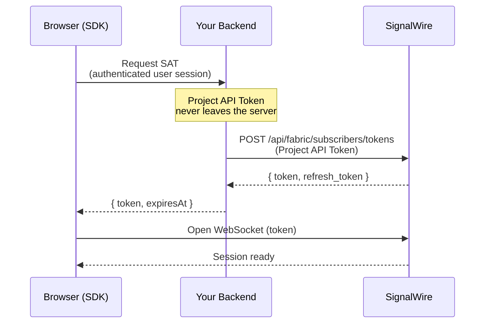

The SDK authenticates with a **Subscriber Access Token (SAT)**, a short-lived credential that identifies which [**User**](/docs/platform/subscribers) (called a **Subscriber** on the platform) the SDK is acting on behalf of. Your backend creates the SAT using your Project API Token, then hands it to the browser, where the SDK uses it to open a WebSocket session with SignalWire.

```ts Browser
import { SignalWire, StaticCredentialProvider } from "@signalwire/js";

const client = new SignalWire(
  new StaticCredentialProvider({ token: "<your SAT>" })
);
```

The sections below cover which kind of SAT to create, how to deliver it to the browser, and how to keep the session alive past the SAT's expiry.

<Info>
**Before you start.** You need a SignalWire space, a Project ID, and an API token with at least one of the **Voice / Messaging / Fax / Video** scopes. All three are in the [API Credentials section of the dashboard](https://my.signalwire.com/?page=api). The Project API Token is what creates SATs. Keep it server-side only.
</Info>

## Authentication patterns

The SDK supports four authentication patterns, each shaped by who is holding the credential and what they need to do with it.

<CardGroup cols={2}>
  <Card title="Authenticated users" icon="fa-regular fa-user-check">
    For apps where users sign in with an account. Each user can place and receive calls.
  </Card>
  <Card title="Guest users" icon="fa-regular fa-user-clock">
    For users without an account who need limited calling, typically to a short list of destinations you allow.
  </Card>
  <Card title="Public usage" icon="fa-regular fa-globe">
    For embedding a "call us" button on a public webpage. Anyone visiting can dial one preset destination.
  </Card>
  <Card title="Call invite" icon="fa-regular fa-envelope">
    For giving a specific recipient a way to connect to a call through a shareable invite.
  </Card>
</CardGroup>

Each pattern uses a different credential: three **Subscriber Access Token (SAT)** flavors issued for a user, guest, or invitee, and a separate **Embed token** for public widgets. The credential's capabilities determine what the holder can do:

| Pattern | Credential | Inbound calls | Outbound calls | Destinations | Audience |
|---|---|:---:|:---:|---|---|
| Authenticated users | **[Subscriber Access Token](/docs/apis/rest/subscribers/tokens/create-subscriber-token)** | ✓ | ✓ | Anywhere the user can reach | One signed-in user |
| Guest users | **[Guest SAT](/docs/apis/rest/subscribers/tokens/create-subscriber-guest-token)** | ✗ | ✓ | A list of allowed destinations you set (max 10) | One guest user with scoped capabilities |
| Call invite | **[Invite SAT](/docs/apis/rest/subscribers/tokens/create-subscriber-invite-token)** | ✗ | ✓ | The inviting user's address | One invitee |
| Public usage | **[Embed token](/docs/apis/rest/embeds/tokens/create-guest-embed-token)** | ✗ | ✓ | Tied to a single resource | Anyone visiting a public page |

Match the credential's reach to the trust level of whoever holds it. If a credential can dial anyone, then anyone who can read it can dial anyone, so use the [delivery model](#how-the-sdk-gets-its-credential) below that keeps the credential out of untrusted hands.

## How the SDK gets its credential

Credentials reach the SDK one of two ways. Embed tokens live in the page itself. Every other variant is created server-side and handed to the browser; the only thing that differs is whether the SDK should keep the session alive past the credential's first expiry.

### Embed tokens (in-page)

Embed tokens are the only credential designed to sit in a public page. They are pinned to one Click-to-Call resource: anyone who reads the page can only dial the resource the embed token was created for. That fixed scope is what makes them safe to expose to every visitor.

Getting an embed token is a two-step setup:

1. Create a [Click-to-Call resource in your SignalWire dashboard](https://my.signalwire.com/?page=click_to_calls). The dashboard issues a **Click-to-Call (C2C) token** (with a `c2c_` prefix) tied to that resource.
2. Exchange the C2C token for an **embed token** by calling [`POST /api/embeds/tokens`](/docs/apis/rest/embeds/tokens/create-guest-embed-token). The embed token is what the SDK is built to consume for public widgets.

The SDK also accepts a C2C token directly as a shortcut (convenient for testing), but production widgets should pass the exchanged embed token. The examples below use the shortcut form so they can run with only the dashboard value.

**Shortcut for a single call.** [`embeddableCall()`](/docs/browser-sdk/v4/reference/functions/embeddable-call) handles credential exchange, client construction, and dial in one call:

```ts Browser
import { embeddableCall } from "@signalwire/js";

const call = await embeddableCall({
  host: "yourspace.signalwire.com",
  embedToken: "c2c_7acc0e5e968706a032983cd80cdca219",
  to: "/public/support",
});
```

**Full SDK setup for multiple calls or client-level subscriptions.** Pass [`EmbedTokenCredentialProvider`](/docs/browser-sdk/v4/reference/credential-providers/embed-token-credential-provider) to the SDK directly. You keep a long-lived [`SignalWire`](/docs/browser-sdk/v4/reference/signalwire) client that can dial repeatedly and exposes observables you can subscribe to. The provider exchanges the embed token for a Guest SAT and refreshes automatically:

```ts Browser
import { SignalWire, EmbedTokenCredentialProvider } from "@signalwire/js";

const client = new SignalWire(
  new EmbedTokenCredentialProvider(
    "yourspace.signalwire.com",
    "c2c_7acc0e5e968706a032983cd80cdca219"
  )
);

const call = await client.dial("/public/support");
```

### Server-fetched SATs

The browser asks for a SAT, your backend creates one using the Project API Token, and the SDK uses it for the session.



The browser never talks to SignalWire directly here. Creating any SAT requires the Project API Token, which can issue a SAT for *any* user in your project. That is why it stays server-side. The hop through your backend is what enforces "this browser session can only get the SAT it's authorized for."

Three SAT variants come through this path:

- **Subscriber Access Token** ([`POST /api/fabric/subscribers/tokens`](/docs/apis/rest/subscribers/tokens/create-subscriber-token)): full user identity for a signed-in user; can receive inbound calls. Also called a default-scope SAT when you need to distinguish it from the variants below.
- **Guest SAT** ([`POST /api/fabric/guests/tokens`](/docs/apis/rest/subscribers/tokens/create-subscriber-guest-token)): outbound-only, pinned to up to 10 `allowed_addresses`.
- **Invite SAT** ([`POST /api/fabric/subscriber/invites`](/docs/apis/rest/subscribers/tokens/create-subscriber-invite-token)): outbound-only, pinned to one address; created client-side by a signed-in user and delivered out-of-band (URL, email, QR code) to one recipient.

Once the SAT is in the browser, the next decision is **whether the session needs to outlive a single SAT**. For one-shot sessions (typical for Guest and Invite SATs), use [`StaticCredentialProvider`](/docs/browser-sdk/v4/reference/credential-providers/static-credential-provider). The SDK uses the fetched SAT until it expires, then the session ends. For sessions that must outlive a single SAT, pick a refresh strategy below.

## Refreshing SATs

SATs are short-lived (two hours by default), which limits the damage if one ever leaks. When a SAT expires, the SDK's WebSocket session ends with it unless a fresh SAT is supplied first. **Refreshing** is the process of swapping in a fresh SAT before the current one expires, so the session continues uninterrupted: the user stays connected, ongoing calls aren't dropped, and they don't need to re-authenticate.

There are two ways to refresh a SAT, depending on where the rotation logic should live.

### Server-side refresh

The backend rotates the SAT. Your [`CredentialProvider`](/docs/browser-sdk/v4/reference/interfaces/credential-provider) exposes a [`refresh()`](/docs/browser-sdk/v4/reference/interfaces/credential-provider) method that fetches a fresh SAT from your backend; the SDK calls it shortly before the current SAT's `expiry_at`. Every rotation roundtrips through your backend.

```ts Browser
import { SignalWire } from "@signalwire/js";
import type { CredentialProvider } from "@signalwire/js";

class BackendSAT implements CredentialProvider {
  async authenticate() {
    const r = await fetch("/api/signalwire-token", {
      method: "POST",
      // `credentials: "include"` tells fetch to send the browser's cookies with
      // the request, so your backend reads its own session cookie and knows
      // which signed-in user is asking for a token.
      credentials: "include",
    });
    const { token, expiresAt } = await r.json();
    // expiry_at is a Date.now()-style millisecond timestamp.
    return { token, expiry_at: expiresAt };
  }

  refresh() {
    return this.authenticate();
  }
}

const client = new SignalWire(new BackendSAT());
```


Inside `/api/signalwire-token`, your backend produces the fresh SAT one of two ways:

<Tabs>
  <Tab title="Rotate the refresh token (recommended)">
    Every SAT comes back with a companion `refresh_token`. Your backend stores it and swaps it for a new SAT/refresh-token pair via [`POST /api/fabric/subscribers/tokens/refresh`](/docs/apis/rest/subscribers/tokens/refresh-subscriber-token). This keeps the session going without re-checking the user's app session on every rollover.

    ```js Server (Node.js)
    app.post("/api/signalwire-token", async (req, res) => {
      // Look up the refresh_token you stored when this user was created.
      const stored = await getRefreshTokenForUser(req.user.id);

      // Swap that refresh_token for a new SAT + new refresh_token pair.
      const r = await fetch(`https://${SPACE}/api/fabric/subscribers/tokens/refresh`, {
        method: "POST",
        headers: { Authorization: BASIC_AUTH, "Content-Type": "application/json" },
        body: JSON.stringify({ refresh_token: stored }),
      });
      const { token, refresh_token } = await r.json();

      // Save the rotated refresh_token so the next call can swap it too.
      await saveRefreshTokenForUser(req.user.id, refresh_token);

      // expiresAt assumes the 2h default; if you set `expire_at` when you created the SAT, compute from that.
      res.json({ token, expiresAt: Date.now() + 2 * 60 * 60 * 1000 });
    });
    ```

    The new access token carries the standard SAT lifetime; the new refresh token outlives it by five minutes so the swap has slack. Store refresh tokens encrypted, server-side only.
  </Tab>
  <Tab title="Re-issue against the user's session">
    If you'd rather not store refresh tokens, re-authenticate the user on every rollover (usually via their app session cookie) and create a brand-new SAT. Stateless on your side, but it hits your user-auth path every time a SAT expires.

    ```js Server (Node.js)
    app.post("/api/signalwire-token", requireUserAuth, async (req, res) => {
      // `requireUserAuth` reads the session cookie and rejects the request if
      // there's no signed-in app user, then populates `req.user`.
      const r = await fetch(`https://${SPACE}/api/fabric/subscribers/tokens`, {
        method: "POST",
        headers: { Authorization: BASIC_AUTH, "Content-Type": "application/json" },
        // `reference` is the string SignalWire uses to identify the user.
        // Pick a stable identifier from your user record (email, UUID) and use
        // the same one every time so the same user is found across logins.
        body: JSON.stringify({ reference: req.user.email }),
      });
      const { token } = await r.json();
      // expiresAt assumes the 2h default; if you set `expire_at` when you created the SAT above, compute from that.
      res.json({ token, expiresAt: Date.now() + 2 * 60 * 60 * 1000 });
    });
    ```
  </Tab>
</Tabs>

### Client-side refresh

The SDK rotates the SAT directly with SignalWire after it is first issued. Your backend is involved only at startup.

This path binds the SAT to the browser session that requested it. The SDK provides a public **fingerprint** at authentication time; the backend includes that fingerprint plus `scope: "sat:refresh"` on the create request. Refresh calls are then signed against the matching private key the browser holds, so a SAT lifted off the wire can't be rotated from anywhere else.

```ts Browser
import { SignalWire } from "@signalwire/js";
import type { CredentialProvider, AuthenticateContext } from "@signalwire/js";

class BackendSAT implements CredentialProvider {
  async authenticate(context?: AuthenticateContext) {
    const r = await fetch("/api/signalwire-token", {
      method: "POST",
      // `credentials: "include"` tells fetch to send the browser's cookies with
      // the request, so your backend reads its own session cookie and knows
      // which signed-in user is asking for a token.
      credentials: "include",
      headers: { "content-type": "application/json" },
      // Forward the SDK's fingerprint so the backend can issue a SAT bound to this browser.
      body: JSON.stringify({ fingerprint: context?.fingerprint }),
    });
    const { token, expiresAt } = await r.json();
    return { token, expiry_at: expiresAt };
  }

  // No refresh() — rotation happens directly between the SDK and SignalWire after the SAT is first issued.
}

const client = new SignalWire(new BackendSAT());
```

On the backend side, forward the fingerprint and request the refresh scope when creating the SAT:

```js Server (Node.js)
app.post("/api/signalwire-token", requireUserAuth, async (req, res) => {
  // `requireUserAuth` reads the session cookie and populates `req.user` with
  // the signed-in app user; `req.body.fingerprint` was forwarded by the SDK.
  const r = await fetch(`https://${SPACE}/api/fabric/subscribers/tokens`, {
    method: "POST",
    headers: { Authorization: BASIC_AUTH, "Content-Type": "application/json" },
    body: JSON.stringify({
      reference: req.user.email,         // identifies the SignalWire user
      fingerprint: req.body.fingerprint, // binds the SAT to this browser
      scope: "sat:refresh",              // lets the SDK refresh without your backend
    }),
  });
  const { token } = await r.json();
  res.json({ token, expiresAt: Date.now() + 2 * 60 * 60 * 1000 });
});
```

For the rotation endpoints, refresh events you can subscribe to, and failure modes, see [`CredentialProvider`](/docs/browser-sdk/v4/reference/interfaces/credential-provider).

## Connection lifecycle

Constructing [`SignalWire`](/docs/browser-sdk/v4/reference/signalwire) runs three steps in sequence: authenticate the SAT, open the WebSocket, and register the user as online. Each step runs by default, and each can be deferred with a constructor option in [`SignalWireOptions`](/docs/browser-sdk/v4/reference/interfaces/signalwire-options) so your UI can drive it later.

| Step | Default | Defer with | Run later with |
| --- | --- | --- | --- |
| Open the WebSocket | runs | `skipConnection: true` | [`client.connect()`](/docs/browser-sdk/v4/reference/signalwire/connect) |
| Register as online | runs | `skipRegister: true` | [`client.register()`](/docs/browser-sdk/v4/reference/signalwire/register) |
| Persist across reloads | off | `persist: true` | (constructor only) |

```ts Browser
const client = new SignalWire(credentialProvider, {
  skipConnection: true,
  skipRegister: true,
});

await client.connect();    // open the WebSocket when the user opts in
await client.register();   // come online for inbound calls
```

## Going online and offline

[`register()`](/docs/browser-sdk/v4/reference/signalwire/register) tells SignalWire the user is online on this session, so inbound calls and presence events route here. It runs automatically when the client constructs unless `skipRegister: true` is set — defer it when the user needs to opt in (microphone prompt, "Go online" toggle, permissions step) before they start receiving calls.

[`unregister()`](/docs/browser-sdk/v4/reference/signalwire/unregister) is the opposite: the user goes offline for inbound calls, but the WebSocket stays open so outbound calls and observable subscriptions keep working. Use it for Do Not Disturb, app-background, or "available / away" toggles.

```ts Browser
await client.unregister();   // go offline; socket stays open
await client.register();     // come back online later
```

Closing the session entirely is a separate step. [`disconnect()`](/docs/browser-sdk/v4/reference/signalwire/disconnect) closes the WebSocket, and [`destroy()`](/docs/browser-sdk/v4/reference/signalwire/destroy) wipes persisted state on explicit logout.

Only credentials issued with full user (Subscriber) identity can register. Guest SATs, Invite SATs, and embed-derived Guest SATs are outbound-only, so `register()` is a no-op on those clients — inbound calls require a full Subscriber Access Token.

## Try it: create a SAT and connect

Create a Subscriber Access Token (SAT) for your project using the request snippet below. Have your space name and an API token ready, with at least one of the **Voice / Messaging / Fax / Video** scopes. Both come from the API Credentials section of the SignalWire dashboard. Open the [Create Subscriber Token](/docs/apis/rest/subscribers/tokens/create-subscriber-token) reference to send the request with your space and credentials filled in.

<Warning>
The Project API Token can issue a SAT for any user in your project. Use a development project, or rotate the API token afterward.
</Warning>

<EndpointRequestSnippet endpoint="POST /api/fabric/subscribers/tokens" />

Copy the returned `token`, save the page below as `auth-demo.html`, and open it in a browser. Paste the SAT into the input, click **Authenticate**, and watch the log. It reports whether the SDK was able to open a session with the SAT.

<Accordion title="auth-demo.html — full source">
```html
<!doctype html>
<html lang="en">
  <head>
    <meta charset="utf-8" />
    <title>SignalWire SDK auth demo</title>
    <style>
      body { font: 14px/1.5 system-ui, sans-serif; max-width: 640px; margin: 2rem auto; padding: 0 1rem; }
      label { display: block; margin: 0.75rem 0 0.25rem; font-weight: 600; }
      input { width: 100%; padding: 0.5rem; font: 13px ui-monospace, monospace; box-sizing: border-box; }
      button { margin-top: 0.75rem; padding: 0.5rem 1rem; font: 14px system-ui; cursor: pointer; }
      button[disabled] { opacity: 0.5; cursor: wait; }
      #log { margin-top: 1rem; padding: 1rem; background: #111; color: #0f0; font: 13px ui-monospace, monospace; min-height: 5rem; white-space: pre-wrap; border-radius: 4px; }
    </style>
  </head>
  <body>
    <h1>SignalWire SDK auth demo</h1>

    <label for="token">Subscriber Access Token</label>
    <input id="token" type="password" placeholder="Paste your SAT here" />
    <button id="connect">Authenticate</button>

    <pre id="log"></pre>

    <script type="module">
      import { SignalWire, StaticCredentialProvider } from "https://esm.sh/@signalwire/js@dev";

      const log = (msg) =>
        (document.getElementById("log").textContent += msg + "\n");

      document.getElementById("connect").addEventListener("click", () => {
        const token = document.getElementById("token").value.trim();
        if (!token) return log("Paste a token first.");

        const button = document.getElementById("connect");
        button.disabled = true;
        log("Connecting...");

        const provider = new StaticCredentialProvider({ token });
        const client = new SignalWire(provider);

        const readySub = client.ready$.subscribe((ready) => {
          if (ready) {
            log("Authenticated — WebSocket open.");
            readySub.unsubscribe(); // one-shot: stop after the first ready signal
          }
        });

        const errorsSub = client.errors$.subscribe((err) => {
          log("Failed: " + (err.name || "Error") + " — " + err.message);
          button.disabled = false;
          errorsSub.unsubscribe(); // when you're done
        });
      });
    </script>
  </body>
</html>
```
</Accordion>

You should see `Authenticated — WebSocket open.` in the log. If you see `Failed: InvalidCredentialsError`, the SAT is expired, malformed, or issued for a different SignalWire space than the SDK is connecting to. Create a fresh one and try again.

## Next steps

<CardGroup cols={2}>
  <Card title="Inbound Calls" href="/docs/browser-sdk/v4/guides/inbound-calls" icon="fa-regular fa-phone-arrow-down-left">
    Receive incoming calls in a signed-in user session.
  </Card>
  <Card title="Outbound Calls" href="/docs/browser-sdk/v4/guides/outbound-calls" icon="fa-regular fa-phone-arrow-up-right">
    Dial users, rooms, or PSTN destinations.
  </Card>
  <Card title="Subscribers" href="/docs/platform/subscribers" icon="fa-regular fa-users">
    Platform concept: who a credential represents and what addresses they can reach.
  </Card>
</CardGroup>
