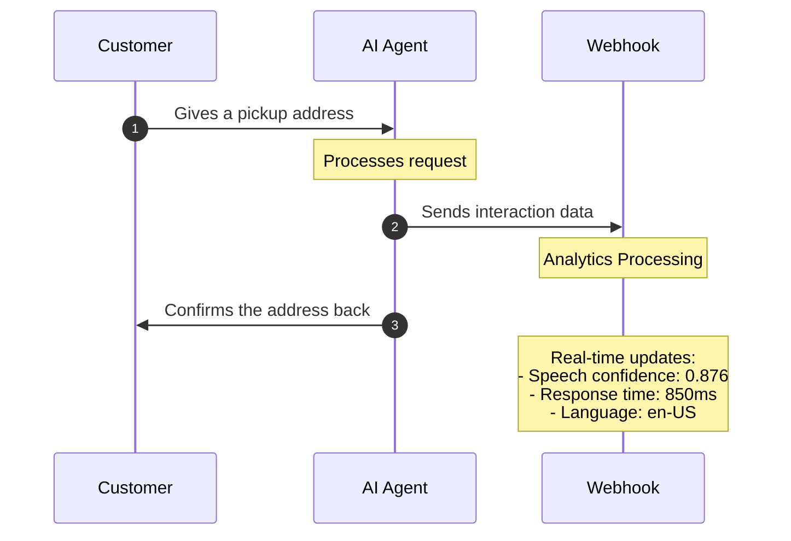

The platform captures the metrics you need to understand and improve your agents:
conversation flow and role adherence, speech recognition accuracy, response timing and latency,
voice quality, and integration performance.
The data arrives over webhooks, so you can monitor conversations in real time, track performance,
and bring in human supervision when a call needs it.

Here's how this works on a dispatch call:



#### Webhook data and metrics

Here's an example of the data you receive during an AI interaction:

```json
{
  "call_info": {
    "project_id": "b08dacad...",
    "content_type": "text/json",
    "call_id": "b3f4e4e1..."
  },
  "conversation_add": {
    "role": "assistant",
    "content": "...",
    "lang": "en-US",
    "tokens": 53,
    "latency": 836,
    "utterance_latency": 934,
    "audio_latency": 1106
  },
  "webhook_reply": {
    "status": "OK",
    "request_id": "341de258...",
    "parameters": {
      "query": "...",
    },
    "data": {...}
  }
}
```

#### Management tools

This data supports live supervision, tuning, and quality assurance.
Monitor high-value interactions as they happen, with alerts for critical situations and the ability
to intervene when a caller needs a human.
The same metrics drive improvement over time: adjust agent behavior, update routing rules, refine
response patterns, and verify that compliance requirements and service standards are being met.
