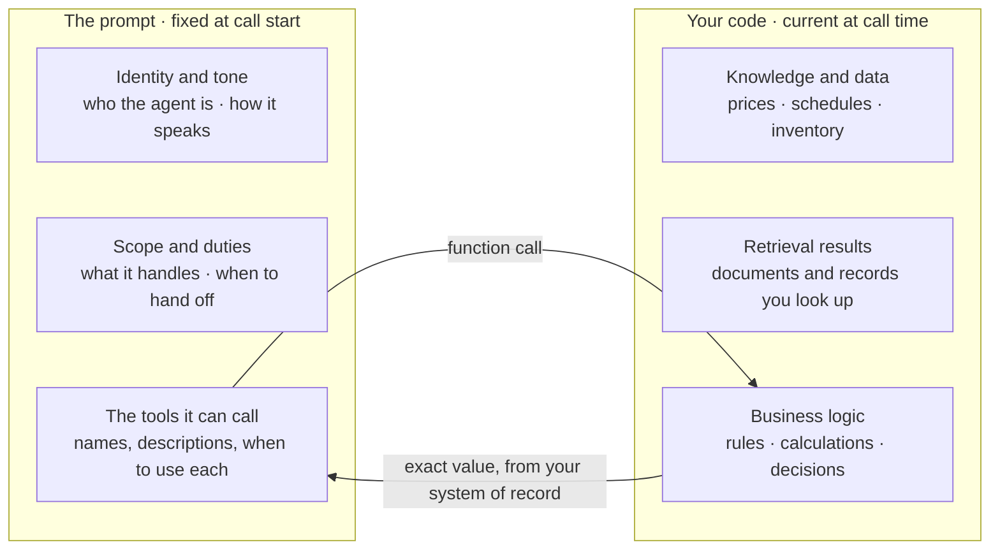

[tool-calling]: /docs/platform/ai/tool-calling
[tool-calling-review]: /docs/platform/ai/tool-calling#read-the-post-prompt-report
[prompt-engineering]: /docs/platform/ai/prompt-engineering
[avoid-overprompting]: /docs/platform/ai/prompt-engineering/best-practices#avoid-overprompting
[swml-datamap]: /docs/swml/guides/data-map
[ai-reference]: /docs/swml/reference/calling/ai
[ai-prompt-reference]: /docs/swml/reference/calling/ai/prompt
[sdk-hints]: /docs/server-sdks/guides/hints

Building an agent that holds up in production takes more than a good prompt.
This guide collects the practices that matter across the whole design: how work divides between
the prompt and your code, how to write for a real-time voice medium, how to help speech recognition,
and how to test, observe, and stay compliant once callers arrive.

The examples build one agent, the dispatcher for a taxi company called Bayview Taxi, a practice at a
time. The last section assembles it into a script you can run.

## Split the work between the prompt and your code

The design decision that matters most is what you *don't* put in the prompt.

A language model is good at conversation. It reads tone, keeps up with a caller who changes
direction halfway through a sentence, and pulls a pickup address out of "yeah, I'm at Gough and
Fell, the blue building on the corner."

It is unreliable at anything with one correct answer. Arithmetic drifts, a fact written into the
prompt goes stale the moment your data changes, and a rule stated in the prompt is a rule the model
may or may not honor on turn nine of a difficult call.

So give each side the work it's suited to. The prompt covers who the agent is, how it speaks, what
it's there to accomplish, and when to reach for its functions. Your code, reached through
[SWAIG functions][tool-calling] (SignalWire AI Gateway, the platform's tool calling), covers prices,
inventory, calculations, policy, and anything else with a right answer. The agent then holds only
the information it needs, verified by your systems, at the moment it needs it.

<llms-ignore>

  

</llms-ignore>

<llms-only>



</llms-only>

<Tip>
Values and conditions change; the prompt doesn't. Anything that can go stale should be fetched
by your code at call time and fed to the agent, not written statically into the prompt.
</Tip>

### Keep business data out of the prompt

It's tempting to paste the fare table, the service-area map, or the policy manual into the prompt
and hope the model honors all of it: prompt and pray.
Resist it.
The prompt is fixed when the call starts, but your data keeps changing;
a function call reads the current value at the moment the caller asks.
Data in the prompt is *recalled* by the model, approximately,
while data from a function call is *returned* by your code, exactly.
And the model has no way to tell your pasted policy apart from anything else it has read.
Your backend is the system of record.

Move that data behind SWAIG functions: a lookup backed by your webhook or the Server SDK,
or a serverless [DataMap][swml-datamap] for straightforward API calls and pattern-matched responses.

<Card title="Tool calling" href="/docs/platform/ai/tool-calling" icon="regular webhook">
  How AI agents call your backend — the mental model, a complete example, and patterns for reliable SWAIG functions.
</Card>

## Write the prompt for conversation, not logic

With business logic out of the way, the prompt's job is focused: define the agent's identity,
its conversational duties, and where it defers to your code.
Outline those necessities clearly, then stop.
Overloading the AI with instructions muddles its behavior rather than tightening it,
and since the prompt is part of every conversational turn, a brief prompt is also cheaper to run.
See [avoiding over-prompting][avoid-overprompting] for techniques.

Structure the prompt with [Markdown](https://www.markdownguide.org/basic-syntax/):
headings and lists keep it organized and legible,
narrowing how the AI interprets each section.

<CodeBlocks>
<CodeBlock title="Server SDK (Python)">
```python
from signalwire import AgentBase

agent = AgentBase(name="bayview-taxi")

agent.prompt_add_section(
    "Role",
    "Your name is Ada. You are the dispatcher for Bayview Taxi."
)
agent.prompt_add_section(
    "Personality and duties",
    "You are calm and efficient. Help callers get a fare quote and book "
    "a pickup, using the functions available to you."
)
agent.prompt_add_section(
    "Greeting rules",
    "Greet the caller, introduce yourself as Ada, and ask where they "
    "are and where they're going."
)

if __name__ == "__main__":
    agent.run()
```
</CodeBlock>
<CodeBlock title="SWML">
```yaml
version: 1.0.0
sections:
  main:
    - ai:
        prompt:
          text: |
            Your name is Ada. You are the dispatcher for Bayview Taxi.

            ## Personality and duties
            You are calm and efficient. Help callers get a fare quote and book
            a pickup, using the functions available to you.

            ## Greeting rules
            Greet the caller, introduce yourself as Ada, and ask where they
            are and where they're going.
```
</CodeBlock>
</CodeBlocks>

Notice what this prompt *doesn't* contain: no fare table, no service-area boundary, no driver roster.
That information lives in the dispatch system behind the agent's functions,
so the prompt stays short and the answers stay accurate.

The function it calls for a fare is a handler of your own. In outline:

```text title="get_quote, in outline"
on get_quote(pickup, destination):
    miles = distance_service.lookup(pickup, destination)
    if miles is none:
        return "that trip is outside the service area"
    rate  = rate_table.current()          # today's rates, not last quarter's
    fare  = rate.base + miles * rate.per_mile
    return "the fare is " + fare + " for " + miles + " miles"
```

[Putting it together](#putting-it-together), at the end of this page, has that handler as running
code.

Some context does belong in the prompt.
Put in it what no system of record can answer: who the agent is, the scope of what it handles,
the tone it takes, how it should treat a caller who is upset, and the point at which it hands off
to a person.
There is nothing to look up for any of those, and leaving them out is what produces a bland,
directionless agent.

Business hours are the trap.
They read like a stable fact and they aren't: holidays move them, a weather closure moves them,
and a short-staffed Saturday moves them.
A prompt written last quarter will state the old hours with complete confidence.
If a caller could be told the wrong thing because the world changed, it belongs behind a function.

Per-call context, such as the caller's name or account tier, can be interpolated into the prompt
at request time; place it at the **bottom** so the stable part stays identical from turn to turn
and from call to call.
Interpolation is for context the conversation starts from. A live answer, like a price or an
order's status, still comes from a function at the moment the caller asks.

For the full craft of prompt writing, including structure, examples, and iterative refinement,
see the [prompt engineering guide][prompt-engineering].

### Adjust the model parameters when the defaults aren't working

The platform's defaults are set to work across most agents, so the parameters on the
[`prompt` object][ai-prompt-reference] are repairs rather than a step in building one.
Reach for them when something specific is wrong with the way your agent talks: it wanders off
topic, it repeats a line, or it leaves a long pause after the caller stops speaking.

| Parameter | Range | What it does |
| --- | --- | --- |
| `temperature` | `0.0`–`1.5` | How random the output is. Closer to `0` is less random. |
| `top_p` | `0.0`–`1.0` | Another way to set randomness, again less random closer to `0`. It does the same job as `temperature`, so change one or the other, not both. |
| `confidence` | `0.0`–`1.0` | The threshold for firing a speech-detect event at the end of the caller's utterance. Lowering it shortens the pause after the caller speaks, at the cost of false positives. |
| `presence_penalty` | `-2.0`–`2.0` | Aversion to staying on topic. Positive values make the model more likely to raise new topics. |
| `frequency_penalty` | `-2.0`–`2.0` | Aversion to repetition. Positive values make the model less likely to repeat the same line verbatim. |
| `max_tokens` | `0`–`4096` | A ceiling on how long a single generated reply can be. |

The [`prompt` reference][ai-prompt-reference] lists the default each one starts at.
Change one at a time and listen to a real call between changes.

## Design for real-time voice

Voice adds a dimension that text chat doesn't have: the caller hears every pause.
Three controls shape how those pauses feel.
Filler phrases give the AI something to say while a function call is running;
configure them [per-function](/docs/swml/reference/calling/ai/swaig/functions) and
[agent-wide](/docs/swml/reference/calling/ai/languages).
Background audio, such as typing or office ambience, gives the caller familiar feedback
while processing happens; set it with
[`params.background_file`](/docs/swml/reference/calling/ai/params#paramsbackground_file).
And your function handlers are part of the conversation's timing, so move slow work out of band
and respond promptly.

Underneath those sit two moments you can also configure.
**End-pointing** (end-of-utterance detection) is how the AI decides the caller has finished
speaking, adjustable through `confidence` in the [`prompt` object][ai-prompt-reference] and
[`params.end_of_speech_timeout`](/docs/swml/reference/calling/ai/params#paramsend_of_speech_timeout).
**Turnaround** is the interval between that decision and the start of the reply.
Judge both on live calls with your own configuration, measuring the interval the caller experiences:
from the moment they stop talking to the moment they hear the reply begin.
Consistency matters as much as the average.

## Help speech recognition with hints

Hints boost recognition accuracy for the words that matter in your domain,
so "Gough Street" doesn't arrive as "Goff Street."

Street names, neighborhoods, and local landmarks are exactly the vocabulary a general speech model
handles worst and a dispatcher hears most, which makes them the first thing to introduce:

<CodeBlocks>
<CodeBlock title="Server SDK (Python)">
```python
from signalwire import AgentBase

agent = AgentBase(name="bayview-taxi")

agent.prompt_add_section(
    "Role",
    "Your name is Ada. You are the dispatcher for Bayview Taxi. "
    "Help callers get a fare quote and book a pickup."
)
agent.add_hints(["Gough Street", "Divisadero", "Presidio", "Embarcadero", "Bayview", "SFO"])

if __name__ == "__main__":
    agent.run()
```
</CodeBlock>
<CodeBlock title="SWML">
```yaml
version: 1.0.0
sections:
  main:
    - ai:
        prompt:
          text: |
            Your name is Ada. You are the dispatcher for Bayview Taxi.
            Help callers get a fare quote and book a pickup.
        hints:
          - Gough Street
          - Divisadero
          - Presidio
          - Embarcadero
          - Bayview
          - SFO
```
</CodeBlock>
</CodeBlocks>

See [`hints`][ai-reference] in the SWML reference, or [speech recognition hints][sdk-hints] in the Server SDK.

## Test, monitor, and iterate

Test with real users before deploying.
Scripted test calls follow the script; customers won't, and beta callers surface the gaps.

Once callers arrive, review real calls.
Post-call reports capture each conversation and everything the agent did during it;
setting them up and reading them is covered in the
[tool calling guide][tool-calling-review].
Read the transcripts where the agent hesitated or chose the wrong function.
That's where the next fix comes from.
Usage metrics fill in the aggregate picture:
token consumption, interaction times, and call outcomes reveal both cost and quality trends.

An agent is never finished.
Your business changes, so revisit the prompt and functions periodically,
and check the documentation and release notes for new parameters, voices,
and features your agent can use as SignalWire's AI capabilities evolve.

## Stay compliant with regulations

In [February 2024](https://www.fcc.gov/document/fcc-makes-ai-generated-voices-robocalls-illegal)
the FCC ruled that an AI-generated voice counts as an artificial voice under the
Telephone Consumer Protection Act (TCPA).
Your agent is subject to the same rules as any other automated call.
The person on the other end has to have consented to it, the call has to identify itself as AI,
and a request to stop has to be honored.
Which of those rules apply, and how strictly, depends on why you're calling
and where the called party lives.

Each rule has a yes-or-no answer, which makes it work for your code rather than the prompt.
Put the AI disclosure in a [`static_greeting`](/docs/swml/reference/calling/ai/params#paramsstatic_greeting)
with `static_greeting_no_barge`, so it plays in full before the agent's first turn.
Verify consent, check your do-not-call list, and confirm the local hour before you ask
SignalWire to dial, because once the call is placed it has already happened.
Then let the agent catch an opt-out mid-conversation with a [SWAIG function][tool-calling]
whose handler writes to your do-not-call list before it answers the caller.

Both halves of that, together:

<CodeBlocks>
<CodeBlock title="Server SDK (Python)">
```python
from signalwire import AgentBase, FunctionResult

class OutboundAgent(AgentBase):
    def __init__(self):
        super().__init__(name="outbound-agent")

        self.set_params({
            "static_greeting": (
                "Hello, this is an automated assistant calling from Bayview "
                "Taxi about your pickup. This call uses an artificial voice."
            ),
            "static_greeting_no_barge": True,
        })

        self.prompt_add_section(
            "Role",
            "You are calling to tell the caller their driver is on the way."
        )
        self.prompt_add_section(
            "Opt-out",
            "If the caller asks not to be contacted again, in any wording, "
            "call opt_out immediately before saying anything else."
        )

        self.define_tool(
            name="opt_out",
            description="Record that the caller does not want to be contacted again",
            parameters={"type": "object", "properties": {}},
            handler=self.opt_out
        )

    def opt_out(self, args, raw_data):
        number = raw_data.get("caller_id_num")
        add_to_do_not_call_list(number)  # your system of record
        return FunctionResult(
            "Confirm the request was recorded, apologize for the interruption, "
            "and end the call."
        ).hangup()

if __name__ == "__main__":
    agent = OutboundAgent()
    agent.run()
```
</CodeBlock>
<CodeBlock title="SWML">
```yaml
version: 1.0.0
sections:
  main:
    - ai:
        params:
          static_greeting: >-
            Hello, this is an automated assistant calling from Bayview Taxi
            about your pickup. This call uses an artificial voice.
          static_greeting_no_barge: true
        prompt:
          text: |
            You are calling to tell the caller their driver is on the way.
            If the caller asks not to be contacted again, in any wording,
            call opt_out immediately before saying anything else.
        SWAIG:
          functions:
            - function: opt_out
              description: Record that the caller does not want to be contacted again
              parameters:
                type: object
                properties: {}
              web_hook_url: https://example.com/opt-out
```
</CodeBlock>
</CodeBlocks>

The prompt asks the agent to call `opt_out`, and the handler is what makes the opt-out real.
The number lands on your do-not-call list before the agent says a word about it, so the record
exists even if the caller hangs up on the confirmation.

<Warning>
This is technical guidance, not legal advice.
Requirements vary by jurisdiction and by call type, and they change often.
Consult qualified counsel before launching an outbound program.
</Warning>

Both compliance guides walk through these controls in detail:

<CardGroup cols={2}>

<Card title="TCPA" href="/docs/platform/compliance/tcpa" icon="regular phone">
  Build TCPA-compliant outbound voice AI with consent gating, AI disclosure, calling-hour rules, and opt-out handling.
</Card>

<Card title="HIPAA" href="/docs/platform/compliance/hipaa" icon="regular shield-halved">
  Build HIPAA-compliant voice AI that protects Protected Health Information (PHI) across the call lifecycle.
</Card>

</CardGroup>

## Putting it together

Here is Ada as a complete script, with each practice in place:
a static greeting that identifies the call as automated, a lean prompt, fares served by the
dispatch system instead of pasted text, a filler phrase and background audio to cover the lookup,
hints for local street names, and a post-call report for review.

Ada answers inbound calls, so the consent check and the do-not-call lookup from
[Stay compliant with regulations](#stay-compliant-with-regulations) aren't here: those run in your
own code before an outbound call is placed, and the `opt_out` function belongs with them.

<CodeBlocks>
<CodeBlock title="Server SDK (Python)">
```python
from signalwire import AgentBase, FunctionResult

# Stand-in for your dispatch system: a distance API, a rate table, a driver roster
RATES = {"base": 4.50, "per_mile": 2.75}
DISTANCES = {
    ("123 gough street", "sfo"): 12.4,
    ("123 gough street", "embarcadero"): 2.1,
}

class DispatchAgent(AgentBase):
    def __init__(self):
        super().__init__(name="bayview-taxi")
        self.add_language("English", "en-US", "rime.spore:coda")

        self.prompt_add_section(
            "Role",
            "Your name is Ada. You are the dispatcher for Bayview Taxi."
        )
        self.prompt_add_section(
            "Personality and duties",
            "You are calm and efficient. Help callers get a fare quote and book "
            "a pickup. Price trips with get_quote, and only quote fares and "
            "pickup times that get_quote returned."
        )
        self.prompt_add_section(
            "Greeting rules",
            "The greeting has already played, so don't introduce yourself again. "
            "Open by asking where the caller is and where they're going."
        )
        self.set_params({
            "static_greeting": (
                "Thanks for calling Bayview Taxi. You're speaking with Ada, an "
                "automated assistant using an artificial voice."
            ),
            "static_greeting_no_barge": True,
            "background_file": "https://example.com/audio/office-ambience.mp3",
        })

        self.add_hints(["Gough Street", "Divisadero", "Presidio",
                        "Embarcadero", "Bayview", "SFO"])
        self.set_post_prompt("Summarize the call and provide the summary in JSON format.")

        self.define_tool(
            name="get_quote",
            description="Quote the fare between a pickup address and a destination",
            parameters={
                "type": "object",
                "properties": {
                    "pickup": {
                        "type": "string",
                        "description": "The pickup address, as the caller said it"
                    },
                    "destination": {
                        "type": "string",
                        "description": "Where the caller is going"
                    }
                },
                "required": ["pickup", "destination"]
            },
            handler=self.get_quote,
            fillers={"en-US": ["Let me work that out..."]}
        )

    def get_quote(self, args, raw_data):
        pickup = args.get("pickup", "").lower().strip()
        destination = args.get("destination", "").lower().strip()

        miles = DISTANCES.get((pickup, destination))
        if miles is None:
            return FunctionResult(
                "That trip isn't in the service area. Apologize and say we can't take it."
            )

        fare = RATES["base"] + miles * RATES["per_mile"]
        return FunctionResult(
            f"The fare from {pickup} to {destination} is ${fare:.2f} for {miles} miles. "
            "Offer to send a driver now."
        )

if __name__ == "__main__":
    agent = DispatchAgent()
    agent.run()
```
</CodeBlock>
<CodeBlock title="SWML">
```yaml
version: 1.0.0
sections:
  main:
    - ai:
        params:
          static_greeting: >-
            Thanks for calling Bayview Taxi. You're speaking with Ada, an
            automated assistant using an artificial voice.
          static_greeting_no_barge: true
          background_file: https://example.com/audio/office-ambience.mp3
        prompt:
          text: |
            Your name is Ada. You are the dispatcher for Bayview Taxi.

            ## Personality and duties
            You are calm and efficient. Help callers get a fare quote and book
            a pickup. Price trips with get_quote, and only quote fares and
            pickup times that get_quote returned.

            ## Greeting rules
            The greeting has already played, so don't introduce yourself again.
            Open by asking where the caller is and where they're going.
        languages:
          - name: English
            code: en-US
            voice: rime.spore:coda
        SWAIG:
          functions:
            - function: get_quote
              description: Quote the fare between a pickup address and a destination
              parameters:
                type: object
                properties:
                  pickup:
                    type: string
                    description: The pickup address, as the caller said it
                  destination:
                    type: string
                    description: Where the caller is going
                required:
                  - pickup
                  - destination
              fillers:
                en-US:
                  - Let me work that out...
              web_hook_url: https://example.com/get-quote
        hints:
          - Gough Street
          - Divisadero
          - Presidio
          - Embarcadero
          - Bayview
          - SFO
        post_prompt:
          text: Summarize the call and provide the summary in JSON format.
        post_prompt_url: https://example.com/post-prompt
```
</CodeBlock>
</CodeBlocks>

When a caller asks what it costs to get to the airport, the platform sends an HTTP POST to your
function's endpoint (the `web_hook_url` in SWML, or the endpoint the Server SDK serves for you):

```json
{
  "function": "get_quote",
  "argument": {
    "parsed": [{ "pickup": "123 Gough Street", "destination": "SFO" }]
  }
}
```

Your server prices the trip against the same rate table the meters use and replies:

```json
{
  "response": "The fare from 123 Gough Street to SFO is $38.60 for 12.4 miles. Offer to send a driver now."
}
```

Ada relays the answer in its own voice and offers to dispatch a car.
Every number in that sentence came out of the dispatch system during the call.
When the rate changes tomorrow, the agent is already right,
and the post-call report shows you every lookup it made.

## Next steps

<CardGroup cols={2}>

<Card title="Tool calling" href="/docs/platform/ai/tool-calling" icon="regular webhook">
  Connect the agent to your backend — where the business logic belongs.
</Card>

<Card title="Prompt engineering" href="/docs/platform/ai/prompt-engineering" icon="regular pen-nib">
  Structure, technique, and refinement for the conversational layer.
</Card>

</CardGroup>
