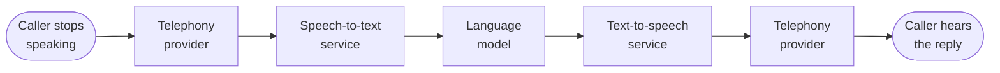
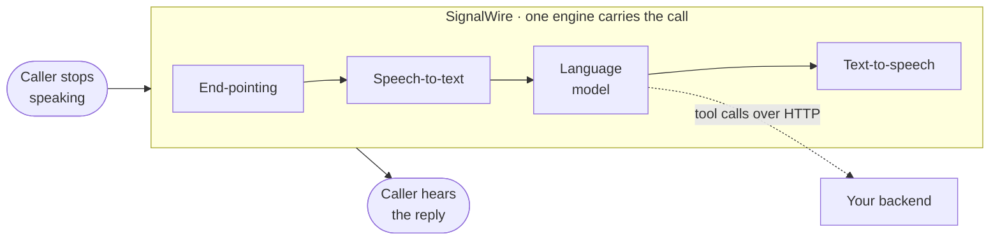
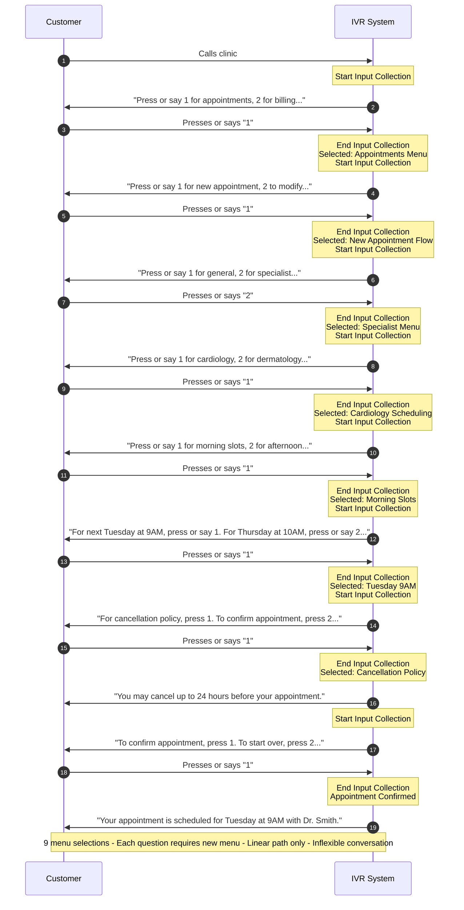
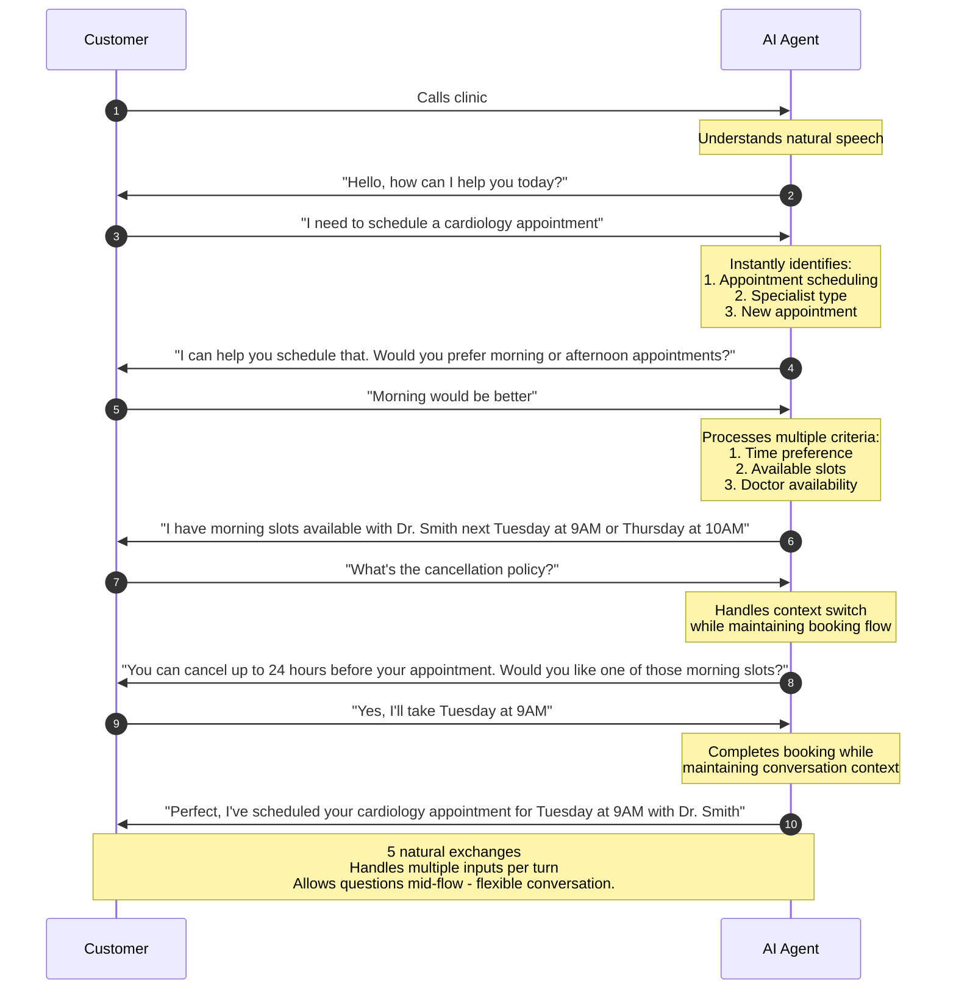
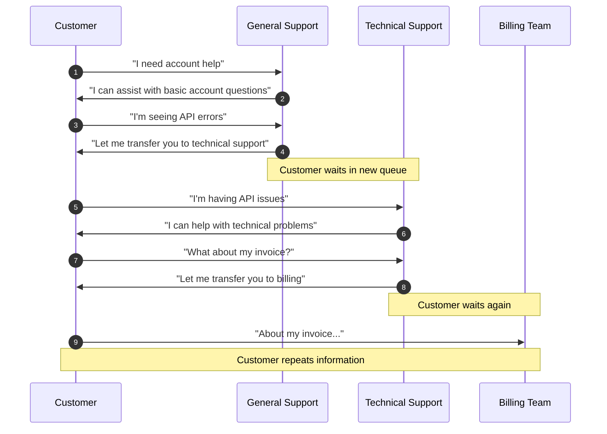
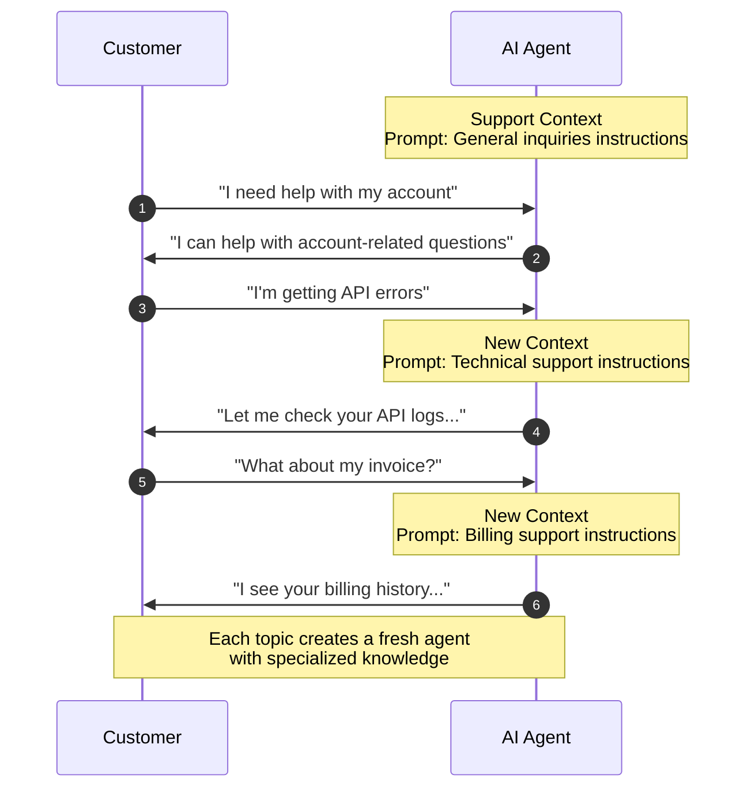
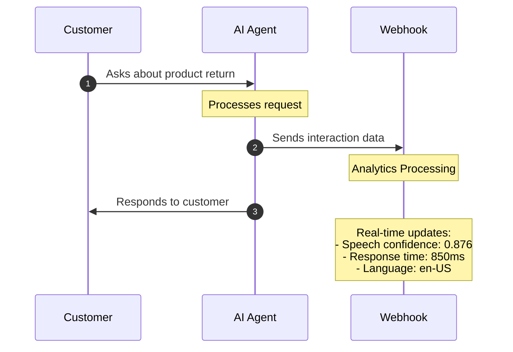
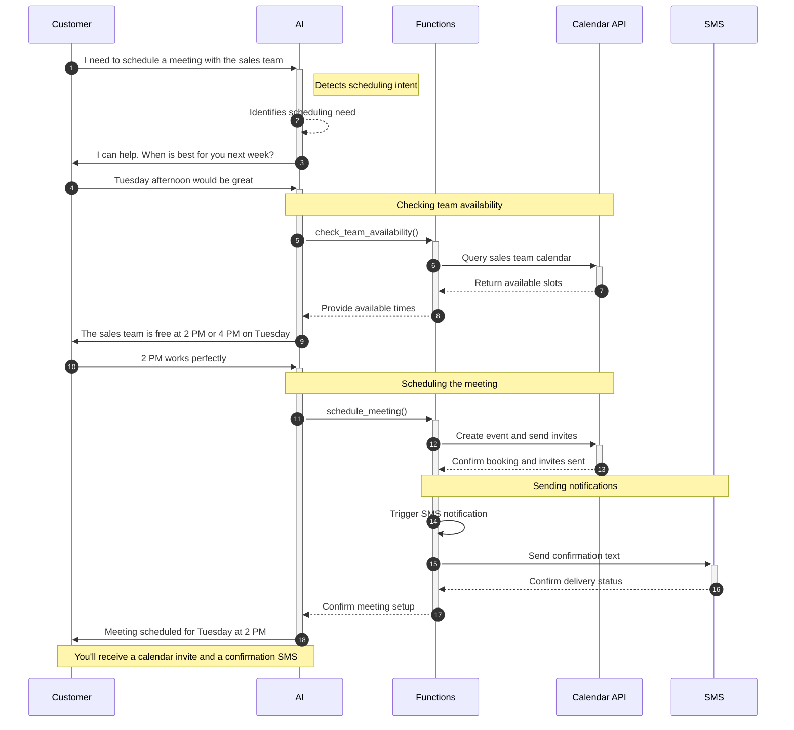
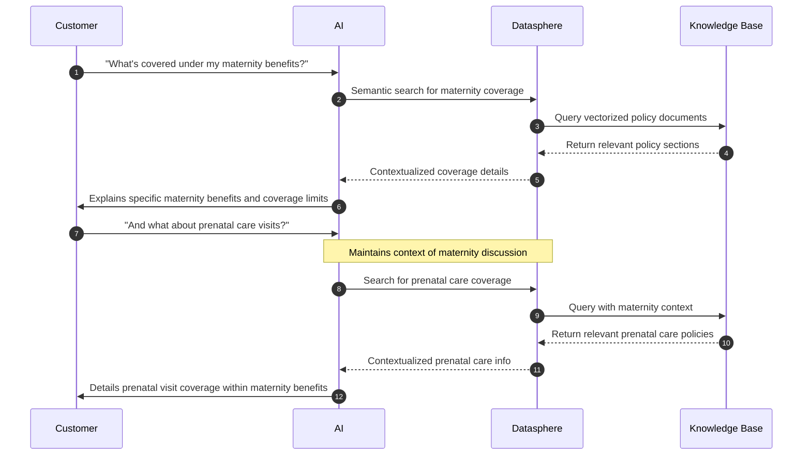

SignalWire's AI platform is a single system for building and deploying conversational AI.
It orchestrates voice, video, and messaging on one platform, with native integrations for the major LLM,
Text-to-Speech, and Speech-to-Text providers.
Functions execute serverlessly during live conversations, in parallel and asynchronously where needed,
and a global edge network with points of presence in every major region keeps latency low.
Security, compliance, logging, and analytics are part of the platform rather than add-ons.

---

## Ways to build AI agents

An AI agent is a resource on the SignalWire platform.
However you create it, the result is the same kind of agent: addressable from phone numbers, SIP,
and your applications, running on the same realtime infrastructure.
Pick the interface by how much control you need.

<CardGroup cols={3}>
<Card
  title="SWML"
  href="/docs/swml/reference/calling/ai"
  icon="regular code"
>
  Define the agent declaratively in readable JSON or YAML, deployed serverlessly from your Dashboard or served from your own server.
</Card>
<Card
  title="Server SDKs"
  href="/docs/server-sdks/guides/build-ai-agents"
  icon="regular server"
>
  Build the agent in code in the language of your choice: the SDK generates the SWML, hosts your SWAIG functions, and serves the agent as a web service.
</Card>
<Card
  title="AI Agents UI"
  href="/docs/platform/ai/no-code-agents"
  icon="regular robot"
>
  Create and manage agents visually in the Dashboard: write the prompt, pick a voice, add functions, and assign a phone number. No code required.
</Card>
</CardGroup>

---

## AI in the media path

Every conversational turn passes through four stages before the caller hears a reply:
detecting that the caller has finished speaking (end-pointing), transcribing the audio,
generating the response, and synthesizing the reply as speech.

A common way to assemble voice AI is to connect a separate service for each stage.
The audio then crosses a network boundary at every stage, on every turn:



Each arrow is a network hop, each hop adds delay on every turn, and any hop can spike.

SignalWire runs all four stages inside the engine that carries the call's audio,
so no network boundary sits between the AI and the call:



The result is response time that stays low and, just as important, consistent from turn to turn.
The one network hop that remains is the one you control:
tool calls to your backend, covered in the [tool calling guide](/docs/platform/ai/tool-calling).

---

## Core capabilities

### Voice technology

Voice technology controls how your AI agents sound and understand speech.
Select from multiple Text-to-Speech providers and tune voice parameters to match your brand.
Natural speech <Tooltip tip="A user can define what words or phrases to say during pauses in the conversation. These pauses can occur from function calls or speech down time.">fillers</Tooltip>
keep the conversation moving during processing pauses, while real-time audio processing handles noise
filtering and accent variation.

### Conversation intelligence

Unlike traditional IVR systems that follow rigid decision trees, SignalWire AI agents converse naturally.
They hold their assigned role while juggling multiple conversation threads, reach backend systems without
breaking the dialogue, and handle unexpected topic changes without losing context.

The diagrams below compare how a customer might schedule a medical appointment with a conventional IVR
("interactive voice response") and with a SignalWire AI Agent.


<Tabs>
<Tab title="Traditional IVR flow">



</Tab>
<Tab title="AI IVR flow">



</Tab>
</Tabs>


For example, when a caller asks "What about the premium version?", the AI understands this refers to a product discussed
earlier in the conversation. This context awareness extends across different topics and requests within the same interaction, allowing for natural conversation
flows like:

"I'd like to schedule an appointment" → "What time works for you?" → "Actually, before we do that, what's your cancellation policy?"

The AI handles these context switches while keeping the original intent to schedule an appointment.

### Dynamic context switching

One way to structure conversations is through <Tooltip tip="Contexts are specialized topics or roles that an AI agent can handle. Each context has its own specialized prompt, fresh conversation memory, and its own steps to follow through the conversation.">
contexts</Tooltip>. Instead of transferring callers between departments like a traditional system, your AI agent switches context internally
to handle different topics and requests within the same conversation.

Each context is independent, with its own specialized prompt and fresh conversation memory,
focused on an area such as technical support, billing, or sales.
Information boundaries keep the roles separate: each task is routed to the right context,
transitions stay conversational, and information doesn't bleed between roles — which matters
for compliance and for sensitive operations.

For example, when a customer moves from technical support to billing questions, the AI swaps context to
focus on financial matters, leaving technical details in the previous context.

Below is an example of a context switch in a customer support scenario for both a traditional IVR and a SignalWire AI Agent.

<Tabs>
<Tab title="Traditional support flow">



</Tab>
<Tab title="SignalWire AI flow">



</Tab>
</Tabs>


### Real-time analytics and monitoring

The platform captures the metrics you need to understand and improve your agents:
conversation flow and role adherence, speech recognition accuracy, response timing and latency,
voice quality, and integration performance.
The data arrives over webhooks, so you can monitor conversations in real time, track performance,
and bring in human supervision when a call needs it.

Here's how this works in a customer support scenario:



#### Webhook data and metrics

Here's an example of the data you receive during an AI interaction:

```json
{
  "call_info": {
    "project_id": "b08dacad...",
    "content_type": "text/json",
    "call_id": "b3f4e4e1..."
  },
  "conversation_add": {
    "role": "assistant",
    "content": "...",
    "lang": "en-US",
    "tokens": 53,
    "latency": 836,
    "utterance_latency": 934,
    "audio_latency": 1106
  },
  "webhook_reply": {
    "status": "OK",
    "request_id": "341de258...",
    "parameters": {
      "query": "...",
    },
    "data": {...}
  }
}
```


#### Management tools

This data supports live supervision, tuning, and quality assurance.
Monitor high-value interactions as they happen, with alerts for critical situations and the ability
to intervene when a caller needs a human.
The same metrics drive improvement over time: adjust agent behavior, update routing rules, refine
response patterns, and verify that compliance requirements and service standards are being met.


---

## Integration & architecture

### External service integration

SignalWire AI connects with your business systems through its function framework. When your agent needs to perform an action - like checking inventory or booking an appointment - it can call functions that interact with your databases and services while keeping the conversation natural. The [tool calling guide](/docs/platform/ai/tool-calling) covers the complete model, with a worked example and patterns for production.

Here's an example of scheduling a meeting:



The process works like this:

1. Your agent recognizes when a request needs external data or actions
2. It calls the appropriate function
3. The function handles the technical work with your systems
4. Your agent incorporates the results naturally into the conversation

This lets you automate complex processes without exposing the technical details to your users.

### SignalWire's RAG stack integration - Datasphere

[Datasphere](/docs/apis/rest/documents/list-documents) is SignalWire's built-in knowledge integration system.
It gives AI agents access to your organization's information during conversations,
drawing on your latest documentation so answers stay accurate and current.

Here's an example of how it works in practice:



Because agents query Datasphere at conversation time, they use the latest version of your documentation
as soon as you update it.
Searches combine the conversation's context with natural-language queries over your documents,
and responses stay grounded in what those documents actually say, with sources to back them.
You control how documents are tagged and chunked, so retrieval fits the way your information is organized.


---

## Real-world applications

### Customer service

Support agents handle complex, multi-step inquiries while keeping the conversation's context.
They answer from your knowledge base, reach your backend systems to resolve problems during the call,
and transfer to a human agent — with context intact — when a situation calls for one.

### Process automation

Agents automate multi-step processes conversationally.
In appointment scheduling, for example, an agent interprets time and date requests, works across
calendar systems, resolves schedule conflicts, sends confirmations, and accommodates changes.

---

## Security and compliance

The platform encrypts communications, detects and protects PII, and provides compliance tooling for
HIPAA and GDPR requirements.
Audit logging and granular access controls let you automate sensitive communications while staying
within regulatory bounds.
