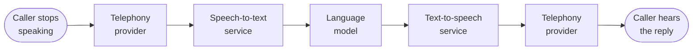
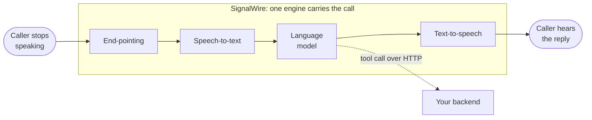
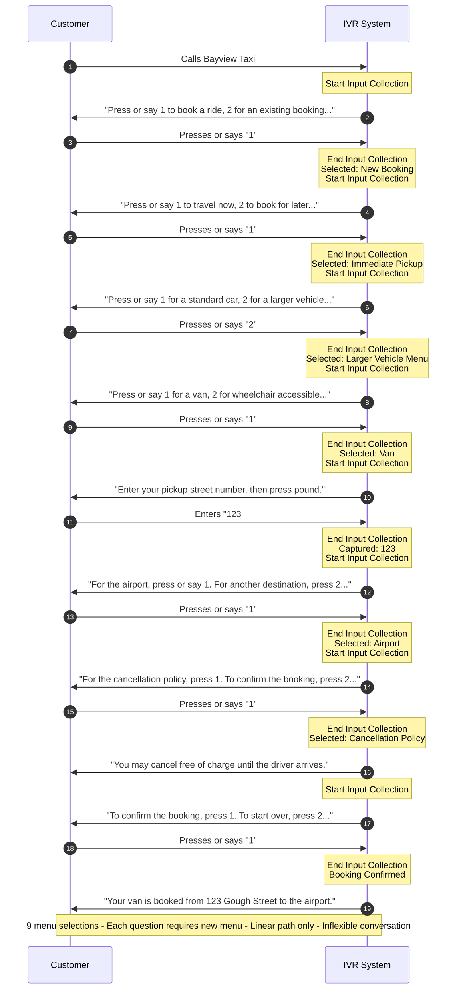
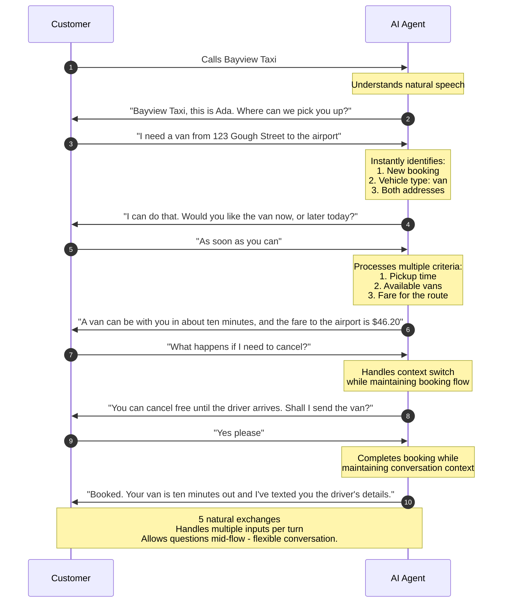
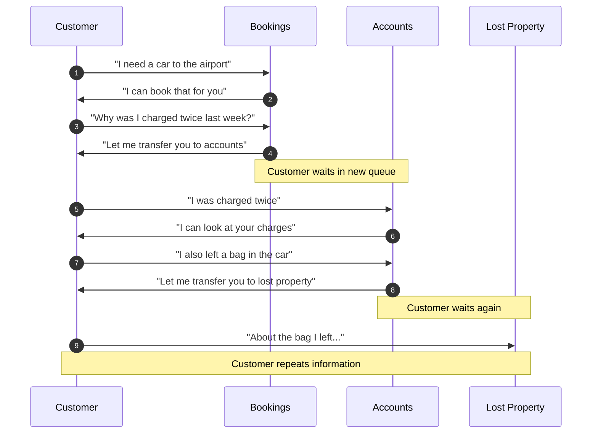
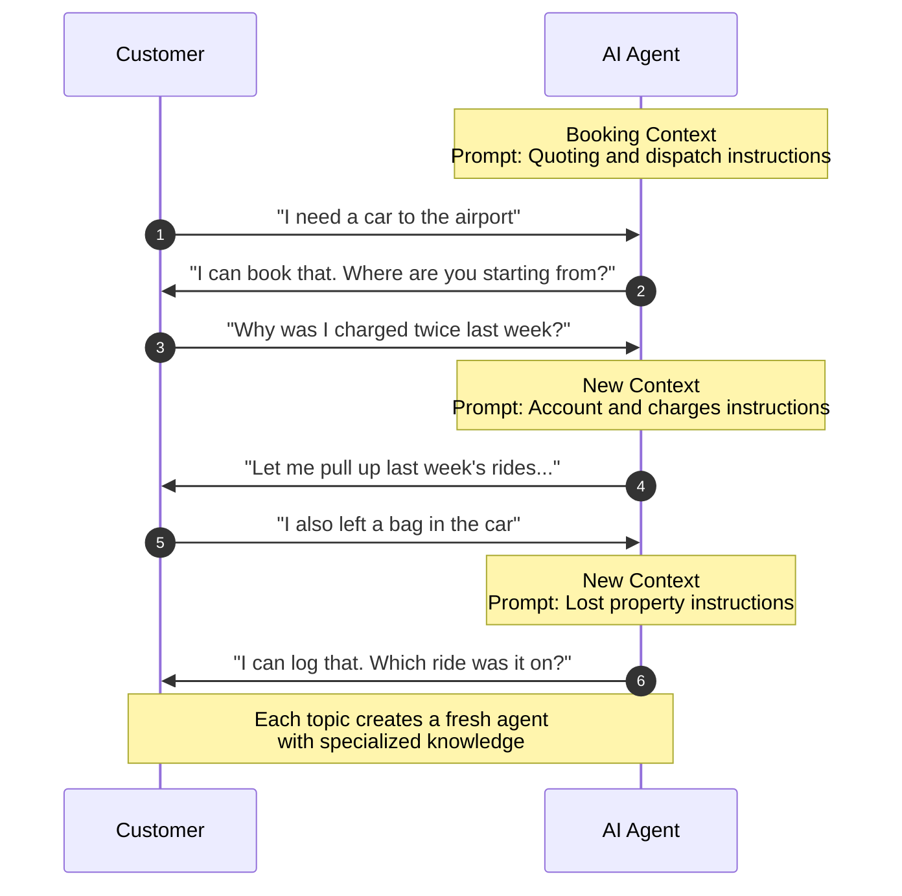
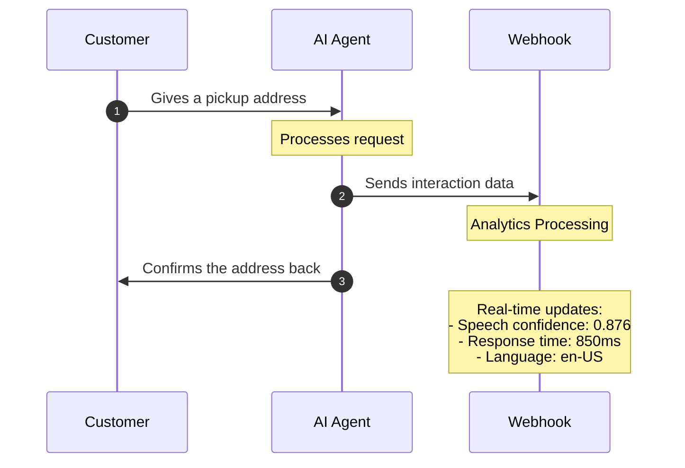
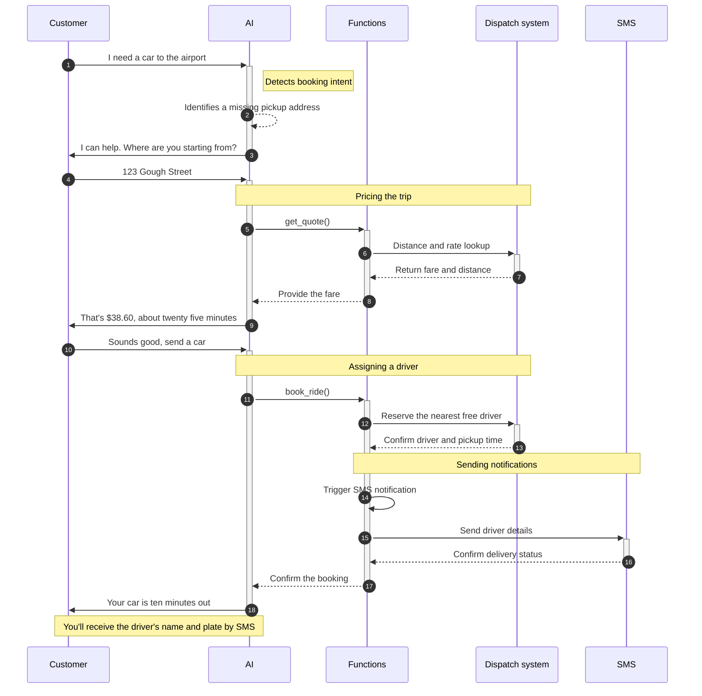
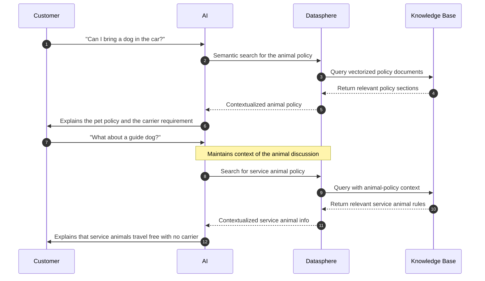

SignalWire's AI platform is a single system for building and deploying conversational AI.
It orchestrates voice, video, and messaging on one platform, with native integrations for the major LLM,
Text-to-Speech, and Speech-to-Text providers.
Functions execute serverlessly during live conversations, in parallel and asynchronously where needed,
and a global edge network with points of presence in every major region keeps latency low.
Security, compliance, logging, and analytics are part of the platform rather than add-ons.

---

## Ways to build AI agents

An AI agent is a resource on the SignalWire platform.
However you create it — in SWML, with a Server SDK, in the Dashboard's AI Agents UI, or as a
node in Call Flow Builder — the result is the same kind of agent: addressable from phone
numbers, SIP, and your applications, running on the same realtime infrastructure.
The [AI overview](/docs/platform/ai) introduces each interface, with side-by-side examples
of the same agents built in each.

---

## AI in the media path

Every conversational turn passes through four stages before the caller hears a reply:
detecting that the caller has finished speaking (end-pointing), transcribing the audio,
generating the response, and synthesizing the reply as speech.

A common way to assemble voice AI is to connect a separate service for each stage.
The audio then crosses a network boundary at every stage, on every turn:


```mermaid
flowchart LR
    A([Caller stops<br/>speaking]) --> B[Telephony<br/>provider]
    B --> C[Speech-to-text<br/>service]
    C --> D[Language<br/>model]
    D --> E[Text-to-speech<br/>service]
    E --> F[Telephony<br/>provider]
    F --> G([Caller hears<br/>the reply])
```

Every arrow is a network hop that adds delay on every turn, and any one of them can spike.

SignalWire runs all four stages inside the engine that carries the call's audio,
so no network boundary sits between the AI and the call:


```mermaid
flowchart LR
    A([Caller stops<br/>speaking]) --> B
    subgraph SW["SignalWire: one engine carries the call"]
        direction LR
        B[End-pointing] --> C[Speech-to-text] --> D[Language<br/>model] --> E[Text-to-speech]
    end
    E --> F([Caller hears<br/>the reply])
    D -.->|"tool call over HTTP"| Y[Your backend]
```

Response time stays low, and it stays consistent from turn to turn.
The one network hop left is the one you control: tool calls to your backend, covered in the
[tool calling guide](/docs/platform/ai/tool-calling).

---

## Core capabilities

### Voice technology

<llms-ignore>

Voice technology controls how your AI agents sound and understand speech.
Select from multiple Text-to-Speech providers and tune voice parameters to match your brand.
Natural speech <Tooltip tip="A user can define what words or phrases to say during pauses in the conversation. These pauses can occur from function calls or speech down time.">fillers</Tooltip>
keep the conversation moving during processing pauses, while real-time audio processing handles noise
filtering and accent variation.

</llms-ignore>

<llms-only>

Voice technology controls how your AI agents sound and understand speech.
Select from multiple Text-to-Speech providers and tune voice parameters to match your brand.
Natural speech fillers—words or phrases spoken during pauses caused by function calls or processing—keep the conversation moving,
while real-time audio processing handles noise filtering and accent variation.

</llms-only>

### Conversation intelligence

Unlike traditional IVR systems that follow rigid decision trees, SignalWire AI agents converse naturally.
They hold their assigned role while juggling multiple conversation threads, reach backend systems without
breaking the dialogue, and handle unexpected topic changes without losing context.

The diagrams below follow one caller booking a van to the airport, first through a conventional IVR
("interactive voice response") and then through a SignalWire AI Agent.
What to compare is the work the caller has to do.
The IVR spends nine selections walking them down a fixed tree, one question per turn, with no way to
say anything the tree has no key for.
The agent reaches the same booking in five exchanges, because the caller states the goal once in their
own words and the agent takes several facts from a single sentence.

That flexibility isn't a trade against accuracy.
The fare and the pickup time come back from the dispatch system through a
[tool call](/docs/platform/ai/tool-calling), so the price, the wait, and the cancellation policy are
the ones your systems hold rather than a plausible answer the model produced.


<Tabs>
<Tab title="Traditional IVR flow">


```mermaid
sequenceDiagram
    autonumber
    participant C as Customer
    participant I as IVR System
    C->>I: Calls Bayview Taxi
    Note over I: Start Input Collection
    I->>C: "Press or say 1 to book a ride, 2 for an existing booking..."
    C->>I: Presses or says "1"
    Note over I: End Input Collection<br/>Selected: New Booking<br/>Start Input Collection
    I->>C: "Press or say 1 to travel now, 2 to book for later..."
    C->>I: Presses or says "1"
    Note over I: End Input Collection<br/>Selected: Immediate Pickup<br/>Start Input Collection
    I->>C: "Press or say 1 for a standard car, 2 for a larger vehicle..."
    C->>I: Presses or says "2"
    Note over I: End Input Collection<br/>Selected: Larger Vehicle Menu<br/>Start Input Collection
    I->>C: "Press or say 1 for a van, 2 for wheelchair accessible..."
    C->>I: Presses or says "1"
    Note over I: End Input Collection<br/>Selected: Van<br/>Start Input Collection
    I->>C: "Enter your pickup street number, then press pound."
    C->>I: Enters "123#"
    Note over I: End Input Collection<br/>Captured: 123<br/>Start Input Collection
    I->>C: "For the airport, press or say 1. For another destination, press 2..."
    C->>I: Presses or says "1"
    Note over I: End Input Collection<br/>Selected: Airport<br/>Start Input Collection
    I->>C: "For the cancellation policy, press 1. To confirm the booking, press 2..."
    C->>I: Presses or says "1"
    Note over I: End Input Collection<br/>Selected: Cancellation Policy
    I->>C: "You may cancel free of charge until the driver arrives."
    Note over I: Start Input Collection
    I->>C: "To confirm the booking, press 1. To start over, press 2..."
    C->>I: Presses or says "1"
    Note over I: End Input Collection<br/>Booking Confirmed
    I->>C: "Your van is booked from 123 Gough Street to the airport."
    Note over C,I: 9 menu selections - Each question requires new menu - Linear path only - Inflexible conversation
```

</Tab>
<Tab title="AI IVR flow">


```mermaid
sequenceDiagram
    autonumber
    participant C as Customer
    participant A as AI Agent
    C->>A: Calls Bayview Taxi
    Note over A: Understands natural speech
    A->>C: "Bayview Taxi, this is Ada. Where can we pick you up?"
    C->>A: "I need a van from 123 Gough Street to the airport"
    Note over A: Instantly identifies:<br/>1. New booking<br/>2. Vehicle type: van<br/>3. Both addresses
    A->>C: "I can do that. Would you like the van now, or later today?"
    C->>A: "As soon as you can"
    Note over A: Processes multiple criteria:<br/>1. Pickup time<br/>2. Available vans<br/>3. Fare for the route
    A->>C: "A van can be with you in about ten minutes, and the fare to the airport is $46.20"
    C->>A: "What happens if I need to cancel?"
    Note over A: Handles context switch<br/>while maintaining booking flow
    A->>C: "You can cancel free until the driver arrives. Shall I send the van?"
    C->>A: "Yes please"
    Note over A: Completes booking while<br/>maintaining conversation context
    A->>C: "Booked. Your van is ten minutes out and I've texted you the driver's details."
    Note over C,A: 5 natural exchanges<br/>Handles multiple inputs per turn<br/>Allows questions mid-flow - flexible conversation.
```

</Tab>
</Tabs>


The cancellation question partway through the AI diagram is the turn an IVR can't take at all.
The caller interrupts a booking in progress, the agent answers, and then it offers back the same van
it had already found.
The detour doesn't cost the caller their place, and it doesn't cost the agent the original intent —
the caller never has to restate that they came to book a ride.

### Dynamic context switching

<llms-ignore>

One way to structure conversations is through <Tooltip tip="Contexts are specialized topics or roles that an AI agent can handle. Each context has its own specialized prompt, fresh conversation memory, and its own steps to follow through the conversation.">
contexts</Tooltip>. Instead of transferring callers between departments like a traditional system, your AI agent switches context internally
to handle different topics and requests within the same conversation.

</llms-ignore>

<llms-only>

One way to structure conversations is through contexts: specialized topics or roles that each have their own prompt,
fresh conversation memory, and steps. Instead of transferring callers between departments like a traditional system,
your AI agent switches context internally to handle different topics and requests within the same conversation.

</llms-only>

Each context is independent, with its own specialized prompt and fresh conversation memory,
focused on an area such as booking, account questions, or lost property.
Each task is routed to the right context and transitions stay conversational, while information
doesn't bleed from one role into the next.
This forms the information boundary that keeps the roles separate, which matters for compliance
and for sensitive operations.

For example, when a caller moves from booking a ride to querying a charge on their card, the AI swaps
context to focus on the account, leaving the trip details in the previous context.

Below is the same caller journey through a traditional phone tree and through a SignalWire AI Agent.

<Tabs>
<Tab title="Traditional support flow">


```mermaid
sequenceDiagram
    autonumber
    participant C as Customer
    participant B as Bookings
    participant A as Accounts
    participant L as Lost Property

    C->>B: "I need a car to the airport"
    B->>C: "I can book that for you"
    C->>B: "Why was I charged twice last week?"
    B->>C: "Let me transfer you to accounts"
    Note over B,A: Customer waits in new queue
    C->>A: "I was charged twice"
    A->>C: "I can look at your charges"
    C->>A: "I also left a bag in the car"
    A->>C: "Let me transfer you to lost property"
    Note over A,L: Customer waits again
    C->>L: "About the bag I left..."
    Note over C,L: Customer repeats information
```

</Tab>
<Tab title="SignalWire AI flow">


```mermaid
sequenceDiagram
    autonumber
    participant C as Customer
    participant A as AI Agent

    Note over A: Booking Context<br/>Prompt: Quoting and dispatch instructions
    C->>A: "I need a car to the airport"
    A->>C: "I can book that. Where are you starting from?"
    C->>A: "Why was I charged twice last week?"
    Note over A: New Context<br/>Prompt: Account and charges instructions
    A->>C: "Let me pull up last week's rides..."
    C->>A: "I also left a bag in the car"
    Note over A: New Context<br/>Prompt: Lost property instructions
    A->>C: "I can log that. Which ride was it on?"
    Note over C,A: Each topic creates a fresh agent<br/>with specialized knowledge
```

</Tab>
</Tabs>


### Real-time analytics and monitoring

The platform captures the metrics you need to understand and improve your agents:
conversation flow and role adherence, speech recognition accuracy, response timing and latency,
voice quality, and integration performance.
The data arrives over webhooks, so you can monitor conversations in real time, track performance,
and bring in human supervision when a call needs it.

Here's how this works on a dispatch call:


```mermaid
sequenceDiagram
    autonumber
    participant C as Customer
    participant A as AI Agent
    participant W as Webhook

    C->>A: Gives a pickup address
    Note over A: Processes request
    A->>W: Sends interaction data
    Note over W: Analytics Processing
    A->>C: Confirms the address back
    Note over W: Real-time updates:<br/>- Speech confidence: 0.876<br/>- Response time: 850ms<br/>- Language: en-US
```

#### Webhook data and metrics

Here's an example of the data you receive during an AI interaction:

```json
{
  "call_info": {
    "project_id": "b08dacad...",
    "content_type": "text/json",
    "call_id": "b3f4e4e1..."
  },
  "conversation_add": {
    "role": "assistant",
    "content": "...",
    "lang": "en-US",
    "tokens": 53,
    "latency": 836,
    "utterance_latency": 934,
    "audio_latency": 1106
  },
  "webhook_reply": {
    "status": "OK",
    "request_id": "341de258...",
    "parameters": {
      "query": "...",
    },
    "data": {...}
  }
}
```


#### Management tools

This data supports live supervision, tuning, and quality assurance.
Monitor high-value interactions as they happen, with alerts for critical situations and the ability
to intervene when a caller needs a human.
The same metrics drive improvement over time: adjust agent behavior, update routing rules, refine
response patterns, and verify that compliance requirements and service standards are being met.


---

## Integration & architecture

### External service integration

SignalWire AI connects with your business systems through its function framework. When your agent needs to perform an action - like pricing a trip or dispatching a driver - it can call functions that interact with your databases and services while keeping the conversation natural. The [tool calling guide](/docs/platform/ai/tool-calling) covers the complete model, with a worked example and patterns for production.

Here's the dispatcher booking a ride:


```mermaid
sequenceDiagram
            autonumber
            
            participant Customer
            participant AI
            participant Functions
            participant Dispatch as Dispatch system
            participant SMS

            %% Initial Request
            Customer->>+AI: I need a car to the airport
            Note right of AI: Detects booking intent
            AI-->>AI: Identifies a missing pickup address
            AI->>-Customer: I can help. Where are you starting from?
            
            %% Address
            Customer->>+AI: 123 Gough Street
            
            %% Pricing
            Note over AI,Dispatch: Pricing the trip
            AI->>+Functions: get_quote()
            Functions->>+Dispatch: Distance and rate lookup
            Dispatch-->>-Functions: Return fare and distance
            Functions-->>-AI: Provide the fare
            
            AI->>-Customer: That's $38.60, about twenty five minutes
            Customer->>+AI: Sounds good, send a car
            
            %% Dispatch
            Note over AI,Dispatch: Assigning a driver
            AI->>+Functions: book_ride()
            Functions->>+Dispatch: Reserve the nearest free driver
            Dispatch-->>-Functions: Confirm driver and pickup time
            
            %% Notifications
            Note over Functions,SMS: Sending notifications
            Functions->>Functions: Trigger SMS notification
            Functions->>+SMS: Send driver details
            SMS-->>-Functions: Confirm delivery status
            
            Functions-->>-AI: Confirm the booking
            AI->>-Customer: Your car is ten minutes out
            Note over Customer,AI: You'll receive the driver's name and plate by SMS
```

The process works like this:

1. Your agent recognizes when a request needs external data or actions
2. It calls the appropriate function
3. The function handles the technical work with your systems
4. Your agent incorporates the results naturally into the conversation

This lets you automate complex processes without exposing the technical details to your users.

### SignalWire's RAG stack integration - Datasphere

[Datasphere](/docs/apis/rest/documents/list-documents) is SignalWire's built-in knowledge integration system.
It gives AI agents access to your organization's information during conversations,
drawing on your latest documentation so answers stay accurate and current.

Here's an example of how it works in practice:


```mermaid
sequenceDiagram
    autonumber
    participant Customer
    participant AI
    participant Datasphere
    participant KB as Knowledge Base

    Customer->>AI: "Can I bring a dog in the car?"
    AI->>Datasphere: Semantic search for the animal policy
    Datasphere->>KB: Query vectorized policy documents
    KB-->>Datasphere: Return relevant policy sections
    Datasphere-->>AI: Contextualized animal policy
    AI->>Customer: Explains the pet policy and the carrier requirement
    Customer->>AI: "What about a guide dog?"
    Note over AI,Datasphere: Maintains context of the animal discussion
    AI->>Datasphere: Search for service animal policy
    Datasphere->>KB: Query with animal-policy context
    KB-->>Datasphere: Return relevant service animal rules
    Datasphere-->>AI: Contextualized service animal info
    AI->>Customer: Explains that service animals travel free with no carrier
```

Because agents query Datasphere at conversation time, they use the latest version of your documentation
as soon as you update it.
Searches combine the conversation's context with natural-language queries over your documents,
and responses stay grounded in what those documents actually say, with sources to back them.
You control how documents are tagged and chunked, so retrieval fits the way your information is organized.

An agent can only reach the documents you put in Datasphere.
There is no wider corpus behind it, so every answer it retrieves comes from material you uploaded
and can withdraw, and you decide exactly what the agent is allowed to look up.


---

## Security and compliance

The SignalWire platform encrypts communications, and content redaction masks sensitive values — payment details,
account numbers, health information — in the transcripts, logs, and post-call reports a conversation
leaves behind.
Audit logging and granular access controls cover who reached what, so you can automate sensitive
communications and still account for them afterward.

Which rules apply depends on why you're calling and what you're handling.
The [compliance guides](/docs/platform/compliance) work through the regulated cases, and each one
identifies the controls that belong in your code rather than in a prompt:

<CardGroup cols={3}>

<Card title="TCPA" href="/docs/platform/compliance/tcpa" icon="regular phone">
  Consent gating, AI disclosure, calling-hour rules, and opt-out handling for outbound voice AI.
</Card>

<Card title="HIPAA" href="/docs/platform/compliance/hipaa" icon="regular shield-halved">
  Protecting Protected Health Information (PHI) across the call lifecycle.
</Card>

<Card title="Content redaction" href="/docs/platform/ai/content-redaction" icon="regular eye-slash">
  Masking sensitive information in conversation records.
</Card>

</CardGroup>

## Next steps

<CardGroup cols={2}>

<Card title="Tool calling" href="/docs/platform/ai/tool-calling" icon="regular webhook">
  Connect an agent to your backend, so your code owns business logic, live data, and decisions.
</Card>

<Card title="Prompt engineering" href="/docs/platform/ai/prompt-engineering" icon="regular pen-nib">
  Structure, technique, and refinement for the conversational layer.
</Card>

<Card title="Best practices" href="/docs/platform/ai/best-practices" icon="regular list-check">
  What it takes to hold up in production: latency, speech recognition, testing, and iteration.
</Card>

</CardGroup>
