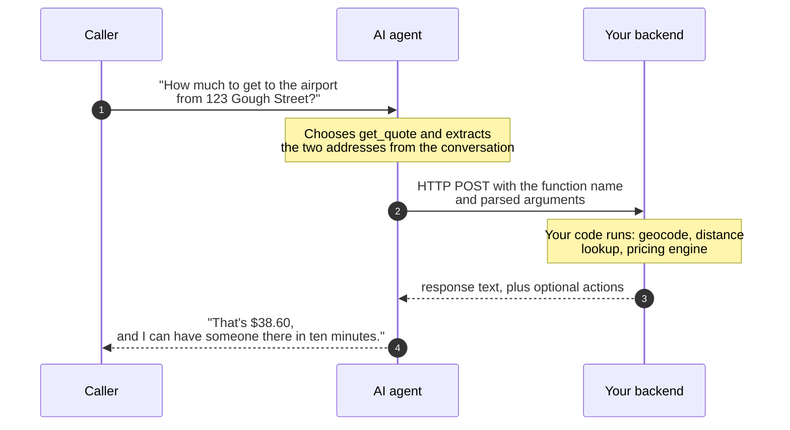

[best-practices]: /docs/platform/ai/best-practices
[prompt-engineering]: /docs/platform/ai/prompt-engineering
[swaig-guide]: /docs/swml/guides/swaig
[swaig-functions]: /docs/swml/reference/calling/ai/swaig/functions
[ai-reference]: /docs/swml/reference/calling/ai
[ai-languages]: /docs/swml/reference/calling/ai/languages
[sdk-functions]: /docs/server-sdks/guides/defining-functions
[sdk-swaig]: /docs/server-sdks/guides/swaig
[sdk-datamap]: /docs/server-sdks/guides/data-map
[swml-datamap]: /docs/swml/guides/data-map
[result-actions]: /docs/server-sdks/guides/result-actions
[state-management]: /docs/server-sdks/guides/state-management
[contexts-workflows]: /docs/server-sdks/guides/contexts-workflows
[toggle-functions]: /docs/swml/guides/toggle-functions
[context-switch]: /docs/swml/guides/context-switch
[swaig-webhook]: /docs/apis/rest/webhooks/ai-swaig-tool-webhook
[swaig-includes]: /docs/swml/reference/calling/ai/swaig/includes
[sdk-includes]: /docs/server-sdks/reference/python/agents/agent-base/add-function-include
[signature-webhook]: /docs/apis/rest/webhooks/swaig-signature-request

Ask a language model what a ride across town costs, with nothing else to go on, and it will give you
a number. The number will sound right. That doesn't make it the fare you charge.
A model without tools has no way to tell the difference: it will invent an answer rather than admit
it doesn't know.

Tool calling, also called function calling, closes that gap. A tool can look up or check something,
such as the fare to an address or whether a driver is free, and a tool can do something, such as
book the pickup, text the receipt, or transfer the call. Either way, the result goes back to the
agent as context it can act on and talk about.
On SignalWire, tool calls travel over **SWAIG**, the SignalWire AI Gateway,
and the tools you define are **SWAIG functions**.

SWAIG functions belong to the agent definition, not to a communication channel. The same functions
can serve voice calls and text conversations. Channel-specific actions, such as transferring a call
or playing audio, apply only when the active channel supports them.

This guide follows one agent the whole way through: a dispatcher for a taxi company that quotes fares
and books pickups.

## The agent is the front end

Think about what you would ask of a new person on your dispatch desk.
You would want them to listen well, get the caller to the point, and stay pleasant with someone who
is running late.
You would not ask them to memorize the fare table, or which drivers are free this afternoon, or how
the airport surcharge is calculated.
You would point them at the dispatch system and expect them to look it up, every time, because that
is where the answer actually lives.

An AI agent earns its keep the same way.
Let it run the conversation, and leave prices, availability, and formulas in the code that owns them.
Tool calling is how you point the agent at that code and tell it when to go looking.

A prompt is a suggestion, and code is a constraint:
"never give discounts" holds most of the time, while a pricing rule in your handler holds every time.
Anything that must be exact, current, or enforced belongs behind a SWAIG function:

| The prompt owns | Your code owns |
|---|---|
| Personality and tone | Business rules and policy |
| Understanding what the caller wants | Prices, inventory, and availability |
| Extracting details (names, dates, addresses) | Calculations and discounts |
| Deciding when to reach for a function | Lookups and side effects (booking, texting, transferring) |

The split also keeps rate tables, prices, and policies out of the prompt, where they go stale and get
ignored. [Best practices][best-practices] and [prompt engineering][prompt-engineering] cover the
prompt side. This guide covers the functions: how they work, how to build one, and how to keep them
reliable on real calls.

## How a SWAIG function works

A SWAIG function is a named capability you hand to the agent: a **name**, a **description**, and a
JSON Schema describing its **parameters**. Each SWAIG request is one HTTP POST carrying a JSON body,
answered by one JSON reply. Nothing stays open between requests, and nothing has to be installed on
your server.

<Tip>
SWAIG function descriptions are prompt engineering.
"Quote the fare from the caller's pickup address to their destination" tells the agent what the function does *and* what it needs before calling it.
When an agent picks the wrong function or calls it too early, the description is usually the first thing to fix.
</Tip>

The round trip goes from the caller, through the agent, to your server and back:



### The request and the reply

SignalWire POSTs the request to the function's `web_hook_url`.
Every request names the function, carries the arguments the agent extracted, and identifies itself
with `"content_type": "text/swaig"`; the fields around those describe the call and the session it
belongs to. If `web_hook_url` carries credentials in `username:password@host` form, they arrive as
HTTP basic authentication.

<llms-ignore>

<WebhookPayloadSnippet webhook="aiSwaigToolWebhook" />

</llms-ignore>

The [AI SWAIG tool webhook][swaig-webhook] documents every field, and the
[`SWAIG.functions` reference][swaig-functions] documents the same fields next to the configuration
that declares them.

A minimal reply:

```json
{
  "response": "The fare to the airport is $38.60. Offer to book a pickup now."
}
```

<Note>
The `response` is written to the AI, not to the caller.
It can carry data, and it can carry instructions about what the agent should do next.
A reply can also carry `action`, which changes what the conversation does next. See
[steering the conversation](#steering-the-conversation).
</Note>

### Where the code lives

Any endpoint that can host HTTP, accept JSON, and return JSON can serve a SWAIG function, which leaves
you two ways to host yours:

- **Your own webhook**: a route you write and host, reachable over HTTPS from the public internet —
  a Flask view, an Express handler, a serverless function behind its own URL. It reads the POST body,
  runs whatever your business does, and returns the JSON reply. You name it in `web_hook_url`, and
  nothing SignalWire-specific has to be installed for it to work.
- **The Server SDK**: define the function and its handler in one class built on the SDK's Agents
  namespace (`AgentBase`), and the SDK serves the endpoint for you.
  See [SWAIG functions in the Server SDK][sdk-functions].

If the function is a straightforward REST call, DataMap describes the request and response mapping
declaratively and SignalWire executes it server-side, with no server of yours at all.
See DataMap in the [Server SDK][sdk-datamap] or in [SWML][swml-datamap].

## Declaring your functions

Wherever the code lives, the agent needs each function's name, description, and parameters before it
can call anything. There are two ways to hand it that declaration: write it into the agent, or point
the agent at a URL and let SignalWire fetch it while the agent loads.

### Declaring inline

An inline declaration lives with the rest of the agent's configuration, so SignalWire has every
signature the moment the agent loads and asks your server nothing. In SWML, each function is an entry
in [`SWAIG.functions`][swaig-functions]. With the Server SDK, each is a `define_tool` call, which
declares the function and registers the handler that runs it in one step.

Declare inline when the functions belong to one application. The whole contract is readable where the
agent is configured, and there is no second endpoint to keep available.

<CodeBlocks>
<CodeBlock title="Server SDK (Python)">
```python
self.define_tool(
    name="validate_trip",
    description="Confirm the pickup address and destination the caller gave",
    parameters={
        "type": "object",
        "properties": {
            "pickup": {
                "type": "string",
                "description": "The pickup address, as the caller said it"
            },
            "destination": {
                "type": "string",
                "description": "Where the caller is going, as they said it"
            }
        },
        "required": ["pickup", "destination"]
    },
    handler=self.validate_trip
)
```
</CodeBlock>
<CodeBlock title="SWML">
```yaml
SWAIG:
  functions:
    - function: validate_trip
      description: Confirm the pickup address and destination the caller gave
      parameters:
        type: object
        properties:
          pickup:
            type: string
            description: The pickup address, as the caller said it
          destination:
            type: string
            description: Where the caller is going, as they said it
        required:
          - pickup
          - destination
      web_hook_url: https://example.com/validate-trip
```
</CodeBlock>
</CodeBlocks>

The [dispatch agent](#a-dispatch-agent) at the end of this guide declares its functions this way, in
both forms.

### Declaring remotely

A remote declaration leaves the agent holding only a URL. A [`SWAIG.includes`][swaig-includes] entry
names that URL and the functions you want from it, and while the agent loads, SignalWire POSTs a
[signature request][signature-webhook] there. Your server answers with the full definitions, so the
agent learns the signatures from the same server that implements them.

The point is that the asking happens up front rather than mid-call. The agent finishes loading knowing
exactly what it can do, the same as if you had written the definitions in by hand — the list just
arrived from somewhere else.

That matters once one toolset serves more than one agent. Say the taxi company runs three: a main
line, a corporate-accounts line, and an after-hours line, all of which quote and book. Declared
inline, the same definitions are pasted into three configurations, and adding a `passenger_count`
parameter means editing all three and redeploying each. Declared remotely, each agent names the
dispatch server's URL, the parameter is added once where the handler already lives, and every agent
picks it up the next time it loads.

<CodeBlocks>
<CodeBlock title="Server SDK (Python)">
```python
self.add_function_include(
    url="https://example.com/swaig",
    functions=["validate_trip", "book_ride"],
    meta_data={"fleet_id": "sf-01"}
)
```
</CodeBlock>
<CodeBlock title="SWML">
```yaml
SWAIG:
  includes:
    - url: https://example.com/swaig
      functions: ["validate_trip", "book_ride"]
      meta_data:
        fleet_id: sf-01
```
</CodeBlock>
</CodeBlocks>

Your server replies to the signature request with an array of definitions — the same fields an inline
declaration carries, plus the `web_hook_url` each function should be called on:

```json
[
  {
    "function": "validate_trip",
    "description": "Confirm the pickup address and destination the caller gave",
    "parameters": {
      "type": "object",
      "properties": {
        "pickup": { "type": "string", "description": "The pickup address, as the caller said it" },
        "destination": { "type": "string", "description": "Where the caller is going, as they said it" }
      },
      "required": ["pickup", "destination"]
    },
    "web_hook_url": "https://example.com/validate-trip"
  }
]
```

A definition registers only when it has all three of `function`, `description`, and a `web_hook_url`;
one that omits any of them is skipped without an error, so check that a function you expected is
actually being offered. A shared `web_hook_url` can go in a `defaults` object returned alongside the
functions, and a definition that carries a `data_map` needs no URL at all.
For every field an entry accepts, see [`SWAIG.includes`][swaig-includes] in SWML and
[`add_function_include`][sdk-includes] in the Server SDK.

From there the two paths converge. A remotely declared function receives the same request, returns the
same `response` and `action`, and steers the call the same way; nothing downstream of the declaration
can tell them apart.

## Steering the conversation

Alongside `response`, your code can return **actions**: instructions the platform executes during
the conversation. Some actions operate on either channel, while others require a live voice call:

- **Update conversation state** (`global_data`) that later functions and the prompt can use.
- **Move the conversation** to a different step or context, changing which functions are exposed.
- **Send an SMS**, such as a confirmation, a link, or a receipt.
- **Transfer the call** to a human, a queue, or another agent during a voice call.
- **Play audio or execute calling SWML** during a voice call.

Your backend decides, and the function result tells the agent what to do about it.
When your code books the ride, it can return the pickup time for the agent to read out and an action
that texts the caller the driver's name and plate.

Every object `action` accepts is documented in the [`SWAIG.functions` reference][swaig-functions].
For the code side, see [`FunctionResult` actions][result-actions] in the Server SDK, and the SWML
guides on [switching context][context-switch] and [toggling functions][toggle-functions].

## Reliability patterns

The failure modes below show up once real callers arrive.

### Validate in code

Every argument the AI fills in was extracted from spoken, imperfect audio, so treat it as user input.
Normalize and verify it in your handler: geocode the address, check the account number's format,
ask "Portland, Oregon or Portland, Maine?" when it matters.
When validation fails, return a `response` that tells the AI how to recover,
such as "No match for that address. Ask the caller to repeat it, street first."

### Keep validated state in `global_data`

Once your code has verified something, don't make the AI carry it.
Write it to `global_data`, the conversation state that lives with the session,
and let downstream functions take **no arguments at all**, reading the validated state instead.

The dispatcher does this with a pair of handlers on the agent class. `validate_trip` takes the two
addresses as the caller said them, geocodes both, and writes the results to `global_data`.
`get_quote` declares no parameters at all and prices the trip from what is already there:

```python
class DispatchAgent(AgentBase):
    # geocode() and price_ride() are the stand-ins defined with the complete agent below

    def validate_trip(self, args, raw_data):
        pickup = geocode(args.get("pickup", ""))
        destination = geocode(args.get("destination", ""))

        if not pickup:
            return FunctionResult(
                "No match for the pickup address. Ask the caller to repeat it, street first."
            )
        if not destination:
            return FunctionResult(
                "No match for the destination. Ask the caller to say it another way."
            )

        return FunctionResult(
            f"Trip confirmed: {pickup} to {destination}. Offer to quote the fare."
        ).update_global_data({"pickup": pickup, "destination": destination})

    def get_quote(self, args, raw_data):
        state = raw_data.get("global_data", {})
        pickup, destination = state.get("pickup"), state.get("destination")
        if not (pickup and destination):
            return FunctionResult("No confirmed trip yet. Ask for both addresses first.")
        fare = price_ride(pickup, destination)
        return FunctionResult(f"The fare is ${fare:.2f}. Ask if they'd like to book it.")
```

A function with no arguments has no arguments to get wrong.
The quote is computed from addresses your code validated, so a creative caller can't talk the agent
into a different pickup or a better price.
The [dispatch agent](#a-dispatch-agent) at the end of this guide wires both functions into a
complete Server SDK application and shows the equivalent SWML agent definition.
See [state management][state-management] for the full `global_data` lifecycle.

### Scope functions to each step

An agent with every function available at every moment will eventually call one at the wrong time,
booking before it quotes or charging before it confirms.
Structure multi-stage conversations into steps, and scope which functions are active in each one.
The dispatcher can't call `book_ride` before `get_quote` if `book_ride` doesn't exist yet.
For more on scoping functions to a step, see [contexts and workflows][contexts-workflows] in the
Server SDK, or [toggling functions][toggle-functions] in SWML.

### Cover the wait on voice calls

Most lookups take a noticeable moment, and callers hear silence as a dropped call.
Give every function that leaves the conversation a filler phrase ("Let me work that out...")
or hold audio, so the caller hears a working agent instead of dead air.
Fillers play asynchronously; when your endpoint is fast, the caller may never hear them at all.
Configure per-function `fillers`, as in the dispatch agent below, and agent-wide
[`function_fillers`][ai-languages].

### Read the post-prompt report

Define a `post_prompt` and set a [`post_prompt_url`][ai-reference], and the platform delivers a report
after each conversation ends: the summary, the full conversation log, and every function call with
its timing.
Study the turns around each function call. A mis-picked function or a guessed argument usually traces
back to the function's description, which you can revise like any other interface copy.
The open-source [post prompt viewer](https://github.com/signalwire/post_prompt_viewer)
inspects these reports, with the transcript, telemetry, and latency in one place.
In the Server SDK, see [post-prompt data][state-management].

## A dispatch agent

Everything above comes together in one agent. A fare depends on two addresses, the current rate card,
and how busy the fleet is, so no prompt could hold it. The examples below confirm the addresses in
code before anything is priced, keep them in `global_data` so the quote itself takes no arguments,
cover both waits with fillers, and declare both functions inline.

<CodeBlocks>
<CodeBlock title="Server SDK (Python)">
```python
from signalwire import AgentBase, FunctionResult

def geocode(address):
    # Stand-in for a real geocoding service
    known = {
        "123 gough street": "123 Gough St, San Francisco",
        "456 divisadero": "456 Divisadero St, San Francisco",
        "the airport": "San Francisco International Airport",
    }
    return known.get(address.lower().strip())

def price_ride(pickup, destination):
    # Stand-in for your pricing engine
    return 38.60

class DispatchAgent(AgentBase):
    def __init__(self):
        super().__init__(name="dispatch-agent")
        self.add_language("English", "en-US", "rime.spore:coda")

        self.prompt_add_section(
            "Role",
            "You are Ada, the dispatcher for Bayview Taxi. Ask where the caller is and "
            "where they're going, confirm both with validate_trip, then quote the fare "
            "with get_quote. Only quote a fare that get_quote returned."
        )

        self.define_tool(
            name="validate_trip",
            description="Confirm the pickup address and destination the caller gave",
            parameters={
                "type": "object",
                "properties": {
                    "pickup": {
                        "type": "string",
                        "description": "The pickup address, as the caller said it"
                    },
                    "destination": {
                        "type": "string",
                        "description": "Where the caller is going, as they said it"
                    }
                },
                "required": ["pickup", "destination"]
            },
            handler=self.validate_trip,
            fillers={"en-US": ["Let me check those addresses..."]}
        )

        # get_quote takes no arguments: it reads state your code already verified
        self.define_tool(
            name="get_quote",
            description="Quote the fare. Only call after validate_trip has confirmed both addresses.",
            parameters={"type": "object", "properties": {}},
            handler=self.get_quote,
            fillers={"en-US": ["Let me work that out..."]}
        )

    def validate_trip(self, args, raw_data):
        pickup = geocode(args.get("pickup", ""))
        destination = geocode(args.get("destination", ""))

        if not pickup:
            return FunctionResult(
                "No match for the pickup address. Ask the caller to repeat it, street first."
            )
        if not destination:
            return FunctionResult(
                "No match for the destination. Ask the caller to say it another way."
            )

        return FunctionResult(
            f"Trip confirmed: {pickup} to {destination}. Offer to quote the fare."
        ).update_global_data({"pickup": pickup, "destination": destination})

    def get_quote(self, args, raw_data):
        state = raw_data.get("global_data", {})
        pickup, destination = state.get("pickup"), state.get("destination")
        if not (pickup and destination):
            return FunctionResult("No confirmed trip yet. Ask for both addresses first.")
        fare = price_ride(pickup, destination)
        return FunctionResult(
            f"The fare from {pickup} to {destination} is ${fare:.2f}. "
            "Ask whether they'd like a pickup now."
        )

if __name__ == "__main__":
    agent = DispatchAgent()
    agent.run()
```
</CodeBlock>
<CodeBlock title="SWML">
```yaml
version: 1.0.0
sections:
  main:
    - ai:
        prompt:
          text: |
            You are Ada, the dispatcher for Bayview Taxi. Ask where the caller is and
            where they're going, confirm both with validate_trip, then quote the fare
            with get_quote. Only quote a fare that get_quote returned.
        SWAIG:
          functions:
            - function: validate_trip
              description: Confirm the pickup address and destination the caller gave
              parameters:
                type: object
                properties:
                  pickup:
                    type: string
                    description: The pickup address, as the caller said it
                  destination:
                    type: string
                    description: Where the caller is going, as they said it
                required:
                  - pickup
                  - destination
              fillers:
                en-US:
                  - Let me check those addresses...
              web_hook_url: https://example.com/validate-trip
            - function: get_quote
              description: Quote the fare. Only call after validate_trip has confirmed both addresses.
              parameters:
                type: object
                properties: {}
              fillers:
                en-US:
                  - Let me work that out...
              web_hook_url: https://example.com/get-quote
```
</CodeBlock>
</CodeBlocks>

In SWML, `web_hook_url` names the server you run; with the Server SDK, the class *is* the server,
and the SDK hosts the endpoint for you.
The Server SDK tab is a complete local application. The SWML tab is the equivalent agent definition;
replace its example webhook URLs with public endpoints that implement `validate_trip` and
`get_quote` before you run it.
For the SDK side, see [SWAIG functions in the Server SDK][sdk-functions] and
[SWAIG request handling][sdk-swaig].
For SWML, see the [SWAIG guide][swaig-guide] and the [`SWAIG.functions` reference][swaig-functions].

`geocode` and `price_ride` stand in for the services you already run: an address lookup, a distance
API, a rate table, a surge multiplier. Swap them out and nothing else changes.
When an address doesn't resolve, the agent asks for it again, because that is what your code returned.

You can exercise a function before any call.
The SDK's [`swaig-test` CLI](/docs/server-sdks/reference/python/agents/cli/swaig-test) loads the agent file,
executes a function with arguments you supply, and prints the exact response the agent would receive:

```bash
swaig-test dispatch_agent.py --exec validate_trip --pickup "123 Gough Street" --destination "the airport"
```

To hear it on a real call, run the Python file and point a phone number at your agent
(the [Server SDK quickstart](/docs/server-sdks/guides/quickstart) walks through it),
or paste the SWML into your Dashboard as shown in the [AI quickstart](/docs/platform/ai/quickstart).

## Next steps

<CardGroup cols={2}>

<Card title="SWAIG guide" href="/docs/swml/guides/swaig" icon="regular webhook">
  The request/response contract between the platform and your server.
</Card>

<Card title="SWAIG reference" href="/docs/swml/reference/calling/ai/swaig" icon="regular book">
  Every SWAIG configuration option in SWML.
</Card>

<Card title="Server SDK functions" href="/docs/server-sdks/guides/defining-functions" icon="regular code">
  Define SWAIG functions and handlers in the language of your choice.
</Card>

<Card title="DataMap" href="/docs/server-sdks/guides/data-map" icon="regular bolt">
  Call REST APIs from SWAIG functions with no server of your own.
</Card>

</CardGroup>
