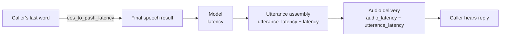

[best-practices]: /docs/platform/ai/best-practices
[content-redaction]: /docs/platform/ai/content-redaction
[debug-webhook-ref]: /docs/apis/rest/webhooks/ai-debug-webhook
[enable-debug-events]: /docs/server-sdks/reference/python/agents/agent-base/enable-debug-events
[on-summary]: /docs/server-sdks/reference/python/agents/agent-base/on-summary
[post-prompt-callback]: /docs/apis/rest/webhooks/ai-post-prompt-callback
[prompt-engineering]: /docs/platform/ai/prompt-engineering
[set-post-prompt]: /docs/server-sdks/reference/python/agents/agent-base/set-post-prompt
[tool-calling]: /docs/platform/ai/tool-calling
[tts]: /docs/platform/voice/tts

Conversation analytics shows what happened during an AI conversation, how well the experience
performed, and whether the user accomplished their goal. Use it to replace impressions such as
“the agent felt slow” or “the call went poorly” with specific evidence you can act on.

You can identify where a response was delayed, find words the agent repeatedly misheard, understand
why callers interrupted, inspect function behavior, measure outcomes, and connect resource usage to
successful conversations. Comparing those signals over time helps you improve prompts, functions,
voices, and recognition settings without guessing.

## What you can learn

<CardGroup cols={3}>

<Card title="Outcomes" href="#understand-outcomes" icon="regular bullseye-arrow">
  Did the conversation accomplish what the user needed?
</Card>

<Card title="Responsiveness" href="#measure-responsiveness" icon="regular stopwatch">
  Where did the delay occur before the caller heard a reply?
</Card>

<Card title="Recognition" href="#diagnose-recognition" icon="regular ear-listen">
  Which words and phrases does the agent regularly mishear?
</Card>

<Card title="Turn-taking" href="#evaluate-turn-taking" icon="regular arrows-turn-to-dots">
  Is the agent speaking at the right time and stopping when interrupted?
</Card>

<Card title="Function health" href="#inspect-function-activity" icon="regular webhook">
  Did the agent choose the right function, with the right arguments, and get a useful result?
</Card>

<Card title="Usage" href="#connect-usage-to-value" icon="regular receipt">
  What did successful and unsuccessful conversations consume?
</Card>

</CardGroup>

## Choose the right source

SignalWire provides two independent ways to collect this information. Configure either one or both,
depending on when you need the data and what you want to do with it:

| Source | Delivery | Availability | Use it for |
| --- | --- | --- | --- |
| [Post-prompt report](#post-prompt-reports) | One callback after the conversation ends | Voice and AI Chat | Analytics, transcripts, outcomes, performance, function history, and usage |
| [Debug webhook](#live-debug-events) | A stream of events during the session | Voice | Development-time tracing, live errors, context changes, function activity, and turn behavior |

Use the post-prompt report as your durable analytics record. Debug events are asynchronous,
high-volume diagnostics rather than a guaranteed event store. They are not a replacement for the
final report.

## Post-prompt reports

A post-prompt has two parts:

- `post_prompt` tells the model what to extract or summarize after the conversation.
- `post_prompt_url` receives the complete report, including the model's post-prompt response and the
  conversation telemetry assembled by the platform.

The post-prompt runs after the conversation, so it cannot change what the agent already said or did.
Ask for structured JSON when you need outcomes that can be counted across conversations.

### Configure a final report

<Tabs>
<Tab title="Server SDK">

The Server SDK creates and handles its own `post_prompt_url`. Use
[`set_post_prompt()`][set-post-prompt] to define the analysis instruction and override
[`on_summary()`][on-summary] to process the result.

```python {11-14,17-19}
from signalwire import AgentBase


class AnalyticsAgent(AgentBase):
    def __init__(self):
        super().__init__(name="bayview-analytics")
        self.prompt_add_section(
            "Role",
            "You are Ada, the dispatcher for Bayview Taxi. Help callers request fare quotes.",
        )
        self.set_post_prompt(
            "Return JSON only with these keys: intent, outcome, escalated, and sentiment. "
            "Set outcome to resolved, unresolved, or abandoned."
        )
        self.set_params({"accounting": True})

    def on_summary(self, summary, raw_data=None):
        print("Outcome:", summary)
        print("Complete report:", raw_data)


if __name__ == "__main__":
    AnalyticsAgent().run()
```

</Tab>
<Tab title="SWML">

Set `post_prompt_url` to an endpoint that accepts the final callback.

```yaml {10-15}
version: 1.0.0
sections:
  main:
    - answer: {}
    - ai:
        prompt:
          text: >-
            You are Ada, the dispatcher for Bayview Taxi. Help callers request
            fare quotes.
        post_prompt:
          text: >-
            Return JSON only with these keys: intent, outcome, escalated, and
            sentiment. Set outcome to resolved, unresolved, or abandoned.
        # Replace this URL with an endpoint that accepts the final report.
        post_prompt_url: https://example.com/ai/post-prompt
        params:
          accounting: true
```

</Tab>
</Tabs>

The generated [post-prompt callback documentation][post-prompt-callback] provides request examples
and documents the complete payload. The `conversation_type` field identifies voice or chat reports.

### Understand outcomes

`post_prompt_data` contains the model's answer to your post-prompt. Its shape depends on the output
you requested and on the conversation engine, so treat the schema in your prompt as an application
contract.

For aggregate reporting, ask for named fields with limited values. Useful fields include:

- intent or request category
- outcome such as `resolved`, `unresolved`, or `abandoned`
- whether the conversation escalated to a person
- caller sentiment
- follow-up work that remains

Voice and chat can deliver `post_prompt_data` in different wrappers. The Server SDK normalizes these
forms before passing the result to `on_summary()`. If you process callbacks yourself, preserve the
raw payload and handle `raw`, flat objects, and `parsed` wrappers described in the
[post-prompt callback reference][post-prompt-callback].

The wording of the post-prompt determines whether the result is useful at scale. A request such as
“summarize the conversation” produces prose for reviewing one conversation. Named fields with a
small set of allowed values produce records you can group, filter, and compare. For example, once
`intent`, `outcome`, and `escalated` are consistent, you can calculate the resolution rate for each
intent without rereading transcripts.

Do not rely only on the model's assessment for facts your application already knows. Values written
by your functions appear in `global_data`; use those values for verified facts such as an order ID,
appointment status, or transfer result.

### Reconstruct the conversation

The final report provides three views of the conversation:

| Field | Contains | Use it for |
| --- | --- | --- |
| `call_log` | The filtered, or “blessed,” conversation after consolidation | Readable transcripts and per-turn analysis |
| `raw_call_log` | The append-only conversation before filtering | Interrupted responses and details removed during consolidation |
| `call_timeline` | A flat stream of typed events extracted from the conversation log | Replaying context changes, functions, and other events in order |

Dialogue entries use `user` and `assistant` roles. Other roles describe prompts, tool results, model
thinking, manual speech, and platform lifecycle events. Filter by role when you need a caller-facing
transcript, but retain the full logs for diagnosis.

### Measure responsiveness

Voice reports expose two related views of responsiveness:

- **Caller-perceived latency** runs from the end of the caller's last word to the first audio from
  the agent. This is the silence the caller experiences.
- **Pipeline latency** starts after the caller's speech has been finalized and separates model,
  utterance, and audio processing.

Do not use `audio_latency` alone as mouth-to-ear latency. It begins after speech recognition has
produced its final result, so it excludes the time spent detecting the end of the caller's turn.



| Measurement | How to read it | What to investigate |
| --- | --- | --- |
| Turn detection | `eos_to_push_latency` measures the caller's last word to the final speech result | End-of-speech and recognition settings |
| Model | `latency` measures the final speech result to the model's first token | Prompt size, model choice, and unnecessary functions |
| Utterance assembly | `utterance_latency - latency` isolates preparation of the first speakable utterance | Long or complex responses |
| Audio delivery | `audio_latency - utterance_latency` isolates speech generation and delivery inside the server | Voice and [text-to-speech provider][tts] |
| Mouth-to-ear | `first_audio - last_word_end` from `stamps_us`; `acoustic_latency` is the corresponding reported field | The complete delay experienced by the caller |

Use one value per caller turn when aggregating mouth-to-ear and turn-detection latency. A single
caller turn can trigger filler speech, a function, and a final response that share the same
`last_word_end`; only the first agent audio represents that turn's response latency. The Post Prompt
Viewer deduplicates on this anchor and can compare the reported timing with the call recording.

Track the median to understand a typical turn and the 95th percentile to expose the pauses users
remember. Compare the same intent and conversation type before and after a change; one overall
average can hide a slow function or a particularly verbose workflow. If the report does not contain
the required timing anchor, omit that turn rather than inventing one.

### Diagnose recognition

Recognition metrics apply to voice calls, not AI Chat. Each `user` turn can include:

- `confidence`, from 0 to 1, estimates how confidently speech was recognized
- `content_type` distinguishes detected speech from inputs such as keypad digits
- `merge_count` shows how many recognition segments were combined into the utterance

Confidence is most useful as a way to find patterns, not as a score to average across every call.
Review the transcript around low-confidence turns and group them by repeated terms. Product names,
street names, abbreviations, and account identifiers often emerge as the real problem. Add
<Tooltip tip="Speech hints bias recognition toward names and domain-specific vocabulary.">speech hints</Tooltip>
for vocabulary that is repeatedly misrecognized.

Use `merge_count` or `timing.segments` as context when a turn spans several recognition segments;
those turns are not directly comparable to a simple, single-segment utterance.

### Evaluate turn-taking

Recognition asks whether the platform heard the correct words. Turn-taking asks whether the agent
listened and spoke at the right moments.

| Field | What it reveals |
| --- | --- |
| `speaking_to_turn_detection` | Time from speech onset until the platform identified the end of the user's turn |
| `turn_detection_to_final_event` | Time from turn detection to the final recognition result |
| `barged` and `barge_count` | Whether the caller interrupted and the number of recorded interruptions |
| `barge_elapsed_ms`, `text_spoken_total`, and `text_heard_approx` | When the interruption occurred and how much of the response was likely heard |

The explicit barge fields are carried on interrupted responses in `raw_call_log` and corresponding
`call_timeline` events; they can be absent from the consolidated `call_log`. Use the raw entry to
separate the portion the caller likely heard from the portion cut off by the interruption.

Look at the interruption rate together with response length. Frequent barges often mean the useful
answer arrives too late, the response includes unnecessary detail, or the agent continues after the
caller is ready to move on. Put the answer first and tighten the response guidelines in the
[prompt][prompt-engineering]. Use short filler language only when a function genuinely takes time;
[AI best practices][best-practices] explains that pattern.

### Inspect function activity

`swaig_log` records each SignalWire AI Gateway (SWAIG) function call, including its name, arguments,
endpoint, request body, and response. Use it to answer:

- Did the agent choose the correct function?
- Were the extracted arguments correct?
- Did the endpoint return the expected response and actions?
- Did the agent repeat the same function unnecessarily?

Use `swaig_log` for the authoritative function name, arguments, request, and response. For timing,
pair it with the corresponding `role: "tool"` entry and prefer `execution_latency` or
`function_latency`. Do not treat the tool entry's generic `latency` value as model response latency.

Aggregate runtime by function name rather than across all functions. This exposes one slow backend
behind an otherwise healthy average. Also track calls per conversation: repeated calls to the same
function often mean its description is too broad, its result did not give the model enough context,
or its response instructed the agent to try again. See [tool calling][tool-calling] for designing
clear function contracts.

### Examine conversation shape

Conversation shape connects several user-experience problems. Per-response fields such as
`response_word_count`, `tokens`, `answer_time`, and `tps` show how much the agent produced and how
quickly. Entries with an empty response usually dispatched a function instead of speaking, so omit
them from response-length averages.

These fields are stored in `times[]`, which can also contain generations that produced a function
call instead of speech. Match an entry to the spoken assistant turn by response text rather than by
array position.

Long replies take longer to generate and synthesize, consume more tokens and text-to-speech
characters, and create more opportunities for interruption. If response length rises, inspect the
affected intents and tighten the prompt's response guidelines instead of applying an arbitrary
global word limit.

### Connect usage to value

When accounting is enabled, the final report includes totals for:

- conversation minutes
- input and output tokens
- billable wire tokens and per-minute rates
- text-to-speech characters
- speech-recognition minutes and cost factor

Compare usage with outcomes rather than optimizing it alone. A shorter prompt reduces input tokens
on every turn, while shorter replies reduce output tokens, speech synthesis, latency, and
interruption opportunities.

Input tokens often exceed output tokens because the prompt and accumulated conversation are sent
again on later turns. Compare cost per resolved conversation, not simply cost per minute: a cheaper
call that fails and requires another contact is not necessarily an improvement.

## Live debug events

The debug webhook sends event objects while a voice session is running. Each request includes
`call_info` and one or more properties named for the events in that request.

Use level 1 for routine diagnostics such as session lifecycle, errors, function activity, barges,
and step changes. Level 2 also emits high-volume details such as each `conversation_add` and model
request or response. Enable level 2 for a focused investigation rather than as a default analytics
feed.

### Configure debug events

<Tabs>
<Tab title="Server SDK">

The Server SDK generates a callback to its `/debug_events` route and passes each event to the
registered handler. See [`enable_debug_events()`][enable-debug-events] for the SDK configuration.

```python {9,12-14}
from signalwire import AgentBase


agent = AgentBase(name="bayview-debug")
agent.prompt_add_section(
    "Role",
    "You are Ada, the dispatcher for Bayview Taxi. Help callers request fare quotes.",
)
agent.enable_debug_events(level=1)


@agent.on_debug_event
def handle_debug_event(event_type, data):
    print(event_type, data)


if __name__ == "__main__":
    agent.run()
```

</Tab>
<Tab title="SWML">

Provide your own collector URL in `debug_webhook_url`.

```yaml {10-13}
version: 1.0.0
sections:
  main:
    - answer: {}
    - ai:
        prompt:
          text: >-
            You are Ada, the dispatcher for Bayview Taxi. Help callers request
            fare quotes.
        params:
          # Replace this URL with an endpoint that accepts debug event POSTs.
          debug_webhook_url: https://example.com/ai/debug-events
          debug_webhook_level: 1
```

</Tab>
</Tabs>

The generated [debug webhook documentation][debug-webhook-ref] provides request examples and
documents the event types and their fields.

### Handle the stream safely

Debug events are posted asynchronously so the collector does not block the conversation. Design the
collector for diagnostics:

- return a successful response quickly and process events asynchronously
- identify sessions with `call_info.call_id`
- handle recognized event properties and ignore unknown ones
- expect multiple event properties in one request
- avoid putting business-critical state changes behind debug delivery
- protect and redact stored event bodies when they contain conversation content

Debug events help explain a call while it is happening. The final report remains the source for a
complete transcript and cross-conversation metrics.

## Store and review reports

Store each final report verbatim in a JSON column and extract only the fields you query frequently.
This preserves new fields without requiring an immediate database migration. Send malformed bodies
to a dead-letter store instead of discarding them, and authenticate both final-report and debug
collectors.

The open-source [Post Prompt Viewer](https://github.com/signalwire/post_prompt_viewer) demonstrates
this pattern. It stores the complete payload while extracting a small set of fields for search and
the call index. Its views combine the transcript, event timeline, per-turn pipeline, functions,
usage data, and raw report. When a recording is available, it can compare report timings with the
silence measured in the audio. Point `post_prompt_url` at its `/collect` endpoint to inspect reports
without building a viewer first.

Conversation reports and debug events can contain caller speech, addresses, tool arguments, and
other sensitive values. Apply [content redaction][content-redaction], restrict access, and set a
retention policy appropriate for your application.

## Improve the agent

Use a repeatable loop:

1. Define the outcome and performance measurements that matter.
2. Collect final reports for a representative set of conversations.
3. Segment by intent, outcome, function, or failure type.
4. Inspect the transcript and timeline behind an outlier.
5. Use debug level 2 to reproduce a live problem when the final report is not enough.
6. Change one prompt, function, or voice setting and compare the same measurements again.

| Symptom | Start with | Likely change |
| --- | --- | --- |
| Outcomes cannot be counted | `post_prompt_data` | Ask for named fields and limited values |
| Replies feel slow | Mouth-to-ear percentiles and the per-turn pipeline | Fix turn detection or the dominant model, utterance, or audio segment |
| The agent mishears recurring terms | Low-confidence user turns | Add <Tooltip tip="Speech hints bias recognition toward names and domain-specific vocabulary.">speech hints</Tooltip> |
| A function is slow or repeated | `swaig_log` and function timing | Improve the handler or narrow its description |
| A live call enters the wrong step | Debug step and function events | Fix context transitions or function scope |
| Replies are long or often interrupted | Word counts and turn-taking fields | Tighten [prompt response guidelines][prompt-engineering] |
