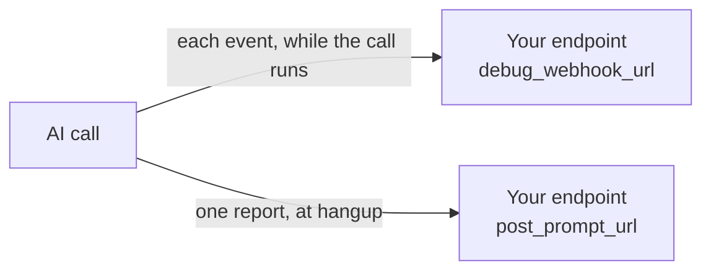
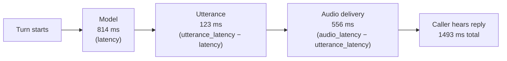

[ai-params]: /docs/swml/reference/calling/ai/params
[ai-reference]: /docs/swml/reference/calling/ai
[best-practices]: /docs/platform/ai/best-practices
[content-redaction]: /docs/platform/ai/content-redaction
[enable-debug-events]: /docs/server-sdks/reference/python/agents/agent-base/enable-debug-events
[hints]: /docs/server-sdks/guides/hints
[on-summary]: /docs/server-sdks/reference/python/agents/agent-base/on-summary
[debug-webhook-ref]: /docs/apis/rest/webhooks/ai-debug-webhook
[post-prompt-callback]: /docs/apis/rest/webhooks/ai-post-prompt-callback
[prompt-engineering]: /docs/platform/ai/prompt-engineering
[set-post-prompt]: /docs/server-sdks/reference/python/agents/agent-base/set-post-prompt
[set-post-prompt-url]: /docs/server-sdks/reference/python/agents/agent-base/set-post-prompt-url
[state-management]: /docs/server-sdks/guides/state-management
[tool-calling]: /docs/platform/ai/tool-calling
[tts]: /docs/platform/voice/tts

Every AI call emits a record of what was said, how long each part took, and what your tools
returned. This page covers the measurements in that record and what to change when one goes wrong.

## What you can measure

<CardGroup cols={3}>

<Card title="Responsiveness" href="#responsiveness" icon="regular stopwatch">
  Does the agent reply fast enough to feel like a conversation?
</Card>

<Card title="Recognition" href="#recognition" icon="regular ear-listen">
  Is the agent hearing callers correctly?
</Card>

<Card title="Turn-taking" href="#turn-taking" icon="regular arrows-turn-to-dots">
  Does it speak at the right moment, and stop when interrupted?
</Card>

<Card title="Tool health" href="#tool-health" icon="regular webhook">
  Are the calls into your systems fast and correct?
</Card>

<Card title="Conversation shape" href="#conversation-shape" icon="regular comments">
  Is the agent saying more than it needs to?
</Card>

<Card title="Outcomes and cost" href="#outcomes-and-cost" icon="regular receipt">
  Did the call succeed, and what did it consume?
</Card>

</CardGroup>

## Where the measurements come from

Two channels carry this data off the same call.

| Channel | Set by | Fires | Use for |
|---|---|---|---|
| Debug webhook | [`ai.params.debug_webhook_url`][ai-params], `debug_webhook_level` | Per event, during the call | Live supervision, alerting |
| Post-call report | [`ai.post_prompt`, `ai.post_prompt_url`][ai-reference] | Once, at hangup | Analysis, tuning |



At `debug_webhook_level` 2 and above, the debug webhook includes `conversation_add`, one event per
turn:

```json title="conversation_add event"
{
  "call_info": { "project_id": "b08dacad...", "content_type": "text/json", "call_id": "b3f4e4e1..." },
  "conversation_add": {
    "role": "assistant",
    "content": "...",
    "lang": "en-US",
    "tokens": 53,
    "latency": 836,
    "utterance_latency": 934,
    "audio_latency": 1106
  }
}
```

Use it when something must happen mid-call: paging a supervisor, flagging a handoff. In the Server
SDKs, [`enable_debug_events()`][enable-debug-events] wires the URL and endpoint for you. The
[AI debug webhook reference][debug-webhook-ref] documents all 47 event types it can carry.

Everything else on this page comes from the post-call report.

### Enable the post-call report

<Tabs>
<Tab title="SWML">

```json title="SWML"
{
  "ai": {
    "prompt": { "text": "You dispatch taxis..." },
    "post_prompt": { "text": "Summarize the call as JSON with keys intent, resolved, sentiment." },
    "post_prompt_url": "https://example.com/reports"
  }
}
```

</Tab>
<Tab title="Server SDK">

```python title="Python"
from signalwire import AgentBase


class DispatchAgent(AgentBase):
    def __init__(self):
        super().__init__(name="dispatch")
        self.prompt_add_section("Role", "You dispatch taxis.")

        self.set_post_prompt(
            "Summarize the call as JSON with keys intent, resolved, sentiment."
        )
        self.set_post_prompt_url("https://example.com/reports")
```

</Tab>
</Tabs>

See [`set_post_prompt()`][set-post-prompt] and [`set_post_prompt_url()`][set-post-prompt-url], or
[`on_summary()`][on-summary] to handle the report in process. The
[AI post-prompt callback reference][post-prompt-callback] documents every field.

<Accordion title="A full post-call report">

<WebhookPayloadSnippet webhook="aiPostPromptCallback" />

</Accordion>

<Tip>
Store the body verbatim in a JSON column and extract only the columns you query. The report gains
fields over time; a mirrored schema needs a migration each time. Send unparseable bodies to a
dead-letter store rather than discarding them, and set credentials on the collector — the URL
accepts `username:password@url`.
</Tip>

### Pick the right log

The report carries the conversation three times.

| Field | Contains | Use for |
|---|---|---|
| `call_log` | Filtered conversation: interrupted segments consolidated, evicted entries dropped | Transcripts, per-turn timings |
| `raw_call_log` | Unfiltered, append-only. Interruption detail appears **here only** | Barge-in analysis |
| `call_timeline` | Flat stream of typed events, aligned to `raw_call_log` | Replaying a call in order |

Each `call_log` entry carries a `role`:

| Role | Entry |
|---|---|
| `user` | Caller speech, with recognition confidence and timings |
| `assistant` | Agent reply, with the three latency fields |
| `tool` | Function result returned to the model |
| `system` | Prompt text |
| `assistant-manual` | A line the agent was instructed to speak |
| `assistant-thinking` | Model reasoning before an answer |
| `system-log` | Platform events: step changes, function calls, session start and end |

## Responsiveness

Each `assistant` entry carries three timings from the same origin. The gaps between them are where
the time actually went.

<llms-ignore>

  

</llms-ignore>

<llms-only>



</llms-only>

<ParamField path="latency" type="integer">
  Milliseconds to the model's first token.
</ParamField>

<ParamField path="utterance_latency" type="integer">
  Milliseconds until the reply was assembled into speakable text. Includes `latency`.
</ParamField>

<ParamField path="audio_latency" type="integer">
  Milliseconds until speech was synthesized and delivered. Includes `utterance_latency`.
</ParamField>

| Segment | Formula | What to change |
|---|---|---|
| Model | `latency` | Shorten the prompt, remove tools the agent never calls |
| Utterance | `utterance_latency - latency` | Ask for shorter replies |
| Audio | `audio_latency - utterance_latency` | Try a different voice or [text-to-speech provider][tts] |

```python title="Decompose per-turn latency"
def latency_segments(report):
    """Yield (model_ms, utterance_ms, audio_ms) for each spoken assistant turn."""
    for entry in report["call_log"]:
        if entry.get("role") != "assistant" or not entry.get("audio_latency"):
            continue

        model = entry["latency"]
        yield (
            model,
            entry["utterance_latency"] - model,
            entry["audio_latency"] - entry["utterance_latency"],
        )
```

<Warning>
On `role: "tool"` entries, the fields `latency`, `utterance_latency`, `audio_latency`,
`function_latency`, and `execution_latency` describe the **surrounding turn**, not the function. The
entry says so itself, in a `deprecation_warning` field.

A function's real runtime is `end_timestamp - start_timestamp`, in microseconds.
</Warning>

### Set a target

Track the 95th percentile of `audio_latency`, not the average. One three-second pause is what a
caller remembers about an otherwise quick call.

| Average `audio_latency` | Rating |
|---|---|
| Under 1200 ms | Excellent |
| 1200–1800 ms | Good |
| 1800–2500 ms | Fair |
| Over 2500 ms | Needs work |

<Note>
These bands are the convention used by the [post prompt viewer](#the-improvement-loop), not a
platform commitment. SignalWire publishes measured turn latency in its
[performance analysis](https://signalwire.com/c/performance-analysis).
</Note>

<Accordion title="Rule out the phone leg first">

Tool time runs on your infrastructure, so it belongs to your handler, not the agent. Track it under
[tool health](#tool-health) instead.

Delay before anyone spoke isn't the agent either. The report's date fields are microsecond
timestamps, and two differences separate telephony from the AI session:

| Interval | Formula |
|---|---|
| Ring time | `call_answer_date - call_start_date` |
| Session setup | `ai_start_date - call_answer_date` |

</Accordion>

## Recognition

<ParamField path="confidence" type="float">
  Recognition confidence for a `user` entry, from 0 to 1.
</ParamField>

<ParamField path="content_type" type="string">
  `Detected Speech` for spoken input. Keypad digits carry no meaningful confidence.
</ParamField>

<ParamField path="merge_count" type="integer">
  Recognition segments stitched into this utterance. Above 1, the entry's `start_timestamp` refers
  to the earliest segment and its timings run long.
</ParamField>

| Confidence | Read it as |
|---|---|
| 0.8 and above | Healthy |
| 0.5–0.8 | Review the turn against what the agent replied |
| Below 0.5 | Assume it misheard |

Averaging confidence across a call tells you little. The value is in the outliers and what they have
in common: sort a week of low-confidence turns and the same street names, product codes, and
surnames surface.

<Tip>
That list of recurring terms is what [speech hints][hints] are for. Hints prime recognition toward
vocabulary the model would otherwise guess at, and cost less than a prompt change.
</Tip>

Exclude entries with `merge_count` above 1 before averaging any recognition timing.

## Turn-taking

Recognition is whether the agent heard the right words. Turn-taking is whether it started speaking
at the right moment.

<ParamField path="speaking_to_turn_detection" type="integer">
  Milliseconds from speech onset to the platform deciding the caller had finished. **Negative when
  the caller interrupted.**
</ParamField>

<ParamField path="turn_detection_to_final_event" type="integer">
  Milliseconds from that decision to the final recognition result.
</ParamField>

<ParamField path="speaking_to_final_event" type="integer">
  Milliseconds across the whole utterance.
</ParamField>

<ParamField path="barge_count" type="integer">
  Interruption count for the entry, where the platform records it.
</ParamField>

A negative `speaking_to_turn_detection` means turn detection fired before the utterance was expected
to end, so the caller spoke over the agent. It's the most reliable interruption signal in the
filtered log:

```python title="Count interruptions"
def interruptions(report):
    return [
        entry
        for entry in report["call_log"]
        if entry.get("role") == "user"
        and (entry.get("speaking_to_turn_detection") or 0) < 0
    ]
```

For how much of a reply landed, `raw_call_log` carries `text_spoken_total` against
`text_heard_approx`.

<Tip>
A rising interruption rate is a response-design problem, not a recognition one. Callers interrupt
when the answer isn't arriving, so put it in the first sentence. [Best practices][best-practices]
covers the filler phrases that hold attention while a tool runs.
</Tip>

## Tool health

Every function call appears in `swaig_log`, one entry each.

<ParamField path="command_name" type="string">
  The function the agent chose.
</ParamField>

<ParamField path="command_arg" type="string">
  Arguments the agent extracted, as a JSON string.
</ParamField>

<ParamField path="epoch_time" type="integer">
  Call start, in **seconds** rather than the microseconds used elsewhere.
</ParamField>

<ParamField path="url" type="string">
  The endpoint the platform posted to.
</ParamField>

<ParamField path="post_data" type="object">
  The full request body your handler received.
</ParamField>

<ParamField path="post_response" type="object">
  Your handler's reply: the `response` text and any `action` array.
</ParamField>

<ParamField path="active_count" type="integer | string">
  Remaining permitted uses, or `endless`.
</ParamField>

<ParamField path="native" type="boolean">
  `true` on platform functions such as `next_step` and `end_call`.
</ParamField>

For timing, use the matching `call_log` entry with `role: "tool"`, where `function_name` identifies
the function and `end_timestamp - start_timestamp` gives its runtime. A `system-log` entry with
`action: "function_call"` reports `metadata.duration_ms` directly.

| Aggregate | What it finds |
|---|---|
| Average runtime by `command_name` | The one slow handler behind a healthy overall average |
| Tool calls per minute of AI session | An agent calling functions more than the conversation warrants |
| Calls per distinct function | An agent looping on one tool |

The last two are usually function descriptions that read more broadly than intended.
[Tool calling][tool-calling] covers writing them.

## Conversation shape

`call_log` supports turns exchanged, messages per role, and words per role. Per generated response,
`times[]` adds:

<ParamField path="response_word_count" type="integer">
  Words in the generated reply.
</ParamField>

<ParamField path="tokens" type="integer">
  Tokens in the reply.
</ParamField>

<ParamField path="answer_time" type="float">
  Seconds to produce the reply.
</ParamField>

<ParamField path="tps" type="float">
  Token throughput for this generation. `avg_tps` gives the running average.
</ParamField>

Entries with an empty `response` dispatched a tool rather than speaking. Drop them before averaging.

`response_word_count` connects three sections of this page: longer replies take longer to
synthesize, cost more in speech synthesis characters, and give callers more to interrupt. When it
climbs, look at the response guidelines in the prompt ([prompt engineering][prompt-engineering]).

## Outcomes and cost

<ParamField path="post_prompt_data.raw" type="string">
  The agent's answer to the post-prompt.
</ParamField>

<ParamField path="post_prompt_data.substituted" type="string">
  The same answer with template variables resolved.
</ParamField>

<ParamField path="post_prompt_data.parsed" type="array">
  The structured form. **Empty unless the post-prompt asks for structured output.**
</ParamField>

That last field decides whether outcomes are countable. "Summarize the call" produces prose you read
one call at a time. Naming the keys produces records you can aggregate:

```python title="A post-prompt that produces aggregatable outcomes"
self.set_post_prompt(
    """
    Return JSON only, with these keys:
      intent: what the caller wanted, in three words or fewer
      resolved: yes, no, or partial
      escalated: true if the call was handed to a person
      sentiment: positive, neutral, or negative
    """
)
```

With that in place, "how many booking calls resolved without a transfer last week" is a query.
[`on_summary()`][on-summary] receives the same structure in process.

<ParamField path="global_data" type="object">
  State your tools wrote during the call, so the report shows values your code verified rather than
  ones the model remembered. See [state management][state-management].
</ParamField>

<ParamField path="SWMLVars" type="object">
  Runtime values, including `ai_result` and the recording URL.
</ParamField>

Usage totals close the report:

| Field | Counts |
|---|---|
| `total_input_tokens`, `total_output_tokens` | Tokens the model processed and produced |
| `total_wire_input_tokens`, `total_wire_output_tokens` | Billable tokens, with matching `_per_minute` rates |
| `total_tts_chars`, `total_tts_chars_per_min` | Characters sent to speech synthesis |
| `total_asr_minutes`, `total_asr_cost_factor` | Speech recognition volume |
| `total_minutes` | Billable call minutes |

Input tokens dwarf output tokens, because the prompt and the conversation so far are resent every
turn. Prompt length is a running cost, not a one-time one.

## The improvement loop

| Symptom | Measurement | Change |
|---|---|---|
| Replies feel sluggish | p95 of `audio_latency`, decomposed | Fix the dominant segment |
| One kind of call drags | Runtime by `command_name` | Speed up that handler, or cover the wait |
| The agent mishears names | `confidence` below 0.5, grouped by term | Add [speech hints][hints] |
| Callers talk over the agent | Negative `speaking_to_turn_detection` | Put the answer in the first sentence |
| The agent rambles | `response_word_count` trending up | Tighten the response guidelines |
| Outcomes can't be counted | `post_prompt_data.parsed` empty | Ask the post-prompt for named JSON keys |

Change one thing at a time and compare the same measurement before and after. The
[iterative refinement process][prompt-engineering] covers running that loop against real calls.

The open-source [post prompt viewer](https://github.com/signalwire/post_prompt_viewer) ingests these
reports at a URL you point your agent at, then renders the transcript, per-turn timings, and tool
calls side by side, cross-checking reported latency against the recording. It is one example of
handling this data, and a reference if you build your own.

## Next steps

<CardGroup cols={3}>

<Card title="Post-prompt callback" href="/docs/apis/rest/webhooks/ai-post-prompt-callback" icon="regular book">
  Every field the post-call report carries.
</Card>

<Card title="Tool calling" href="/docs/platform/ai/tool-calling" icon="regular webhook">
  The round trip behind every SWAIG log entry.
</Card>

<Card title="Prompt engineering" href="/docs/platform/ai/prompt-engineering" icon="regular pen-nib">
  Turning measurements into prompt changes.
</Card>

<Card title="Best practices" href="/docs/platform/ai/best-practices" icon="regular list-check">
  Designing for real-time voice before the metrics tell you to.
</Card>

<Card title="Speech hints" href="/docs/server-sdks/guides/hints" icon="regular comments">
  Recognition help for the terms your callers say.
</Card>

<Card title="Handling sensitive content" href="/docs/platform/ai/content-redaction" icon="regular eye-slash">
  Masking values in the records a call leaves behind.
</Card>

</CardGroup>
