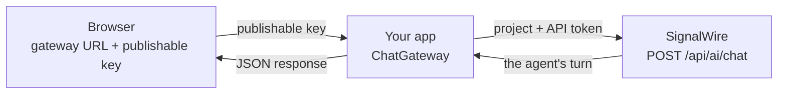

[chat-endpoint]: /docs/apis/rest/ai-chat/chat-methods
[error-codes]: /docs/apis/error-codes
[chat-client]: /docs/server-sdks/reference/python/agents/ai-chat-client
[chat-gateway]: /docs/server-sdks/reference/python/agents/chat-gateway
[gateway-router]: /docs/server-sdks/reference/python/agents/chat-gateway/router
[visible-messages]: /docs/server-sdks/reference/python/agents/chat-gateway/visible-messages
[client-create]: /docs/server-sdks/reference/python/agents/ai-chat-client/create-conversation
[client-chat]: /docs/server-sdks/reference/python/agents/ai-chat-client/chat
[client-log]: /docs/server-sdks/reference/python/agents/ai-chat-client/log
[client-end]: /docs/server-sdks/reference/python/agents/ai-chat-client/end
[swaig-webhook]: /docs/apis/rest/webhooks/ai-swaig-tool-webhook
[post-prompt-webhook]: /docs/apis/rest/webhooks/ai-post-prompt-callback
[tool-calling]: /docs/platform/ai/tool-calling
[ai-reference]: /docs/swml/reference/calling/ai
[api-scopes]: /docs/platform/your-signalwire-api-space
[messaging-chat]: /docs/platform/chat
[webhooks]: /docs/platform/webhooks
[messaging-swml]: /docs/swml/reference/messaging
[swml-reply]: /docs/swml/reference/messaging/reply
[inbound-message-webhook]: /docs/apis/rest/webhooks/inbound-message-webhook

The AI agents made on the Server SDK or with SWML can be accessed by a text conversation, in addition to voice conversations. This allows
an easier fallback in case voice is inconvenient, as well as programmatic access to the AI agents. AI chat happens over HTTP, with 
a chat gateway which allows you to use it securely from the browser.

<Note title="AI Chat is not related to the Chat API or the SWML messaging variant">
AI chat is the [`ai`][ai-reference] method or Server SDK agents reached over text instead of voice. 

The [Chat API][messaging-chat] is an unrelated messaging product. And it is not the messaging flavor of SWML either.
</Note>

## Pick the right product for AI chat

AI chat runs on a single HTTP endpoint. Neither SWML nor Relay reaches it — an agent written in
either is what you talk *to*, not what you talk *with* — so the only choice is how your code gets
there.

- The [AI chat REST API][chat-endpoint] is JSON-RPC 2.0 against `POST /api/ai/chat`, carrying your project API token. [`AIChatClient`][chat-client], in the Server SDKs, covers the same six methods in Python with typed methods and typed exceptions. Use either from a server you control.
- [`ChatGateway`][chat-gateway], also in the Server SDKs, mounts inside a web application you already host and forwards on a page's behalf. It holds the API token, the project, and the `config_url`; the page holds a URL and a publishable key that the gateway manages itself. This is the only option that is safe from a browser.
- A phone number sits on top of the REST API rather than beside it: someone texts your number, your webhook calls `chat`, and the agent texts back. Your server still holds the token.

A browser cannot use the REST API directly. Anything a page can read, a visitor can read, and an API
token in a page is a published API token.

## Make your first AI chat request

Hold a short text conversation with an agent you host, using nothing but HTTP.

<Steps>

### Save an agent as a hosted script resource

```json title="agent.swml.json"
{
  "version": "1.0.0",
  "sections": {
    "main": [
      { "answer": {} },
      {
        "ai": {
          "prompt": {
            "text": "You are Ada, the dispatcher for Bayview Taxi. Answer questions about booking a ride. Keep replies to one or two sentences."
          }
        }
      }
    ]
  }
}
```

Once saved, you will get a request URL like `<YOUR_SPACE>.signalwire.com/relay-bins/<YOUR_AGENT_ID>`.
On top of testing this agent by voice with the Click-to-Test button, you can also hold conversations with it over HTTP.

### Set your credentials

Replace these values in the requests below:

| Value | Replace with |
|---|---|
| `<YOUR_SPACE>` | Your Space's subdomain in `<YOUR_SPACE>.signalwire.com` |
| `<YOUR_PROJECT_ID>` | Your Project ID |
| `<YOUR_API_TOKEN>` | An API token with the `chat` scope |
| `<YOUR_AGENT_ID>` | The UUID in your hosted script resource's request URL |

Every method below is a POST to the same endpoint, authenticated with those credentials.

<EndpointRequestSnippet endpoint="POST /api/ai/chat" />

### Create the conversation

`create_conversation` opens the conversation against your agent and hands back its opening line.

<CodeBlocks>

```json title="JSON-RPC request"
{
  "jsonrpc": "2.0",
  "id": "req-1",
  "method": "create_conversation",
  "params": {
    "id": "chat-demo-1",
    "config_url": "https://<YOUR_SPACE>.signalwire.com/relay-bins/<YOUR_AGENT_ID>"
  }
}
```

```json title="JSON-RPC response"
{
  "jsonrpc": "2.0",
  "result": {
    "status": "created",
    "id": "chat-demo-1",
    "initial_message": "Hello! Welcome to Bayview Taxi. How can I assist you with booking a ride today?"
  },
  "id": "req-1"
}
```

</CodeBlocks>

### Send a turn

Every turn after that is the same request with `chat` as the method, and the reply comes back in
the same response.

<CodeBlocks>

```json title="JSON-RPC request"
{
  "jsonrpc": "2.0",
  "id": "req-2",
  "method": "chat",
  "params": {
    "id": "chat-demo-1",
    "message": "I need a ride to the airport."
  }
}
```

```json title="JSON-RPC response"
{
  "jsonrpc": "2.0",
  "result": {
    "response": "Sure! Which airport are you heading to, and what time do you need the ride?"
  },
  "id": "req-2"
}
```

</CodeBlocks>

</Steps>

This is all it takes to text with your AI agent. However, since this is directly over HTTP and uses your project API key, it can't be safely directly served on the browser without a proxy.

## How an AI chat conversation works

**Your agent** is the SWML document you serve. `config_url` is where you serve it.

**A conversation** is a series of turns, addressed by an `id` you choose. Ids are scoped to your
project.

**A turn** is one user message and the agent's reply, including any tool calls made along the way.
One request, one turn, one response — and it takes seconds, not milliseconds.

## Hold an AI chat conversation

The [AI chat endpoint reference][chat-endpoint] documents all six methods, their parameters, and
their error codes. In Python, [`AIChatClient`][chat-client] covers the same ground with typed
methods and typed exceptions.

### Hold an AI chat conversation from your server

<CodeBlocks>

```python title="Python — AIChatClient" {10,13}
import asyncio

from signalwire.ai_chat import AIChatClient

CONFIG_URL = "https://<YOUR_SPACE>.signalwire.com/relay-bins/<YOUR_AGENT_ID>"


async def main():
    async with AIChatClient(space="<YOUR_SPACE>") as client:
        info = await client.create_conversation("chat-demo-1", config_url=CONFIG_URL)
        print("Ada:", info.initial_message)

        reply = await client.chat("chat-demo-1", "I need a ride to the airport.")
        print("Ada:", reply.text)

        await client.end("chat-demo-1")


asyncio.run(main())
```

```json title="JSON-RPC request"
{
  "jsonrpc": "2.0",
  "id": "req-2",
  "method": "chat",
  "params": {
    "id": "chat-demo-1",
    "message": "I need a ride to the airport."
  }
}
```

```json title="JSON-RPC response"
{
  "jsonrpc": "2.0",
  "result": {
    "response": "Sure! Which airport are you heading to, and what time do you need the ride?"
  },
  "id": "req-2"
}
```

</CodeBlocks>

### Hold an AI chat conversation from a browser

[`ChatGateway`][chat-gateway] mounts on any FastAPI app, and allows for safe browser-side access.

```python title="server.py"
from signalwire.ai_chat import ChatGateway

gateway = ChatGateway(
    config_url=CONFIG_URL,                    # never leaves the server
    key=os.environ["SIGNALWIRE_CHAT_GATEWAY_KEY"],       # safe in the page
    secret=os.environ["SIGNALWIRE_CHAT_GATEWAY_SECRET"], # signs handles
    allowed_origins=["https://bayviewtaxi.example.com"],
)

app.include_router(gateway.router(), prefix="/chat")
```

### Hold an AI chat conversation from a phone number

We can use the Server SDK to create a messaging variant SWML which replies to text conversations using the AI agent.

```python title="sms.py"
@app.post("/sms")
async def sms(request: Request):
    message = (await request.json())["message"]

    reply = await client.chat(
        f"sms-{message['from']}", message["body"], config_url=CONFIG_URL
    )

    return {"version": "1.0.0", "sections": {"main": [{"reply": reply.text}]}}
```

### AI chat methods on the direct path

| Method | What it does | Worth knowing |
|---|---|---|
| [`create_conversation`][client-create] | Creates a conversation, or resets one with `reinit` | Returns `initial_message`, so the agent speaks first |
| [`chat`][client-chat] | Sends a message, returns the reply | Passing `config_url` here creates the conversation in one call, but you never get `initial_message` |
| [`chat_log`][client-log] | Reads the conversation back | Changes nothing |
| `summarize` | Summarizes on demand | One call per minute per conversation; over that returns `-32005` |
| [`end_conversation`][client-end] | Ends it and starts post-processing | Triggers the summary and your `post_prompt_url` |
| `delete` | Removes the conversation and its messages | Nothing is post-processed and no webhook fires |

Messages take a `role` of `user` or `system`. A `system` message steers the agent without appearing
as something the user said.

### The AI chat browser gateway

You run a **gateway**: [`ChatGateway`][chat-gateway] with the Server SDK, mounted inside a web application you already
host. It holds the API token, the project, and the `config_url`. The page holds a URL and a
publishable key that's managed by the gateway itself. The agent it points at is either a SWML
document you're hosting, or a Server SDK agent.



A key lifted from your page reaches one agent and can do nothing else. It cannot name a different
`config_url`, because the gateway injects that itself and never accepts it from the request.

One endpoint, [four methods][gateway-router]. The router adds a `POST /`, so with `prefix="/chat"`
the path is `/chat/`. The key is a bearer token that automatically gets sent.

| Method | Body | Returns |
|---|---|---|
| `start` | `{"method": "start"}` | `greeting`, `status`, `timeout`, plus an `X-Chat-Handle` header |
| `chat` | `{"method": "chat", "handle", "message"}` | the service's JSON-RPC envelope |
| `log` | `{"method": "log", "handle"}` | `messages`, `timeout`, `last_activity` |
| `end` | `{"method": "end", "handle"}` | `{"status": "ended"}` |

## Webhooks an AI chat conversation sends

A chat conversation delivers the same webhooks a voice AI session does.

**Tool calls** reach the `web_hook_url` on your SWAIG functions, exactly as they do on a call.
[Tool calling][tool-calling] covers the round trip, and the [AI SWAIG tool webhook][swaig-webhook]
documents the payload. Nothing about the reply shape changes for chat.

**A summary** reaches your `post_prompt_url` after the conversation ends, when your SWML sets one.
Not instantly — expect seconds. The [AI post-prompt callback][post-prompt-webhook] documents the
payload. General webhook handling is covered under [webhooks][webhooks].

{/* TODO(validate): confirm and then state the values that identify a chat session —
     `conversation_type` and what `call_id` carries. Those are what let one handler serve both. */}

<Warning title="Transcripts can contain your system prompt">
`chat_log` and the post-prompt `call_log` can include your prompt and other non-dialogue entries.
Filter to `user` and `assistant` before showing either to anyone. The gateway's `log` already does.
</Warning>

## Next steps

<CardGroup cols={2}>

<Card title="AI chat endpoint" href="/docs/apis/rest/ai-chat/chat-methods" icon="regular rectangle-api">
  Every method, parameter, return field, and error code on the wire.
</Card>

<Card title="AIChatClient" href="/docs/server-sdks/reference/python/agents/ai-chat-client" icon="brands python">
  The Python client for the direct path, with every method and return type.
</Card>

<Card title="ChatGateway" href="/docs/server-sdks/reference/python/agents/chat-gateway" icon="regular globe">
  The browser-facing gateway, with every argument, default, and cap.
</Card>

<Card title="Tool calling" href="/docs/platform/ai/tool-calling" icon="regular webhook">
  Connect the agent to your systems, the same way a voice agent does.
</Card>

<Card title="Prompt engineering" href="/docs/platform/ai/prompt-engineering" icon="regular pen-ruler">
  Shape how the agent converses before you change any code.
</Card>

<Card title="ai method reference" href="/docs/swml/reference/calling/ai" icon="regular book">
  The SWML the agent is built from, shared with voice.
</Card>

</CardGroup>
