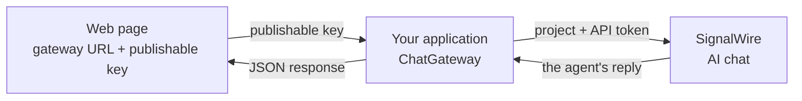

[chat-endpoint]: /docs/apis/rest/ai-chat/chat-methods
[chat-client]: /docs/server-sdks/reference/python/agents/ai-chat-client
[chat-gateway]: /docs/server-sdks/reference/python/agents/chat-gateway
[gateway-router]: /docs/server-sdks/reference/python/agents/chat-gateway/router
[client-create]: /docs/server-sdks/reference/python/agents/ai-chat-client/create-conversation
[client-chat]: /docs/server-sdks/reference/python/agents/ai-chat-client/chat
[client-log]: /docs/server-sdks/reference/python/agents/ai-chat-client/log
[client-end]: /docs/server-sdks/reference/python/agents/ai-chat-client/end
[swaig-webhook]: /docs/apis/rest/webhooks/ai-swaig-tool-webhook
[post-prompt-webhook]: /docs/apis/rest/webhooks/ai-post-prompt-callback
[inbound-message-webhook]: /docs/apis/rest/webhooks/inbound-message-webhook
[create-swml-script]: /docs/apis/rest/swml-scripts/create-swml-script
[tool-calling]: /docs/platform/ai/tool-calling
[ai-reference]: /docs/swml/reference/calling/ai
[api-credentials]: /docs/platform/your-signalwire-api-space
[resources]: /docs/platform/resources
[phone-numbers]: /docs/platform/phone-numbers
[messaging-chat]: /docs/platform/chat
[webhooks]: /docs/platform/webhooks
[swml-reply]: /docs/swml/reference/messaging/reply
[error-codes]: /docs/apis/error-codes
[handoff-router]: /docs/server-sdks/reference/python/agents/handoff-router

An AI agent you built for voice can also hold a text conversation. Each turn is one HTTP request:
you send the user's message, and the agent's reply comes back in the response. Start by sending two
requests to an agent saved in your Space, then hold conversations from your server, from a web page,
and from a phone number.

<Note title="AI chat is not the Chat API">
AI chat is the [`ai`][ai-reference] method, or a Server SDKs agent, reached over text instead of voice.
The [Chat API][messaging-chat] is a separate messaging product.
</Note>

## Pick the right product for AI chat

| Function | REST | Server SDKs | Browser SDK |
|---|---|---|---|
| Hold a text conversation with your agent from your server | <Icon icon="regular circle-check" color="var(--status-success)" /> | <Icon icon="regular circle-check" color="var(--status-success)" /> | <Icon icon="regular circle-xmark" color="var(--status-error)" /> |
| Let a web page chat with your agent without exposing your API token | <Icon icon="regular circle-xmark" color="var(--status-error)" /> | <Icon icon="regular circle-check" color="var(--status-success)" /> | <Icon icon="regular circle-xmark" color="var(--status-error)" /> |
| Answer text messages to your phone number with the agent | <Icon icon="regular circle-check" color="var(--status-success)" /> | <Icon icon="regular circle-check" color="var(--status-success)" /> | <Icon icon="regular circle-xmark" color="var(--status-error)" /> |
| Read a conversation back, summarize it, or end it | <Icon icon="regular circle-check" color="var(--status-success)" /> | <Icon icon="regular circle-check" color="var(--status-success)" /> | <Icon icon="regular circle-xmark" color="var(--status-error)" /> |

- The [AI chat REST API][chat-endpoint] is JSON-RPC 2.0 over `POST /api/ai/chat`, authenticated with
  your project's API token, so any language with an HTTP client can use it from a server.
- The [Server SDKs][chat-client] add [`AIChatClient`][chat-client] for your server and
  [`ChatGateway`][chat-gateway], which lets a web page chat while your server keeps the API token.
  Both are Python only.
- The Browser SDK has no AI chat support. A web page chats through `ChatGateway` instead.

## Prepare for AI chat

Have these values ready:

- Your Space URL, such as `<YOUR_SPACE>.signalwire.com`.
- Your Project ID and an API token from the Dashboard's [API credentials][api-credentials] page,
  with the token's **Chat** permission enabled.
- An agent: a SWML document with an [`ai`][ai-reference] method, served at a URL SignalWire can
  fetch from the public internet. The first run below saves
  one in your Space.
- For text messages, a messaging-capable [phone number][phone-numbers] in your Space.
- For tool calls, summaries, text messages, and the web page gateway, a publicly reachable HTTPS URL
  for your application.

<Warning title="Never put your API token in a web page">
Anything a page can read, a visitor can read. An API token in page code is a published API token,
so a web page reaches AI chat only through [`ChatGateway`](#hold-an-ai-chat-conversation-from-a-web-page)
on your server.
</Warning>

## Hold your first AI chat conversation

Hold a short text conversation with an agent saved in your Space, using nothing but HTTP.

<Steps>

### Set your credentials

Replace these values in the code sample you choose:

| Value | Replace with |
|---|---|
| `<YOUR_SPACE>` | Your Space's subdomain in `<YOUR_SPACE>.signalwire.com` |
| `<YOUR_PROJECT_ID>` | Your Project ID |
| `<YOUR_API_TOKEN>` | An API token with the **Chat** permission |
| `<YOUR_AGENT_ID>` | The ID at the end of your agent's request URL, `https://<YOUR_SPACE>.signalwire.com/relay-bins/<YOUR_AGENT_ID>` |
| `<YOUR_GATEWAY_KEY>` | A publishable key you choose for your web page, such as `pk_bayview_web` |
| `<YOUR_GATEWAY_SECRET>` | A long random string your gateway signs conversation handles with |
| `<YOUR_SITE_ORIGIN>` | The origin your chat page is served from, such as `https://bayviewtaxi.example.com` |
| `<YOUR_TOOL_WEBHOOK_URL>` | The HTTPS URL that receives your agent's tool calls |
| `<YOUR_POST_PROMPT_URL>` | The HTTPS URL that receives the conversation summary |

### Save an agent as a hosted SWML script

Save this document as a SWML Script [resource][resources] in your Space's Dashboard, or with the
[REST API][create-swml-script]. Its request URL, ending in `/relay-bins/<YOUR_AGENT_ID>`, is the
address AI chat fetches your agent from. The same resource also answers voice calls.

<CodeBlocks>

```json title="JSON"
{
  "version": "1.0.0",
  "sections": {
    "main": [
      { "answer": {} },
      {
        "ai": {
          "prompt": {
            "text": "You are Ada, the dispatcher for Bayview Taxi. Answer questions about booking a ride. Keep replies to one or two sentences."
          }
        }
      }
    ]
  }
}
```

```bash title="cURL — REST API"
curl -X POST "https://<YOUR_SPACE>.signalwire.com/api/fabric/resources/swml_scripts" \
  -u "<YOUR_PROJECT_ID>:<YOUR_API_TOKEN>" \
  -H "Content-Type: application/json" \
  -d '{
    "name": "bayview-ada",
    "contents": "{\"version\": \"1.0.0\", \"sections\": {\"main\": [{\"answer\": {}}, {\"ai\": {\"prompt\": {\"text\": \"You are Ada, the dispatcher for Bayview Taxi. Answer questions about booking a ride. Keep replies to one or two sentences.\"}}}]}}"
  }'
```

</CodeBlocks>

The REST response carries the request URL in `swml_script.request_url`.

### Create the conversation

`create_conversation` opens a conversation with your agent under an ID you choose, and returns the
agent's opening line.

<CodeBlocks>

```bash title="cURL — AI Chat API"
curl -X POST "https://<YOUR_SPACE>.signalwire.com/api/ai/chat" \
  -u "<YOUR_PROJECT_ID>:<YOUR_API_TOKEN>" \
  -H "Content-Type: application/json" \
  -d '{
    "jsonrpc": "2.0",
    "id": "req-1",
    "method": "create_conversation",
    "params": {
      "id": "chat-demo-1",
      "config_url": "https://<YOUR_SPACE>.signalwire.com/relay-bins/<YOUR_AGENT_ID>"
    }
  }'
```

```json title="Response"
{
  "jsonrpc": "2.0",
  "result": {
    "status": "created",
    "id": "chat-demo-1",
    "initial_message": "Hello! Welcome to Bayview Taxi. How can I assist you with booking a ride today?"
  },
  "id": "req-1"
}
```

</CodeBlocks>

### Send a message

Every turn after that is a `chat` request with the same conversation ID. The agent's reply comes
back in the same response.

<CodeBlocks>

```bash title="cURL — AI Chat API"
curl -X POST "https://<YOUR_SPACE>.signalwire.com/api/ai/chat" \
  -u "<YOUR_PROJECT_ID>:<YOUR_API_TOKEN>" \
  -H "Content-Type: application/json" \
  -d '{
    "jsonrpc": "2.0",
    "id": "req-2",
    "method": "chat",
    "params": {
      "id": "chat-demo-1",
      "message": "I need a ride to the airport."
    }
  }'
```

```json title="Response"
{
  "jsonrpc": "2.0",
  "result": {
    "response": "Sure! Which airport are you heading to, and what time do you need the ride?"
  },
  "id": "req-2"
}
```

</CodeBlocks>

### Read the reply

A working turn returns the agent's reply in `result.response`, usually within a few seconds. Check
the HTTP status first. An HTTP `401 Unauthorized` means the credentials are wrong or the token lacks
the **Chat** permission, and an HTTP `400` with an HTML body means the request wasn't valid JSON.

Errors from AI chat itself arrive with HTTP `200` and an `error` object in place of `result`:

- `-32001`, `Conversation not found`: the ID doesn't match a live conversation. Check its spelling,
  or create the conversation again if it ended or sat idle past its timeout.
- `-32002`, `Configuration error`: SignalWire couldn't fetch your agent from `config_url`. Check the
  agent ID at the end of the URL.

The [error codes][error-codes] page lists the AI chat codes.

</Steps>

## How an AI chat conversation works

Your agent is the SWML document at `config_url`. A conversation is a series of turns under an ID you
choose, and IDs are scoped to your project. A turn is one user message and the agent's reply,
including any tool calls the agent makes along the way.

A conversation ID keeps only letters, digits, `_`, `-`, `.`, and `:`. Any other character is dropped
without an error, so `rider~2` is stored as `rider2`; use `.` when you compose IDs. A conversation
ends when you end or delete it, or after it sits idle past its `conversation_timeout`, 3600 seconds
unless you set one on `create_conversation`. An ended conversation can't be reopened: a later `chat`
that passes `config_url` under the same ID starts a new conversation with no memory of the old one.

## Hold an AI chat conversation

The [AI chat REST API reference][chat-endpoint] documents every method, parameter, and error code.

### Hold an AI chat conversation via REST

Read the conversation back with `chat_log`, then end it with `end_conversation`. Ending starts
post-processing, such as the summary sent to your `post_prompt_url`.

<CodeBlocks>

```bash title="cURL — AI Chat API"
curl -X POST "https://<YOUR_SPACE>.signalwire.com/api/ai/chat" \
  -u "<YOUR_PROJECT_ID>:<YOUR_API_TOKEN>" \
  -H "Content-Type: application/json" \
  -d '{
    "jsonrpc": "2.0",
    "id": "req-3",
    "method": "chat_log",
    "params": { "id": "chat-demo-1" }
  }'

curl -X POST "https://<YOUR_SPACE>.signalwire.com/api/ai/chat" \
  -u "<YOUR_PROJECT_ID>:<YOUR_API_TOKEN>" \
  -H "Content-Type: application/json" \
  -d '{
    "jsonrpc": "2.0",
    "id": "req-4",
    "method": "end_conversation",
    "params": { "id": "chat-demo-1" }
  }'
```

</CodeBlocks>

`chat_log` returns every entry in `result.chat_log`, and `end_conversation` returns
`{"status": "ended"}`.

### Hold an AI chat conversation via the Server SDKs

[`AIChatClient`][chat-client] sends the same methods from Python and raises typed exceptions, all
subclasses of `AIChatError`: `ConversationNotFoundError` for `-32001`, `RateLimitError`,
`ChatInProgressError` when a turn is already running on the conversation, `AuthenticationError`,
and `SummaryError` when `summarize` fails. Any other code raises `AIChatError` itself.

```python title="Python — AIChatClient"
# Install: python -m pip install signalwire-sdk==3.4.1
# Save as chat_client.py and run: python chat_client.py
import asyncio

from signalwire.ai_chat import AIChatClient

CONFIG_URL = "https://<YOUR_SPACE>.signalwire.com/relay-bins/<YOUR_AGENT_ID>"


async def main():
    async with AIChatClient(
        project="<YOUR_PROJECT_ID>", token="<YOUR_API_TOKEN>", space="<YOUR_SPACE>"
    ) as client:
        info = await client.create_conversation("chat-demo-2", config_url=CONFIG_URL)
        print("Ada:", info.initial_message)

        reply = await client.chat("chat-demo-2", "I need a ride to the airport.")
        print("Ada:", reply.text)

        log = await client.log("chat-demo-2")
        for entry in log.messages:
            if entry.get("role") in ("user", "assistant"):
                print(f"{entry['role']}: {entry['content']}")

        await client.end("chat-demo-2")


asyncio.run(main())
```

### Hold an AI chat conversation from a web page

[`ChatGateway`][chat-gateway] runs inside your web application and forwards a page's messages to AI
chat. Your server holds the API token and the `config_url`. The page holds only the gateway's URL
and a publishable key, which can reach this one agent and nothing else, because the gateway injects
`config_url` itself and never accepts it from the page.

The server below serves the chat page and mounts the gateway at `/chat/`. Localhost is always
allowed, so it runs locally unconfigured; list your production origin in `allowed_origins`.

<CodeBlocks>

```python title="Python — ChatGateway"
# Install: python -m pip install signalwire-sdk==3.4.1
# Save as chat_gateway.py next to index.html and run: python chat_gateway.py
# Then open http://localhost:3000
import uvicorn
from fastapi import FastAPI
from fastapi.responses import FileResponse
from signalwire.ai_chat import AIChatClient, ChatGateway

gateway = ChatGateway(
    config_url="https://<YOUR_SPACE>.signalwire.com/relay-bins/<YOUR_AGENT_ID>",
    key="<YOUR_GATEWAY_KEY>",
    secret="<YOUR_GATEWAY_SECRET>",
    allowed_origins=["<YOUR_SITE_ORIGIN>"],
    client=AIChatClient(
        project="<YOUR_PROJECT_ID>", token="<YOUR_API_TOKEN>", space="<YOUR_SPACE>"
    ),
)

app = FastAPI()
app.include_router(gateway.router(), prefix="/chat")


@app.get("/")
async def page():
    return FileResponse("index.html")


if __name__ == "__main__":
    uvicorn.run(app, host="0.0.0.0", port=3000)
```

```html title="HTML — index.html"
<!doctype html>
<meta charset="utf-8">
<title>Bayview Taxi</title>
<div id="log"></div>
<form id="form"><input id="message" autocomplete="off"><button>Send</button></form>
<script type="module">
const GATEWAY_URL = "/chat/";
const GATEWAY_KEY = "<YOUR_GATEWAY_KEY>";
let handle = null;

async function send(body) {
  const res = await fetch(GATEWAY_URL, {
    method: "POST",
    headers: { Authorization: `Bearer ${GATEWAY_KEY}`, "Content-Type": "application/json" },
    body: JSON.stringify({ ...body, handle }),
  });
  handle = res.headers.get("X-Chat-Handle") ?? handle;
  return res.json();
}

function show(who, text) {
  const line = document.createElement("p");
  line.textContent = `${who}: ${text}`;
  document.getElementById("log").append(line);
}

const start = await send({ method: "start" });
show("Ada", start.greeting);

document.getElementById("form").addEventListener("submit", async (event) => {
  event.preventDefault();
  const input = document.getElementById("message");
  const text = input.value;
  input.value = "";
  show("You", text);
  const reply = await send({ method: "chat", message: text });
  show("Ada", reply.result?.response ?? reply.error?.message);
});
</script>
```

</CodeBlocks>

The gateway takes four methods on one endpoint, each a `POST` with the key as a bearer token. The
first `start` or `chat` returns a signed conversation handle in the `X-Chat-Handle` response header,
and every later request sends it back as `handle`. See the [gateway router reference][gateway-router].

| Method | Body | Returns |
|---|---|---|
| `start` | `{"method": "start"}` | `greeting`, `status`, and `timeout`, plus the `X-Chat-Handle` header |
| `chat` | `{"method": "chat", "handle", "message"}` | The AI chat JSON-RPC response |
| `log` | `{"method": "log", "handle"}` | `messages`, reduced to `user` and `assistant` entries, with `timeout` and `last_activity` |
| `end` | `{"method": "end", "handle"}` | `{"status": "ended"}` |

A key copied from your page lets someone talk to your agent, and every turn is billed to your
project. The origin allowlist stops the key working in someone else's page, but not in a script,
which can leave out the `Origin` header. The gateway caps new conversations at 60 a minute and turns
at 200 per conversation by default; lower them with `max_new_conversations` and `max_turns`.


```mermaid
flowchart LR
    Browser["Web page<br/>gateway URL + publishable key"]
    Gateway["Your application<br/>ChatGateway"]
    SW["SignalWire<br/>AI chat"]

    Browser -->|"publishable key"| Gateway
    Gateway -->|"project + API token"| SW
    SW -->|"the agent's reply"| Gateway
    Gateway -->|"JSON response"| Browser
```

To move a web chat onto a phone call and back, mount [`HandoffRouter`][handoff-router] beside the
gateway at the same prefix. It adds `/handoff`, `/escalate`, and `/say` routes, and waits for your
code to record each leg of the conversation before the next one starts.

### Hold an AI chat conversation from a phone number

Answer text messages to your number with the agent. When a message arrives, SignalWire posts the
[inbound message webhook][inbound-message-webhook] to your server, which sends the text to AI chat and
returns a messaging SWML document whose [`reply`][swml-reply] carries the agent's answer.

```python title="Python — AIChatClient"
# Install: python -m pip install signalwire-sdk==3.4.1
# Save as chat_sms.py and run: python chat_sms.py
import uvicorn
from fastapi import FastAPI, Request
from signalwire.ai_chat import AIChatClient

CONFIG_URL = "https://<YOUR_SPACE>.signalwire.com/relay-bins/<YOUR_AGENT_ID>"

client = AIChatClient(project="<YOUR_PROJECT_ID>", token="<YOUR_API_TOKEN>", space="<YOUR_SPACE>")
app = FastAPI()


@app.post("/sms")
async def sms(request: Request):
    message = (await request.json())["message"]
    conversation_id = "sms." + message["from"].lstrip("+")
    reply = await client.chat(conversation_id, message["body"], config_url=CONFIG_URL)
    return {"version": "1.0.0", "sections": {"main": [{"reply": reply.text}]}}


if __name__ == "__main__":
    uvicorn.run(app, host="0.0.0.0", port=3000)
```

Point your number's messaging handler at `https://<your-app>/sms` as a SWML webhook in the
[phone number's settings][phone-numbers]. Passing `config_url` on `chat` creates the conversation on
the first message from a sender and continues it after that, keyed on the sender's number.

## AI chat methods: create, chat, read, summarize, end, and delete

| Method | What it does | Worth knowing |
|---|---|---|
| [`create_conversation`][client-create] | Creates a conversation | Returns `initial_message`, so the agent speaks first. On an ID that is already live it returns `status: "exists"` and no greeting; pass `reinit: true` to start it over |
| [`chat`][client-chat] | Sends a message and returns the reply | With `config_url`, it creates the conversation if needed, but you never get `initial_message` |
| [`chat_log`][client-log] | Reads the conversation back | Changes nothing |
| `summarize` | Summarizes the conversation on demand | Takes an optional `summary_prompt` |
| [`end_conversation`][client-end] | Ends the conversation and starts post-processing | Triggers the summary to your `post_prompt_url` |
| `delete` | Removes the conversation and its messages | Nothing is post-processed and no webhook fires |

Messages take a `role` of `user` or `system`. A `system` message steers the agent without appearing
as something the user said.

## Receive tool calls and summaries from an AI chat conversation

A chat conversation sends the same webhooks as a voice AI session. Tool calls reach the
`web_hook_url` on your SWAIG functions, and the summary reaches your `post_prompt_url` a few seconds
after the conversation ends. [Tool calling][tool-calling] covers the round trip, and [webhooks][webhooks]
covers handling them in general.

```json title="JSON"
{
  "version": "1.0.0",
  "sections": {
    "main": [
      { "answer": {} },
      {
        "ai": {
          "prompt": {
            "text": "You are Ada, the dispatcher for Bayview Taxi. When the rider gives a pickup address and time, call book_ride. Keep replies to one or two sentences."
          },
          "post_prompt": { "text": "Summarize the booking in one sentence." },
          "post_prompt_url": "<YOUR_POST_PROMPT_URL>",
          "SWAIG": {
            "functions": [
              {
                "function": "book_ride",
                "description": "Book a taxi ride",
                "parameters": {
                  "type": "object",
                  "properties": {
                    "pickup": { "type": "string", "description": "Pickup address" },
                    "time": { "type": "string", "description": "Pickup time" }
                  }
                },
                "web_hook_url": "<YOUR_TOOL_WEBHOOK_URL>"
              }
            ]
          }
        }
      }
    ]
  }
}
```

Both webhooks identify a chat, so one handler can serve voice and text. SignalWire also appends
`conversation_id` and `conversation_type` to the tool webhook's query string.

| Field | [Tool webhook][swaig-webhook] | [Post-prompt callback][post-prompt-webhook] |
|---|---|---|
| `conversation_type` | `chat` | `chat` |
| `conversation_id` | Your conversation ID | Your conversation ID |
| `call_id` | Your conversation ID | A separate UUID |

The summary arrives in `post_prompt_data.raw`.

<Warning title="Transcripts contain your system prompt">
`chat_log` and the post-prompt `call_log` include your prompt, `system` messages, and tool entries
alongside the dialogue. Filter to `user` and `assistant` before showing either to anyone. The
gateway's `log` already does.
</Warning>

## Next steps

<CardGroup cols={2}>

<Card title="AI chat REST API" href="/docs/apis/rest/ai-chat/chat-methods" icon="regular rectangle-api">
  Every method, parameter, return field, and error code.
</Card>

<Card title="AIChatClient" href="/docs/server-sdks/reference/python/agents/ai-chat-client" icon="brands python">
  The Python client, with every method and return type.
</Card>

<Card title="ChatGateway" href="/docs/server-sdks/reference/python/agents/chat-gateway" icon="regular globe">
  The web page gateway, with every argument, default, and cap.
</Card>

<Card title="Tool calling" href="/docs/platform/ai/tool-calling" icon="regular webhook">
  Connect the agent to your systems, the same way a voice agent does.
</Card>

<Card title="Prompt engineering" href="/docs/platform/ai/prompt-engineering" icon="regular pen-ruler">
  Shape how the agent converses before you change any code.
</Card>

<Card title="ai method reference" href="/docs/swml/reference/calling/ai" icon="regular book">
  The SWML the agent is built from, shared with voice.
</Card>

</CardGroup>
