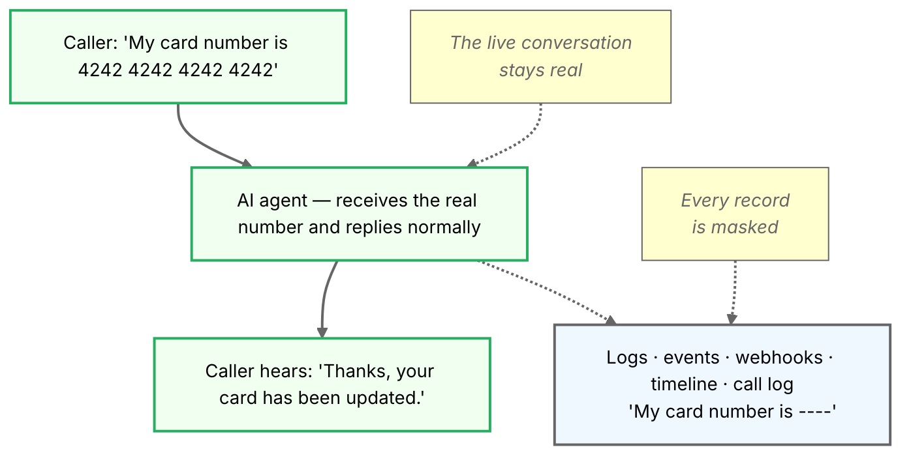

[ai-params]: /docs/swml/reference/calling/ai/params
[redact-prompt]: /docs/swml/reference/calling/ai/params#paramsredact_prompt
[auto-correct]: /docs/swml/reference/calling/ai/params#paramsauto_correct
[utility-model]: /docs/swml/reference/calling/ai/params#paramsutility_model
[text-normalization]: /docs/swml/reference/calling/ai/params#text-normalization-values
[prompt-engineering]: /docs/platform/ai/prompt-engineering
[hipaa]: /docs/platform/compliance/hipaa

AI agents routinely handle sensitive information — payment details, social security numbers,
account credentials, names and addresses. Content redaction masks that information in
everything SignalWire records or transmits about the call: logs, events, webhook payloads,
the call timeline, and the post-conversation call log.

The conversation itself is untouched. The caller hears the agent normally, and the agent
understands the caller perfectly — only the records change.



## Enable redaction

Turn redaction on with a single parameter, [`redact_prompt`][redact-prompt], in the `ai`
method's `params` block:

<CodeBlocks>
<CodeBlock title="YAML">
```yaml
version: 1.0.0
sections:
  main:
    - answer: {}
    - ai:
        prompt:
          text: You are a payments support agent. Help callers update their billing details.
        params:
          redact_prompt: credit card numbers, CVVs, social security numbers, and full names
```
</CodeBlock>
<CodeBlock title="JSON">
```json
{
  "version": "1.0.0",
  "sections": {
    "main": [
      { "answer": {} },
      {
        "ai": {
          "prompt": {
            "text": "You are a payments support agent. Help callers update their billing details."
          },
          "params": {
            "redact_prompt": "credit card numbers, CVVs, social security numbers, and full names"
          }
        }
      }
    ]
  }
}
```
</CodeBlock>
</CodeBlocks>

The value of `redact_prompt` does two jobs: it switches redaction on, and it describes — in
plain language — what counts as sensitive. Anything matching that description is replaced with
`----` wherever the call is recorded or transmitted.

<Warning>
Redaction protects what the platform **records and transmits** — not what the AI processes.
The agent still receives the caller's real words on every turn (that's what keeps the
conversation working), and the caller always hears the agent's responses in full. If your
requirement is to keep sensitive data from reaching the AI model itself, redaction does not
do that.
</Warning>

## How it works

Redaction covers both sides of the conversation. Your `redact_prompt` description guides the
agent to treat matching content as sensitive whenever it speaks — the first time it says it,
when it repeats it back, when it confirms it. What the caller says is masked separately,
before it is stored or delivered. In both cases the real words still flow through the live
conversation; only the records change.

With redaction on, here is what each surface shows:

| Surface | What appears |
|---|---|
| Audio the caller hears | The real content, spoken in full |
| Text the AI model receives | The real content, every turn |
| AI events and webhook payloads (including SWAIG and debug webhooks) | Masked — `----` |
| Call timeline and stored conversation transcript | Masked — `----` |
| Post-conversation `call_log` and `raw_call_log` | Masked — `----` |

Redaction is performed by AI, not by a fixed pattern-matcher. It errs on the side of masking
too much rather than too little, but it can occasionally miss — treat it as a strong safeguard
for your logs and integrations rather than an absolute guarantee.

## Keep it fast

Redaction runs as a lightweight background task while the caller is waiting for a response.
Two companion parameters keep that work quick.

[`utility_model`][utility-model] selects the model used for background tasks like redaction
and transcription cleanup. It defaults to the agent's main model, which is usually larger and
slower than these tasks need.

<Tip>
Set `utility_model` to a small, fast model — `gpt-4o-mini`, `gpt-4.1-mini`, or
`gpt-4.1-nano` — so background passes don't add noticeable latency to the agent's responses.
</Tip>

[`auto_correct`][auto-correct] cleans up the transcription of the caller's speech —
converting spoken numbers to digits, formatting addresses and phone numbers, and fixing
obvious mishearings. When used alongside `redact_prompt`, cleanup and redaction happen
together in a single step instead of two.

<Note>
`auto_correct` only takes effect when [`enable_text_normalization`][text-normalization] —
which is on by default — is set to `false`. The example below includes both settings.
</Note>

A complete configuration:

<CodeBlocks>
<CodeBlock title="YAML">
```yaml
version: 1.0.0
sections:
  main:
    - answer: {}
    - ai:
        prompt:
          text: You are a payments support agent. Help callers update their billing details.
        params:
          redact_prompt: credit card numbers, CVVs, social security numbers, and full names
          utility_model: gpt-4o-mini
          auto_correct: true
          enable_text_normalization: false
```
</CodeBlock>
<CodeBlock title="JSON">
```json
{
  "version": "1.0.0",
  "sections": {
    "main": [
      { "answer": {} },
      {
        "ai": {
          "prompt": {
            "text": "You are a payments support agent. Help callers update their billing details."
          },
          "params": {
            "redact_prompt": "credit card numbers, CVVs, social security numbers, and full names",
            "utility_model": "gpt-4o-mini",
            "auto_correct": true,
            "enable_text_normalization": false
          }
        }
      }
    ]
  }
}
```
</CodeBlock>
</CodeBlocks>

## Verify redaction

<Steps>

#### Place a test call

Call your agent and read out a fake card number — for example, `4242 4242 4242 4242` — and
ask the agent to repeat it back to confirm.

#### Check the call records

Open the call in your Dashboard and review the timeline and logs. Everywhere the number was
said — by you or by the agent — should read `----`.

#### Check your webhook payloads

If your application receives SWAIG function calls, debug webhooks, or the post-conversation
call log, confirm the sensitive values arrive masked there too.

#### Sharpen the description if something leaks

If one category keeps slipping through, name it explicitly in `redact_prompt` — for example,
"including partial card numbers read back one digit at a time".

</Steps>

## Limitations

- **It is not model-input privacy.** The AI model receives the real text every turn.
  Redaction keeps sensitive data out of your logs, webhooks, and call records — keeping it
  away from the model is a different requirement that redaction does not satisfy.
- **It is best-effort.** Redaction is AI-driven and biased toward over-masking, but a value
  can occasionally slip through. Sharpen the `redact_prompt` description if a category leaks.
- **It adds a small amount of background work per turn.** Point `utility_model` at a small,
  fast model, and enable `auto_correct` to fold cleanup and redaction into one step.
- **It applies to text records, not audio.** The caller hears everything in full, and if you
  record calls, the recording still contains the real spoken audio.

## Next steps

<CardGroup cols={3}>
  <Card title="ai.params reference" href="/docs/swml/reference/calling/ai/params">
    Full details for `redact_prompt`, `auto_correct`, and `utility_model`.
  </Card>
  <Card title="Prompt engineering" href="/docs/platform/ai/prompt-engineering">
    Write prompts that keep your agent reliable in real conversations.
  </Card>
  <Card title="HIPAA compliance" href="/docs/platform/compliance/hipaa">
    Build agents that handle protected health information.
  </Card>
</CardGroup>
