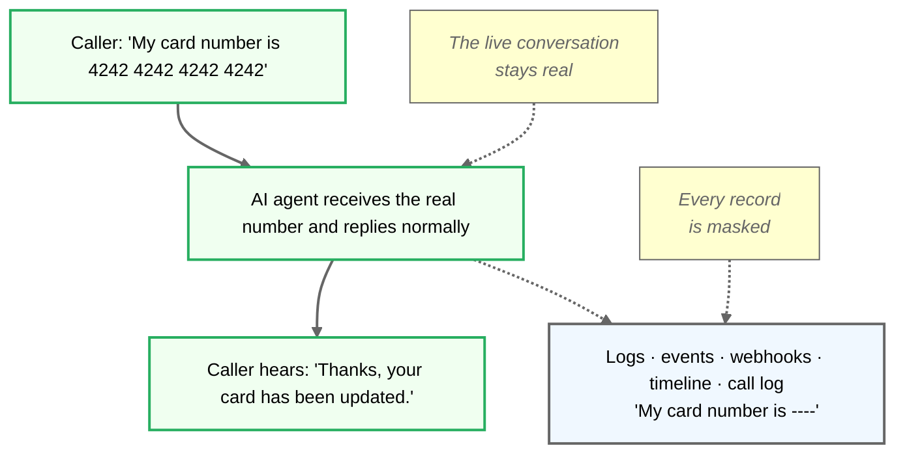

[redact-prompt]: /docs/swml/reference/calling/ai/params#paramsredact_prompt
[auto-correct]: /docs/swml/reference/calling/ai/params#paramsauto_correct
[utility-model]: /docs/swml/reference/calling/ai/params#paramsutility_model
[text-normalization]: /docs/swml/reference/calling/ai/params#text-normalization-values
[tool-calling]: /docs/platform/ai/tool-calling
[set-meta-data]: /docs/swml/guides/set-meta-data
[pay-reference]: /docs/swml/reference/calling/pay
[prompt-method]: /docs/swml/reference/calling/prompt
[request-method]: /docs/swml/reference/calling/request
[state-management]: /docs/server-sdks/guides/state-management

Bayview Taxi's dispatcher agent quotes fares, books rides, and takes payment for them.
Only one of those three needs a card number, and the agent doesn't have to be the thing that hears it.

That is the shape of most sensitive-content problems on a voice call. A value has to reach *something*
during the conversation, but it rarely has to reach the language model. The platform gives you ways to
collect it, speak it, and remember it while the model stays out of the loop, and content redaction for
the cases where it genuinely can't.

## Decide what the agent needs to know

Before reaching for redaction, ask what the agent actually has to do with the value.
Usually it needs an outcome, not the value itself.
The dispatcher doesn't need the card number; it needs to know whether the payment went through.
It doesn't need the caller's full account number; it needs to know whether the account is valid.

| What you need | Where to do it | Does the model see the value? |
|---|---|---|
| Take a card payment | The [`pay`](#take-a-payment) method | No |
| Collect digits, such as an account number or PIN | A [`prompt`](#collect-digits) inside a `SWML` action | No, unless you put them in the reply |
| Read a value back to the caller | A [`SWML` action](#speak-a-value) with its own text-to-speech | No |
| Carry a verified value between functions | [`meta_data`](#remember-a-value) | No |
| Reason about the value in conversation | The conversation, plus [redaction](#redact-conversation-records) | Yes |

Only the last row is a redaction problem. The rest are design choices.

## Perform actions outside the agent's context

The first four rows all work the same way. A SWAIG function returns an action, the platform carries out
that action on the call, and the sensitive value moves between the caller, a SWML method, and your
server without passing through the model. What the agent gets back is whatever outcome you choose to
report.

### Take a payment

The [`pay`][pay-reference] method collects card details over DTMF, validates them, and hands them to
your payment connector. The digits are keypad tones, so they are never spoken, never transcribed, and
never enter the conversation. Your agent triggers it from a SWAIG function and learns only what you
choose to tell it afterward.

<CodeBlocks>
<CodeBlock title="Server SDK (Python)">
```python
def charge_fare(self, args, raw_data):
    fare = raw_data.get("global_data", {}).get("fare")

    return (
        FunctionResult("Starting the payment now.")
        .pay(
            payment_connector_url="https://example.com/payment",
            charge_amount=f"{fare:.2f}",
            description="Bayview Taxi fare",
            security_code=True,
            postal_code=True,
            ai_response=(
                "The payment result was ${pay_result}. Tell the caller the outcome "
                "and, if it succeeded, confirm the pickup."
            ),
        )
    )
```
</CodeBlock>
<CodeBlock title="SWML">
```json
{
  "response": "Starting the payment now.",
  "action": [
    {
      "SWML": {
        "version": "1.0.0",
        "sections": {
          "main": [
            {
              "set": {
                "ai_response": "The payment result was ${pay_result}. Tell the caller the outcome and, if it succeeded, confirm the pickup."
              }
            },
            {
              "pay": {
                "payment_connector_url": "https://example.com/payment",
                "charge_amount": "38.60",
                "description": "Bayview Taxi fare",
                "security_code": true,
                "postal_code": true
              }
            }
          ]
        }
      }
    }
  ]
}
```
</CodeBlock>
</CodeBlocks>

The `ai_response` variable is the whole control surface here. When the payment finishes, whatever you
set it to is handed back to the agent as its next piece of context, and nothing else from the payment
flow is. Write a status into it and the agent knows the status. Write `${pay_result}` and it knows the
result code. There is no field you could set that would leak the card number unless you put it there
yourself.

<Tip>
The Server SDK's `pay()` sets a sensible `ai_response` for you, describing the result and telling the
agent not to discuss the collection itself. Override it when you want the agent to say something
specific about what happens next.
</Tip>

### Collect digits

The same pattern works for anything a caller can type: an account number, a PIN, a policy number, the
last four digits of a card. The [`prompt`][prompt-method] method plays a message and collects DTMF
digits into `prompt_value`, and [`request`][request-method] posts them to your server.

<CodeBlocks>
<CodeBlock title="Server SDK (Python)">
```python
def verify_account(self, args, raw_data):
    swml = {
        "version": "1.0.0",
        "sections": {
            "main": [
                {
                    "prompt": {
                        "play": "say:Please enter your six digit account number, then press pound.",
                        "max_digits": 6,
                        "terminators": "#",
                    }
                },
                {
                    "request": {
                        "url": "https://example.com/verify-account",
                        "method": "POST",
                        "headers": {"Content-Type": "application/json"},
                        "body": {"account_number": "${prompt_value}"},
                        "save_variables": True,
                    }
                },
                {
                    "set": {
                        "ai_response": "Account verification came back ${status}. "
                                       "Tell the caller and continue."
                    }
                },
            ]
        },
    }

    return FunctionResult("Let me verify the account.").execute_swml(swml)
```
</CodeBlock>
<CodeBlock title="SWML">
```json
{
  "response": "Let me verify the account.",
  "action": [
    {
      "SWML": {
        "version": "1.0.0",
        "sections": {
          "main": [
            {
              "prompt": {
                "play": "say:Please enter your six digit account number, then press pound.",
                "max_digits": 6,
                "terminators": "#"
              }
            },
            {
              "request": {
                "url": "https://example.com/verify-account",
                "method": "POST",
                "headers": { "Content-Type": "application/json" },
                "body": { "account_number": "${prompt_value}" },
                "save_variables": true
              }
            },
            {
              "set": {
                "ai_response": "Account verification came back ${status}. Tell the caller and continue."
              }
            }
          ]
        }
      }
    }
  ]
}
```
</CodeBlock>
</CodeBlocks>

`save_variables` turns the JSON your server replies with into SWML variables, which is where `${status}`
comes from. The digits reach your server and your server alone.

<Warning>
`ai_response` is expanded against every variable in scope, `prompt_value` included. Writing
`"You entered ${prompt_value}"` puts the digits straight into the model's context and undoes the
whole exercise. Report the verdict, not the input.
</Warning>

### Speak a value

Sometimes the caller needs to hear a value read back. There are two ways to do that, and they differ
in what the model ends up knowing.

A **`say` action** hands text to the agent's own voice. The agent speaks it verbatim, and because you
wrote it rather than the model, it is not fed back into the model's context on later turns. It does
land in the call's conversation record, and [redaction](#redact-conversation-records) will not mask it
there: redaction rewrites what the caller said and what the model generated, not text your handler
supplied. Anything sensitive in a `say` action shows up in your records exactly as you wrote it.

A **`SWML` action** playing `say:` text uses a separate text-to-speech pass outside the AI session
entirely. Nothing about it reaches the model, and nothing is added to the conversation unless you set
`ai_response`. Reach for this one when the value must stay out of both the model's context and the
conversation record.

<CodeBlocks>
<CodeBlock title="Server SDK (Python)">
```python
def confirm_charge(self, args, raw_data):
    last_four = raw_data.get("meta_data", {}).get("card_last_four")
    spoken = " ".join(last_four)

    swml = {
        "version": "1.0.0",
        "sections": {
            "main": [
                {
                    "play": {
                        "url": f"say:The card ending in {spoken} has been charged."
                    }
                },
                {
                    "set": {
                        "ai_response": "The caller has been told their card was charged. "
                                       "Confirm the pickup time."
                    }
                },
            ]
        },
    }

    return FunctionResult("Reading the card back now.").execute_swml(swml)
```
</CodeBlock>
<CodeBlock title="SWML">
```json
{
  "response": "Reading the card back now.",
  "action": [
    {
      "SWML": {
        "version": "1.0.0",
        "sections": {
          "main": [
            {
              "play": {
                "url": "say:The card ending in 4 2 4 2 has been charged thirty eight dollars and sixty cents."
              }
            },
            {
              "set": {
                "ai_response": "The caller has been told their card was charged. Confirm the pickup time."
              }
            }
          ]
        }
      }
    }
  ]
}
```
</CodeBlock>
</CodeBlocks>

### Remember a value

An agent that has to hold a value across several turns is an agent that has the value in its context.
Store it beside the conversation instead, and let your handlers read it back.

Two stores are available, and the difference between them matters here.

[`meta_data`][set-meta-data] is a keyed store rather than one shared bag. Each function carries a
`meta_data_token`, and every function carrying the same token reads and writes the same store, while a
function with a different token sees nothing of it. Leave the token off and SignalWire derives one from
that function's `web_hook_url` together with the credentials you set for it, so two functions share a
store by default only when their handler URL and its credentials both match. Nothing in `meta_data` is
interpolated into the prompt, so nothing you put there reaches the model. This is the right place for a
payment token, a verified account ID, or anything else your handlers need and the conversation does not.

`global_data` is call-scoped state that your handlers also receive, but it is additionally made
available to the prompt for interpolation. A value in `global_data` reaches the model if, and only if,
your prompt references it by name. That makes it a good fit for things the agent genuinely should know
about, such as the caller's first name or the fare it just quoted, and a poor fit for a card number.

<CodeBlocks>
<CodeBlock title="Server SDK (Python)">
```python
def record_payment(self, args, raw_data):
    return (
        FunctionResult("The payment is confirmed. Offer to text the receipt.")
        .set_metadata({"payment_token": "tok_9f42", "card_last_four": "4242"})
        .update_global_data({"fare_paid": True})
    )
```
</CodeBlock>
<CodeBlock title="SWML">
```json
{
  "response": "The payment is confirmed. Offer to text the receipt.",
  "action": [
    { "set_meta_data": { "payment_token": "tok_9f42", "card_last_four": "4242" } },
    { "set_global_data": { "fare_paid": true } }
  ]
}
```
</CodeBlock>
</CodeBlocks>

A later function reads the token out of `raw_data["meta_data"]` and takes no arguments of its own,
which means there is no argument for the agent to get wrong or a caller to talk it out of.
[Tool calling][tool-calling] covers that pattern in full, and
[state management][state-management] covers the lifecycle of both stores.

## Redact conversation records

Some conversations leave you no choice about the model hearing the value. A caller reads their card
number aloud before the agent can offer the keypad. A health intake line has to take a date of birth in
conversation. An agent has to confirm a value it was told earlier.

For those, content redaction masks what the caller says and what the agent generates in everything
SignalWire records or transmits about the call: logs, events, webhook payloads, the call timeline, and
the post-conversation call log. The conversation itself is untouched. The caller hears the agent
normally and the agent understands the caller perfectly. Only the records change.

<llms-ignore>

  

</llms-ignore>

<llms-only>


```mermaid
%%{init: {
    'theme': 'mc',
    'themeVariables': {
        'fontFamily': 'Inter',
        'fontSize': '14px',
        'nodeBorder': '2px',
        'nodeTextColor': '#000000'
    },
    'flowchart': {
        'wrappingWidth': 200
    }
}}%%
flowchart TD
    classDef live fill:#f0fff0,stroke:#27ae60,stroke-width:2px,color:#000000,fontFamily:Inter
    classDef masked fill:#f0f8ff,stroke:#666,stroke-width:2px,color:#000000,fontFamily:Inter
    classDef note fill:#ffffd0,stroke:#666,stroke-width:1px,color:#666,font-style:italic,fontFamily:Inter

    C["Caller: 'My card number is 4242 4242 4242 4242'"]:::live
    A["AI agent receives the real number and replies normally"]:::live
    T["Caller hears: 'Thanks, your card has been updated.'"]:::live
    R["Logs · events · webhooks · timeline · call log
    'My card number is ----'"]:::masked

    C --> A
    A --> T
    A -.-> R

    N1["The live conversation
    stays real"]:::note
    N2["Every record
    is masked"]:::note
    N1 -.-> A
    N2 -.-> R

    linkStyle default stroke:#666666,stroke-width:2px,color:#666666
```

</llms-only>

### Enable redaction

Turn redaction on with a single parameter, [`redact_prompt`][redact-prompt], in the `ai`
method's `params` block:

<CodeBlocks>
<CodeBlock title="YAML">
```yaml
version: 1.0.0
sections:
  main:
    - answer: {}
    - ai:
        prompt:
          text: You are the dispatcher for Bayview Taxi. Book rides and take payment for them.
        params:
          redact_prompt: credit card numbers, CVVs, social security numbers, and full names
```
</CodeBlock>
<CodeBlock title="JSON">
```json
{
  "version": "1.0.0",
  "sections": {
    "main": [
      { "answer": {} },
      {
        "ai": {
          "prompt": {
            "text": "You are the dispatcher for Bayview Taxi. Book rides and take payment for them."
          },
          "params": {
            "redact_prompt": "credit card numbers, CVVs, social security numbers, and full names"
          }
        }
      }
    ]
  }
}
```
</CodeBlock>
</CodeBlocks>

The value of `redact_prompt` does two jobs: it switches redaction on, and it describes in plain
language what counts as sensitive. Anything matching that description is replaced with `----`
wherever the call is recorded or transmitted.

<Warning>
Redaction protects what the platform **records and transmits**, not what the model processes.
The agent still receives the caller's real words on every turn, which is what keeps the conversation
working. If your requirement is to keep a value away from the model, use one of the patterns above
instead. Redaction is the fallback for when you can't.
</Warning>

### What gets masked

Redaction covers both sides of the conversation. Your `redact_prompt` description guides the
agent to treat matching content as sensitive whenever it speaks: the first time it says it,
when it repeats it back, and when it confirms it. What the caller says is masked separately,
before it is stored or delivered. Text your handler supplies is neither of those, so a
[`say` action](#speak-a-value)'s text is recorded as you wrote it.

| Surface | What appears |
|---|---|
| Audio the caller hears | The real content, spoken in full |
| Text the model receives | The real content, every turn |
| Conversation text in AI events and webhook payloads | Masked as `----` |
| Call timeline and stored conversation transcript | Masked as `----` |
| Post-conversation `call_log` and `raw_call_log` | Masked as `----` |
| Arguments your SWAIG functions receive | The real content |

That last row is deliberate. Your handler is the code that has to act on the value, so the arguments
the agent extracted arrive intact. What is masked in a SWAIG payload is the conversation text carried
alongside them. Treat your own handler as a place where sensitive data lands, and log accordingly.

Redaction is performed by AI, not by a fixed pattern-matcher, which is why it catches a card number
read back one digit at a time. It errs on the side of masking too much rather than too little.

### Keep it fast

Redaction runs as a lightweight background task while the caller is waiting for a response.
Two companion parameters keep that work quick.

[`utility_model`][utility-model] selects the model used for background tasks like redaction
and transcription cleanup. It defaults to the agent's main model, which is usually larger and
slower than these tasks need.

<Tip>
Set `utility_model` to a small, fast model, such as `gpt-4o-mini`, `gpt-4.1-mini`, or
`gpt-4.1-nano`, so background passes don't add noticeable latency to the agent's responses.
</Tip>

[`auto_correct`][auto-correct] cleans up the transcription of the caller's speech, converting
spoken numbers to digits, formatting addresses and phone numbers, and fixing obvious mishearings.
When used alongside `redact_prompt`, cleanup and redaction happen together in a single step
instead of two.

<Note>
`auto_correct` only takes effect when [`enable_text_normalization`][text-normalization],
which is on by default, is set to `"off"`. The example below includes both settings.
</Note>

A complete configuration:

<CodeBlocks>
<CodeBlock title="YAML">
```yaml
version: 1.0.0
sections:
  main:
    - answer: {}
    - ai:
        prompt:
          text: You are the dispatcher for Bayview Taxi. Book rides and take payment for them.
        params:
          redact_prompt: credit card numbers, CVVs, social security numbers, and full names
          utility_model: gpt-4o-mini
          auto_correct: true
          enable_text_normalization: "off"
```
</CodeBlock>
<CodeBlock title="JSON">
```json
{
  "version": "1.0.0",
  "sections": {
    "main": [
      { "answer": {} },
      {
        "ai": {
          "prompt": {
            "text": "You are the dispatcher for Bayview Taxi. Book rides and take payment for them."
          },
          "params": {
            "redact_prompt": "credit card numbers, CVVs, social security numbers, and full names",
            "utility_model": "gpt-4o-mini",
            "auto_correct": true,
            "enable_text_normalization": "off"
          }
        }
      }
    ]
  }
}
```
</CodeBlock>
</CodeBlocks>

### Verify redaction

<Steps>

### Place a test call

Call your agent and read out a fake card number, such as `4242 4242 4242 4242`, then ask the
agent to repeat it back to confirm.

### Check the call records

Open the call in your Dashboard and review the timeline and logs. Everywhere the number was
said, by you or by the agent, should read `----`.

### Check your webhook payloads

If your application receives SWAIG function calls, debug webhooks, or the post-conversation
call log, confirm the conversation text arrives masked there too.

### Sharpen the description if something leaks

If one category keeps slipping through, name it explicitly in `redact_prompt`. For a card number
the caller spells out slowly, that might be "including partial card numbers read back one digit
at a time".

</Steps>

## Limitations

Redaction is best-effort. It is AI-driven and biased toward over-masking, but a value can slip
through, so treat it as a strong safeguard for your logs and integrations rather than a guarantee.

It also has nothing to say about audio. If you record calls, the recording still holds the real
spoken words, and so does anything downstream that transcribes it.

Where a value *lives* is a separate decision from what gets logged. Anything that must outlive
the call belongs on your server. Anything that only matters during the call can go in
[`meta_data`][set-meta-data], which is gone when the session ends.

## Next steps

<CardGroup cols={3}>
  <Card title="Tool calling" href="/docs/platform/ai/tool-calling" icon="regular webhook">
    Return actions from your handlers, and keep verified values in scoped state.
  </Card>
  <Card title="ai.params reference" href="/docs/swml/reference/calling/ai/params" icon="regular sliders">
    Full details for `redact_prompt`, `auto_correct`, and `utility_model`.
  </Card>
  <Card title="HIPAA compliance" href="/docs/platform/compliance/hipaa" icon="regular shield-halved">
    Build agents that handle protected health information.
  </Card>
</CardGroup>
