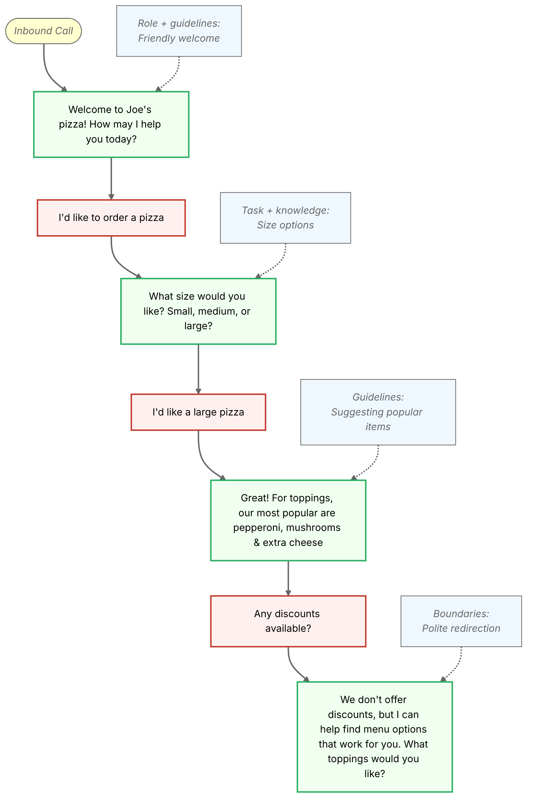

[swml-docs]: /docs/swml
[context-steps]: /docs/platform/ai/prompt-engineering/where-to-apply#context-steps
[swaig]: /docs/platform/ai/prompt-engineering/where-to-apply#swaig-functions
[conscience]: /docs/platform/ai/prompt-engineering/where-to-apply#conscience
[post-prompt]: /docs/platform/ai/prompt-engineering/where-to-apply#post-prompt

SignalWire AI Agents combine 
<Tooltip tip="ASR, or 'Automatic Speech Recognition', is also known as 'Speech-to-Text' (STT).">ASR</Tooltip>, 
conversational intelligence, 
[tool calling](/docs/platform/ai/tool-calling),
<Tooltip tip="'Retrieval Augmented Generation' systems, like SignalWire's Datasphere, empower AI Agents with structured data to improve quality and reliability.">integrated RAG</Tooltip>, and 
<Tooltip tip="'Text-to-Speech' models speak text in a variety of languages and voices.">TTS</Tooltip>,
all in one system integrated with and optimized for telecommunications.

[Prompts](/docs/platform/ai/prompt-engineering/where-to-apply) are used to design and configure an AI Agent. 
In addition to its primary (or "Main") prompt, each SignalWire AI Agent has additional areas that accept prompts, like 
[Context Steps][context-steps], 
[SWAIG Functions][swaig], 
[Conscience][conscience],
and the [Post-Prompt][post-prompt].

Think of prompt engineering like giving detailed instructions to a new team member: for them to succeed,
you need to be clear about what you want them to do, how to do it, and what boundaries to respect. 
A good prompt tells the AI exactly how to handle user questions, what tone to use, what information to focus on, and what topics to avoid.

<Info>
You can use all these prompt engineering techniques with either [SWML][swml-docs] or the AI agent resource.
</Info>

## The art of prompt engineering

Prompt engineering is part technical skill, part creative problem-solving:
the goal is instructions clear enough to leave no room for confusion.
Great prompts come from specific instructions, logically organized information,
explicit ethical and brand boundaries, and constant refinement against real-world results.
The difference shows up in production, where a well-prompted agent handles complex customer
conversations consistently, day in and day out.

## Why this matters

How you write your prompts determines your AI's performance.
Good prompts create agents that stay consistent whether they're talking to a first-time customer
or someone who's been around for years, and that handle real conversations: understanding context,
managing back-and-forth, and recovering when things get confusing.
The results reach everything downstream — an agent that sounds like your company, stays compliant,
handles more conversations without losing quality, and leaves callers satisfied.

## What makes prompts work

The best prompts share a few traits.
They use clear, specific language: the AI takes instructions literally, so vague wording leads to
unexpected results, and concrete examples beat abstract directions.
They organize information with headings and consistent formatting, so the AI can tell how the
pieces fit together.
They leave room for real conversations, which rarely follow a script — different phrasings of the
same question, topic changes, and misunderstandings all need to be handled naturally.
And they carry your brand voice: your terminology, your tone, and the things that matter to your business.


### Technical considerations

Avoid over-prompting when designing your AI agents. Excessive instructions and constraints degrade both performance and reliability: when prompts become too long or complex, the AI struggles to prioritize, and responses turn inconsistent. Focus on clear, essential guidance rather than exhaustive detail.

Good prompts also keep the AI anchored in the conversation, remembering what was said earlier so responses make sense throughout longer interactions.

They plan for failure, too. Tell the AI how to recover when things get confusing: ask for clarification, offer alternatives, or steer the conversation back on track without frustrating the caller.


## Building your prompt structure

A solid prompt is like a well-organized recipe - it has all the right ingredients in the right order. Here's how to structure your prompts for SignalWire AI agents:

### Role definition
Begin by establishing who your AI is supposed to be. This identity is the foundation of the prompt, setting the tone and expertise level for all interactions. When you tell your AI "You're a telecom support specialist with five years under your belt," you're giving it a clear persona to embody throughout the conversation.

### Context
Every conversation happens within a context that shapes understanding. Your AI needs background information to perform well: details about user demographics and technical knowledge, system capabilities and limitations, or relevant history that might influence the interaction. This context keeps the AI from making inappropriate assumptions.

### Response guidelines
Response guidelines shape how your AI communicates. Defining whether you want "friendly, simple language with clear steps" or "professional but approachable, getting straight to the point" keeps the conversation natural and aligned with your brand voice.

### Boundaries
Boundaries protect both users and your business. Stating clearly what the AI shouldn't do — "Don't ask for passwords," "Don't promise specific delivery times," "Don't compare us to competitors unless asked" — prevents problems while keeping the flexibility a natural conversation needs.

### Example structure

Here's a real-world example of a well-structured prompt for a pizza ordering AI:

```markdown
## Role
You are a friendly pizza restaurant assistant responsible for taking orders and providing information about our menu. You have extensive knowledge of our pizzas, toppings, and policies.

## Knowledge base
- Menu Items: All pizza sizes (small, medium, large), available toppings, speciality pizzas
- Operating Hours: Monday-Sunday 11am-10pm
- Policies: Delivery radius (5 miles), minimum order for delivery ($15), modification limits
- Dietary Information: Vegetarian options, gluten-free crust availability

## Task structure
1. Greet customer warmly and establish if ordering or asking questions
2. For orders:
   - Get pizza size (small/medium/large)
   - Collect topping preferences
   - Confirm order details
   - Handle delivery/pickup choice
3. For inquiries:
   - Answer menu questions
   - Provide policy information
   - Address dietary concerns

## Response guidelines
- Use friendly, conversational tone
- Confirm understanding of customer requests
- Provide clear pricing information
- Suggest popular topping combinations when asked
- Guide customers through options step-by-step

## Boundaries
- Don't accept orders outside operating hours which is 11am-10pm
- Don't promise delivery times
- Don't modify set specialty pizza recipes
- Don't offer discounts or special prices
- Don't discuss internal operations or competitors
```

<Info>
This example embeds the menu in the prompt to teach structure.
In production, menu items, prices, and order-taking belong in your backend, reached through
[tool calls](/docs/platform/ai/tool-calling).
Keep the prompt's knowledge base for stable facts like hours and policies.
</Info>

### Visual representation of prompt impact

The following diagram illustrates the above prompt in a real conversation and how it influences the AI's responses:



This diagram demonstrates how:
- The **role** shapes the AI's friendly greeting and professional demeanor
- The **knowledge base** informs accurate responses about menu options and policies
- The **task structure** ensures a logical order flow from size selection to toppings
- **Response guidelines** maintain consistent, helpful interaction throughout
- **Boundaries** keep the conversation within appropriate service parameters

## Get started

Follow these steps to create a basic set of prompts, then test and iterate until your agent is ready for production.


<Steps>
#### Define clear objectives

Start by establishing specific, measurable goals for your AI agent. Create a mission statement that defines its purpose, scope,
 and success criteria.

#### Research your target audience

Gather detailed information about your audience and their experiences:
- Technical proficiency levels (beginner, intermediate, expert)
- Familiarity with industry-specific terminology
- Common challenges and pain points they face
- Communication preferences and interaction styles
- Typical scenarios and use cases relevant to your service

Use these audience insights to enhance your prompts and test them from different user perspectives.

#### Build an iterative prompt framework

1. **Core functionality**: Start with a minimal viable prompt (MVP) that handles the most common use cases
2. **Expansion phase**: Expand the prompt incrementally to cover more use cases
3. **Edge case handling**: Incorporate instructions for unusual scenarios
4. **Refinement**: Trim unnecessary instructions that don't improve performance

This layered approach prevents prompt bloat while ensuring comprehensive coverage.

#### Implement rigorous testing protocols

Develop a systematic testing framework:
- **Functional testing**: Verify responses to standard queries match expectations
- **Adversarial testing**: Deliberately try to confuse or mislead the AI
- **Boundary testing**: Explore the limits of the AI's knowledge and capabilities
- **A/B testing**: Compare different prompt versions with real users

Document all test cases and results to track improvements over time.

#### Establish a continuous improvement cycle

Make continuous improvement part of your process. Watch how real users interact with your AI,
spot patterns of success and failure, and adjust your prompts accordingly.
</Steps>

## Next steps

<CardGroup cols={3}>

<Card title="Best practices" href="/docs/platform/ai/prompt-engineering/best-practices" icon="regular pen-nib">
  Core techniques for clear, reliable prompts.
</Card>

<Card title="Where to apply prompt engineering" href="/docs/platform/ai/prompt-engineering/where-to-apply" icon="regular layer-group">
  The five surfaces that accept prompts.
</Card>

<Card title="Tool calling" href="/docs/platform/ai/tool-calling" icon="regular webhook">
  The other half of a reliable agent.
</Card>

</CardGroup>
