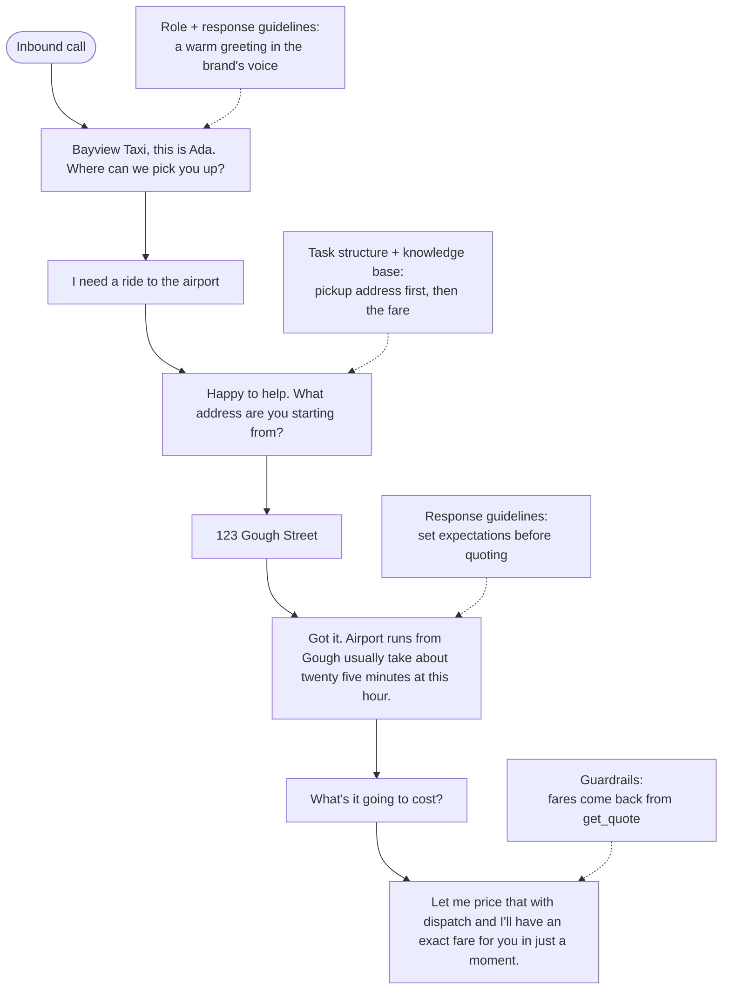

[context-steps]: /docs/platform/ai/prompt-engineering/where-to-apply#context-steps
[swaig]: /docs/platform/ai/prompt-engineering/where-to-apply#swaig-functions
[conscience]: /docs/platform/ai/prompt-engineering/where-to-apply#conscience
[post-prompt]: /docs/platform/ai/prompt-engineering/where-to-apply#post-prompt

<llms-ignore>

SignalWire AI Agents combine 
<Tooltip tip="ASR, or 'Automatic Speech Recognition', is also known as 'Speech-to-Text' (STT).">ASR</Tooltip>, 
conversational intelligence, 
[tool calling](/docs/platform/ai/tool-calling),
<Tooltip tip="'Retrieval Augmented Generation' systems, like SignalWire's Datasphere, empower AI Agents with structured data to improve quality and reliability.">integrated RAG</Tooltip>, and 
<Tooltip tip="'Text-to-Speech' models speak text in a variety of languages and voices.">TTS</Tooltip>,
all in one system integrated with and optimized for telecommunications.

</llms-ignore>

<llms-only>

SignalWire AI Agents combine automatic speech recognition (ASR), also known as Speech-to-Text (STT),
conversational intelligence, [tool calling](/docs/platform/ai/tool-calling), integrated retrieval-augmented generation (RAG),
and Text-to-Speech (TTS) models in one system optimized for telecommunications.

</llms-only>

[Prompts](/docs/platform/ai/prompt-engineering/where-to-apply) are used to design and configure an AI Agent. 
In addition to its primary (or "Main") prompt, each SignalWire AI Agent has additional areas that accept prompts, like 
[Context Steps][context-steps], 
[SWAIG Functions][swaig], 
[Conscience][conscience],
and the [Post-Prompt][post-prompt].

Think of prompt engineering like giving detailed instructions to a new team member: for them to succeed,
you need to be clear about what you want them to do, how to do it, and what counts as done. 
A good prompt tells the AI how to handle user questions, what tone to use, and what information to focus on.
The rules that have to hold on every call belong in your code, where they are enforced instead of requested.

## What makes a prompt work

How you write your prompts determines your AI's performance: a well-prompted agent stays
consistent from caller to caller, handles real back-and-forth conversation, and recovers
gracefully when things get confusing.
The best prompts share a few traits.
They use clear, specific language, because the AI takes instructions literally.
They organize information with headings and consistent formatting, so the AI can tell how
the pieces fit together.
They leave room for real conversations, which rarely follow a script.
And they stay lean: excessive instructions muddle behavior rather than tightening it,
and business data belongs behind a [tool call](/docs/platform/ai/tool-calling) rather than
in the prompt.
The [prompt writing techniques](/docs/platform/ai/prompt-engineering/best-practices) guide
covers each of these traits in depth, with worked examples of prompts that follow them
and prompts that don't.

## Building your prompt structure

A solid prompt is like a well-organized recipe - it has all the right ingredients in the right order. Here's how to structure your prompts for SignalWire AI agents:

### Role definition
Begin by establishing who your AI is supposed to be. This identity is the foundation of the prompt, setting the tone and expertise level for all interactions. When you tell your AI "You are a well-tenured taxi dispatcher," you're giving it a clear persona to embody throughout the conversation.

### Context
Every conversation happens within a context that shapes understanding. Your AI needs background information to perform well: details about user demographics and technical knowledge, system capabilities and limitations, or relevant history that might influence the interaction. This context keeps the AI from making inappropriate assumptions.

### Response guidelines
Response guidelines shape how your AI communicates. Defining whether you want "friendly, simple language with clear steps" or "professional but approachable, getting straight to the point" keeps the conversation natural and aligned with your brand voice.

### Guardrails
Guardrails are the rules that keep the agent in bounds: what it won't promise, what it won't decide on
its own, what it hands off. Most of them work better outside the prompt than in it, so the prompt
carries only the few that can't live anywhere else.
[Where guardrails belong](#where-guardrails-belong) covers the order to reach for them in.

### Example structure

Here's a well-structured prompt for Bayview Taxi's dispatcher, the agent the rest of these guides build on:

```markdown
## Role
You are Ada, the dispatcher for Bayview Taxi. You quote fares and book pickups.

## Knowledge base
- Vehicle types: standard, van, wheelchair accessible
- Payment: card over the phone, or cash to the driver
- A booking needs a pickup address, a destination, and a pickup time

## Tools
- get_quote: prices a trip and returns the fare and the distance. Call it once you have both addresses, and every time either one changes.
- book_ride: dispatches a driver and returns the pickup time and vehicle. Call it only after the caller has accepted a quote.

## Task structure
1. Greet the caller and ask where they are and where they're going
2. To quote a trip:
   - Collect the pickup address and the destination
   - Confirm both back to the caller before pricing
   - Call get_quote and read the fare it returns
3. To book:
   - Ask which vehicle type they need
   - Call book_ride, then read back the pickup time and vehicle

## Response guidelines
- Use a calm, efficient tone; callers are often in a hurry
- Confirm addresses back before acting on them
- Read fares and pickup times exactly as the functions return them
- Offer the nearest alternative when a caller asks for something unavailable

## Guardrails
- Fares, surcharges, and distances come from get_quote; relay its answer rather than working them out
- Availability and pickup times are decided by book_ride
- If asked how long a trip will take, give the estimate book_ride returned and say traffic can change it
```

<Info>
The prompt holds the shape of a booking — the vehicle types, the ways to pay, what a booking needs —
and nothing whose answer can change. Fares move with distance, time of day, and surge, so they come
from `get_quote`. Pickup times depend on which driver is free, so they come from `book_ride`. Both are
SWAIG functions the agent calls on your backend through a
[tool call](/docs/platform/ai/tool-calling).

That split is also what replaces a list of prohibitions. `get_quote` prices the trip and `book_ride`
refuses a pickup no driver can make, so a caller can't talk the agent into a cheaper fare or a car that
isn't there, and the prompt never has to forbid either.
</Info>

### Visual representation of prompt impact

The following diagram illustrates the above prompt in a real conversation and how it influences the AI's responses:

<llms-ignore>

<Frame caption="Each turn traces back to the part of the prompt that shaped it — except the fare, which comes from code">
  
</Frame>

</llms-ignore>

<llms-only>


```mermaid
flowchart TD
    Start([Inbound call])
    Start --> R1["Bayview Taxi, this is Ada. Where can we pick you up?"]
    R1 --> Q1["I need a ride to the airport"]
    Q1 --> R2["Happy to help. What address are you starting from?"]
    R2 --> Q2["123 Gough Street"]
    Q2 --> R3["Got it. Airport runs from Gough usually take about twenty five minutes at this hour."]
    R3 --> Q3["What's it going to cost?"]
    Q3 --> R4["Let me price that with dispatch and I'll have an exact fare for you in just a moment."]

    Note1["Role + response guidelines:<br/>a warm greeting in the brand's voice"]
    Note2["Task structure + knowledge base:<br/>pickup address first, then the fare"]
    Note3["Response guidelines:<br/>set expectations before quoting"]
    Note4["Guardrails:<br/>fares come back from get_quote"]

    Note1 -.-> R1
    Note2 -.-> R2
    Note3 -.-> R3
    Note4 -.-> R4
```

</llms-only>

This diagram demonstrates how:
- The **role** shapes the AI's calm, professional greeting
- The **knowledge base** informs accurate responses about vehicle types and how a booking works
- The **task structure** collects both addresses before anything is priced
- **Response guidelines** maintain consistent, helpful interaction throughout
- **Guardrails** leave the fare to the code that owns it, and keep the redirection polite

## Where guardrails belong

A prompt full of prohibitions is one of the most common ways an agent becomes unpredictable.
Every rule you add competes with the others for the model's attention, and a prohibition is followed
less reliably than the same rule written as an instruction.
Work through the options below in order, and stop as soon as the behavior is covered.

1. **State what success looks like.** An agent that knows its objective works out most of its
   own limits. "Quote the trip, book it once the caller accepts, and hand off anything you
   can't complete" already rules out competitor talk and freelance discounts, without a
   single prohibition.
2. **Enforce hard rules in code.** Prices, discounts, eligibility, and anything that must be
   exact or current belong behind a [tool call](/docs/platform/ai/tool-calling), where your
   handler validates the caller's input and decides the outcome. Your handler enforces a pricing
   rule on every call; the prompt only asks.
3. **Remove the possibility.** Scope which functions exist at each stage with
   [context steps][context-steps]: the agent can't book before it quotes if the booking
   function isn't available yet.
4. **Put global rules in the conscience.** Tone, persona, safety, and compliance rules that
   apply to the whole call belong in the [conscience][conscience]. It is reinforced throughout
   the conversation, including after function calls, so the rule doesn't fade the way one line
   in the middle of a long main prompt does.
5. **Then, sparingly, write a don't.** A short list of genuine non-negotiables that can't be
   enforced structurally still earns its place. Keep it specific, and phrase it as the
   behavior you want wherever you can: "If asked how long the trip will take, give the estimate
   book_ride returned and say traffic can change it" steers better than "Don't promise arrival times".

## From draft to production

A first prompt is a draft.
Expect to test it against real conversations, watch where the agent hesitates or drifts,
and refine it in small steps.
The [iterative refinement process](/docs/platform/ai/prompt-engineering/best-practices#iterative-refinement-process)
walks through that workflow, from objectives and audience research to systematic testing.

## Next steps

<CardGroup cols={3}>

<Card title="Prompt writing techniques" href="/docs/platform/ai/prompt-engineering/best-practices" icon="regular pen-nib">
  Core techniques for clear, reliable prompts.
</Card>

<Card title="Where to apply prompt engineering" href="/docs/platform/ai/prompt-engineering/where-to-apply" icon="regular layer-group">
  The five surfaces that accept prompts.
</Card>

<Card title="Tool calling" href="/docs/platform/ai/tool-calling" icon="regular webhook">
  The other half of a reliable agent.
</Card>

</CardGroup>
