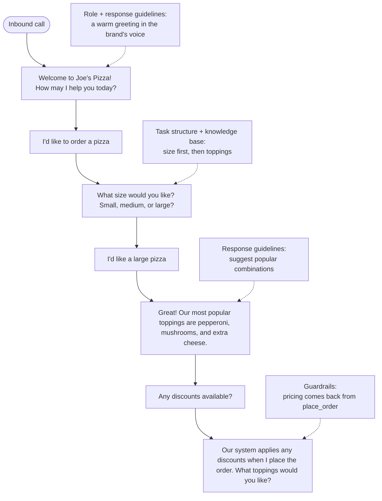

[swml-docs]: /docs/swml
[context-steps]: /docs/platform/ai/prompt-engineering/where-to-apply#context-steps
[swaig]: /docs/platform/ai/prompt-engineering/where-to-apply#swaig-functions
[conscience]: /docs/platform/ai/prompt-engineering/where-to-apply#conscience
[post-prompt]: /docs/platform/ai/prompt-engineering/where-to-apply#post-prompt

SignalWire AI Agents combine 
<Tooltip tip="ASR, or 'Automatic Speech Recognition', is also known as 'Speech-to-Text' (STT).">ASR</Tooltip>, 
conversational intelligence, 
[tool calling](/docs/platform/ai/tool-calling),
<Tooltip tip="'Retrieval Augmented Generation' systems, like SignalWire's Datasphere, empower AI Agents with structured data to improve quality and reliability.">integrated RAG</Tooltip>, and 
<Tooltip tip="'Text-to-Speech' models speak text in a variety of languages and voices.">TTS</Tooltip>,
all in one system integrated with and optimized for telecommunications.

[Prompts](/docs/platform/ai/prompt-engineering/where-to-apply) are used to design and configure an AI Agent. 
In addition to its primary (or "Main") prompt, each SignalWire AI Agent has additional areas that accept prompts, like 
[Context Steps][context-steps], 
[SWAIG Functions][swaig], 
[Conscience][conscience],
and the [Post-Prompt][post-prompt].

Think of prompt engineering like giving detailed instructions to a new team member: for them to succeed,
you need to be clear about what you want them to do, how to do it, and what counts as done. 
A good prompt tells the AI how to handle user questions, what tone to use, and what information to focus on,
while the rules that have to hold on every call are enforced in your code rather than asked for in words.

<Info>
You can use all these prompt engineering techniques with either [SWML][swml-docs] or the AI agent resource.
</Info>

## What makes a prompt work

How you write your prompts determines your AI's performance: a well-prompted agent stays
consistent from caller to caller, handles real back-and-forth conversation, and recovers
gracefully when things get confusing.
The best prompts share a few traits.
They use clear, specific language, because the AI takes instructions literally.
They organize information with headings and consistent formatting, so the AI can tell how
the pieces fit together.
They leave room for real conversations, which rarely follow a script.
And they stay lean: excessive instructions muddle behavior rather than tightening it,
and business data belongs behind a [tool call](/docs/platform/ai/tool-calling) rather than
in the prompt.
The [prompt writing techniques](/docs/platform/ai/prompt-engineering/best-practices) guide
covers each of these traits in depth, with worked examples of prompts that follow them
and prompts that don't.

## Building your prompt structure

A solid prompt is like a well-organized recipe - it has all the right ingredients in the right order. Here's how to structure your prompts for SignalWire AI agents:

### Role definition
Begin by establishing who your AI is supposed to be. This identity is the foundation of the prompt, setting the tone and expertise level for all interactions. When you tell your AI "You're a telecom support specialist with five years under your belt," you're giving it a clear persona to embody throughout the conversation.

### Context
Every conversation happens within a context that shapes understanding. Your AI needs background information to perform well: details about user demographics and technical knowledge, system capabilities and limitations, or relevant history that might influence the interaction. This context keeps the AI from making inappropriate assumptions.

### Response guidelines
Response guidelines shape how your AI communicates. Defining whether you want "friendly, simple language with clear steps" or "professional but approachable, getting straight to the point" keeps the conversation natural and aligned with your brand voice.

### Guardrails

The instinct is to list everything the agent must never do. Resist it.
A prompt full of don'ts is one of the most common ways an agent becomes unpredictable:
each rule competes for the model's attention, rules phrased as prohibitions are followed
less reliably than the same rule phrased as an instruction, and a rule that only lives in
the prompt holds most of the time rather than every time.

Reach for guardrails in this order, and stop as soon as the behavior is covered.

1. **State what success looks like.** An agent that knows its objective infers most of its
   own limits. "Take the order, confirm it back to the caller, and hand off anything you
   can't complete" already rules out competitor talk and freelance discounts, without a
   single "don't".
2. **Enforce hard rules in code.** Prices, discounts, eligibility, and anything that must be
   exact or current belong behind a [tool call](/docs/platform/ai/tool-calling), where your
   handler validates the caller's input and decides the outcome. A pricing rule in code holds
   on every call; "never give discounts" in a prompt holds on most of them.
3. **Remove the possibility.** Scope which functions exist at each stage with
   [context steps][context-steps]: the agent can't book before it quotes if the booking
   function isn't available yet.
4. **Put global rules in the conscience.** Tone, persona, safety, and compliance rules that
   apply to the whole call belong in the [conscience][conscience], which is reinforced
   throughout the conversation, including after function calls, rather than stated once in
   the middle of a long main prompt.
5. **Then, sparingly, write a don't.** A short list of genuine non-negotiables that can't be
   enforced structurally still earns its place. Keep it specific, and phrase it as the
   behavior you want wherever you can: "If asked when an order will arrive, say the store
   confirms a delivery window at checkout" steers better than "Don't promise delivery times".

### Example structure

Here's a real-world example of a well-structured prompt for a pizza ordering AI:

```markdown
## Role
You are a friendly pizza restaurant assistant responsible for taking orders and providing information about our menu. You have extensive knowledge of our pizzas, toppings, and policies.

## Knowledge base
- Menu Items: All pizza sizes (small, medium, large), available toppings, speciality pizzas
- Operating Hours: Monday-Sunday 11am-10pm
- Policies: Delivery radius (5 miles), minimum order for delivery ($15), modification limits
- Dietary Information: Vegetarian options, gluten-free crust availability

## Task structure
1. Greet customer warmly and establish if ordering or asking questions
2. For orders:
   - Get pizza size (small/medium/large)
   - Collect topping preferences
   - Confirm order details
   - Handle delivery/pickup choice
3. For inquiries:
   - Answer menu questions
   - Provide policy information
   - Address dietary concerns

## Response guidelines
- Use friendly, conversational tone
- Confirm understanding of customer requests
- Read prices and totals back exactly as place_order returns them
- Suggest popular topping combinations when asked
- Guide customers through options step-by-step

## Guardrails
- Prices, totals, and discounts come from place_order; relay its answer rather than working them out
- Substitutions and specialty recipe changes are decided by place_order too
- If asked when an order will arrive, say the store confirms a delivery window at checkout
```

<Info>
This example keeps the menu's shape in the prompt to teach structure, and leaves the priced parts of
an order to `place_order`, a [tool call](/docs/platform/ai/tool-calling) the agent makes to your
backend. In production the menu itself belongs there too; the prompt's knowledge base is for stable
facts like hours, delivery radius, and dietary options.

That split does the work of the don'ts this prompt no longer needs.
`place_order` prices the order and rejects one placed after closing,
so the agent can't invent a discount or take a late order even if a caller talks it into trying.
</Info>

### Visual representation of prompt impact

The following diagram illustrates the above prompt in a real conversation and how it influences the AI's responses:

<llms-ignore>

<Frame caption="Each turn traces back to the part of the prompt that shaped it — except the price, which comes from code">
  
</Frame>

</llms-ignore>

<llms-only>


```mermaid
flowchart TD
    Start([Inbound call])
    Start --> R1["Welcome to Joe's Pizza! How may I help you today?"]
    R1 --> Q1["I'd like to order a pizza"]
    Q1 --> R2["What size would you like? Small, medium, or large?"]
    R2 --> Q2["I'd like a large pizza"]
    Q2 --> R3["Great! Our most popular toppings are pepperoni, mushrooms, and extra cheese."]
    R3 --> Q3["Any discounts available?"]
    Q3 --> R4["Our system applies any discounts when I place the order. What toppings would you like?"]

    Note1["Role + response guidelines:<br/>a warm greeting in the brand's voice"]
    Note2["Task structure + knowledge base:<br/>size first, then toppings"]
    Note3["Response guidelines:<br/>suggest popular combinations"]
    Note4["Guardrails:<br/>pricing comes back from place_order"]

    Note1 -.-> R1
    Note2 -.-> R2
    Note3 -.-> R3
    Note4 -.-> R4
```

</llms-only>

This diagram demonstrates how:
- The **role** shapes the AI's friendly greeting and professional demeanor
- The **knowledge base** informs accurate responses about menu options and policies
- The **task structure** ensures a logical order flow from size selection to toppings
- **Response guidelines** maintain consistent, helpful interaction throughout
- **Guardrails** keep pricing decisions in the code that owns them, and the redirection polite

## From draft to production

A first prompt is a draft.
Expect to test it against real conversations, watch where the agent hesitates or drifts,
and refine it in small steps.
The [iterative refinement process](/docs/platform/ai/prompt-engineering/best-practices#iterative-refinement-process)
walks through that workflow, from objectives and audience research to systematic testing.

## Next steps

<CardGroup cols={3}>

<Card title="Prompt writing techniques" href="/docs/platform/ai/prompt-engineering/best-practices" icon="regular pen-nib">
  Core techniques for clear, reliable prompts.
</Card>

<Card title="Where to apply prompt engineering" href="/docs/platform/ai/prompt-engineering/where-to-apply" icon="regular layer-group">
  The five surfaces that accept prompts.
</Card>

<Card title="Tool calling" href="/docs/platform/ai/tool-calling" icon="regular webhook">
  The other half of a reliable agent.
</Card>

</CardGroup>
