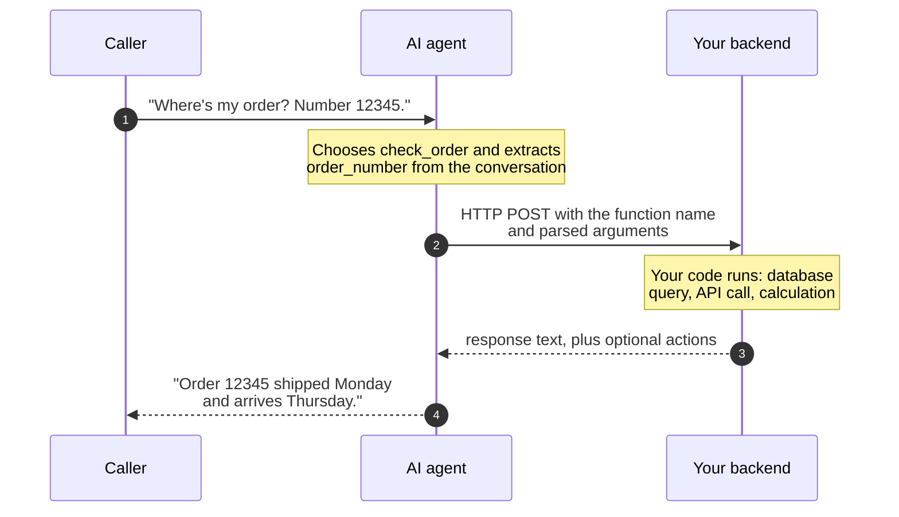

[best-practices]: /docs/platform/ai/best-practices
[prompt-engineering]: /docs/platform/ai/prompt-engineering
[swaig-guide]: /docs/swml/guides/swaig
[swaig-functions]: /docs/swml/reference/calling/ai/swaig/functions
[ai-reference]: /docs/swml/reference/calling/ai
[ai-languages]: /docs/swml/reference/calling/ai/languages
[sdk-functions]: /docs/server-sdks/guides/defining-functions
[sdk-swaig]: /docs/server-sdks/guides/swaig
[sdk-datamap]: /docs/server-sdks/guides/data-map
[swml-datamap]: /docs/swml/guides/data-map
[result-actions]: /docs/server-sdks/guides/result-actions
[state-management]: /docs/server-sdks/guides/state-management
[contexts-workflows]: /docs/server-sdks/guides/contexts-workflows
[toggle-functions]: /docs/swml/guides/toggle-functions
[context-switch]: /docs/swml/guides/context-switch

Ask a language model what a ride across town costs and it will answer with a confident, plausible, invented number.
Put that model on your phone line, and its invented number becomes your price.

A production agent needs two things the model alone can't provide.
It needs facts that are true right now, for this caller: the order's status, the open slots, the actual fare.
And it needs to act on the world: book the pickup, send the text, transfer the call.
**Tool calling**, also known as *function calling*, is how the agent gets both.
The AI agent is the **front end** of the call, speaking, listening, and working out what the caller wants,
while your backend stays the source of truth and does the real work.
On SignalWire, tool calls are delivered by **SWAIG**, the SignalWire AI Gateway,
and the tools you give an agent are called **SWAIG functions**.

## The agent is the front end

Think about how a website works.
The front end renders the interface and captures what the user wants, but it never computes the cart total.
The backend does that, because the backend can be tested, versioned, and trusted.
A voice agent deserves the same architecture: the conversation is the interface, and your code is still the application.

A prompt is a suggestion, and code is a constraint:
"never give discounts" holds most of the time, while a pricing rule in your handler holds every time.
Anything that must be exact, current, or enforced belongs behind a SWAIG function:

| The prompt owns | Your code owns |
|---|---|
| Personality and tone | Business rules and policy |
| Understanding what the caller wants | Prices, inventory, and availability |
| Extracting details (names, dates, addresses) | Calculations and discounts |
| Deciding when to reach for a function | Lookups and side effects (booking, texting, transferring) |

This split also keeps the prompt itself lean — pasted menus, prices, and policies are the classic
way prompts bloat, go stale, and get ignored. That prompt-side discipline is covered in
[best practices][best-practices] and [prompt engineering][prompt-engineering];
this guide covers the functions themselves: how they work, how to build one, and how to keep
them reliable on real calls.

## How a SWAIG function works

A SWAIG function is a named capability you hand to the agent: a **name**, a **description**,
and a JSON Schema describing its **parameters**.
If you have used tool calling with another LLM API, this is the same concept,
and your existing intuition transfers directly.

<Tip>
SWAIG function descriptions are prompt engineering.
"Look up order status by order number" tells the agent what the function does *and* what it needs before calling it.
When an agent picks the wrong function or calls it too early, the description is usually the first thing to fix.
</Tip>

A SWAIG function call round-trips between the caller, the agent, and your server:



The request your server receives looks like this, trimmed to the essentials:

```json
{
  "function": "check_order",
  "argument": {
    "parsed": [{ "order_number": "12345" }],
    "raw": "{\"order_number\":\"12345\"}"
  },
  "caller_id_num": "+15552340987",
  "ai_session_id": "c960da54-3f09-4de6-8c84-49c1fcca704c"
}
```

And a minimal reply:

```json
{
  "response": "Order 12345 shipped Monday and arrives Thursday. Offer to text the tracking link."
}
```

<Note>
The `response` is written to the AI, not to the caller.
It can carry data, and it can carry instructions about what the agent should do next.
The full payloads are documented in the [SWAIG guide][swaig-guide] and the
[`SWAIG.functions` reference][swaig-functions].
</Note>

You have three ways to host the code behind a SWAIG function:

- **Your own webhook**: any HTTP endpoint, in any language, set with `web_hook_url`.
- **The Server SDK**: define the function and its handler in one class built on the SDK's Agents
  namespace (`AgentBase`), and the SDK serves the endpoint for you.
  See [SWAIG functions in the Server SDK][sdk-functions].
- **DataMap**: for straightforward REST calls, describe the request and response mapping declaratively and
  SignalWire executes it server-side, with no infrastructure of yours at all.
  See DataMap in the [Server SDK][sdk-datamap] or in [SWML][swml-datamap].

## Build it: an order-status agent

Order status is the plainest case for a SWAIG function: the answer lives in your fulfillment system,
changes by the hour, and is different for every caller, so no prompt could contain it.
Here is a complete agent that fetches it instead.

<CodeBlocks>
<CodeBlock title="SWML">
```yaml
version: 1.0.0
sections:
  main:
    - ai:
        prompt:
          text: |
            You are an order status assistant. Help customers check their orders.
            Ask for the order number, then look it up with check_order.
        SWAIG:
          functions:
            - function: check_order
              description: Look up order status by order number
              parameters:
                type: object
                properties:
                  order_number:
                    type: string
                    description: The order number to look up
                required:
                  - order_number
              fillers:
                en-US:
                  - Let me pull that up...
              web_hook_url: https://example.com/check-order
```
</CodeBlock>
<CodeBlock title="Server SDK (Python)">
```python
from signalwire import AgentBase, FunctionResult

class OrderAgent(AgentBase):
    def __init__(self):
        super().__init__(name="order-agent")
        self.add_language("English", "en-US", "rime.spore")

        self.prompt_add_section(
            "Role",
            "You are an order status assistant. Help customers check their orders."
        )

        self.define_tool(
            name="check_order",
            description="Look up order status by order number",
            parameters={
                "type": "object",
                "properties": {
                    "order_number": {
                        "type": "string",
                        "description": "The order number to look up"
                    }
                },
                "required": ["order_number"]
            },
            handler=self.check_order,
            fillers={"en-US": ["Let me pull that up..."]}
        )

    def check_order(self, args, raw_data):
        order_number = args.get("order_number")

        # Your business logic here - database lookup, API call, etc.
        orders = {
            "12345": "Shipped Monday, arriving Thursday",
            "67890": "Processing, ships tomorrow"
        }

        status = orders.get(order_number, "Order not found")
        return FunctionResult(f"Order {order_number}: {status}")

if __name__ == "__main__":
    agent = OrderAgent()
    agent.run()
```
</CodeBlock>
</CodeBlocks>

In SWML, `web_hook_url` names the server you run; with the Server SDK, the class *is* the server,
and the SDK hosts the endpoint for you.
For the SDK side, see [SWAIG functions in the Server SDK][sdk-functions] and
[SWAIG request handling][sdk-swaig].
For SWML, see the [SWAIG guide][swaig-guide] and the [`SWAIG.functions` reference][swaig-functions].

The `orders` dictionary stands in for your real backend: a database, an internal API, a fulfillment system.
Swap it out and nothing else changes.
When a caller asks about an order that doesn't exist, the agent says so: your code returned
"Order not found", and the AI has nothing to invent.

You can exercise the function before any call.
The SDK's [`swaig-test` CLI](/docs/server-sdks/reference/python/agents/cli/swaig-test) loads the agent file,
executes `check_order` with arguments you supply, and prints the exact response the agent would receive:

```bash
swaig-test order_agent.py --exec check_order --order_number 12345
```

To hear it on a real call, run the Python file and point a phone number at your agent
(the [Server SDK quickstart](/docs/server-sdks/guides/quickstart) walks through it),
or paste the SWML into your Dashboard as shown in the [AI overview](/docs/platform/ai).

## SWAIG functions steer the call, not just the answer

A function result isn't limited to text.
Alongside `response`, your code can return **actions**, which are instructions the platform executes on the live call:

- **Transfer the call** to a human, a queue, or another agent.
- **Send an SMS**, such as a confirmation, a link, or a receipt.
- **Play audio or execute SWML** mid-conversation.
- **Update call state** (`global_data`) that later functions and the prompt can use.
- **Move the conversation** to a different step or context, changing which functions are exposed.

This is the part teams miss when they treat the AI as the application:
the decision-making stays in your code even when the delivery is conversational.
Your backend notices the caller qualifies for a promotion,
and its function result tells the AI to offer it.

See [`FunctionResult` actions][result-actions] in the Server SDK, and the SWML guides on
[switching context][context-switch] and [toggling functions][toggle-functions].

## Patterns for reliable SWAIG functions

Five habits keep SWAIG functions dependable once real callers arrive.

### Validate in code, recover in conversation

Every argument the AI fills in is extracted from spoken, imperfect audio.
Treat it as user input, not as truth.
Normalize and verify it in your handler: geocode the address, check the account number's format,
ask "Portland, Oregon or Portland, Maine?" when it matters.
When validation fails, return a `response` that tells the AI how to recover,
such as "No match for that address. Ask the caller to repeat it, street first."
The conversation stays graceful because your code planned for the failure.

### Store validated state, then use zero-argument functions

Once your code has verified something, don't make the AI carry it.
Write it to `global_data`, the call-scoped state that lives with the session,
and let downstream functions take **no arguments at all**, reading the validated state instead:

```python
from signalwire import AgentBase, FunctionResult

def geocode(address):
    # Stand-in for a real geocoding service: your validator, your rules
    known = {
        "123 main street": "123 Main St, Springfield",
        "456 oak avenue": "456 Oak Ave, Springfield",
    }
    return known.get(address.lower().strip())

def price_ride(address):
    # Stand-in for your pricing engine, not the model's guess
    return 18.50

class TaxiAgent(AgentBase):
    def __init__(self):
        super().__init__(name="taxi-agent")
        self.add_language("English", "en-US", "rime.spore")

        self.prompt_add_section(
            "Role",
            "You book taxi pickups. Ask for the pickup address and validate it "
            "with validate_address, then quote the fare with get_quote."
        )

        self.define_tool(
            name="validate_address",
            description="Validate the pickup address the caller gave",
            parameters={
                "type": "object",
                "properties": {
                    "address": {
                        "type": "string",
                        "description": "The pickup address, as the caller said it"
                    }
                },
                "required": ["address"]
            },
            handler=self.validate_address
        )

        # get_quote takes no arguments: it reads state your code already verified
        self.define_tool(
            name="get_quote",
            description="Quote the fare. Only call after the pickup address is confirmed.",
            parameters={"type": "object", "properties": {}},
            handler=self.get_quote
        )

    def validate_address(self, args, raw_data):
        match = geocode(args.get("address", ""))
        if not match:
            return FunctionResult(
                "No match for that address. Ask the caller to repeat it."
            )
        return FunctionResult(
            f"Address confirmed: {match}. Ask when they'd like to be picked up."
        ).update_global_data({"pickup_address": match})

    def get_quote(self, args, raw_data):
        address = raw_data.get("global_data", {}).get("pickup_address")
        if not address:
            return FunctionResult("No confirmed address yet. Ask for the pickup address first.")
        fare = price_ride(address)
        return FunctionResult(f"The fare is ${fare:.2f}. Ask if they'd like to book it.")

if __name__ == "__main__":
    agent = TaxiAgent()
    agent.run()
```

A function with no arguments has no arguments to get wrong.
The quote is computed from data your code validated, so a creative caller can't talk the agent
into a different address or a better price.
See [state management][state-management] for the full `global_data` lifecycle.

### Expose only the functions each step needs

An agent with every function available at every moment will eventually call one at the wrong time:
booking before quoting, charging before confirming.
Structure multi-stage conversations into steps, and scope which functions are active in each one.
The AI can't call `book_ride` before `get_quote` if `book_ride` doesn't exist yet.
See [contexts and workflows][contexts-workflows] in the Server SDK,
or [toggling functions][toggle-functions] in SWML.

### Cover the wait

Most lookups take a noticeable moment, and callers hear silence as a dropped call.
Give every function that leaves the conversation a filler phrase ("Let me pull that up...")
or hold audio, so the caller hears a working agent instead of dead air.
Fillers play asynchronously; when your endpoint is fast, the caller may never hear them at all.
Configure per-function `fillers` (as in the examples above) and agent-wide
[`function_fillers`][ai-languages].

### Review what actually happened

Define a `post_prompt` and set a [`post_prompt_url`][ai-reference], and the platform delivers a report
after each call ends: the summary, the full conversation log, and every function call with its timing.
In those reports, study the turns around each function call: a mis-picked function or a guessed
argument usually traces back to its description, and descriptions can be iterated on like any
interface copy.
The open-source [post prompt viewer](https://github.com/signalwire/post_prompt_viewer)
inspects these reports, with the transcript, telemetry, and latency in one place.
In the Server SDK, see [post-prompt data][state-management].

## Next steps

<CardGroup cols={2}>

<Card title="SWAIG guide" href="/docs/swml/guides/swaig" icon="regular webhook">
  The request/response contract between the platform and your server.
</Card>

<Card title="SWAIG reference" href="/docs/swml/reference/calling/ai/swaig" icon="regular book">
  Every SWAIG configuration option in SWML.
</Card>

<Card title="Server SDK functions" href="/docs/server-sdks/guides/defining-functions" icon="regular code">
  Define SWAIG functions and handlers in the language of your choice.
</Card>

<Card title="DataMap" href="/docs/server-sdks/guides/data-map" icon="regular bolt">
  Call REST APIs from SWAIG functions with no server of your own.
</Card>

</CardGroup>
