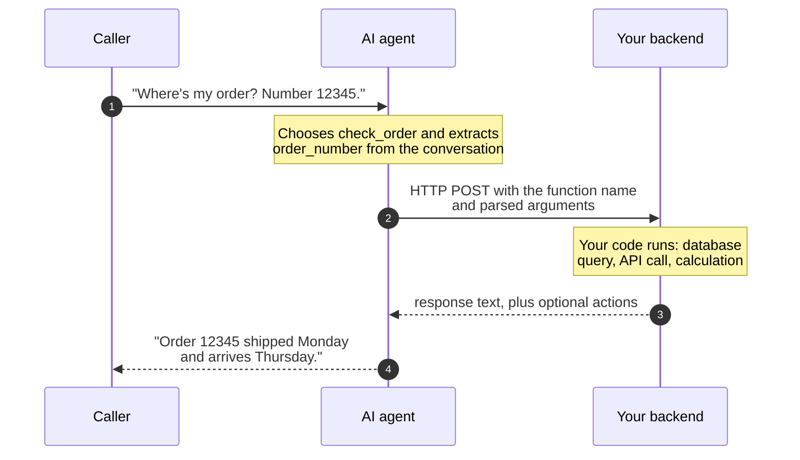

[prompt-engineering]: /docs/platform/ai/prompt-engineering
[swaig-guide]: /docs/swml/guides/swaig
[swaig-functions]: /docs/swml/reference/calling/ai/swaig/functions
[ai-reference]: /docs/swml/reference/calling/ai
[ai-languages]: /docs/swml/reference/calling/ai/languages
[sdk-functions]: /docs/server-sdks/guides/defining-functions
[sdk-swaig]: /docs/server-sdks/guides/swaig
[sdk-datamap]: /docs/server-sdks/guides/data-map
[swml-datamap]: /docs/swml/guides/data-map
[result-actions]: /docs/server-sdks/guides/result-actions
[state-management]: /docs/server-sdks/guides/state-management
[contexts-workflows]: /docs/server-sdks/guides/contexts-workflows
[toggle-functions]: /docs/swml/guides/toggle-functions
[context-switch]: /docs/swml/guides/context-switch
[faq-bot]: /docs/server-sdks/guides/faq-bot

Ask a language model what a ride across town costs and it will answer with a confident, plausible, invented number.
Put that model on your phone line, and its invented number becomes your price.

The most common production failure in voice AI isn't a bad model. It's architecture:
the menu, the prices, and the policies all stuffed into one long prompt.
That approach (sometimes called "prompt and pray") usually survives the demo and breaks on real callers.

SignalWire agents are designed around a different division of labor.
The AI agent is the **front end** of the call: it speaks, listens, works out what the caller wants, and collects details.
Your backend remains the source of truth, and the agent reaches it through **tool calling**,
also known as *function calling*.
On SignalWire, tool calls are delivered by **SWAIG**, the SignalWire AI Gateway.

## The agent is the front end

Think about how a website works.
The front end renders the interface and captures what the user wants, but it never computes the cart total.
The backend does that, because the backend can be tested, versioned, and trusted.
A voice agent deserves the same architecture: the conversation is the interface, and your code is still the application.

A prompt is a suggestion, and code is a constraint.
An instruction like "never give discounts" is followed most of the time; pricing rules need to hold every time.
Anything that must be exact, current, or enforced belongs behind a tool call:

| The prompt owns | Your code owns |
|---|---|
| Personality and tone | Business rules and policy |
| Understanding what the caller wants | Prices, inventory, and availability |
| Extracting details (names, dates, addresses) | Calculations and discounts |
| Deciding when to reach for a tool | Lookups and side effects (booking, texting, transferring) |

Here is the difference in practice, using a drive-thru agent:

<Tabs>

<Tab title="Prompt-stuffed">

```yaml
- ai:
    prompt:
      text: |
        You are the drive-thru assistant for Taco Palace.

        ## Menu
        Beef taco: $3.50. Chicken taco: $3.75. Veggie taco: $3.25.
        Chips and salsa: $2.99. Small soda: $2.19. Large soda: $2.79.
        The taco combo (two tacos, chips and salsa, and a drink) is $9.99.

        ## Rules
        Add up the order total yourself and read it to the customer.
        Never invent menu items. Never give discounts.
```

Every line of that menu is a liability.
Prices go stale the day they change, the model is doing arithmetic on a phone call,
and each "never" is a rule the model is merely encouraged to follow.

</Tab>

<Tab title="Tool-backed">

```yaml
- ai:
    prompt:
      text: |
        You are the drive-thru assistant for Taco Palace.
        Take the customer's order using the functions available to you.
        Confirm each item as you add it, and read back the total at the end.
    SWAIG:
      defaults:
        web_hook_url: https://example.com/orders
      functions:
        - function: add_item
          description: Add an item to the order when the customer asks for one
          parameters:
            type: object
            properties:
              item:
                type: string
                description: The menu item the customer asked for, in their own words
        - function: finalize_order
          description: Total the order and send it to the kitchen
```

The AI never sees the menu.
Your code looks up each item, owns every price, computes the total,
and can refuse "a pizza" without a single rule being written into the prompt.

</Tab>

</Tabs>

The prompt still matters: a well-written prompt is what makes the conversation natural,
and [prompt engineering][prompt-engineering] is a real craft.
Tool calling decides which kind of work the prompt should be doing.

## How a tool call works

A tool is a named capability you hand to the agent: a **name**, a **description**,
and a JSON Schema describing its **parameters**.
If you have used tool calling with OpenAI or Anthropic APIs, this is the same concept,
and your existing intuition transfers directly.

<Tip>
Tool descriptions are prompt engineering.
"Look up order status by order number" tells the agent what the tool does *and* what it needs before calling it.
When an agent picks the wrong tool or calls it too early, the description is usually the first thing to fix.
</Tip>

A tool call round-trips between the caller, the agent, and your server:



The request your server receives looks like this, trimmed to the essentials:

```json
{
  "function": "check_order",
  "argument": {
    "parsed": [{ "order_number": "12345" }],
    "raw": "{\"order_number\":\"12345\"}"
  },
  "caller_id_num": "+15552340987",
  "ai_session_id": "c960da54-3f09-4de6-8c84-49c1fcca704c"
}
```

And a minimal reply:

```json
{
  "response": "Order 12345 shipped Monday and arrives Thursday. Offer to text the tracking link."
}
```

<Note>
The `response` is written to the AI, not to the caller.
It can carry data, and it can carry instructions about what the agent should do next.
The full payloads are documented in the [SWAIG guide][swaig-guide] and the
[`SWAIG.functions` reference][swaig-functions].
</Note>

You have three ways to host the code behind a tool:

- **Your own webhook**: any HTTP endpoint, in any language, set with `web_hook_url`.
- **The Agents SDK**: define the tool and its handler in one class, and the SDK serves the endpoint for you.
  See [SWAIG functions in the Agents SDK][sdk-functions].
- **DataMap**: for straightforward REST calls, describe the request and response mapping declaratively and
  SignalWire executes it server-side, with no infrastructure of yours at all.
  See DataMap in the [Agents SDK][sdk-datamap] or in [SWML][swml-datamap].

## Build it: an order-status agent

Here is a complete agent whose knowledge of orders lives entirely in code.
The prompt never claims to know order status; it only knows there is a tool for that.

<Tabs>

<Tab title="Agents SDK">

```python
from signalwire import AgentBase, FunctionResult

class OrderAgent(AgentBase):
    def __init__(self):
        super().__init__(name="order-agent")
        self.add_language("English", "en-US", "rime.spore")

        self.prompt_add_section(
            "Role",
            "You are an order status assistant. Help customers check their orders."
        )

        self.define_tool(
            name="check_order",
            description="Look up order status by order number",
            parameters={
                "type": "object",
                "properties": {
                    "order_number": {
                        "type": "string",
                        "description": "The order number to look up"
                    }
                },
                "required": ["order_number"]
            },
            handler=self.check_order,
            fillers={"en-US": ["Let me pull that up..."]}
        )

    def check_order(self, args, raw_data):
        order_number = args.get("order_number")

        # Your business logic here - database lookup, API call, etc.
        orders = {
            "12345": "Shipped Monday, arriving Thursday",
            "67890": "Processing, ships tomorrow"
        }

        status = orders.get(order_number, "Order not found")
        return FunctionResult(f"Order {order_number}: {status}")

if __name__ == "__main__":
    agent = OrderAgent()
    agent.run()
```

[SWAIG functions in the Agents SDK][sdk-functions] | [SWAIG request handling][sdk-swaig]

</Tab>

<Tab title="SWML">

```yaml
version: 1.0.0
sections:
  main:
    - ai:
        prompt:
          text: |
            You are an order status assistant. Help customers check their orders.
            Ask for the order number, then look it up with check_order.
        SWAIG:
          functions:
            - function: check_order
              description: Look up order status by order number
              parameters:
                type: object
                properties:
                  order_number:
                    type: string
                    description: The order number to look up
                required:
                  - order_number
              fillers:
                en-US:
                  - Let me pull that up...
              web_hook_url: https://example.com/check-order
```

[SWAIG guide][swaig-guide] | [`SWAIG.functions` reference][swaig-functions]

</Tab>

</Tabs>

The `orders` dictionary stands in for your real backend: a database, an internal API, a fulfillment system.
Swap it out and nothing else changes.
When a caller asks about an order that doesn't exist, the agent says so: your code returned
"Order not found", and the AI has nothing to invent.

To hear it on a real call, run the Python file and point a phone number at your agent
(the [Agents SDK quickstart](/docs/server-sdks/guides/quickstart) walks through it),
or paste the SWML into your Dashboard as shown in the [AI overview](/docs/platform/ai).

## Tools steer the call, not just the answer

A tool result isn't limited to text.
Alongside `response`, your code can return **actions**, which are instructions the platform executes on the live call:

- **Transfer the call** to a human, a queue, or another agent.
- **Send an SMS**, such as a confirmation, a link, or a receipt.
- **Play audio or execute SWML** mid-conversation.
- **Update call state** (`global_data`) that later tools and the prompt can use.
- **Move the conversation** to a different step or context, changing which tools are exposed.

This is the part teams miss when they treat the AI as the application:
the decision-making stays in your code even when the delivery is conversational.
Your backend notices the customer qualifies for the combo upgrade,
and its tool result tells the AI to offer it.

See [`FunctionResult` actions][result-actions] in the Agents SDK, and the SWML guides on
[switching context][context-switch] and [toggling functions][toggle-functions].

## Patterns for reliable tools

Five habits keep tools dependable once real callers arrive.

### Validate in code, recover in conversation

Every argument the AI fills in is extracted from spoken, imperfect audio.
Treat it as user input, not as truth.
Normalize and verify it in your handler: geocode the address, check the account number's format,
ask "Portland, Oregon or Portland, Maine?" when it matters.
When validation fails, return a `response` that tells the AI how to recover,
such as "No match for that address. Ask the caller to repeat it, street first."
The conversation stays graceful because your code planned for the failure.

### Store validated state, then use zero-argument tools

Once your code has verified something, don't make the AI carry it.
Write it to `global_data`, the call-scoped state that lives with the session,
and let downstream tools take **no arguments at all**, reading the validated state instead:

```python
def validate_address(self, args, raw_data):
    match = geocode(args.get("address"))  # your validator, your rules
    if not match:
        return FunctionResult(
            "No match for that address. Ask the caller to repeat it."
        )
    return FunctionResult(
        f"Address confirmed: {match}. Ask when they'd like to be picked up."
    ).update_global_data({"pickup_address": match})

# In __init__: get_quote takes no arguments, reading state your code already verified
self.define_tool(
    name="get_quote",
    description="Quote the fare. Only call after the pickup address is confirmed.",
    parameters={"type": "object", "properties": {}},
    handler=self.get_quote
)

def get_quote(self, args, raw_data):
    address = raw_data.get("global_data", {}).get("pickup_address")
    fare = price_ride(address)  # your pricing engine, not the model's guess
    return FunctionResult(f"The fare is ${fare:.2f}. Ask if they'd like to book it.")
```

A tool with no arguments has no arguments to get wrong.
The quote is computed from data your code validated, so a creative caller can't talk the agent
into a different address or a better price.
See [state management][state-management] for the full `global_data` lifecycle.

### Expose only the tools each step needs

An agent with every tool available at every moment will eventually call one at the wrong time:
booking before quoting, charging before confirming.
Structure multi-stage conversations into steps, and scope which functions are active in each one.
The AI can't call `book_ride` before `get_quote` if `book_ride` doesn't exist yet.
See [contexts and workflows][contexts-workflows] in the Agents SDK,
or [toggling functions][toggle-functions] in SWML.

### Cover the wait

Most lookups take a noticeable moment, and callers hear silence as a dropped call.
Give every tool that leaves the conversation a filler phrase ("Let me pull that up...")
or hold audio, so the caller hears a working agent instead of dead air.
Fillers play asynchronously; when your endpoint is fast, the caller may never hear them at all.
Configure per-function `fillers` (as in the examples above) and agent-wide
[`function_fillers`][ai-languages].

### Review what actually happened

You can't fix a conversation you can't see.
Define a `post_prompt` and set a [`post_prompt_url`][ai-reference], and the platform delivers a report
after each call ends: the summary, the full conversation log, and every tool call with its timing.
Read real transcripts, find the turns where the AI hesitated or picked the wrong tool,
and iterate on your tool descriptions the way you'd iterate on any interface copy.
The open-source [post prompt viewer](https://github.com/signalwire/post_prompt_viewer)
inspects these reports, with the transcript, telemetry, and latency in one place.
In the Agents SDK, see [post-prompt data][state-management].

## Common use cases

The pattern generalizes. A few shapes come up constantly:

### Order and account lookup

Extract an identifier in conversation, validate it in code, fetch from your system of record,
and return the result as `response` text.
The order-status agent above is the template; see
[SWAIG functions in the Agents SDK][sdk-functions] to extend it.

### Booking and payment

Collect details across steps, validating each into `global_data`.
Finish with zero-argument confirm-and-book tools that read only verified state.
Take card details outside the AI entirely: a payment action hands the caller to a secure collection flow
and returns when it's done. See [`FunctionResult` actions][result-actions].

### Catalog and menu ordering

The catalog never enters the prompt.
The agent gets `add_item`, `remove_item`, and `finalize_order`; your code resolves each request against
the real menu, rejects what doesn't exist, computes totals, and decides when to offer an upsell.
Scope the tools per step with [contexts and workflows][contexts-workflows].

### Grounded Q&A

Don't let the model answer from its own training data, which is how agents end up inventing policy.
Back a `search_knowledge` tool with your curated content, and instruct the agent to answer
only from what the tool returns.
For a ready-made version, see the [FAQ bot prefab][faq-bot].

## Next steps

<CardGroup cols={3}>

<Card title="SWAIG guide" href="/docs/swml/guides/swaig" icon="regular webhook">
  The request/response contract between the platform and your server.
</Card>

<Card title="Agents SDK functions" href="/docs/server-sdks/guides/defining-functions" icon="regular code">
  Define tools and handlers in Python or TypeScript.
</Card>

<Card title="DataMap" href="/docs/server-sdks/guides/data-map" icon="regular bolt">
  Call REST APIs from tools with no server of your own.
</Card>

<Card title="SWAIG reference" href="/docs/swml/reference/calling/ai/swaig" icon="regular book">
  Every SWAIG configuration option in SWML.
</Card>

<Card title="Best practices" href="/docs/platform/ai/best-practices" icon="regular circle-check">
  Design guidance for production agents.
</Card>

<Card title="Prompt engineering" href="/docs/platform/ai/prompt-engineering" icon="regular pen-nib">
  Make the conversational layer as good as the logic behind it.
</Card>

</CardGroup>
