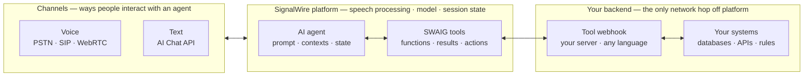

[addresses]: /docs/platform/addresses
[analytics]: /docs/platform/ai/analytics
[best-practices]: /docs/platform/ai/best-practices
[chat-api]: /docs/apis/rest/ai-chat/chat-methods
[chat-client]: /docs/server-sdks/reference/python/agents/ai-chat-client
[chat-gateway]: /docs/server-sdks/reference/python/agents/chat-gateway
[call-transfer]: /docs/server-sdks/guides/call-transfer
[compliance]: /docs/platform/compliance
[content-redaction]: /docs/platform/ai/content-redaction
[contexts]: /docs/server-sdks/guides/contexts-workflows
[datamap]: /docs/server-sdks/guides/data-map
[datasphere]: /docs/server-sdks/reference/python/rest/datasphere
[hints]: /docs/server-sdks/guides/hints
[mcp-gateway]: /docs/server-sdks/guides/mcp-gateway
[prompt-engineering]: /docs/platform/ai/prompt-engineering
[skills]: /docs/server-sdks/guides/understanding-skills
[state-management]: /docs/server-sdks/guides/state-management
[tool-calling]: /docs/platform/ai/tool-calling
[tts]: /docs/platform/voice/tts

SignalWire AI separates conversation from control. The model interprets what a person says and
carries the conversation. Your code checks current data, applies business rules, performs actions,
and returns results that direct what the agent does next.

This division makes the agent **system-directed**. A prompt defines how the agent communicates and
when it should use a tool. Your systems remain the source of truth for facts and decisions that must
be exact, current, or enforced.

An agent definition includes its prompt, contexts, state, and tools. The same definition can handle
voice calls and text conversations while SignalWire runs the model and manages the session.

<llms-ignore>

  

</llms-ignore>

<llms-only>

</llms-only>

## AI capabilities

Explore the ways you can add AI to text conversations and live calls. Each capability links to its
canonical API, SDK, or SWML reference.

<CardGroup cols={2}>

<Card title="AI Chat" icon="regular comments" href="/docs/apis/rest/ai-chat/chat-methods">
  Hold text conversations with the same SignalWire AI agent that handles voice calls. Use the REST
  API directly, [`AIChatClient`](/docs/server-sdks/reference/python/agents/ai-chat-client) from a
  trusted server, or [`ChatGateway`](/docs/server-sdks/reference/python/agents/chat-gateway) from a
  browser-facing application.
</Card>

<Card title="AI Sidecar" icon="regular headset" href="/docs/swml/reference/calling/ai-sidecar">
  Attach a real-time AI observer that listens to a live call and streams coaching, compliance
  alerts, or other agent-facing insights without speaking on the call.
</Card>

<Card title="Live translation" icon="regular globe" href="/docs/swml/reference/calling/live-translate">
  Translate both sides of a voice conversation in real time, inject translated speech, and request
  summaries during or after the session.
</Card>

<Card title="Live transcription" icon="regular waveform-lines" href="/docs/swml/reference/calling/live-transcribe">
  Stream real-time transcripts to your application and request an AI-generated summary while the
  session is active or when it ends.
</Card>

</CardGroup>

## How system-directed AI works

A conversation moves between the model and your systems as the situation requires:

1. A person speaks on a voice channel or sends a turn through the [AI Chat API][chat-api].
2. SignalWire adds the input to the session. The model interprets it using the agent's prompt,
   current context, and state.
3. When the agent needs current information or permission to act, it calls a tool defined through
   the **SignalWire AI Gateway (SWAIG)**.
4. Your code validates the input, reads your systems of record, applies your rules, and returns a
   result. The result can include data for the agent, instructions for the next response, and
   actions for SignalWire to execute.
5. The agent explains the result and continues the conversation. A returned action can update
   state, change context, send a message, transfer a call, or take another step in the conversation.

Consider a taxi dispatcher. The model can recognize that a caller wants a ride and collect the
pickup time. It cannot know which drivers are working. A SWAIG tool sends the requested time to the
dispatch system, where code checks availability and policy. The result tells the agent which times
it may offer instead of leaving that decision to the prompt.

The [Tool calling guide][tool-calling] covers this request and response cycle, including validation,
state, and actions.

## What each layer controls

| Layer | Responsibility |
|---|---|
| Your agent definition | The prompt, tool descriptions, contexts, workflows, and initial configuration you provide |
| SignalWire | Voice and text sessions, the model, conversation state, SWAIG tool routing, and platform actions |
| Your systems | Input validation, current data, business rules, authorization, calculations, and side effects |

A prompt remains useful for identity, tone, conversational goals, and deciding when to reach for a
tool. It is not an enforcement boundary. Put prices, schedules, eligibility rules, and other
authoritative decisions in code. Store checked values in [agent state][state-management] so later
tools use validated data instead of asking the model to recall it.

[Prompt engineering][prompt-engineering] covers the conversational side of this design.
[Best practices][best-practices] explains how to divide work between the prompt and your code.

## One agent across voice and text

Voice and text are channels into the same agent. Both use the same prompt, contexts, state, SWAIG
functions, and tool results.

| Channel | How a person connects | What SignalWire handles |
|---|---|---|
| Voice | A [phone number, SIP URI, or dialable resource name][addresses] over the Public Switched Telephone Network (PSTN), Session Initiation Protocol (SIP), or WebRTC | Audio, end-pointing, speech recognition, the model, and speech synthesis |
| Text | One HTTP request per turn through the [AI Chat API][chat-api] | Conversation state, the model, tool calls, and the text response |

Server applications can send text turns with [`AIChatClient`][chat-client]. Browser and mobile
applications connect through [`ChatGateway`][chat-gateway], which keeps SignalWire credentials in
your trusted application rather than in the client.

Voice-specific settings, such as voices, speech hints, and end-pointing, do not apply to text.
Business rules and tool implementations can remain channel-independent. A SWAIG request identifies
its conversation as `voice` or `chat` when your application needs channel-specific behavior.

## Choose how to build

Each authoring path produces an agent that runs on SignalWire and can connect to your systems.

<CardGroup cols={3}>

<Card title="Server SDK" href="/docs/server-sdks/guides/quickstart" icon="regular code">
  Build agents and tool handlers in application code.
</Card>

<Card title="SWML" href="/docs/swml/reference/calling/ai" icon="regular brackets-curly">
  Define agents directly in JSON or YAML.
</Card>

<Card title="Dashboard" href="/docs/platform/resources#in-the-dashboard" icon="regular browser">
  Configure agents and webhook-backed tools in your SignalWire Space.
</Card>

</CardGroup>

## Extend your agent

Once the agent can converse and call your code, add capabilities based on what the application
needs.

| Goal | Capabilities |
|---|---|
| Connect knowledge and services | Add prebuilt [Skills][skills], retrieve from [DataSphere][datasphere], call REST APIs with [DataMap][datamap], or expose tools through the [Model Context Protocol (MCP) gateway][mcp-gateway] |
| Control the conversation | Use [contexts and workflows][contexts] to change the prompt and available tools, keep verified values in [state][state-management], and [transfer calls][call-transfer] |
| Shape voice interactions | Choose [voices and languages][tts] and add [speech hints][hints] for names and specialized terms |

## Operate agents in production

[Conversation analytics][analytics] provides live diagnostic events for voice calls and a final
report for voice or text conversations. Use those records to inspect transcripts, tool activity,
outcomes, usage, and the measurements available for each channel.

[Content redaction][content-redaction] masks configured sensitive values in conversation records.
The [compliance guides][compliance] cover requirements such as consent, disclosure, access control,
and handling regulated data. Rules that must hold on every conversation belong in your application,
not only in the prompt.

## Start building

<CardGroup cols={2}>

<Card title="Build your first agent" href="/docs/platform/ai/quickstart" icon="regular bolt">
  Build one agent, call it over a phone number, and send it a text turn through the AI Chat API.
</Card>

<Card title="Connect your systems" href="/docs/platform/ai/tool-calling" icon="regular webhook">
  Define SWAIG functions that look up data, enforce rules, update state, and perform actions.
</Card>

<Card title="Write the prompt" href="/docs/platform/ai/prompt-engineering" icon="regular message-lines">
  Structure the agent's role, conversational duties, tool guidance, and guardrails.
</Card>

<Card title="Measure conversations" href="/docs/platform/ai/analytics" icon="regular gauge-high">
  Collect live events and final reports to troubleshoot behavior and improve outcomes.
</Card>

</CardGroup>
