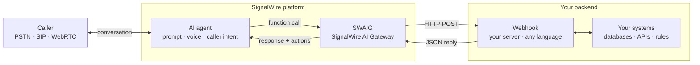
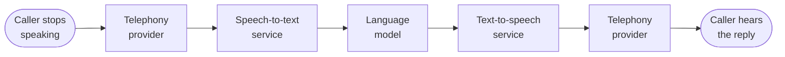
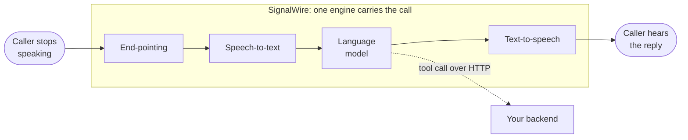

Someone dials your number and an agent answers. It listens, asks for what it needs, checks your
systems, and speaks the answer back. SignalWire runs that agent inside the same network that carries
the call, and your code decides what it is allowed to do.

<llms-ignore>

  

</llms-ignore>

<llms-only>

</llms-only>

## What this is, and what it isn't

Outside telecom, "voice AI" usually means speech synthesis: a service that turns text into audio,
which you then have to get onto a phone call yourself. SignalWire carries the call. An agent lives on
the same platform as your phone numbers, your SIP (Session Initiation Protocol) trunks, and your
browser sessions, so there is no separate telephony vendor to wire up and no audio to shuttle between
providers.

What the agent says is one half of the design. What it is allowed to do is the other half, and that
half belongs in your code. [Prompt engineering](/docs/platform/ai/prompt-engineering) shapes the
conversation; your backend prices the trip, checks the calendar, and books the seat. An agent whose
rules live only in a prompt is an agent you have to
supervise, because the model is the only thing enforcing them. Move the rules into code and you get
something you can leave running unattended, at whatever volume your phone numbers see.

So think of the agent as the front end of the call. Its prompt and voice handle the conversation:
understanding the caller, collecting details, and speaking naturally in whichever of the
[voices and languages](/docs/platform/voice/tts) you pick for it — the platform carries voices from
more than a dozen text-to-speech providers, and an agent handling several languages can use a
different voice for each. Your backend stays the backend,
owning prices, lookups, bookings, and rules. Connecting the two is SWAIG, the SignalWire AI Gateway,
which delivers the agent's tool calls to your backend over HTTP.

## AI in the media path

Every conversational turn passes through four stages before the caller hears a reply:
detecting that the caller has finished speaking (end-pointing), transcribing the audio,
generating the response, and synthesizing the reply as speech.

A common way to assemble voice AI is to connect a separate service for each stage.
The audio then crosses a network boundary at every stage, on every turn:

Every arrow is a network hop that adds delay on every turn, and any one of them can spike.

SignalWire runs all four stages inside the engine that carries the call's audio,
so no network boundary sits between the AI and the call:

Response time stays low, and it stays consistent from turn to turn.
The one network hop left is the one you control: tool calls to your backend, covered in the
[tool calling guide](/docs/platform/ai/tool-calling).
Your server's own response time is still real, and the agent can cover that wait rather than leave
the caller in silence. Filler phrases are set per language in the
[`ai.languages` reference](/docs/swml/reference/calling/ai/languages) and per function in the
[SWAIG functions reference](/docs/swml/reference/calling/ai/swaig/functions), and background audio
comes from [`params.background_file`](/docs/swml/reference/calling/ai/params#paramsbackground_file).

## What it can do, and what it beats

An agent takes several facts from one sentence. A caller who says "I need a van from 123 Gough Street
to the airport, as soon as you can" has supplied the vehicle type, both addresses, and the timing in a
single turn, so the agent can go straight to quoting a fare. A phone menu, or interactive voice
response (IVR), walks the caller down a fixed tree to reach the same point, one question per turn,
with no key for anything the tree didn't anticipate.

Callers also interrupt themselves. A question about the cancellation policy arriving halfway through a
booking costs the caller nothing: the agent answers it, then offers back the same van it had already
found. The caller never restates why they called.

That flexibility isn't a trade against accuracy, because the facts don't come from the model. The fare
and the pickup time come back from your dispatch system through a
[tool call](/docs/platform/ai/tool-calling), so the caller hears the price your systems hold rather
than a plausible number.

For conversations that span genuinely different jobs, contexts keep those jobs apart. Each context
carries its own prompt and its own conversation memory, so an agent that moves from booking a ride to
disputing a charge changes role without carrying the trip details into the billing conversation. That
information boundary is what lets a single agent cover jobs whose compliance rules differ. Contexts
are configured in SignalWire Markup Language (SWML) through the
[AI prompt reference](/docs/swml/reference/calling/ai/prompt), and in the Server SDKs through the
[contexts and workflows guide](/docs/server-sdks/guides/contexts-workflows).

## Ways to build

An agent is a resource on the SignalWire platform however you create it: addressable from phone
numbers, from SIP, and from your applications, running on the same realtime infrastructure. The Server
SDKs generate SWML, so the choice between them is one of authoring rather than of capability.

<CardGroup cols={2}>

<Card title="Server SDKs" href="/docs/server-sdks" icon="regular code">
  Build agents in your own language, with your tools, tests, and deployment pipeline around them.
</Card>

<Card title="SWML" href="/docs/swml" icon="regular file-code">
  Describe an agent in JSON or YAML and host it yourself, or let SignalWire host it for you.
</Card>

</CardGroup>

You can also build an agent without writing code. In your SignalWire Space, an AI Agent is one of the
[resources](/docs/platform/resources) you can add from the Dashboard and assign a phone number to.

## Reaching your systems

An agent reaches your systems through tool calls. It recognizes that a request needs data or an
action, calls a function you defined, and folds the result back into what it says next. That function
runs on your server, in your language, against your database, and it is the single network hop in the
loop described in [AI in the media path](#ai-in-the-media-path).

For questions your documents answer rather than your API, [Datasphere](/docs/server-sdks/guides/builtin-skills#datasphere)
holds the documents and the agent searches them during the conversation, so a revised policy takes
effect as soon as you upload it. An agent can only reach what you put there: there is no wider corpus
behind it, and you decide what it is allowed to look up.

Data flows back the other way too. Each exchange between the agent and the caller can post to a URL
you set as it happens, carrying the transcript along with token counts, per-turn latency, and the
language in use. [Conversation analytics](/docs/platform/ai/analytics) covers that payload and the
live monitoring and tuning it supports.

## Worked examples

The Server SDK guides carry a progression of complete agents, from a first prompt through skills,
tool definitions, state, and multi-agent designs. They are the place to go for code you can run.

<CardGroup cols={2}>

<Card title="Build AI agents" href="/docs/server-sdks/guides/build-ai-agents" icon="regular code">
  Worked examples from a first agent to multi-agent architectures.
</Card>

<Card title="Prefab agents" href="/docs/server-sdks/guides/build-ai-agents#prefab-agents" icon="regular robot">
  Agent archetypes to deploy directly or extend.
</Card>

</CardGroup>

## Security and compliance

The platform encrypts communications, and content redaction masks sensitive values — payment details,
account numbers, health information — in the transcripts, logs, and post-call reports a conversation
leaves behind. Audit logging and granular access controls record who reached what, so you can automate
sensitive communications and still account for them afterward.

Which rules apply depends on why you're calling and what you're handling. The
[compliance guides](/docs/platform/compliance) work through the regulated cases, and each one
identifies the controls that belong in your code rather than in a prompt.

<CardGroup cols={3}>

<Card title="TCPA" href="/docs/platform/compliance/tcpa" icon="regular phone">
  Consent gating, AI disclosure, calling-hour rules, and opt-out handling for outbound voice AI under
  the Telephone Consumer Protection Act (TCPA).
</Card>

<Card title="HIPAA" href="/docs/platform/compliance/hipaa" icon="regular shield-halved">
  Protecting Protected Health Information (PHI) across the call lifecycle, under the Health Insurance
  Portability and Accountability Act (HIPAA).
</Card>

<Card title="Content redaction" href="/docs/platform/ai/content-redaction" icon="regular eye-slash">
  Masking sensitive information in conversation records.
</Card>

</CardGroup>

## Next steps

<CardGroup cols={2}>

<Card title="Quickstart" href="/docs/platform/ai/quickstart" icon="regular rocket">
  Deploy an agent and call it over the phone, with a Server SDK or with SWML.
</Card>

<Card title="Tool calling" href="/docs/platform/ai/tool-calling" icon="regular webhook">
  How agents call your backend, and why business logic belongs in your code rather than the prompt.
</Card>

<Card title="Best practices" href="/docs/platform/ai/best-practices" icon="regular clipboard-check">
  What it takes to hold up in production: latency, speech recognition, testing, and iteration.
</Card>

<Card title="Conversation analytics" href="/docs/platform/ai/analytics" icon="regular chart-line">
  The per-turn data the platform posts to your endpoint, and monitoring a call as it runs.
</Card>

</CardGroup>
