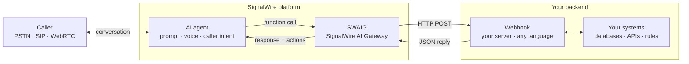
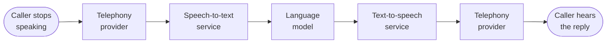

A caller dials your number and an agent answers. It listens, asks for what it needs, checks your
systems, and speaks the answer back.

An AI agent is a resource you create on the SignalWire platform and assign a phone number to.
Understanding the caller, deciding what to say, and speaking the reply all come with the platform.
What you supply is the prompt that shapes how the agent talks, and the functions that connect it to
your systems.

Left to answer on its own, a language model will state a price, a delivery date, or an account balance
that sounds right whether or not it is true. A system-directed agent works differently. The model
conducts the conversation, but your code decides what it can say and do.

Anything that has to be exact, current, or enforced comes from your systems, reached through functions
you define. The agent calls one when the conversation needs a fact or an action. Your code runs and
returns the result for the agent to use.

## How it works

Your agent is part of the SignalWire platform, reachable from the phone network, SIP (Session Initiation
Protocol), a browser, or a mobile app. Recognizing speech, generating the reply, and speaking it back
all happen in the same system that carries the call's audio.

Your systems are the one part that isn't on the platform. SWAIG, the SignalWire AI Gateway, bridges
them. When the agent calls a function you defined, SWAIG posts it to your endpoint over HTTP and hands
your JSON reply back to the conversation. Your handler can be a route in any language, hosted anywhere.

Say the agent dispatches for a taxi company. Asked what a ride to the airport costs, the agent calls
your function instead of guessing, and your code runs your real pricing and returns the fare. Booking a
ride, texting a receipt, or transferring to a person takes the same round trip. Your code can also say
no, so a handler returning "no driver until four" stops the agent from promising a car at two.

<llms-ignore>

  

</llms-ignore>

<llms-only>

</llms-only>

## The platform runs the conversation

Speech recognition, the model, and speech synthesis all come with the platform. Your phone numbers,
SIP trunks, and sessions from a browser or mobile app all reach the same agent, so you don't wire a
telephony vendor to a separate AI vendor, and the call's audio never leaves the platform to be
processed somewhere else.

The agent knows when a caller has finished speaking rather than waiting out a timer, and it takes
several facts from one sentence. A caller who says "a van from 123 Gough Street to the airport, as
soon as you can" has supplied the vehicle, both addresses, and the timing in a single turn. A question
raised mid-booking gets answered, and the booking picks up where it left off. You pick the voice from
more than a dozen [text-to-speech providers](/docs/platform/voice/tts), and an agent working in
several languages can use a different voice for each.

## Your code decides what it can do

Prompt instructions hold most of the time, but code holds every time. Anything that has to be exact,
current, or enforced belongs in a handler rather than in the prompt, and these are the controls that
put it there:

- [**Tool calling**](/docs/platform/ai/tool-calling) keeps prices, availability, and bookings in your
  handlers rather than in the model.
- [**Call transfer**](/docs/server-sdks/guides/call-transfer) hands the call to a person, a queue, or
  another agent, with your code deciding what goes along with it.
- [**Datasphere**](/docs/server-sdks/guides/builtin-skills#datasphere) answers from documents you
  upload and nothing else, so there is no wider corpus for the agent to reach into.
- **Contexts** give each job on a call its own prompt and its own memory, so an agent moving from
  booking a ride to disputing a charge leaves the trip details behind. Configure them in
  [SWML](/docs/swml/reference/calling/ai/prompt) or with the
  [Server SDKs](/docs/server-sdks/guides/contexts-workflows).
- [**Content redaction**](/docs/platform/ai/content-redaction) keeps card numbers and account numbers
  out of your records, and the [compliance guides](/docs/platform/compliance) cover TCPA and HIPAA.

You can watch all of it as it happens. Each exchange between the agent and the caller posts to a URL
you set, carrying the transcript along with token counts, per-turn latency, and the language in use.
[Conversation analytics](/docs/platform/ai/analytics) covers that payload and the live monitoring and
tuning it supports.

Use [prompt engineering](/docs/platform/ai/prompt-engineering) to shape how the agent speaks, and
your code for everything it is allowed to do.

## One central engine

Every conversational turn passes through four stages before the caller hears a reply:
detecting that the caller has finished speaking (end-pointing), transcribing the audio,
generating the response, and synthesizing the reply as speech.

A common way to assemble voice AI is to connect a separate service for each stage.
The audio then crosses a network boundary at every stage, on every turn:

Every arrow is a network hop that adds delay on every turn, and any one of them can spike.

SignalWire runs all four stages inside the engine that carries the call's audio,
so no network boundary sits between the AI and the call:

Response time stays low, and it stays consistent from turn to turn. SignalWire's
[performance analysis](https://signalwire.com/c/performance-analysis) publishes measured turn latency
for the platform.

The only network hop left is the tool call out to your code, and that is a hop you control. Enforcing
a fact in code means fetching it while the caller waits, so your server's own response time is real. The agent
can cover that wait with a filler phrase or background audio rather than leave the caller in silence.
[Tool calling](/docs/platform/ai/tool-calling) covers the round trip, and
[best practices](/docs/platform/ai/best-practices) covers filler phrases and background audio.

## Ways to build

However you create it, an agent is a resource on the SignalWire platform. It is addressable from
phone numbers, from SIP, and from your applications, and it runs on the same realtime infrastructure.
The Server SDKs generate SWML, so the choice between them is one of authoring rather than of
capability.

<CardGroup cols={2}>

<Card title="Server SDKs" href="/docs/server-sdks" icon="regular code">
  Build agents in your own language, with your tools, tests, and deployment pipeline around them.
</Card>

<Card title="SWML" href="/docs/swml" icon="regular file-code">
  Describe an agent in JSON or YAML and host it yourself, or let SignalWire host it for you.
</Card>

</CardGroup>

You can also build an agent without writing code. In your SignalWire Space, an AI Agent is one of the
[resources](/docs/platform/resources) you can add from the Dashboard and assign a phone number to.

## Worked examples

The Server SDK guides carry a progression of complete agents, from a first prompt through skills,
tool definitions, state, and multi-agent designs. They are the place to go for code you can run.

<CardGroup cols={2}>

<Card title="Build AI agents" href="/docs/server-sdks/guides/build-ai-agents" icon="regular code">
  Worked examples from a first agent to multi-agent architectures.
</Card>

<Card title="Prefab agents" href="/docs/server-sdks/guides/build-ai-agents#prefab-agents" icon="regular robot">
  Agent archetypes to deploy directly or extend.
</Card>

</CardGroup>

## Security and compliance

The platform encrypts communications, and content redaction masks sensitive values in the transcripts,
logs, and post-call reports a conversation leaves behind. Those values include payment details, account
numbers, and health information. Audit logging and granular access controls record who reached what, so
you can automate sensitive communications and still account for them afterward.

Which rules apply depends on why you're calling and what you're handling. The
[compliance guides](/docs/platform/compliance) work through the regulated cases, and each one
identifies the controls that belong in your code rather than in a prompt.

<CardGroup cols={3}>

<Card title="TCPA" href="/docs/platform/compliance/tcpa" icon="regular phone">
  Consent gating, AI disclosure, calling-hour rules, and opt-out handling for outbound voice AI under
  the Telephone Consumer Protection Act (TCPA).
</Card>

<Card title="HIPAA" href="/docs/platform/compliance/hipaa" icon="regular shield-halved">
  Protecting Protected Health Information (PHI) across the call lifecycle, under the Health Insurance
  Portability and Accountability Act (HIPAA).
</Card>

<Card title="Content redaction" href="/docs/platform/ai/content-redaction" icon="regular eye-slash">
  Masking sensitive information in conversation records.
</Card>

</CardGroup>

## Next steps

<CardGroup cols={2}>

<Card title="Quickstart" href="/docs/platform/ai/quickstart" icon="regular rocket">
  Deploy an agent and call it over the phone, with a Server SDK or with SWML.
</Card>

<Card title="Tool calling" href="/docs/platform/ai/tool-calling" icon="regular webhook">
  How agents call your backend, and why business logic belongs in your code rather than the prompt.
</Card>

<Card title="Best practices" href="/docs/platform/ai/best-practices" icon="regular clipboard-check">
  The latency, speech recognition, testing, and iteration it takes to hold up in production.
</Card>

<Card title="Conversation analytics" href="/docs/platform/ai/analytics" icon="regular chart-line">
  The per-turn data the platform posts to your endpoint, and monitoring a call as it runs.
</Card>

</CardGroup>
