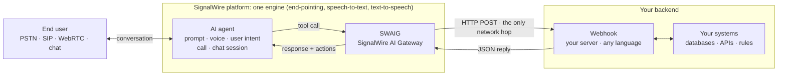

[addresses]: /docs/platform/addresses
[best-practices]: /docs/platform/ai/best-practices
[call-transfer]: /docs/server-sdks/guides/call-transfer
[compliance]: /docs/platform/compliance
[function-result]: /docs/server-sdks/reference/python/agents/function-result
[prompt-engineering]: /docs/platform/ai/prompt-engineering
[result-actions]: /docs/server-sdks/guides/result-actions
[state-management]: /docs/server-sdks/guides/state-management
[swaig-functions]: /docs/swml/reference/calling/ai/swaig/functions
[tool-calling]: /docs/platform/ai/tool-calling
[tts]: /docs/platform/voice/tts

An AI agent is a resource you create on the SignalWire platform, reachable at one or more
[addresses][addresses]: a phone number, a SIP URI, or a name your own application dials. Reading the
intent behind the conversation, deciding what to say, and delivering the reply all come with the
platform. What you supply is the prompt that shapes how the agent responds, and the tools that
connect it to your systems.

The model conducts the conversation, but your code decides what it can say and do. Anything that has
to be exact, current, or enforced comes from your systems, reached through tools you define.

<llms-ignore>

  

</llms-ignore>

<llms-only>



</llms-only>

## How it works

Your agent is reachable from the phone network, SIP (Session Initiation Protocol), a browser, or a
mobile app. On a voice channel, every turn passes through four stages before the caller hears a
reply: detecting that the caller has finished speaking (end-pointing), transcribing the audio,
generating the response, and synthesizing the reply as speech.

Assembling those stages from separate services puts a network boundary at each one, on every turn.
SignalWire runs all four inside the engine that carries the call's audio, so response time stays low
and stays consistent from turn to turn. SignalWire's
[performance analysis](https://signalwire.com/c/performance-analysis) publishes measured turn latency
for the platform.

Your systems are the one part that isn't on the platform, and SWAIG, the SignalWire AI Gateway,
bridges them. The tools you define are SWAIG functions: when the agent calls one, SWAIG posts it to
your endpoint over HTTP and hands your JSON reply back to the conversation. Ask a dispatch agent what
a ride to the airport costs and it calls your tool instead of guessing: your code runs your real
pricing and returns the fare. Your handler can also say no, so returning "no driver until four" stops
the agent from promising a car at two.

That tool call is the only network hop in the round trip, and it is a hop you control. Enforcing a
fact in code means fetching it while the caller waits, so your server's own response time is real.
[Tool calling][tool-calling] covers the round trip, and [best practices][best-practices] covers the
filler phrases and background audio that keep the caller from sitting in silence.

## What you build, what the platform runs

| Layer | Who runs it |
|---|---|
| End-pointing, speech-to-text, the model, text-to-speech | SignalWire, inside the engine carrying the call's audio |
| Phone numbers, SIP trunks, browser and mobile sessions | SignalWire |
| Voice and language | SignalWire, integrated with more than a dozen [text-to-speech providers][tts] for you to choose from; a multilingual agent can use a different voice per language |
| Prompt and conversational style | You |
| Business logic, external data, and actions | You, in handlers on your own infrastructure that the agent calls over SWAIG |

The agent knows when a caller has finished speaking rather than waiting out a timer, and it takes
several facts from one sentence. A caller who says "a van from 123 Gough Street to the airport, as
soon as you can" has supplied the vehicle, both addresses, and the timing in a single turn.

## What your code controls

A prompt is a suggestion the model follows most of the time, not every time. Your code runs the same
logic every time. Every [tool call][tool-calling] hands your code what the agent heard, and takes
back what the agent says and does next.

### Check what the model can't know

Ask a model whether a car is free at two o'clock and it will likely say yes, or invent some other
answer that fits the conversation. It has no schedule to check, and the caller sounds like someone
hoping for a yes. Your dispatch system has the schedule, so that answer has to come from a tool call:

<Tabs>
<Tab title="Server SDK">

```python title="Python backend, using the Server SDK"
from signalwire import AgentBase, FunctionResult


class DispatchAgent(AgentBase):
    def __init__(self):
        super().__init__(name="dispatch")
        self.prompt_add_section(
            "Role",
            "You dispatch taxis. Check availability before promising a pickup.",
        )

        # The agent reads this description to decide when to call the tool, so it
        # says what the tool does and what it needs to do it.
        self.define_tool(
            name="check_availability",
            description="Check whether a driver is free at the time the caller wants",
            parameters={
                "type": "object",
                "properties": {
                    "pickup_time": {
                        "type": "string",
                        "description": "Requested pickup time, as the caller said it",
                    }
                },
                "required": ["pickup_time"],
            },
            handler=self.check_availability,
        )

    def check_availability(self, args, raw_data):
        # args is what the agent heard, transcribed from speech. Treat it the way
        # you'd treat anything typed into a form by a stranger.
        when = parse_time(args.get("pickup_time", ""))  # your own code

        if not when:
            return FunctionResult(
                "Didn't catch a time. Ask the caller when they need the car."
            )

        # Your dispatch system knows who is on shift. The model doesn't, and will
        # promise a car at two if nothing stops it.
        driver = first_free_driver(when)  # your own code

        if not driver:
            # The response is read by the agent, not the caller, so it can carry
            # the constraint and what to do about it.
            return FunctionResult(
                "No driver until four. Offer four o'clock or later, "
                "and don't promise anything sooner."
            )

        # Writing to call state means the booking tool reads a checked time
        # instead of asking the model to remember one.
        return FunctionResult(
            "A driver is free then. Confirm the pickup with the caller."
        ).update_global_data({"pickup_time": when.isoformat(), "driver_id": driver.id})


if __name__ == "__main__":
    DispatchAgent().run()
```

</Tab>
<Tab title="Any HTTP endpoint">

The SDK is a convenience, not a requirement. Any endpoint that accepts JSON over HTTPS can serve a
tool: SignalWire posts the function name and the arguments the agent extracted, and you return a
`response` for the agent to read, plus optional `action` objects the platform executes on the live
call.

When the fleet is busy, the reply is the response alone:

```json title="Your endpoint's JSON reply"
{
  "response": "No driver until four. Offer four o'clock or later, and don't promise anything sooner."
}
```

When a driver is free, the same reply carries an action that writes the checked values to call state.
This is the raw form of what `update_global_data` builds for you:

```json title="Your endpoint's JSON reply"
{
  "response": "A driver is free then. Confirm the pickup with the caller.",
  "action": [
    { "set_global_data": { "pickup_time": "2026-03-04T16:00:00", "driver_id": "d-114" } }
  ]
}
```

</Tab>
</Tabs>

The same shape covers anything the model has no way to check: a reservation on a day you're closed,
a discount the caller doesn't qualify for, a part that's out of stock. Checked values belong in
[call state][state-management] rather than the model's memory, so the booking tool reads
`pickup_time` from there and declares no parameters of its own. A tool that takes no arguments has no
arguments to get wrong.

### Steer the call with tool actions

A result carries the line the agent speaks next. It can also carry [actions][result-actions] the
platform executes on the live conversation:

```python title="Python backend, using the Server SDK"
# A second handler on DispatchAgent, registered with define_tool the same way.
def book_ride(self, args, raw_data):
    state = raw_data.get("global_data", {})  # checked in check_availability
    ride = dispatch(state["pickup_time"], state["driver_id"])  # your dispatch system

    # The result carries what the agent says next and an action the platform runs
    # on the live conversation. Chain as many actions as the moment needs.
    return FunctionResult(
        f"Booked. {ride.driver} arrives at {ride.eta}."
    ).send_sms(
        to_number=raw_data.get("caller_id_number"),
        from_number="+15551234567",
        body=f"{ride.driver}, {ride.plate}, arriving {ride.eta}",
    )
```

Other actions hand the call to a person or [another agent][call-transfer], play audio, run SWML, or
move to a step where a different set of tools is exposed. The
[`FunctionResult` reference][function-result] documents the full set, and
[SWAIG functions][swaig-functions] documents the same actions in their raw JSON form.

Use [prompt engineering][prompt-engineering] to shape how the agent converses, and your code for
everything it is allowed to do.

## Capabilities

Not everything has to be built from scratch. These are the parts of the platform worth knowing before
you design an agent:

<CardGroup cols={3}>

<Card title="Skills" href="/docs/server-sdks/guides/understanding-skills" icon="regular cubes">
  Prebuilt tools you register in one call: date and time, math, web search, Google Maps, and more.
</Card>

<Card title="DataSphere" href="/docs/server-sdks/reference/python/rest/datasphere" icon="regular book-open">
  Retrieval over documents you upload, added as a `search_knowledge` tool that answers from your
  content rather than the model's.
</Card>

<Card title="DataMap" href="/docs/server-sdks/guides/data-map" icon="regular rectangle-api">
  A REST call described declaratively and executed by SignalWire, for tools that need no server of
  your own at all.
</Card>

<Card title="MCP gateway" href="/docs/server-sdks/guides/mcp-gateway" icon="regular layer-group">
  Tools from an MCP (Model Context Protocol) server, exposed to the agent.
</Card>

<Card title="Contexts and workflows" href="/docs/server-sdks/guides/contexts-workflows" icon="regular diagram-project">
  Each job in a conversation gets its own prompt, memory, and set of available tools.
</Card>

<Card title="Call transfer" href="/docs/server-sdks/guides/call-transfer" icon="regular headset">
  Handoff to a person, a queue, or another agent, with your code deciding what goes along.
</Card>

<Card title="Speech hints" href="/docs/server-sdks/guides/hints" icon="regular comments">
  Recognition help for names, jargon, and product terms the model would otherwise mishear.
</Card>

<Card title="Voices and languages" href="/docs/platform/voice/tts" icon="regular waveform-lines">
  More than a dozen text-to-speech providers, with a different voice per language.
</Card>

<Card title="Conversation analytics" href="/docs/platform/ai/analytics" icon="regular gauge-high">
  Every exchange posted to a URL you set, with the transcript, token counts, per-turn latency, and
  language in use.
</Card>

</CardGroup>

## Security and compliance

The platform encrypts communications, and content redaction masks payment details, account numbers,
and health information in the transcripts, logs, and post-call reports a conversation leaves behind.
Audit logging and granular access controls record who reached what.

Which rules apply depends on why you're calling and what you're handling. The
[compliance guides][compliance] work through the regulated cases, and each one identifies the
controls that belong in your code rather than in a prompt.

<CardGroup cols={3}>

<Card title="TCPA" href="/docs/platform/compliance/tcpa" icon="regular phone">
  Consent gating, AI disclosure, calling-hour rules, and opt-out handling for outbound voice AI under
  the Telephone Consumer Protection Act (TCPA).
</Card>

<Card title="HIPAA" href="/docs/platform/compliance/hipaa" icon="regular shield-halved">
  Protecting Protected Health Information (PHI) across the call lifecycle, under the Health Insurance
  Portability and Accountability Act (HIPAA).
</Card>

<Card title="Content redaction" href="/docs/platform/ai/content-redaction" icon="regular eye-slash">
  Masking sensitive information in conversation records.
</Card>

</CardGroup>
