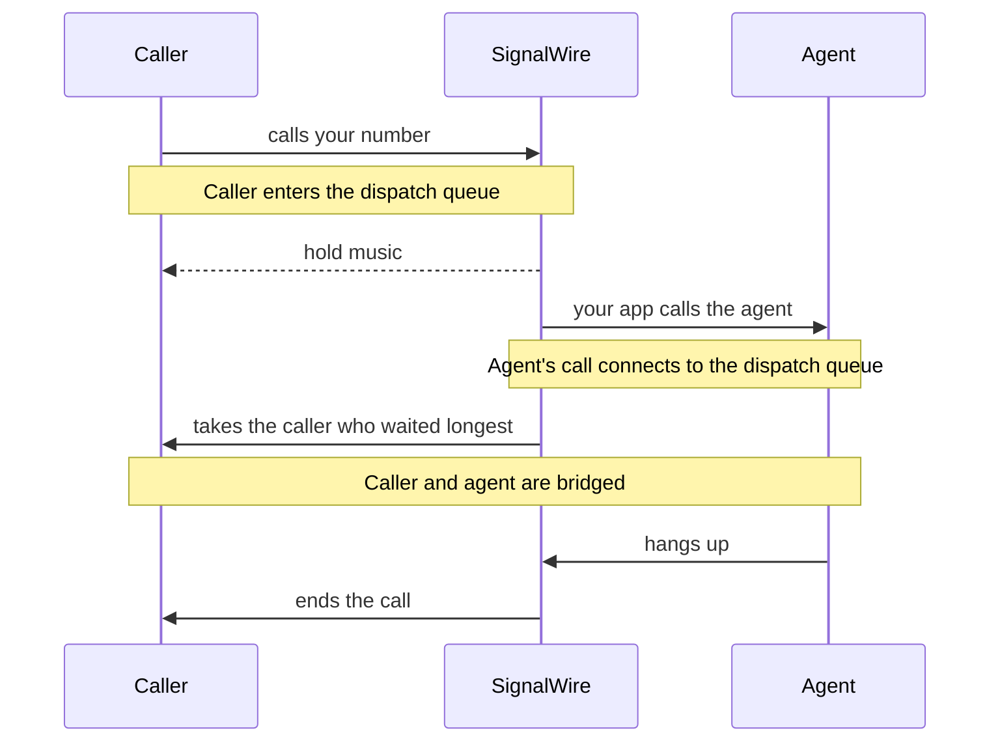

[make-and-receive-calls]: /docs/platform/voice/make-and-receive-calls
[prepare-calls]: /docs/platform/voice/make-and-receive-calls#prepare-for-your-first-call
[place-swml]: /docs/platform/voice/make-and-receive-calls#place-a-call-via-swml
[answer-swml]: /docs/platform/voice/make-and-receive-calls#answer-a-call-via-swml
[place-relay]: /docs/platform/voice/make-and-receive-calls#place-a-call-via-websocket-relay
[answer-relay]: /docs/platform/voice/make-and-receive-calls#answer-a-call-via-websocket-relay
[caller-id]: /docs/platform/voice/how-to-set-caller-id-or-cnam
[trial-mode]: /docs/platform/trial-mode
[webhooks]: /docs/platform/webhooks
[server-sdks]: /docs/server-sdks
[swml-intro]: /docs/swml
[relay-guide]: /docs/server-sdks/guides/relay-client
[swml-enter-queue]: /docs/swml/reference/calling/enter-queue
[swml-connect]: /docs/swml/reference/calling/connect
[swml-switch]: /docs/swml/reference/calling/switch
[call-commands]: /docs/apis/rest/calls/call-commands
[rest-create-queue]: /docs/apis/rest/queues/create-queue
[rest-list-queues]: /docs/apis/rest/queues/list-queues
[rest-update-queue]: /docs/apis/rest/queues/update-queue
[rest-delete-queue]: /docs/apis/rest/queues/delete-queue
[rest-list-members]: /docs/apis/rest/queue-members/list-queue-members
[rest-get-member]: /docs/apis/rest/queue-members/retrieve-queue-member

A call queue holds callers until someone is free to talk to them. Callers hear hold music while
they wait, and each time an agent becomes available, SignalWire connects the agent to the caller
who has waited longest. This guide builds a dispatch line for Bayview Taxi: callers wait in a
`dispatch` queue, and the dispatcher, Ada, takes them one at a time.

## Choose an approach

Follow the section for your app's approach. Each is a complete way to build the queue, and the
sections don't build on each other:

- [SWML](#run-a-call-queue-via-swml): a document puts the caller in the queue with
  `enter_queue`, and a document on the agent's call takes the next caller with `connect`.
  SignalWire plays the hold music and enforces the wait limit.
- [WebSocket (Relay)](#run-a-call-queue-via-websocket-relay): your code puts an answered call in
  the queue and connects an agent's call to it, and handles queue events as they happen. Your
  code plays the hold music and decides when a caller has waited too long. No public URL is
  needed.

Both approaches use the same queues, which you can [create, inspect, and delete over
REST](#monitor-and-manage-queues-via-rest) whichever one you choose.

## Prepare for call queues

Start with working call setup from [Make and receive calls][make-and-receive-calls]. To test a
queue you need two phones: one to call in and wait as the caller, and one to answer as the agent.

<Warning title="Trial projects only call and receive calls from verified numbers">
A [trial project][trial-mode] only places calls to and receives calls from numbers you've
purchased or verified. [Prepare for your first call][prepare-calls] shows how to verify the
phones you'll test with.
</Warning>

Replace these values in the samples you run:

| Value | Replace with |
|---|---|
| `<YOUR_SPACE>` | Your Space's subdomain in `<YOUR_SPACE>.signalwire.com` |
| `<YOUR_PROJECT_ID>` | Your Project ID |
| `<YOUR_API_TOKEN>` | Your API token with the **Voice** permission, used only in server code |
| `<YOUR_CALLER_ID>` | Your SignalWire phone number, or a [verified caller ID][caller-id], in E.164 format |
| `<YOUR_AGENT_NUMBER>` | The phone the agent answers, in E.164 format |
| `<YOUR_BASIC_AUTH_PASSWORD>` | A password you choose for your SWML server |
| `<YOUR_HOLD_MUSIC_URL>` | The public URL of an audio file to play while callers wait (Relay only) |
| `<YOUR_STATUS_WEBHOOK_URL>` | An HTTPS endpoint you control that receives queue events |
| `<YOUR_QUEUE_ID>` | A queue's ID, from [Create a queue](#create-a-queue) or [List queues][rest-list-queues] |
| `<YOUR_CALL_ID>` | The call ID of a waiting caller, from a queue event or [List queue members][rest-list-members] |

## How call queues work

A queue is a named waiting line in your project. Two calls take part in every connection:

1. **The caller's call enters the queue.** SignalWire records the caller's position and plays
   hold audio. A caller can wait in only one queue at a time.
2. **The agent's call connects to the queue.** This is a separate call: an agent dialing in, or a
   call you place to the agent. When it connects to the queue, SignalWire takes the caller who
   has waited longest and bridges the two calls.
3. **The bridge ends.** When either side hangs up, the other side hangs up too, unless you gave it
   SWML to run next with `execute_after_queue`.

A caller can also leave without reaching an agent: they hang up, their wait limit runs out, or
your code removes them.



Queues are matched by exact name. The first time a call enters or connects to a name your project
hasn't used, SignalWire creates a queue with that name, so you can run the examples below without
creating one first.

## Create a queue

Create a queue ahead of time when you want to set it up before any call arrives, or to look up its
ID for the REST examples in this guide. The [Server SDKs][server-sdks] create one with a `name`
that's unique among your project's queues:

<CodeBlocks>
<CodeBlock title="Python — REST client">
```python
# Install: python -m pip install signalwire-sdk==3.4.1
# Save as create_queue.py and run: python create_queue.py
from signalwire.rest import RestClient

client = RestClient(
    project="<YOUR_PROJECT_ID>",
    token="<YOUR_API_TOKEN>",
    host="<YOUR_SPACE>.signalwire.com",
)

queue = client.queues.create(name="dispatch")
print(queue["id"])
```
</CodeBlock>
<CodeBlock title="TypeScript — REST client">
```typescript
// Install: npm install @signalwire/sdk@2.0.5
// This sample also runs as JavaScript: save as create-queue.mjs,
// then run: node create-queue.mjs
import { RestClient } from "@signalwire/sdk";

const client = new RestClient({
  project: "<YOUR_PROJECT_ID>",
  token: "<YOUR_API_TOKEN>",
  host: "<YOUR_SPACE>.signalwire.com",
});

const queue = await client.queues.create({ name: "dispatch" });
console.log(queue.id);
```
</CodeBlock>
</CodeBlocks>

To call the REST API directly, use [Create queue][rest-create-queue]:

<EndpointRequestSnippet endpoint="POST /api/relay/rest/queues" />

The response's `id` is the queue's ID, and `friendly_name` is the name that calls use to reach it.
A request with a name that's already in use fails with a validation error.

`max_size` sets how many callers the queue may hold. [NEEDS SOURCE: what happens to a caller who
enters a queue that has reached max_size]

## Run a call queue via SWML

[`enter_queue`][swml-enter-queue] places the caller in a queue, and [`connect`][swml-connect]
with `to: "queue:<name>"` connects the agent's call to the caller at the front.

### Put a caller in a queue via SWML

Callers to your number hear a greeting, then wait in the `dispatch` queue for up to two minutes.
`wait_time` defaults to 180 seconds. SignalWire plays hold music until an agent connects; set
`wait_url` to an audio file to play your own.

The server below answers calls the way [Answer a call via SWML][answer-swml] does. Run it in place
of that server, with the same public URL and SWML Script.

<CodeBlocks>
<CodeBlock title="Python — SWML builder">
```python
# Install: python -m pip install signalwire-sdk==3.4.1
# Save as dispatch_queue.py and run: python dispatch_queue.py
from signalwire import SWMLBuilder, SWMLService

service = SWMLService(
    name="dispatch-queue",
    route="/swml",
    port=3000,
    basic_auth=("signalwire", "<YOUR_BASIC_AUTH_PASSWORD>"),
    # signalwire-sdk 3.4.1 validates enter_queue against an outdated schema
    # that rejects every valid document, so validation is off for this service.
    schema_validation=False,
)
(
    SWMLBuilder(service)
    .say("Thanks for calling Bayview Taxi. A dispatcher will be with you shortly.")
    .enter_queue(queue_name="dispatch", wait_time=120)
    # Runs only if the caller leaves the queue without reaching an agent.
    .say("All our dispatchers are busy. Please call back in a few minutes.")
    .hangup()
)

service.serve()
```
</CodeBlock>
<CodeBlock title="TypeScript — SWML builder">
```typescript
// Install: npm install @signalwire/sdk@2.0.5
// This sample also runs as JavaScript: save as dispatch-queue.mjs,
// then run: node dispatch-queue.mjs
import { SWMLService } from "@signalwire/sdk";

const service = new SWMLService({
  name: "dispatch-queue",
  route: "/swml",
  port: 3000,
  basicAuth: ["signalwire", "<YOUR_BASIC_AUTH_PASSWORD>"],
});
service
  .getBuilder()
  .say("Thanks for calling Bayview Taxi. A dispatcher will be with you shortly.")
  .enter_queue({ queue_name: "dispatch", wait_time: 120 })
  // Runs only if the caller leaves the queue without reaching an agent.
  .say("All our dispatchers are busy. Please call back in a few minutes.")
  .hangup();

await service.serve();
```
</CodeBlock>
<CodeBlock title="YAML">
```yaml
version: 1.0.0
sections:
  main:
    - play:
        url: say:Thanks for calling Bayview Taxi. A dispatcher will be with you shortly.
    - enter_queue:
        queue_name: dispatch
        wait_time: 120
    - play:
        url: say:All our dispatchers are busy. Please call back in a few minutes.
    - hangup: {}
```
</CodeBlock>
<CodeBlock title="JSON">
```json
{
  "version": "1.0.0",
  "sections": {
    "main": [
      { "play": { "url": "say:Thanks for calling Bayview Taxi. A dispatcher will be with you shortly." } },
      { "enter_queue": { "queue_name": "dispatch", "wait_time": 120 } },
      { "play": { "url": "say:All our dispatchers are busy. Please call back in a few minutes." } },
      { "hangup": {} }
    ]
  }
}
```
</CodeBlock>
</CodeBlocks>

Call your number from the caller phone. You hear the greeting, then hold music. Stay on the line
for the next section, or wait two minutes to hear the busy message.

If you hear the busy message right after the greeting, the caller couldn't enter the queue. When
you set `wait_url`, check that it points at a public audio file in WAV, MP3, AIFF, GSM, or μ-law
format: a file that can't be played ends the wait.

### Connect an agent to a waiting caller via SWML

Call the agent with a document that connects to the queue. When Ada answers, she hears a short
announcement, then the caller who has waited longest. The call is placed as in
[Place a call via SWML][place-swml].

<CodeBlocks>
<CodeBlock title="Python — REST client">
```python
# Install: python -m pip install signalwire-sdk==3.4.1
# Save as call_agent.py and run: python call_agent.py
from signalwire import SWMLBuilder, SWMLService
from signalwire.rest import RestClient

client = RestClient(
    project="<YOUR_PROJECT_ID>",
    token="<YOUR_API_TOKEN>",
    host="<YOUR_SPACE>.signalwire.com",
)

swml = (
    SWMLBuilder(SWMLService(name="call-agent"))
    .say("Connecting you to the next caller in the dispatch queue.")
    .connect(to="queue:dispatch")
    # Runs only if no caller is waiting.
    .say("No callers are waiting.")
    .hangup()
    .build()
)

call = client.calling.dial(
    from_="<YOUR_CALLER_ID>",
    to="<YOUR_AGENT_NUMBER>",
    swml=swml,
)
print(call["id"])
```
</CodeBlock>
<CodeBlock title="TypeScript — REST client">
```typescript
// Install: npm install @signalwire/sdk@2.0.5
// This sample also runs as JavaScript: save as call-agent.mjs,
// then run: node call-agent.mjs
import { RestClient, SwmlBuilder } from "@signalwire/sdk";

const client = new RestClient({
  project: "<YOUR_PROJECT_ID>",
  token: "<YOUR_API_TOKEN>",
  host: "<YOUR_SPACE>.signalwire.com",
});

const swml = new SwmlBuilder()
  .say("Connecting you to the next caller in the dispatch queue.")
  .connect({ to: "queue:dispatch" })
  // Runs only if no caller is waiting.
  .say("No callers are waiting.")
  .hangup()
  .build();

const call = await client.calling.dial({
  from: "<YOUR_CALLER_ID>",
  to: "<YOUR_AGENT_NUMBER>",
  swml,
});
console.log(call.id);
```
</CodeBlock>
<CodeBlock title="YAML">
```yaml
version: 1.0.0
sections:
  main:
    - play:
        url: say:Connecting you to the next caller in the dispatch queue.
    - connect:
        to: queue:dispatch
    - play:
        url: say:No callers are waiting.
    - hangup: {}
```
</CodeBlock>
<CodeBlock title="JSON">
```json
{
  "version": "1.0.0",
  "sections": {
    "main": [
      { "play": { "url": "say:Connecting you to the next caller in the dispatch queue." } },
      { "connect": { "to": "queue:dispatch" } },
      { "play": { "url": "say:No callers are waiting." } },
      { "hangup": {} }
    ]
  }
}
```
</CodeBlock>
</CodeBlocks>

With the caller phone still on hold, run the program and answer the agent phone. After the
announcement, the hold music stops on the caller phone and the two phones can talk. Hang up either
phone to end both calls.

If the agent hears "No callers are waiting.", the queue was empty: `connect` doesn't wait for a
caller to arrive. It sets `connect_result` to `failed` and the document continues. Check that the
caller is still on hold and that both documents use the same queue name, including case.

A `queue:` connect takes exactly one destination and doesn't accept `call_state_url` or
`call_state_events`; track the queue with `status_url` on `enter_queue` instead. To run more SWML
on either call after the bridge ends, such as a short survey for the caller, set
`execute_after_queue` on `enter_queue` or on `connect` to a URL or an inline SWML document.

### Take a caller out of a queue via SWML

SWML has no instruction that removes a caller from a queue. A waiting caller leaves the queue in
one of three ways:

| How the caller leaves | `queue_result` | What happens next |
|---|---|---|
| An agent connects to the queue | `connected` | The calls are bridged, and the caller's document doesn't continue |
| `wait_time` runs out | `timeout` | The document continues with the next instruction |
| The caller hangs up | `hangup` | The call has ended |

In the caller's document from
[Put a caller in a queue via SWML](#put-a-caller-in-a-queue-via-swml), the busy message plays for
any caller who leaves without reaching an agent. To give a different message per reason, put a
[`switch`][swml-switch] on `queue_result` after `enter_queue`.

To remove a caller before their wait runs out, end their call with the `calling.end`
[call command][call-commands], from any process. Get the caller's call ID from a queue event or
the [member list](#monitor-and-manage-queues-via-rest). The [Server SDKs][server-sdks] send the
command with `end`:

<CodeBlocks>
<CodeBlock title="Python — REST client">
```python
# Install: python -m pip install signalwire-sdk==3.4.1
# Save as remove_caller.py and run: python remove_caller.py
from signalwire.rest import RestClient

client = RestClient(
    project="<YOUR_PROJECT_ID>",
    token="<YOUR_API_TOKEN>",
    host="<YOUR_SPACE>.signalwire.com",
)

client.calling.end("<YOUR_CALL_ID>")
```
</CodeBlock>
<CodeBlock title="TypeScript — REST client">
```typescript
// Install: npm install @signalwire/sdk@2.0.5
// This sample also runs as JavaScript: save as remove-caller.mjs,
// then run: node remove-caller.mjs
import { RestClient } from "@signalwire/sdk";

const client = new RestClient({
  project: "<YOUR_PROJECT_ID>",
  token: "<YOUR_API_TOKEN>",
  host: "<YOUR_SPACE>.signalwire.com",
});

await client.calling.end("<YOUR_CALL_ID>");
```
</CodeBlock>
</CodeBlocks>

To call the REST API directly, send `calling.end` to [Call commands][call-commands]:

<EndpointRequestSnippet endpoint="POST /api/calling/calls" example="calling.end" />

The caller's queue reports `leave`, and their call ends.

### Track a queue via SWML

Add `status_url` to the `enter_queue` instruction in
[Put a caller in a queue via SWML](#put-a-caller-in-a-queue-via-swml) to receive a JSON webhook
each time the caller enters or leaves the queue. The [webhooks guide][webhooks] covers endpoint
setup and local testing.

<CodeBlocks>
<CodeBlock title="Python — SWML builder">
```python
    .enter_queue(queue_name="dispatch", wait_time=120, status_url="<YOUR_STATUS_WEBHOOK_URL>")
```
</CodeBlock>
<CodeBlock title="TypeScript — SWML builder">
```typescript
  .enter_queue({ queue_name: "dispatch", wait_time: 120, status_url: "<YOUR_STATUS_WEBHOOK_URL>" })
```
</CodeBlock>
<CodeBlock title="YAML">
```yaml {4}
    - enter_queue:
        queue_name: dispatch
        wait_time: 120
        status_url: <YOUR_STATUS_WEBHOOK_URL>
```
</CodeBlock>
</CodeBlocks>

Each webhook has `event_type: calling.call.queue` and reports what happened in `params.status`:

| `params.status` | Sent when |
|---|---|
| `enqueue` | The caller enters the queue |
| `dequeue` | An agent connects to the queue and takes this caller |
| `leave` | The caller leaves without reaching an agent: `wait_time` runs out, the caller hangs up, or the call is ended |

A caller receives either `dequeue` or `leave`, never both. SignalWire doesn't send updates while
the caller waits, so to watch positions change, read the
[member list](#monitor-and-manage-queues-via-rest).

| Webhook field | Value |
|---|---|
| `params.call_id` | The caller's call ID |
| `params.id` | The queue's ID |
| `params.name` | The queue's name |
| `params.position` | The caller's position in the queue; `0` in `dequeue` |
| `params.size` | The number of callers in the queue; `0` in `dequeue` |
| `params.avg_time` | The average wait in the queue, in seconds |
| `params.enqueue_ts`, `params.dequeue_ts`, `params.leave_ts` | When the caller entered, was taken, or left, in Unix microseconds; `0` when not applicable |

The [`enter_queue` reference][swml-enter-queue] has a complete payload for each event. After
`enter_queue`, the caller's document can also read `entry_position` and `entry_size`, the
caller's position and the queue's size when they entered, and `wait_time`, how many seconds a
caller who left without reaching an agent waited.

## Run a call queue via WebSocket (Relay)

`queue_enter()` in Python or `queueEnter()` in TypeScript places an answered call in a queue. To
connect an agent, call `connect()` on the agent's call with a `queue` device. The caller's code
must play its own hold music and decide when the caller has waited too long: in Relay,
SignalWire plays no hold audio and doesn't apply a wait limit.

### Put a caller in a queue via WebSocket (Relay)

This handler answers each call, plays a greeting, places the caller in the `dispatch` queue, and
loops hold music. It waits for the caller to leave the queue: a `dequeue` event means an agent took
them, and `leave` means they hung up. If neither happens within two minutes, the handler removes
the caller from the queue, plays a busy message, and hangs up.

The handler receives calls the way [Answer a call via WebSocket (Relay)][answer-relay] does. Run it
in place of that handler, with the same topic and Relay Application.

<CodeBlocks>
<CodeBlock title="Python — Relay client">
```python
# Install: python -m pip install signalwire-sdk==3.4.1
# Save as dispatch_queue_relay.py and run: python dispatch_queue_relay.py
import asyncio
from signalwire.relay import RelayClient
from signalwire.relay.event import QueueEvent

GREETING = "Thanks for calling Bayview Taxi. A dispatcher will be with you shortly."
BUSY = "All our dispatchers are busy. Please call back in a few minutes."

client = RelayClient(
    project="<YOUR_PROJECT_ID>",
    token="<YOUR_API_TOKEN>",
    contexts=["inbound-calling"],
)

@client.on_call
async def handle_call(call):
    left_queue = asyncio.get_running_loop().create_future()

    def on_queue(event: QueueEvent):
        print(f"Queue: {event.status}, position {event.position}")
        if event.status in ("dequeue", "leave") and not left_queue.done():
            left_queue.set_result(event.status)

    call.on("calling.call.queue", on_queue)
    await call.answer()
    greeting = await call.play([{"type": "tts", "params": {"text": GREETING}}])
    await greeting.wait()
    await call.queue_enter(queue_name="dispatch")
    hold_music = await call.play(
        [{"type": "audio", "params": {"url": "<YOUR_HOLD_MUSIC_URL>"}}], loop=0
    )

    try:
        await asyncio.wait_for(left_queue, timeout=120)
        await hold_music.stop()
    except asyncio.TimeoutError:
        # No agent took the caller within two minutes.
        await hold_music.stop()
        await call.queue_leave(queue_name="dispatch")
        busy = await call.play([{"type": "tts", "params": {"text": BUSY}}])
        await busy.wait()
        await call.hangup()

    await call.wait_for_ended()

client.run()
```
</CodeBlock>
<CodeBlock title="TypeScript — Relay client">
```typescript
// Install: npm install @signalwire/sdk@2.0.5
// Save as dispatch-queue-relay.mts and run: npx tsx dispatch-queue-relay.mts
import { RelayClient, QueueEvent } from "@signalwire/sdk";

const GREETING = "Thanks for calling Bayview Taxi. A dispatcher will be with you shortly.";
const BUSY = "All our dispatchers are busy. Please call back in a few minutes.";

const client = new RelayClient({
  project: "<YOUR_PROJECT_ID>",
  token: "<YOUR_API_TOKEN>",
  contexts: ["inbound-calling"],
});

client.onCall(async (call) => {
  const leftQueue = new Promise<string>((resolve) => {
    call.on("calling.call.queue", (event) => {
      const { status, position } = event as QueueEvent;
      console.log(`Queue: ${status}, position ${position}`);
      if (status === "dequeue" || status === "leave") resolve(status);
    });
  });

  await call.answer();
  const greeting = await call.play([{ type: "tts", text: GREETING }]);
  await greeting.wait();
  await call.queueEnter("dispatch");
  const holdMusic = await call.play([{ type: "audio", url: "<YOUR_HOLD_MUSIC_URL>" }], { loop: 0 });

  const timeout = new Promise<string>((resolve) => setTimeout(() => resolve("timeout"), 120_000));
  const outcome = await Promise.race([leftQueue, timeout]);
  await holdMusic.stop();

  if (outcome === "timeout") {
    // No agent took the caller within two minutes.
    await call.queueLeave("dispatch");
    const busy = await call.play([{ type: "tts", text: BUSY }]);
    await busy.wait();
    await call.hangup();
  }

  await call.waitForEnded();
});

await client.run();
```
</CodeBlock>
</CodeBlocks>

Call your number from the caller phone. You hear the greeting, then your hold music, and the
handler logs `Queue: enqueue, position 1`. Stay on the line for the next section.

If you hear silence instead of music, check that `<YOUR_HOLD_MUSIC_URL>` is a public audio file.
If no `Queue:` line appears, check that the handler registers its `calling.call.queue` listener
before it calls `queue_enter()`.

### Connect an agent to a waiting caller via WebSocket (Relay)

Dial the agent, then call `connect()` with a `queue` device that names the queue. SignalWire takes
the caller who has waited longest and bridges the two calls. Watch `calling.call.connect` events on
the agent's call to learn the outcome. The call is placed as in
[Place a call via WebSocket (Relay)][place-relay].

<CodeBlocks>
<CodeBlock title="Python — Relay client">
```python
# Install: python -m pip install signalwire-sdk==3.4.1
# Save as call_agent_relay.py and run: python call_agent_relay.py
import asyncio
from signalwire.relay import RelayClient
from signalwire.relay.event import ConnectEvent

client = RelayClient(
    project="<YOUR_PROJECT_ID>",
    token="<YOUR_API_TOKEN>",
    contexts=["default"],
)

async def main():
    async with client:
        call = await client.dial(
            devices=[[{
                "type": "phone",
                "params": {
                    "from_number": "<YOUR_CALLER_ID>",
                    "to_number": "<YOUR_AGENT_NUMBER>",
                    "timeout": 30,
                },
            }]],
        )

        async def hang_up_after_playback(_event):
            if call.state != "ended":
                await call.hangup()

        async def on_connect(event: ConnectEvent):
            print(f"Connect: {event.connect_state}")
            if event.connect_state == "failed":
                # The queue was empty.
                await call.play(
                    [{"type": "tts", "params": {"text": "No callers are waiting."}}],
                    on_completed=hang_up_after_playback,
                )

        call.on("calling.call.connect", on_connect)
        intro = await call.play([{
            "type": "tts",
            "params": {"text": "Connecting you to the next caller in the dispatch queue."},
        }])
        await intro.wait()
        await call.connect(
            devices=[[{"type": "queue", "params": {"queue_name": "dispatch"}}]],
        )
        await call.wait_for_ended()

asyncio.run(main())
```
</CodeBlock>
<CodeBlock title="TypeScript — Relay client">
```typescript
// Install: npm install @signalwire/sdk@2.0.5
// Save as call-agent-relay.mts and run: npx tsx call-agent-relay.mts
import { RelayClient, ConnectEvent } from "@signalwire/sdk";

const client = new RelayClient({
  project: "<YOUR_PROJECT_ID>",
  token: "<YOUR_API_TOKEN>",
  contexts: ["default"],
});

await client.connect();

try {
  const call = await client.dial([[{
    type: "phone",
    params: {
      from_number: "<YOUR_CALLER_ID>",
      to_number: "<YOUR_AGENT_NUMBER>",
      timeout: 30,
    },
  }]]);

  call.on("calling.call.connect", async (event) => {
    const state = (event as ConnectEvent).connectState;
    console.log(`Connect: ${state}`);
    if (state === "failed") {
      // The queue was empty.
      await call.play([{ type: "tts", text: "No callers are waiting." }], {
        onCompleted: async () => {
          if (call.state !== "ended") await call.hangup();
        },
      });
    }
  });

  const intro = await call.play([
    { type: "tts", text: "Connecting you to the next caller in the dispatch queue." },
  ]);
  await intro.wait();
  await call.connect([[{ type: "queue", params: { queue_name: "dispatch" } }]]);
  await call.waitForEnded();
} finally {
  await client.disconnect();
}
```
</CodeBlock>
</CodeBlocks>

With the caller phone still on hold, run the program and answer the agent phone. After the
announcement, the program logs `Connect: connecting`, then `Connect: connected`. The caller's
handler logs `Queue: dequeue`, stops the hold music, and the two phones can talk. Hang up either phone to end both calls.

If the agent hears "No callers are waiting." and the program logs `Connect: failed`, the queue was empty:
`connect()` doesn't wait for a caller to arrive. Check that the caller is still on hold and that
both programs use the same queue name, including case.

### Take a caller out of a queue via WebSocket (Relay)

`queue_leave()` in Python or `queueLeave()` in TypeScript removes the caller from the queue and
sends a `leave` event. The call stays up, so your code decides what the caller hears next. In
[Put a caller in a queue via WebSocket (Relay)](#put-a-caller-in-a-queue-via-websocket-relay), the
handler calls it when the caller's two minutes run out, then plays the busy message. Call it the
same way to offer a callback, send the caller to voicemail, or move them to another queue.

A caller who hangs up leaves the queue on their own, and also sends a `leave` event. To remove a
caller from a process that doesn't hold their call, end the call with the REST `calling.end`
command, as in [Take a caller out of a queue via SWML](#take-a-caller-out-of-a-queue-via-swml).

### Track a queue via WebSocket (Relay)

Register a `calling.call.queue` handler on the caller's call before `queue_enter()`, as the
caller's handler does. The event carries the same statuses as the
[SWML webhooks](#track-a-queue-via-swml): `enqueue`, `dequeue`, and `leave`.

| Python | TypeScript | Value |
|---|---|---|
| `event.status` | `event.status` | `enqueue`, `dequeue`, or `leave` |
| `event.queue_id` | `event.queueId` | The queue's ID |
| `event.queue_name` | `event.queueName` | The queue's name |
| `event.position` | `event.position` | The caller's position in the queue |
| `event.size` | `event.size` | The number of callers in the queue |

The full payload, including `avg_time` and the timestamps, is in `event.params`. To receive the
same events at a webhook instead, pass `status_url` to `queue_enter()` or `statusUrl` to
`queueEnter()`. The [Relay client guide][relay-guide] covers event listeners in depth.

## Monitor and manage queues via REST

The REST API reads and changes the queues that both approaches use. Use it for a wallboard, to
pick a caller to remove, or to clean up a queue you no longer need. The [Server SDKs][server-sdks]
cover each operation:

| Task | Python | TypeScript | REST API |
|---|---|---|---|
| List queues with their current size and average wait | `client.queues.list()` | `client.queues.list()` | [List queues][rest-list-queues] |
| List the callers waiting in a queue | `client.queues.list_members(queue_id)` | `client.queues.listMembers(queueId)` | [List queue members][rest-list-members] |
| Get one waiting caller | `client.queues.get_member(queue_id, call_id)` | `client.queues.getMember(queueId, callId)` | [Get queue member][rest-get-member] |
| Rename a queue or change its `max_size` | `client.queues.update(queue_id, name=…)` | `client.queues.update(queueId, { name })` | [Update queue][rest-update-queue] |
| Delete an empty queue | `client.queues.delete(queue_id)` | `client.queues.delete(queueId)` | [Delete queue][rest-delete-queue] |

This program prints each caller waiting in a queue, with their position and how long they've waited:

<CodeBlocks>
<CodeBlock title="Python — REST client">
```python
# Install: python -m pip install signalwire-sdk==3.4.1
# Save as list_waiting.py and run: python list_waiting.py
from signalwire.rest import RestClient

client = RestClient(
    project="<YOUR_PROJECT_ID>",
    token="<YOUR_API_TOKEN>",
    host="<YOUR_SPACE>.signalwire.com",
)

members = client.queues.list_members("<YOUR_QUEUE_ID>")
for member in members["data"]:
    print(f"{member['position']}: call {member['call_id']}, waiting {member['wait_time']} s")
```
</CodeBlock>
<CodeBlock title="TypeScript — REST client">
```typescript
// Install: npm install @signalwire/sdk@2.0.5
// This sample also runs as JavaScript: save as list-waiting.mjs,
// then run: node list-waiting.mjs
import { RestClient } from "@signalwire/sdk";

const client = new RestClient({
  project: "<YOUR_PROJECT_ID>",
  token: "<YOUR_API_TOKEN>",
  host: "<YOUR_SPACE>.signalwire.com",
});

const members = await client.queues.listMembers("<YOUR_QUEUE_ID>");
for (const member of members.data) {
  console.log(`${member.position}: call ${member.call_id}, waiting ${member.wait_time} s`);
}
```
</CodeBlock>
</CodeBlocks>

<EndpointRequestSnippet endpoint="GET /api/relay/rest/queues/{queue_id}/members" />

Each member's `call_id` is the caller's call ID, which you can pass to `calling.end` to remove
them. A queue's `average_wait_time` is the average time its current callers have waited so far.

Calls find a queue by name, so renaming a queue doesn't move its callers' documents along with it:
the next call that uses the old name creates a new queue with that name. A queue must be empty
before you can delete it.

## Next steps

<CardGroup cols={2}>
  <Card title="enter_queue reference" icon="regular list-ol" href="/docs/swml/reference/calling/enter-queue">
    Every `enter_queue` property, the status webhook payloads, and the variables it sets
  </Card>
  <Card title="connect reference" icon="regular phone-arrow-right" href="/docs/swml/reference/calling/connect">
    Connect to a queue, and run SWML after the bridge with `execute_after_queue`
  </Card>
  <Card title="Queues API" icon="regular rectangle-api" href="/docs/apis/rest/queues/list-queues">
    Create, list, update, and delete queues, and read their waiting callers
  </Card>
  <Card title="Detect machines" icon="regular voicemail" href="/docs/platform/voice/machine-detection">
    Check that a person answered before you connect an agent's outbound call
  </Card>
</CardGroup>
