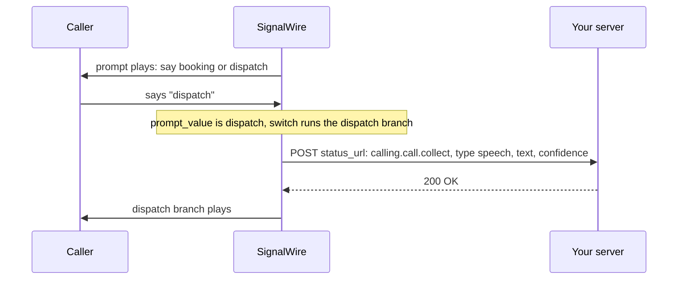
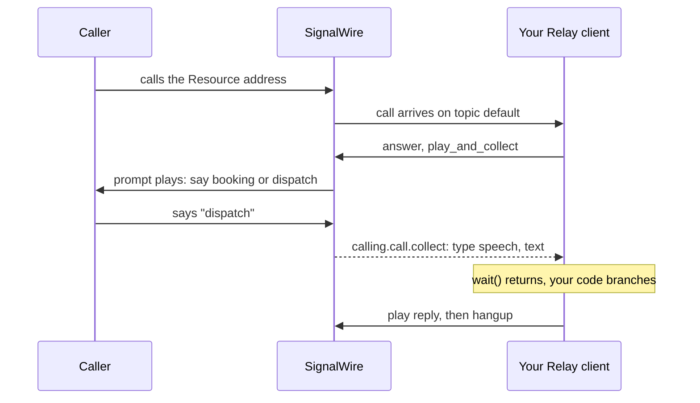

[addresses]: /docs/platform/addresses
[api-credentials]: /docs/platform/your-signalwire-api-space
[browser-sdk]: /docs/browser-sdk
[cfb]: /docs/call-flow-builder
[cfb-forward]: /docs/call-flow-builder/reference/forward-to-phone
[cfb-gather]: /docs/call-flow-builder/reference/gather-input
[cfb-hangup]: /docs/call-flow-builder/reference/hangup-call
[cfb-play]: /docs/call-flow-builder/reference/play-audio-or-tts
[cfb-version]: /docs/call-flow-builder/guides/version
[control-flow]: /docs/swml/guides/goto-execute-transfer-disambiguation
[create-call]: /docs/apis/rest/calls/call-commands
[make-receive]: /docs/platform/voice/make-and-receive-calls
[phone-numbers]: /docs/platform/phone-numbers
[relay-client]: /docs/server-sdks/guides/relay-client
[resources]: /docs/platform/resources
[rest-calling]: /docs/apis/rest/calls/call-commands
[server-sdks]: /docs/server-sdks
[swml]: /docs/swml
[swml-connect]: /docs/swml/reference/calling/connect
[swml-goto]: /docs/swml/reference/calling/goto
[swml-prompt]: /docs/swml/reference/calling/prompt
[swml-switch]: /docs/swml/reference/calling/switch
[swml-transfer]: /docs/swml/reference/calling/transfer
[trial-mode]: /docs/platform/trial-mode

Route a call by deciding what happens after SignalWire answers it: greet the caller, ask a
question, and send the call down a branch based on the reply. The flow you write does not care
whether the call arrived on a phone number, a SIP address, or a browser. Start by answering a call
and speaking one line, then collect speech and branch on it, handle silence and unmatched replies,
and track what the flow heard.

## Pick the right product for routing calls

| Function | SWML | WebSocket (Relay) | REST | Browser SDK | Call Flow Builder |
|---|---|---|---|---|---|
| Answer the call and speak without running a server | <Icon icon="regular circle-check" color="var(--status-success)" /> | <Icon icon="regular circle-xmark" color="var(--status-error)" /> | <Icon icon="regular circle-xmark" color="var(--status-error)" /> | <Icon icon="regular circle-xmark" color="var(--status-error)" /> | <Icon icon="regular circle-check" color="var(--status-success)" /> |
| Collect speech or keypad digits and branch on the result | <Icon icon="regular circle-check" color="var(--status-success)" /> | <Icon icon="regular circle-check" color="var(--status-success)" /> | <Icon icon="regular circle-check" color="var(--status-success)" /> | <Icon icon="regular circle-xmark" color="var(--status-error)" /> | <Icon icon="regular circle-check" color="var(--status-success)" /> |
| Run the routing logic in your own process, step by step, while the call is live | <Icon icon="regular circle-xmark" color="var(--status-error)" /> | <Icon icon="regular circle-check" color="var(--status-success)" /> | <Icon icon="regular circle-check" color="var(--status-success)" /> | <Icon icon="regular circle-xmark" color="var(--status-error)" /> | <Icon icon="regular circle-xmark" color="var(--status-error)" /> |
| Command a call that is already in progress, by its call ID | <Icon icon="regular circle-xmark" color="var(--status-error)" /> | <Icon icon="regular circle-check" color="var(--status-success)" /> | <Icon icon="regular circle-check" color="var(--status-success)" /> | <Icon icon="regular circle-xmark" color="var(--status-error)" /> | <Icon icon="regular circle-xmark" color="var(--status-error)" /> |
| Build the flow visually, with no code | <Icon icon="regular circle-xmark" color="var(--status-error)" /> | <Icon icon="regular circle-xmark" color="var(--status-error)" /> | <Icon icon="regular circle-xmark" color="var(--status-error)" /> | <Icon icon="regular circle-xmark" color="var(--status-error)" /> | <Icon icon="regular circle-check" color="var(--status-success)" /> |

- [SWML][swml] is a JSON or YAML document that SignalWire runs step by step. Generate it with the
  [Server SDKs][server-sdks] or write it by hand, then host it in your Space or serve it from your
  own server.
- [Relay][relay-client] is the WebSocket client in the Server SDKs. Your process receives the call
  and issues each command as the call proceeds.
- The [REST Calling API][rest-calling] sends the same commands over HTTP to a call you already hold
  the ID for. Results come back as webhooks.
- The [Browser SDK][browser-sdk] places and receives calls from a web page. It is the caller or the
  callee, never the flow.
- [Call Flow Builder][cfb] is a visual editor in the Dashboard. You connect nodes and SignalWire
  hosts the result as a Call Flow Resource.

## Prepare for routing calls

Have these values ready:

- Your Space URL, such as `<YOUR_SPACE>.signalwire.com`.
- For the Relay and REST paths, your Project ID and an API token from the Dashboard's
  [API credentials][api-credentials] page, with the **Voice** permission enabled. A hosted SWML
  script or a Call Flow needs no credentials.
- For SWML served from your own server, Python 3 or Node.js and [ngrok](https://ngrok.com/download).
- For the hand-off example, a phone number you can answer, and a number in your Space or a verified
  caller ID to present when the flow dials it.

<Warning title="Trial projects can connect only to verified numbers">
A [trial project][trial-mode] can hand a call to a number it has purchased or verified, and cannot
reach international numbers at all. Every other step in this guide works on a trial project.
</Warning>

This guide picks up once a call reaches your flow. To place calls, or to point a phone number at a
flow, start with [Make and receive calls][make-receive].

## Answer a call and speak

The smallest flow that does something audible: answer, speak one line, hang up. You call it from
the Dashboard, so no phone number is involved yet.

<Steps>

### Set your credentials

Replace these placeholders in the samples. The hosted SWML and Call Flow Builder paths use none of
them.

| Value | Replace with |
|---|---|
| `<YOUR_SPACE>` | Your Space's subdomain in `<YOUR_SPACE>.signalwire.com` |
| `<YOUR_PROJECT_ID>` | Your Project ID |
| `<YOUR_API_TOKEN>` | Your API token |
| `<YOUR_BASIC_AUTH_PASSWORD>` | A password you choose; SignalWire presents it when it fetches a served SWML document |
| `<YOUR_PUBLIC_HOST>` | The hostname of the tunnel in front of your served SWML document |
| `<YOUR_CALL_ID>` | The ID of a call in progress, for the REST samples |
| `<YOUR_STATUS_WEBHOOK_URL>` | A public HTTPS URL on your server that accepts POST requests |
| `<YOUR_DESTINATION>` | A phone number you can answer, in E.164 format |
| `<YOUR_CALLER_ID>` | A number in your Space, or a verified caller ID |

### Write the flow

<Tabs groupId="inbound-flow">
<Tab title="SWML">

The document below answers the call, speaks, and hangs up. The [Server SDKs][server-sdks] build
it from code with the SWML builder and serve it over HTTP; the YAML and JSON forms are what you
paste into the Dashboard.

<CodeBlocks>
<CodeBlock title="Python — SWML builder">
```python
# Install: python -m pip install signalwire-sdk==3.4.1
# Save as route_calls.py and run: python route_calls.py
from signalwire import SWMLBuilder, SWMLService

service = SWMLService(
    name="route-calls",
    route="/swml",
    port=3000,
    basic_auth=("signalwire", "<YOUR_BASIC_AUTH_PASSWORD>"),
)
SWMLBuilder(service).answer().say("Thanks for calling Bayview Taxi. Your flow is running.").hangup()

# Serves the document at /swml. Put the credentials in the URL you give
# SignalWire: https://signalwire:<YOUR_BASIC_AUTH_PASSWORD>@<YOUR_PUBLIC_HOST>/swml
service.serve()
```
</CodeBlock>
<CodeBlock title="TypeScript — SWML builder">
```typescript
// Install: npm install @signalwire/sdk@2.0.5
// This sample also runs as JavaScript: save as route-calls.mjs,
// then run: node route-calls.mjs
import { SWMLService } from "@signalwire/sdk";

const service = new SWMLService({
  name: "route-calls",
  route: "/swml",
  port: 3000,
  basicAuth: ["signalwire", "<YOUR_BASIC_AUTH_PASSWORD>"],
});
service.getBuilder().answer().say("Thanks for calling Bayview Taxi. Your flow is running.").hangup();

// Serves the document at /swml. Put the credentials in the URL you give
// SignalWire: https://signalwire:<YOUR_BASIC_AUTH_PASSWORD>@<YOUR_PUBLIC_HOST>/swml
await service.serve();
```
</CodeBlock>
<CodeBlock title="YAML">
```yaml
version: 1.0.0
sections:
  main:
    - answer: {}
    - play:
        url: "say:Thanks for calling Bayview Taxi. Your flow is running."
    - hangup: {}
```
</CodeBlock>
<CodeBlock title="JSON">
```json
{
  "version": "1.0.0",
  "sections": {
    "main": [
      { "answer": {} },
      { "play": { "url": "say:Thanks for calling Bayview Taxi. Your flow is running." } },
      { "hangup": {} }
    ]
  }
}
```
</CodeBlock>
</CodeBlocks>

Execution starts at the `main` section, which every document must have. Each section is an
ordered list of methods. `answer` picks up the call, `play` speaks the text after the `say:`
prefix, and `hangup` ends the call. The builder's `say` is shorthand for a `play` with a `say:`
URL, and every builder method validates its method against the SWML schema before adding it.

</Tab>
<Tab title="WebSocket (Relay)">

A Relay client stays connected to SignalWire and receives every call routed to its topic. The
handler answers, speaks, and hangs up when playback completes.

<CodeBlocks>
<CodeBlock title="Python — Relay client">
```python
# Install: python -m pip install signalwire-sdk==3.4.1
# Save as route_calls_relay.py and run: python route_calls_relay.py
from signalwire.relay import RelayClient

client = RelayClient(
    project="<YOUR_PROJECT_ID>",
    token="<YOUR_API_TOKEN>",
    host="<YOUR_SPACE>.signalwire.com",
    contexts=["default"],
)


@client.on_call
async def handle_call(call):
    await call.answer()

    async def hang_up_after_playback(_event):
        if call.state != "ended":
            await call.hangup()

    await call.play(
        [{"type": "tts", "params": {"text": "Thanks for calling Bayview Taxi. Your flow is running."}}],
        on_completed=hang_up_after_playback,
    )
    await call.wait_for_ended()


client.run()
```
</CodeBlock>
<CodeBlock title="TypeScript — Relay client">
```typescript
// Install: npm install @signalwire/sdk@2.0.5
// This sample also runs as JavaScript: save as route-calls-relay.mjs,
// then run: node route-calls-relay.mjs
import { RelayClient } from "@signalwire/sdk";

const client = new RelayClient({
  project: "<YOUR_PROJECT_ID>",
  token: "<YOUR_API_TOKEN>",
  host: "<YOUR_SPACE>.signalwire.com",
  contexts: ["default"],
});

client.onCall(async (call) => {
  await call.answer();
  await call.play([
    { type: "tts", text: "Thanks for calling Bayview Taxi. Your flow is running." },
  ], {
    onCompleted: async () => {
      if (call.state !== "ended") await call.hangup();
    },
  });
  await call.waitForEnded();
});

await client.run();
```
</CodeBlock>
</CodeBlocks>

`contexts` names the topic the client listens on. The Relay Application Resource you create in the
next step uses the same name, so SignalWire knows which running client gets the call. `run()`
blocks until you stop the process, reconnecting if the connection drops.

</Tab>
<Tab title="Call Flow Builder">

Open **Tools** > **Call Flow Builder** in the Dashboard, select **Add New**, name the flow, and
select **Save**. Open the flow's **More Options** menu and select **Edit** to reach the canvas.

Every flow starts from the **Handle Call** node. Connect these nodes in order:

1. [**Answer Call**](/docs/call-flow-builder/reference/answer-call).
2. [**Play Audio or TTS**][cfb-play], with the text
   "Thanks for calling Bayview Taxi. Your flow is running." in its Text to Speech setting.
3. [**Hangup Call**][cfb-hangup].

Select **Deploy** to make this version the live one. The [versioning guide][cfb-version] explains
how deployed and draft versions relate.

</Tab>
</Tabs>

### Give the flow a Resource

SignalWire routes calls to [Resources][resources]. This step makes your flow one, and it is the
only place in this guide where delivery differs by surface. Every later task changes the flow's
contents, not how it reaches the call.

<Tabs groupId="inbound-flow">
<Tab title="SWML">

Choose where the document lives.

#### Host it in your Space

1. Open **My Resources**, select **+ Add**, then **Script**, then **SWML Script**.
2. Name it **Route calls**.
3. Under **Handle Calls Using**, choose **Hosted Script**, paste the YAML or JSON form of the
   document into **Primary Script**, and save.

The script is listed under **My Resources**. Return here to replace its contents in each later
task.

#### Serve it from your server

Start the flow from the SWML builder sample:

```bash
python route_calls.py
```

In a second terminal, open a tunnel to port 3000 and keep it running:

```bash
ngrok http 3000
```

ngrok prints an `https://` **Forwarding** URL. Its hostname is your `<YOUR_PUBLIC_HOST>`. Confirm
the document is reachable through the tunnel:

```bash
curl --fail \
  --user "signalwire:<YOUR_BASIC_AUTH_PASSWORD>" \
  "https://<YOUR_PUBLIC_HOST>/swml" \
  | python -m json.tool
```

A working flow returns a JSON document with `"version": "1.0.0"` and a `sections.main` array.

Then create the Resource:

1. Open **My Resources**, select **+ Add**, then **Script**, then **SWML Script**.
2. Name it **Route calls**.
3. Under **Handle Calls Using**, choose **External URL**, enter
   `https://signalwire:<YOUR_BASIC_AUTH_PASSWORD>@<YOUR_PUBLIC_HOST>/swml` in
   **Primary Script URL**, and save.

Later tasks change `route_calls.py` and restart it; the Resource keeps pointing at the tunnel. A
new tunnel usually means a new hostname, so update the Resource whenever it changes.

</Tab>
<Tab title="WebSocket (Relay)">

Start the client and leave it running:

```bash
python route_calls_relay.py
```

In the Dashboard, open **My Resources**, select **+ Add**, then **Relay Application**. Name it and
enter `default` as the **Topic**, the value in the client's `contexts`, then save. Calls to this
Resource reach whichever connected client listens on that topic.

</Tab>
<Tab title="Call Flow Builder">

A deployed Call Flow is already a Resource, listed under **My Resources**.

</Tab>
</Tabs>

### Call it and listen

Open the Resource under **My Resources** and select **Click-to-Test**, under the Resource's name. A
new tab opens, shows "Connecting", and places a browser call to the Resource. Allow microphone
access if the browser asks.

You hear "Thanks for calling Bayview Taxi. Your flow is running." and the call ends.

If it doesn't, match the symptom:

- **The call connects but stays silent.** The flow never ran. For a served document, repeat the
  `curl` request to confirm the tunnel still answers, then check that the External URL Resource
  carries the same URL and password. For a hosted script, reopen it and confirm the document saved
  with a `main` section. For Relay, check that the client process is still running and that the
  Resource's **Topic** matches its `contexts`.
- **`curl` returns 401.** The password in the request differs from the one in the sample's
  `basic_auth`.
- **Click-to-Test is disabled.** It appears only on Resources that handle calls and have an
  address. Open the Resource's **Addresses** and add an alias.

</Steps>

## Collect speech and branch on it

The flow now asks a question and routes on the answer. In every surface the pattern is the same:
play a prompt, wait for input, compare the result, and continue down one path. Bayview Taxi asks
callers to say "booking" or "dispatch". Speech hints tell the recognizer which words to expect,
which makes short single-word replies reliable.

### Collect speech and branch via SWML

Three methods do the work. [`prompt`][swml-prompt] plays the question and waits. Setting any
speech parameter, such as `speech_hints`, switches it from keypad digits to speech; the recognized
text lands in the `prompt_value` variable and the outcome in `prompt_result`.
[`switch`][swml-switch] compares a variable against case keys and runs the matching list, or
`default` when nothing matches. [`transfer`][swml-transfer] jumps to another section and does not
return.

Replace the flow with this version. The `booking` and `dispatch` sections each speak a different
line, and `no_match` catches everything else. The builder's methods append to `main`; the named
sections go through the service.

<CodeBlocks>
<CodeBlock title="Python — SWML builder">
```python
# Install: python -m pip install signalwire-sdk==3.4.1
# Save as route_calls.py and run: python route_calls.py
from signalwire import SWMLBuilder, SWMLService

service = SWMLService(
    name="route-calls",
    route="/swml",
    port=3000,
    basic_auth=("signalwire", "<YOUR_BASIC_AUTH_PASSWORD>"),
)
(
    SWMLBuilder(service)
    .answer()
    .prompt(
        play=["say:Thanks for calling Bayview Taxi. Say booking or dispatch."],
        speech_hints=["booking", "dispatch"],
    )
    .switch(
        variable="prompt_value",
        case={
            "booking": [{"transfer": {"dest": "booking"}}],
            "dispatch": [{"transfer": {"dest": "dispatch"}}],
        },
        default=[{"transfer": {"dest": "no_match"}}],
    )
)

# The builder appends to the main section. Named sections go through the service.
service.add_verb_to_section("booking", "play", {"url": "say:You said booking."})
service.add_verb_to_section("booking", "hangup", {})

service.add_verb_to_section("dispatch", "play", {"url": "say:You said dispatch."})
service.add_verb_to_section("dispatch", "hangup", {})

service.add_verb_to_section("no_match", "play", {"url": "say:Sorry, I didn't catch that. Goodbye."})
service.add_verb_to_section("no_match", "hangup", {})

service.serve()
```
</CodeBlock>
<CodeBlock title="TypeScript — SWML builder">
```typescript
// Install: npm install @signalwire/sdk@2.0.5
// This sample also runs as JavaScript: save as route-calls.mjs,
// then run: node route-calls.mjs
import { SWMLService } from "@signalwire/sdk";

const service = new SWMLService({
  name: "route-calls",
  route: "/swml",
  port: 3000,
  basicAuth: ["signalwire", "<YOUR_BASIC_AUTH_PASSWORD>"],
});
const swml = service.getBuilder();

swml
  .answer()
  .prompt({
    play: ["say:Thanks for calling Bayview Taxi. Say booking or dispatch."],
    speech_hints: ["booking", "dispatch"],
  })
  .switch({
    variable: "prompt_value",
    case: {
      booking: [{ transfer: { dest: "booking" } }],
      dispatch: [{ transfer: { dest: "dispatch" } }],
    },
    default: [{ transfer: { dest: "no_match" } }],
  });

// The builder's verb methods append to the main section. Named sections use addVerbToSection.
swml.addVerbToSection("booking", "play", { url: "say:You said booking." });
swml.addVerbToSection("booking", "hangup", {});

swml.addVerbToSection("dispatch", "play", { url: "say:You said dispatch." });
swml.addVerbToSection("dispatch", "hangup", {});

swml.addVerbToSection("no_match", "play", { url: "say:Sorry, I didn't catch that. Goodbye." });
swml.addVerbToSection("no_match", "hangup", {});

await service.serve();
```
</CodeBlock>
<CodeBlock title="YAML">
```yaml
version: 1.0.0
sections:
  main:
    - answer: {}
    - prompt:
        play:
          - "say:Thanks for calling Bayview Taxi. Say booking or dispatch."
        speech_hints:
          - booking
          - dispatch
    - switch:
        variable: prompt_value
        case:
          booking:
            - transfer:
                dest: booking
          dispatch:
            - transfer:
                dest: dispatch
        default:
          - transfer:
              dest: no_match
  booking:
    - play:
        url: "say:You said booking."
    - hangup: {}
  dispatch:
    - play:
        url: "say:You said dispatch."
    - hangup: {}
  no_match:
    - play:
        url: "say:Sorry, I didn't catch that. Goodbye."
    - hangup: {}
```
</CodeBlock>
<CodeBlock title="JSON">
```json
{
  "version": "1.0.0",
  "sections": {
    "main": [
      { "answer": {} },
      {
        "prompt": {
          "play": ["say:Thanks for calling Bayview Taxi. Say booking or dispatch."],
          "speech_hints": ["booking", "dispatch"]
        }
      },
      {
        "switch": {
          "variable": "prompt_value",
          "case": {
            "booking": [{ "transfer": { "dest": "booking" } }],
            "dispatch": [{ "transfer": { "dest": "dispatch" } }]
          },
          "default": [{ "transfer": { "dest": "no_match" } }]
        }
      }
    ],
    "booking": [
      { "play": { "url": "say:You said booking." } },
      { "hangup": {} }
    ],
    "dispatch": [
      { "play": { "url": "say:You said dispatch." } },
      { "hangup": {} }
    ],
    "no_match": [
      { "play": { "url": "say:Sorry, I didn't catch that. Goodbye." } },
      { "hangup": {} }
    ]
  }
}
```
</CodeBlock>
</CodeBlocks>

`add_verb_to_section` and `addVerbToSection` create a section on first use and append to it after
that. `switch` compares the whole value exactly. SignalWire lowercases recognized speech and strips
its punctuation before storing it in `prompt_value`, so "Booking." still matches the `booking`
case, but "booking please" does not. SWML also has a `cond` method that branches on a JavaScript
expression; the Python SDK cannot emit it, because `add_verb` takes only object-valued methods and
`cond` takes a list, so this guide branches with `switch` on every surface.

Restart the served flow, or paste the new document into the hosted script, then call the Resource
three times: say "booking", say "dispatch", and say nothing. You hear a different line each time.
If every call ends in `no_match`, the recognized text did not equal a case key; the tracking
section below shows what the flow heard.

### Collect speech and branch via WebSocket (Relay)

The [Server SDKs][server-sdks] expose the prompt as `play_and_collect` on the call. It plays the
prompt and resolves when input arrives, times out, or fails. The result carries a `type` of
`speech`, `digit`, `no_input`, or `no_match`, and for speech the recognized `text` with a
`confidence` score. Your code compares the text and continues.

Over REST the same collect command runs against a call you already hold the ID for, so the request
needs the call to exist first, for example a call your Relay client or a hosted script answered.
The result arrives at `status_url` as a `calling.call.collect` event instead of a return value.

<CodeBlocks>
<CodeBlock title="Python — Relay client">
```python
# Install: python -m pip install signalwire-sdk==3.4.1
# Save as route_calls_relay.py and run: python route_calls_relay.py
from signalwire.relay import RelayClient

client = RelayClient(
    project="<YOUR_PROJECT_ID>",
    token="<YOUR_API_TOKEN>",
    host="<YOUR_SPACE>.signalwire.com",
    contexts=["default"],
)


@client.on_call
async def handle_call(call):
    await call.answer()

    action = await call.play_and_collect(
        media=[{"type": "tts", "params": {"text": "Thanks for calling Bayview Taxi. Say booking or dispatch."}}],
        collect={"speech": {"hints": ["booking", "dispatch"], "language": "en-US"}},
    )
    event = await action.wait()
    result = event.params.get("result", {})

    heard = ""
    if result.get("type") == "speech":
        heard = result.get("params", {}).get("text", "").lower()

    if "booking" in heard:
        reply = "You said booking."
    elif "dispatch" in heard:
        reply = "You said dispatch."
    else:
        reply = "Sorry, I didn't catch that. Goodbye."

    async def hang_up_after_playback(_event):
        if call.state != "ended":
            await call.hangup()

    await call.play(
        [{"type": "tts", "params": {"text": reply}}],
        on_completed=hang_up_after_playback,
    )
    await call.wait_for_ended()


client.run()
```
</CodeBlock>
<CodeBlock title="TypeScript — Relay client">
```typescript
// Install: npm install @signalwire/sdk@2.0.5
// Save as route-calls-relay.mts and run: npx tsx route-calls-relay.mts
import { RelayClient } from "@signalwire/sdk";

const client = new RelayClient({
  project: "<YOUR_PROJECT_ID>",
  token: "<YOUR_API_TOKEN>",
  host: "<YOUR_SPACE>.signalwire.com",
  contexts: ["default"],
});

client.onCall(async (call) => {
  await call.answer();

  const action = await call.playAndCollect(
    [{ type: "tts", text: "Thanks for calling Bayview Taxi. Say booking or dispatch." }],
    { speech: { hints: ["booking", "dispatch"], language: "en-US" } },
  );
  const event = await action.wait();
  const result = (event.params.result ?? {}) as {
    type?: string;
    params?: { text?: string };
  };

  const heard = result.type === "speech" ? (result.params?.text ?? "").toLowerCase() : "";

  let reply = "Sorry, I didn't catch that. Goodbye.";
  if (heard.includes("booking")) reply = "You said booking.";
  else if (heard.includes("dispatch")) reply = "You said dispatch.";

  await call.play([{ type: "tts", text: reply }], {
    onCompleted: async () => {
      if (call.state !== "ended") await call.hangup();
    },
  });
  await call.waitForEnded();
});

await client.run();
```
</CodeBlock>
<CodeBlock title="cURL — Calling API">
```bash
# Runs against a call that is already answered; play the question first with calling.play.
curl --request POST "https://<YOUR_SPACE>.signalwire.com/api/calling/calls" \
  --user "<YOUR_PROJECT_ID>:<YOUR_API_TOKEN>" \
  --header "Content-Type: application/json" \
  --data '{
    "id": "<YOUR_CALL_ID>",
    "command": "calling.collect",
    "params": {
      "control_id": "route-1",
      "speech": { "hints": ["booking", "dispatch"], "language": "en-US" },
      "status_url": "<YOUR_STATUS_WEBHOOK_URL>"
    }
  }'
```
</CodeBlock>
</CodeBlocks>

The [Calling API reference][rest-calling] documents every `calling.collect` field.

Because the comparison runs in your code, you can match loosely: `"booking" in heard` accepts
"booking please" as well as "booking". Restart the client and call the Resource three times to hear
the three outcomes. If the client logs an authentication error at startup, the project, token, and
Space do not belong together.

### Collect speech and branch via Call Flow Builder

Replace the **Play Audio or TTS** node with a [**Gather Input**][cfb-gather] node and set its Text
to Speech to "Thanks for calling Bayview Taxi. Say booking or dispatch." Every input option pairs a
key with a word: add one option with **Caller presses** `1` and **Or says** `booking`, and a second
with `2` and `dispatch`. The node grows one output connector per option, plus **Unknown** and
**No Input**.

Connect each option to its own **Play Audio or TTS** node with the matching line, and each of
those to a **Hangup Call** node. Leave **Unknown** and **No Input** for the next task. Select
**Deploy**, then call the Resource three times.

## Handle silence and unmatched speech

A caller who says nothing, or says something the flow did not plan for, must still get an answer.
Each surface reports the two cases separately, so the flow can say something different for each.

### Handle silence and unmatched speech via SWML

After `prompt`, `prompt_result` is `match_speech`, `no_input`, `no_match`, or `failed`, and
`match_digits` once keypad input is enabled. The `default` case already routes everything but a
match to `no_match`; this change makes that section say which one happened, using a JavaScript
expression inside the spoken text. Only the `no_match` section changes.

<CodeBlocks>
<CodeBlock title="Python — SWML builder">
```python {1-6}
service.add_verb_to_section(
    "no_match",
    "play",
    {"url": "say:${prompt_result == 'no_input' ? \"I didn't hear anything.\" : \"I didn't understand that.\"} Goodbye."},
)
service.add_verb_to_section("no_match", "hangup", {})
```
</CodeBlock>
<CodeBlock title="TypeScript — SWML builder">
```typescript {1-4}
swml.addVerbToSection("no_match", "play", {
  url: "say:${prompt_result == 'no_input' ? \"I didn't hear anything.\" : \"I didn't understand that.\"} Goodbye.",
});
swml.addVerbToSection("no_match", "hangup", {});
```
</CodeBlock>
<CodeBlock title="YAML">
```yaml {3}
  no_match:
    - play:
        url: "say:${prompt_result == 'no_input' ? \"I didn't hear anything.\" : \"I didn't understand that.\"} Goodbye."
    - hangup: {}
```
</CodeBlock>
<CodeBlock title="JSON">
```json {2}
    "no_match": [
      { "play": { "url": "say:${prompt_result == 'no_input' ? \"I didn't hear anything.\" : \"I didn't understand that.\"} Goodbye." } },
      { "hangup": {} }
    ]
```
</CodeBlock>
</CodeBlocks>

The wait for input before `no_input` is five seconds by default; `prompt.initial_timeout` changes
it.

### Handle silence and unmatched speech via WebSocket (Relay)

The collect result's `type` is `no_input` when the caller stayed silent and `no_match` when speech
arrived but matched nothing. Replace the reply selection in the Relay sample:

<CodeBlocks>
<CodeBlock title="Python — Relay client">
```python {1-8}
    if "booking" in heard:
        reply = "You said booking."
    elif "dispatch" in heard:
        reply = "You said dispatch."
    elif result.get("type") == "no_input":
        reply = "I didn't hear anything. Goodbye."
    else:
        reply = "I didn't understand that. Goodbye."
```
</CodeBlock>
<CodeBlock title="TypeScript — Relay client">
```typescript {1-4}
  let reply = "I didn't understand that. Goodbye.";
  if (heard.includes("booking")) reply = "You said booking.";
  else if (heard.includes("dispatch")) reply = "You said dispatch.";
  else if (result.type === "no_input") reply = "I didn't hear anything. Goodbye.";
```
</CodeBlock>
</CodeBlocks>

### Handle silence and unmatched speech via Call Flow Builder

Connect the **Gather Input** node's **No Input** connector to a **Play Audio or TTS** node that
says "I didn't hear anything. Goodbye.", and its **Unknown** connector to one that says "I didn't
understand that. Goodbye." Connect both to a **Hangup Call** node and select **Deploy**.

## Track what the flow heard

Three places show what happened on the call: the Dashboard's call log, a webhook you host, and the
Relay client's own event stream.

### See the flow's steps in the Dashboard

Open **Logs** > **Voice** in the Dashboard and select the most recent call. The call's timeline
lists each step the flow ran in order: the call state changes, a **Play** entry for each spoken
line, and a **Collect** entry for the prompt. Select an entry to see its details. A document that
fails to load or contains an invalid method shows a **Script Warning** or **Error** entry with the
reason, so a broken flow is visible here without a support ticket.

The timeline records that input was collected, not what the caller said. For the recognized text
itself, use one of the two paths below.

### Receive the result via SWML

Add a `status_url` to the `prompt` method. SignalWire sends a `calling.call.collect` event to that
URL when input arrives. The same event reaches the `status_url` on a REST `calling.collect`
command.

<CodeBlocks>
<CodeBlock title="Python — SWML builder">
```python {4}
    .prompt(
        play=["say:Thanks for calling Bayview Taxi. Say booking or dispatch."],
        speech_hints=["booking", "dispatch"],
        status_url="<YOUR_STATUS_WEBHOOK_URL>",
    )
```
</CodeBlock>
<CodeBlock title="TypeScript — SWML builder">
```typescript {4}
  .prompt({
    play: ["say:Thanks for calling Bayview Taxi. Say booking or dispatch."],
    speech_hints: ["booking", "dispatch"],
    status_url: "<YOUR_STATUS_WEBHOOK_URL>",
  })
```
</CodeBlock>
<CodeBlock title="YAML">
```yaml {5}
    - prompt:
        play:
          - "say:Thanks for calling Bayview Taxi. Say booking or dispatch."
        speech_hints: [booking, dispatch]
        status_url: "<YOUR_STATUS_WEBHOOK_URL>"
```
</CodeBlock>
<CodeBlock title="JSON">
```json {5}
      {
        "prompt": {
          "play": ["say:Thanks for calling Bayview Taxi. Say booking or dispatch."],
          "speech_hints": ["booking", "dispatch"],
          "status_url": "<YOUR_STATUS_WEBHOOK_URL>"
        }
      }
```
</CodeBlock>
</CodeBlocks>

The POST body for a recognized reply looks like this. `params.result.type` is `no_input` or
`no_match` for the failure cases, with no `params.result.params`.

```json
{
  "event_type": "calling.call.collect",
  "event_channel": "signalwire_calling_...",
  "timestamp": 1757971200.123,
  "project_id": "<YOUR_PROJECT_ID>",
  "space_id": "...",
  "params": {
    "call_id": "<YOUR_CALL_ID>",
    "node_id": "...",
    "control_id": "...",
    "result": {
      "type": "speech",
      "params": {
        "text": "dispatch",
        "confidence": 0.94
      }
    }
  }
}
```

The [`prompt` reference][swml-prompt] documents every field.

<llms-ignore>


</llms-ignore>

<llms-only>



</llms-only>

### Receive the result via WebSocket (Relay)

The Relay client already holds the result: it is the event that `action.wait()` returned. To log
every collect event as it happens, including partial ones, register a handler on the call before
starting the prompt. The [Server SDKs][server-sdks] document the fields of every call event.

<CodeBlocks>
<CodeBlock title="Python — Relay client">
```python {1-4}
    def log_collect(event):
        print("collect:", event.params.get("result"))

    call.on("calling.call.collect", log_collect)
```
</CodeBlock>
<CodeBlock title="TypeScript — Relay client">
```typescript {1-3}
  call.on("calling.call.collect", (event) => {
    console.log("collect:", event.params.result);
  });
```
</CodeBlock>
</CodeBlocks>

<llms-ignore>


</llms-ignore>

<llms-only>



</llms-only>

### Compare the surfaces

| Surface | Where the recognized text shows up | How silence and no match are reported |
|---|---|---|
| SWML | `prompt_value` inside the document; the `status_url` webhook | `prompt_result` is `no_input` or `no_match` |
| WebSocket (Relay) | The `result` on the event `action.wait()` returns; `call.on` handlers | `result.type` is `no_input` or `no_match` |
| REST | The `status_url` webhook only | `params.result.type` is `no_input` or `no_match` |
| Call Flow Builder | Not exposed; the flow branches on the matched option | The **No Input** and **Unknown** connectors |

The Dashboard's call log shows the Collect step and its outcome for every surface, but never the
text.

## Reach the same flow from any channel

The flow you wrote does not know where the call came from. The Dashboard reached it through
**Click-to-Test**. A [phone number][phone-numbers] assigned to the same Resource runs the identical
flow, and so does a SIP address, a browser call to the Resource's [address][addresses], or an
outbound call you place with the [REST Calling API][create-call] and point at the Resource.
Direction and channel are routing details on the Resource; the flow is the same program. That is
also why delivery was a single step above: once a Resource exists, every task in this guide edits
the flow and leaves the routing alone.

## Examples

### Accept a keypad digit as well as speech

Some callers are in a noisy place or on a handset that makes speaking awkward. Offer keys and
words at once, and treat "press 1" and "say booking" as the same answer.

#### Accept a keypad digit as well as speech via SWML

Setting one digit parameter alongside the speech parameters enables both inputs. `max_digits`
joins the prompt, and the digit keys join the switch.

<CodeBlocks>
<CodeBlock title="Python — SWML builder">
```python
# Install: python -m pip install signalwire-sdk==3.4.1
# Save as route_calls.py and run: python route_calls.py
from signalwire import SWMLBuilder, SWMLService

service = SWMLService(
    name="route-calls",
    route="/swml",
    port=3000,
    basic_auth=("signalwire", "<YOUR_BASIC_AUTH_PASSWORD>"),
)
(
    SWMLBuilder(service)
    .answer()
    .prompt(
        play=["say:Thanks for calling Bayview Taxi. Say booking or press 1. Say dispatch or press 2."],
        max_digits=1,
        speech_hints=["booking", "dispatch"],
    )
    .switch(
        variable="prompt_value",
        case={
            "booking": [{"transfer": {"dest": "booking"}}],
            "1": [{"transfer": {"dest": "booking"}}],
            "dispatch": [{"transfer": {"dest": "dispatch"}}],
            "2": [{"transfer": {"dest": "dispatch"}}],
        },
        default=[{"transfer": {"dest": "no_match"}}],
    )
)

# The builder appends to the main section. Named sections go through the service.
service.add_verb_to_section("booking", "play", {"url": "say:You said booking."})
service.add_verb_to_section("booking", "hangup", {})

service.add_verb_to_section("dispatch", "play", {"url": "say:You said dispatch."})
service.add_verb_to_section("dispatch", "hangup", {})

service.add_verb_to_section("no_match", "play", {"url": "say:Sorry, I didn't catch that. Goodbye."})
service.add_verb_to_section("no_match", "hangup", {})

service.serve()
```
</CodeBlock>
<CodeBlock title="TypeScript — SWML builder">
```typescript
// Install: npm install @signalwire/sdk@2.0.5
// This sample also runs as JavaScript: save as route-calls.mjs,
// then run: node route-calls.mjs
import { SWMLService } from "@signalwire/sdk";

const service = new SWMLService({
  name: "route-calls",
  route: "/swml",
  port: 3000,
  basicAuth: ["signalwire", "<YOUR_BASIC_AUTH_PASSWORD>"],
});
const swml = service.getBuilder();

swml
  .answer()
  .prompt({
    play: ["say:Thanks for calling Bayview Taxi. Say booking or press 1. Say dispatch or press 2."],
    max_digits: 1,
    speech_hints: ["booking", "dispatch"],
  })
  .switch({
    variable: "prompt_value",
    case: {
      booking: [{ transfer: { dest: "booking" } }],
      "1": [{ transfer: { dest: "booking" } }],
      dispatch: [{ transfer: { dest: "dispatch" } }],
      "2": [{ transfer: { dest: "dispatch" } }],
    },
    default: [{ transfer: { dest: "no_match" } }],
  });

// The builder's verb methods append to the main section. Named sections use addVerbToSection.
swml.addVerbToSection("booking", "play", { url: "say:You said booking." });
swml.addVerbToSection("booking", "hangup", {});

swml.addVerbToSection("dispatch", "play", { url: "say:You said dispatch." });
swml.addVerbToSection("dispatch", "hangup", {});

swml.addVerbToSection("no_match", "play", { url: "say:Sorry, I didn't catch that. Goodbye." });
swml.addVerbToSection("no_match", "hangup", {});

await service.serve();
```
</CodeBlock>
<CodeBlock title="YAML">
```yaml
version: 1.0.0
sections:
  main:
    - answer: {}
    - prompt:
        play:
          - "say:Thanks for calling Bayview Taxi. Say booking or press 1. Say dispatch or press 2."
        max_digits: 1
        speech_hints:
          - booking
          - dispatch
    - switch:
        variable: prompt_value
        case:
          booking:
            - transfer:
                dest: booking
          "1":
            - transfer:
                dest: booking
          dispatch:
            - transfer:
                dest: dispatch
          "2":
            - transfer:
                dest: dispatch
        default:
          - transfer:
              dest: no_match
  booking:
    - play:
        url: "say:You said booking."
    - hangup: {}
  dispatch:
    - play:
        url: "say:You said dispatch."
    - hangup: {}
  no_match:
    - play:
        url: "say:Sorry, I didn't catch that. Goodbye."
    - hangup: {}
```
</CodeBlock>
<CodeBlock title="JSON">
```json
{
  "version": "1.0.0",
  "sections": {
    "main": [
      { "answer": {} },
      {
        "prompt": {
          "play": ["say:Thanks for calling Bayview Taxi. Say booking or press 1. Say dispatch or press 2."],
          "max_digits": 1,
          "speech_hints": ["booking", "dispatch"]
        }
      },
      {
        "switch": {
          "variable": "prompt_value",
          "case": {
            "booking": [{ "transfer": { "dest": "booking" } }],
            "1": [{ "transfer": { "dest": "booking" } }],
            "dispatch": [{ "transfer": { "dest": "dispatch" } }],
            "2": [{ "transfer": { "dest": "dispatch" } }]
          },
          "default": [{ "transfer": { "dest": "no_match" } }]
        }
      }
    ],
    "booking": [
      { "play": { "url": "say:You said booking." } },
      { "hangup": {} }
    ],
    "dispatch": [
      { "play": { "url": "say:You said dispatch." } },
      { "hangup": {} }
    ],
    "no_match": [
      { "play": { "url": "say:Sorry, I didn't catch that. Goodbye." } },
      { "hangup": {} }
    ]
  }
}
```
</CodeBlock>
</CodeBlocks>

#### Accept a keypad digit as well as speech via WebSocket (Relay)

Pass both `digits` and `speech` in the collect config. A keypad reply comes back with type
`digit` and the pressed key in `params.digits`, so the code maps keys to the same words.

<CodeBlocks>
<CodeBlock title="Python — Relay client">
```python
# Install: python -m pip install signalwire-sdk==3.4.1
# Save as route_calls_relay.py and run: python route_calls_relay.py
from signalwire.relay import RelayClient

client = RelayClient(
    project="<YOUR_PROJECT_ID>",
    token="<YOUR_API_TOKEN>",
    host="<YOUR_SPACE>.signalwire.com",
    contexts=["default"],
)

BY_KEY = {"1": "booking", "2": "dispatch"}


@client.on_call
async def handle_call(call):
    await call.answer()

    action = await call.play_and_collect(
        media=[{"type": "tts", "params": {"text": "Thanks for calling Bayview Taxi. Say booking or press 1. Say dispatch or press 2."}}],
        collect={"digits": {"max": 1}, "speech": {"hints": ["booking", "dispatch"], "language": "en-US"}},
    )
    event = await action.wait()
    result = event.params.get("result", {})

    heard = ""
    if result.get("type") == "digit":
        heard = BY_KEY.get(result.get("params", {}).get("digits", ""), "")
    elif result.get("type") == "speech":
        heard = result.get("params", {}).get("text", "").lower()

    if "booking" in heard:
        reply = "You said booking."
    elif "dispatch" in heard:
        reply = "You said dispatch."
    else:
        reply = "Sorry, I didn't catch that. Goodbye."

    async def hang_up_after_playback(_event):
        if call.state != "ended":
            await call.hangup()

    await call.play(
        [{"type": "tts", "params": {"text": reply}}],
        on_completed=hang_up_after_playback,
    )
    await call.wait_for_ended()


client.run()
```
</CodeBlock>
<CodeBlock title="TypeScript — Relay client">
```typescript
// Install: npm install @signalwire/sdk@2.0.5
// Save as route-calls-relay.mts and run: npx tsx route-calls-relay.mts
import { RelayClient } from "@signalwire/sdk";

const client = new RelayClient({
  project: "<YOUR_PROJECT_ID>",
  token: "<YOUR_API_TOKEN>",
  host: "<YOUR_SPACE>.signalwire.com",
  contexts: ["default"],
});

const byKey: Record<string, string> = { "1": "booking", "2": "dispatch" };

client.onCall(async (call) => {
  await call.answer();

  const action = await call.playAndCollect(
    [{ type: "tts", text: "Thanks for calling Bayview Taxi. Say booking or press 1. Say dispatch or press 2." }],
    { digits: { max: 1 }, speech: { hints: ["booking", "dispatch"], language: "en-US" } },
  );
  const event = await action.wait();
  const result = (event.params.result ?? {}) as {
    type?: string;
    params?: { text?: string; digits?: string };
  };

  let heard = "";
  if (result.type === "digit") heard = byKey[result.params?.digits ?? ""] ?? "";
  else if (result.type === "speech") heard = (result.params?.text ?? "").toLowerCase();

  let reply = "Sorry, I didn't catch that. Goodbye.";
  if (heard.includes("booking")) reply = "You said booking.";
  else if (heard.includes("dispatch")) reply = "You said dispatch.";

  await call.play([{ type: "tts", text: reply }], {
    onCompleted: async () => {
      if (call.state !== "ended") await call.hangup();
    },
  });
  await call.waitForEnded();
});

await client.run();
```
</CodeBlock>
</CodeBlocks>

#### Accept a keypad digit as well as speech via Call Flow Builder

The flow you built already accepts both, because every **Gather Input** option carries a
**Caller presses** key as well as an **Or says** word. Change the prompt text to mention the keys
and select **Deploy**.

### Hand the call to a phone

Once the flow knows what the caller wants, connect them to a person. Bayview Taxi sends dispatch
callers to Ada's desk phone. The caller hears ringing, and the flow resumes only if the connection
fails or the other side hangs up first.

<Warning title="Trial projects can connect only to verified numbers">
On a [trial project][trial-mode], `<YOUR_DESTINATION>` must be a number the project has purchased
or verified.
</Warning>

#### Hand the call to a phone via SWML

The `dispatch` section announces the hand-off, then [`connect`][swml-connect] dials the
destination. The caller's own number is presented as caller ID unless you set `from`.

<CodeBlocks>
<CodeBlock title="Python — SWML builder">
```python
# Install: python -m pip install signalwire-sdk==3.4.1
# Save as route_calls.py and run: python route_calls.py
from signalwire import SWMLBuilder, SWMLService

service = SWMLService(
    name="route-calls",
    route="/swml",
    port=3000,
    basic_auth=("signalwire", "<YOUR_BASIC_AUTH_PASSWORD>"),
)
(
    SWMLBuilder(service)
    .answer()
    .prompt(
        play=["say:Thanks for calling Bayview Taxi. Say booking or dispatch."],
        speech_hints=["booking", "dispatch"],
    )
    .switch(
        variable="prompt_value",
        case={
            "booking": [{"transfer": {"dest": "booking"}}],
            "dispatch": [{"transfer": {"dest": "dispatch"}}],
        },
        default=[{"transfer": {"dest": "no_match"}}],
    )
)

# The builder appends to the main section. Named sections go through the service.
service.add_verb_to_section("booking", "play", {"url": "say:You said booking."})
service.add_verb_to_section("booking", "hangup", {})

service.add_verb_to_section("dispatch", "play", {"url": "say:Connecting you to dispatch."})
service.add_verb_to_section("dispatch", "connect", {"to": "<YOUR_DESTINATION>"})
service.add_verb_to_section("dispatch", "hangup", {})

service.add_verb_to_section("no_match", "play", {"url": "say:Sorry, I didn't catch that. Goodbye."})
service.add_verb_to_section("no_match", "hangup", {})

service.serve()
```
</CodeBlock>
<CodeBlock title="TypeScript — SWML builder">
```typescript
// Install: npm install @signalwire/sdk@2.0.5
// This sample also runs as JavaScript: save as route-calls.mjs,
// then run: node route-calls.mjs
import { SWMLService } from "@signalwire/sdk";

const service = new SWMLService({
  name: "route-calls",
  route: "/swml",
  port: 3000,
  basicAuth: ["signalwire", "<YOUR_BASIC_AUTH_PASSWORD>"],
});
const swml = service.getBuilder();

swml
  .answer()
  .prompt({
    play: ["say:Thanks for calling Bayview Taxi. Say booking or dispatch."],
    speech_hints: ["booking", "dispatch"],
  })
  .switch({
    variable: "prompt_value",
    case: {
      booking: [{ transfer: { dest: "booking" } }],
      dispatch: [{ transfer: { dest: "dispatch" } }],
    },
    default: [{ transfer: { dest: "no_match" } }],
  });

// The builder's verb methods append to the main section. Named sections use addVerbToSection.
swml.addVerbToSection("booking", "play", { url: "say:You said booking." });
swml.addVerbToSection("booking", "hangup", {});

swml.addVerbToSection("dispatch", "play", { url: "say:Connecting you to dispatch." });
swml.addVerbToSection("dispatch", "connect", { to: "<YOUR_DESTINATION>" });
swml.addVerbToSection("dispatch", "hangup", {});

swml.addVerbToSection("no_match", "play", { url: "say:Sorry, I didn't catch that. Goodbye." });
swml.addVerbToSection("no_match", "hangup", {});

await service.serve();
```
</CodeBlock>
<CodeBlock title="YAML">
```yaml
version: 1.0.0
sections:
  main:
    - answer: {}
    - prompt:
        play:
          - "say:Thanks for calling Bayview Taxi. Say booking or dispatch."
        speech_hints:
          - booking
          - dispatch
    - switch:
        variable: prompt_value
        case:
          booking:
            - transfer:
                dest: booking
          dispatch:
            - transfer:
                dest: dispatch
        default:
          - transfer:
              dest: no_match
  booking:
    - play:
        url: "say:You said booking."
    - hangup: {}
  dispatch:
    - play:
        url: "say:Connecting you to dispatch."
    - connect:
        to: "<YOUR_DESTINATION>"
    - hangup: {}
  no_match:
    - play:
        url: "say:Sorry, I didn't catch that. Goodbye."
    - hangup: {}
```
</CodeBlock>
<CodeBlock title="JSON">
```json
{
  "version": "1.0.0",
  "sections": {
    "main": [
      { "answer": {} },
      {
        "prompt": {
          "play": ["say:Thanks for calling Bayview Taxi. Say booking or dispatch."],
          "speech_hints": ["booking", "dispatch"]
        }
      },
      {
        "switch": {
          "variable": "prompt_value",
          "case": {
            "booking": [{ "transfer": { "dest": "booking" } }],
            "dispatch": [{ "transfer": { "dest": "dispatch" } }]
          },
          "default": [{ "transfer": { "dest": "no_match" } }]
        }
      }
    ],
    "booking": [
      { "play": { "url": "say:You said booking." } },
      { "hangup": {} }
    ],
    "dispatch": [
      { "play": { "url": "say:Connecting you to dispatch." } },
      { "connect": { "to": "<YOUR_DESTINATION>" } },
      { "hangup": {} }
    ],
    "no_match": [
      { "play": { "url": "say:Sorry, I didn't catch that. Goodbye." } },
      { "hangup": {} }
    ]
  }
}
```
</CodeBlock>
</CodeBlocks>

#### Hand the call to a phone via WebSocket (Relay)

`connect` takes a list of device groups; each inner list rings at once and the outer list rings in
turn. The dispatch branch bridges to one phone and then waits for the call to end.

<CodeBlocks>
<CodeBlock title="Python — Relay client">
```python
# Install: python -m pip install signalwire-sdk==3.4.1
# Save as route_calls_relay.py and run: python route_calls_relay.py
from signalwire.relay import RelayClient

client = RelayClient(
    project="<YOUR_PROJECT_ID>",
    token="<YOUR_API_TOKEN>",
    host="<YOUR_SPACE>.signalwire.com",
    contexts=["default"],
)


@client.on_call
async def handle_call(call):
    await call.answer()

    action = await call.play_and_collect(
        media=[{"type": "tts", "params": {"text": "Thanks for calling Bayview Taxi. Say booking or dispatch."}}],
        collect={"speech": {"hints": ["booking", "dispatch"], "language": "en-US"}},
    )
    event = await action.wait()
    result = event.params.get("result", {})

    heard = ""
    if result.get("type") == "speech":
        heard = result.get("params", {}).get("text", "").lower()

    if "dispatch" in heard:
        announce = await call.play([{"type": "tts", "params": {"text": "Connecting you to dispatch."}}])
        await announce.wait()
        await call.connect([[{
            "type": "phone",
            "params": {"to_number": "<YOUR_DESTINATION>", "from_number": "<YOUR_CALLER_ID>", "timeout": 30},
        }]])
        await call.wait_for_ended()
        return

    reply = "You said booking." if "booking" in heard else "Sorry, I didn't catch that. Goodbye."

    async def hang_up_after_playback(_event):
        if call.state != "ended":
            await call.hangup()

    await call.play(
        [{"type": "tts", "params": {"text": reply}}],
        on_completed=hang_up_after_playback,
    )
    await call.wait_for_ended()


client.run()
```
</CodeBlock>
<CodeBlock title="TypeScript — Relay client">
```typescript
// Install: npm install @signalwire/sdk@2.0.5
// Save as route-calls-relay.mts and run: npx tsx route-calls-relay.mts
import { RelayClient } from "@signalwire/sdk";

const client = new RelayClient({
  project: "<YOUR_PROJECT_ID>",
  token: "<YOUR_API_TOKEN>",
  host: "<YOUR_SPACE>.signalwire.com",
  contexts: ["default"],
});

client.onCall(async (call) => {
  await call.answer();

  const action = await call.playAndCollect(
    [{ type: "tts", text: "Thanks for calling Bayview Taxi. Say booking or dispatch." }],
    { speech: { hints: ["booking", "dispatch"], language: "en-US" } },
  );
  const event = await action.wait();
  const result = (event.params.result ?? {}) as {
    type?: string;
    params?: { text?: string };
  };
  const heard = result.type === "speech" ? (result.params?.text ?? "").toLowerCase() : "";

  if (heard.includes("dispatch")) {
    const announce = await call.play([{ type: "tts", text: "Connecting you to dispatch." }]);
    await announce.wait();
    await call.connect([[{
      type: "phone",
      params: { to_number: "<YOUR_DESTINATION>", from_number: "<YOUR_CALLER_ID>", timeout: 30 },
    }]]);
    await call.waitForEnded();
    return;
  }

  const reply = heard.includes("booking") ? "You said booking." : "Sorry, I didn't catch that. Goodbye.";
  await call.play([{ type: "tts", text: reply }], {
    onCompleted: async () => {
      if (call.state !== "ended") await call.hangup();
    },
  });
  await call.waitForEnded();
});

await client.run();
```
</CodeBlock>
</CodeBlocks>

#### Hand the call to a phone via Call Flow Builder

Connect the `dispatch` option to a [**Forward to Phone**][cfb-forward] node with
`<YOUR_DESTINATION>` as its number, then select **Deploy**.

### Ask again when the caller says nothing

One retry turns a dead end into a second chance. Ask the question again after silence, then give
up.

#### Ask again when the caller says nothing via SWML

[`goto`][swml-goto] jumps to a label within the same section, and its `when` condition and `max`
count keep the loop bounded. A `label` before the prompt and a conditional `goto` after it repeat
the question once. The TypeScript builder has a `label` method; the Python SDK cannot emit
`label`, whose value is a bare string rather than an object, so from Python paste the YAML or JSON
form into a hosted script. The [control flow guide][control-flow] compares `goto` with `execute`
and `transfer`.

<CodeBlocks>
<CodeBlock title="TypeScript — SWML builder">
```typescript
// Install: npm install @signalwire/sdk@2.0.5
// This sample also runs as JavaScript: save as route-calls.mjs,
// then run: node route-calls.mjs
import { SWMLService } from "@signalwire/sdk";

const service = new SWMLService({
  name: "route-calls",
  route: "/swml",
  port: 3000,
  basicAuth: ["signalwire", "<YOUR_BASIC_AUTH_PASSWORD>"],
});
const swml = service.getBuilder();

swml
  .answer()
  .label("ask")
  .prompt({
    play: ["say:Thanks for calling Bayview Taxi. Say booking or dispatch."],
    speech_hints: ["booking", "dispatch"],
  })
  .goto({ label: "ask", when: "prompt_result == 'no_input'", max: 1 })
  .switch({
    variable: "prompt_value",
    case: {
      booking: [{ transfer: { dest: "booking" } }],
      dispatch: [{ transfer: { dest: "dispatch" } }],
    },
    default: [{ transfer: { dest: "no_match" } }],
  });

// The builder's verb methods append to the main section. Named sections use addVerbToSection.
swml.addVerbToSection("booking", "play", { url: "say:You said booking." });
swml.addVerbToSection("booking", "hangup", {});

swml.addVerbToSection("dispatch", "play", { url: "say:You said dispatch." });
swml.addVerbToSection("dispatch", "hangup", {});

swml.addVerbToSection("no_match", "play", { url: "say:Sorry, I didn't catch that. Goodbye." });
swml.addVerbToSection("no_match", "hangup", {});

await service.serve();
```
</CodeBlock>
<CodeBlock title="YAML">
```yaml
version: 1.0.0
sections:
  main:
    - answer: {}
    - label: ask
    - prompt:
        play:
          - "say:Thanks for calling Bayview Taxi. Say booking or dispatch."
        speech_hints:
          - booking
          - dispatch
    - goto:
        label: ask
        when: "prompt_result == 'no_input'"
        max: 1
    - switch:
        variable: prompt_value
        case:
          booking:
            - transfer:
                dest: booking
          dispatch:
            - transfer:
                dest: dispatch
        default:
          - transfer:
              dest: no_match
  booking:
    - play:
        url: "say:You said booking."
    - hangup: {}
  dispatch:
    - play:
        url: "say:You said dispatch."
    - hangup: {}
  no_match:
    - play:
        url: "say:Sorry, I didn't catch that. Goodbye."
    - hangup: {}
```
</CodeBlock>
<CodeBlock title="JSON">
```json
{
  "version": "1.0.0",
  "sections": {
    "main": [
      { "answer": {} },
      { "label": "ask" },
      {
        "prompt": {
          "play": ["say:Thanks for calling Bayview Taxi. Say booking or dispatch."],
          "speech_hints": ["booking", "dispatch"]
        }
      },
      {
        "goto": {
          "label": "ask",
          "when": "prompt_result == 'no_input'",
          "max": 1
        }
      },
      {
        "switch": {
          "variable": "prompt_value",
          "case": {
            "booking": [{ "transfer": { "dest": "booking" } }],
            "dispatch": [{ "transfer": { "dest": "dispatch" } }]
          },
          "default": [{ "transfer": { "dest": "no_match" } }]
        }
      }
    ],
    "booking": [
      { "play": { "url": "say:You said booking." } },
      { "hangup": {} }
    ],
    "dispatch": [
      { "play": { "url": "say:You said dispatch." } },
      { "hangup": {} }
    ],
    "no_match": [
      { "play": { "url": "say:Sorry, I didn't catch that. Goodbye." } },
      { "hangup": {} }
    ]
  }
}
```
</CodeBlock>
</CodeBlocks>

#### Ask again when the caller says nothing via WebSocket (Relay)

A loop around the prompt exits on the first reply of any kind and gives up after two silent
attempts.

<CodeBlocks>
<CodeBlock title="Python — Relay client">
```python
# Install: python -m pip install signalwire-sdk==3.4.1
# Save as route_calls_relay.py and run: python route_calls_relay.py
from signalwire.relay import RelayClient

client = RelayClient(
    project="<YOUR_PROJECT_ID>",
    token="<YOUR_API_TOKEN>",
    host="<YOUR_SPACE>.signalwire.com",
    contexts=["default"],
)


@client.on_call
async def handle_call(call):
    await call.answer()

    result = {}
    for _attempt in range(2):
        action = await call.play_and_collect(
            media=[{"type": "tts", "params": {"text": "Thanks for calling Bayview Taxi. Say booking or dispatch."}}],
            collect={"speech": {"hints": ["booking", "dispatch"], "language": "en-US"}},
        )
        event = await action.wait()
        result = event.params.get("result", {})
        if result.get("type") != "no_input":
            break

    heard = ""
    if result.get("type") == "speech":
        heard = result.get("params", {}).get("text", "").lower()

    if "booking" in heard:
        reply = "You said booking."
    elif "dispatch" in heard:
        reply = "You said dispatch."
    elif result.get("type") == "no_input":
        reply = "I didn't hear anything. Goodbye."
    else:
        reply = "I didn't understand that. Goodbye."

    async def hang_up_after_playback(_event):
        if call.state != "ended":
            await call.hangup()

    await call.play(
        [{"type": "tts", "params": {"text": reply}}],
        on_completed=hang_up_after_playback,
    )
    await call.wait_for_ended()


client.run()
```
</CodeBlock>
<CodeBlock title="TypeScript — Relay client">
```typescript
// Install: npm install @signalwire/sdk@2.0.5
// Save as route-calls-relay.mts and run: npx tsx route-calls-relay.mts
import { RelayClient } from "@signalwire/sdk";

const client = new RelayClient({
  project: "<YOUR_PROJECT_ID>",
  token: "<YOUR_API_TOKEN>",
  host: "<YOUR_SPACE>.signalwire.com",
  contexts: ["default"],
});

type CollectResult = { type?: string; params?: { text?: string } };

client.onCall(async (call) => {
  await call.answer();

  let result: CollectResult = {};
  for (let attempt = 0; attempt < 2; attempt++) {
    const action = await call.playAndCollect(
      [{ type: "tts", text: "Thanks for calling Bayview Taxi. Say booking or dispatch." }],
      { speech: { hints: ["booking", "dispatch"], language: "en-US" } },
    );
    const event = await action.wait();
    result = (event.params.result ?? {}) as CollectResult;
    if (result.type !== "no_input") break;
  }

  const heard = result.type === "speech" ? (result.params?.text ?? "").toLowerCase() : "";

  let reply = "I didn't understand that. Goodbye.";
  if (heard.includes("booking")) reply = "You said booking.";
  else if (heard.includes("dispatch")) reply = "You said dispatch.";
  else if (result.type === "no_input") reply = "I didn't hear anything. Goodbye.";

  await call.play([{ type: "tts", text: reply }], {
    onCompleted: async () => {
      if (call.state !== "ended") await call.hangup();
    },
  });
  await call.waitForEnded();
});

await client.run();
```
</CodeBlock>
</CodeBlocks>

## Next steps

<CardGroup cols={2}>

<Card title="Make and receive calls" href="/docs/platform/voice/make-and-receive-calls" icon="regular phone">
  Point a phone number at this flow, or place the call yourself and run the flow once the
  destination answers.
</Card>

<Card title="Simple IVR" href="/docs/swml/guides/ivr" icon="regular phone-office">
  A recorded, multi-department menu in hosted SWML that connects each branch to a real number.
</Card>

<Card title="Expose your server to the internet" href="/docs/server-sdks/guides/exposing-agents" icon="regular server">
  Move a served SWML document from a tunnel to a production host.
</Card>

<Card title="Call Flow Builder" href="/docs/call-flow-builder" icon="regular diagram-project">
  Every node the visual editor offers, including request, recording, and AI agent nodes.
</Card>

</CardGroup>
