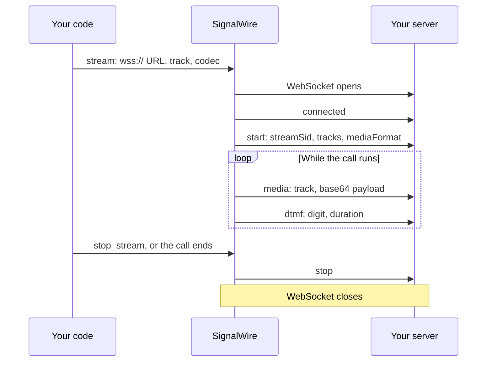

[api-credentials]: /docs/platform/your-signalwire-api-space
[phone-numbers]: /docs/platform/phone-numbers
[caller-id]: /docs/platform/voice/how-to-set-caller-id-or-cnam
[trial-mode]: /docs/platform/trial-mode
[webhooks]: /docs/platform/webhooks
[call-commands]: /docs/apis/rest/calls/call-commands
[swml-stream]: /docs/swml/reference/calling/stream
[swml-stop-stream]: /docs/swml/reference/calling/stop-stream
[swml-connect]: /docs/swml/reference/calling/connect
[swml-sleep]: /docs/swml/reference/calling/sleep
[stream-status-callback]: /docs/apis/rest/webhooks/stream-status-callback
[swml-join-conference]: /docs/swml/reference/calling/join-conference
[relay-connect-py]: /docs/server-sdks/reference/python/relay/call/connect

Stream the audio of a live call to a WebSocket server you run, in near real time. SignalWire opens
a connection to your `wss://` URL, tells you the stream's format, and then sends the call's audio as
a series of JSON messages. Start by streaming your own voice to a small test server, then stop the
stream on demand, decode the audio, and send audio back into the call with a bidirectional stream.

## Prepare for your first stream

Have these values ready:

- Your Space URL, such as `<YOUR_SPACE>.signalwire.com`.
- Your Project ID and API token from the Dashboard's [API credentials][api-credentials] page.
  Enable the token's **Voice** permission for the Calling API.
- A voice-capable [phone number purchased in your Space][phone-numbers] or a
  [verified caller ID][caller-id] to place the test call from.
- A phone you can answer and speak into.
- A machine that can run a small WebSocket server and expose it to the internet over TLS.

<Warning title="Stream URLs must use wss://">
SignalWire connects to your server over a secure WebSocket only. A plain `ws://` URL is rejected.
During development, run the server locally and put a TLS tunnel in front of it. The
[webhooks guide][webhooks] shows how to expose a local port with a tunneling tool.
</Warning>

<Warning title="Trial projects and international calls are restricted">
A [trial project][trial-mode] can dial only numbers it has purchased or verified, and cannot call
internationally at all.
</Warning>

## Stream your first call

Call your own phone, stream what you say to a test server, and watch the audio frames arrive.

<Steps>

### Choose how to start the stream

Choose the approach that fits where you want the start and stop decisions to live. A stream starts
from a SignalWire Markup Language (SWML) document, from the REST Calling API, or from a Server SDK;
the Browser SDK can't start one.

| What you want to do | Where to start |
|---|---|
| Start the stream as part of the call's instructions, when the call is placed or answered | [SWML `stream`](#start-the-stream), inline in a REST `dial` request or served from your SWML endpoint |
| Start or stop a stream on a call that is already in progress, from any process that knows the call ID | [REST Calling API](#start-the-stream), using cURL or a Server SDK |
| Control the stream in real time from code that holds a persistent connection to the call | [WebSocket (Relay)](#start-the-stream), using a Server SDK |

Each approach delivers the same audio to the same kind of server, but they differ in how you
control the stream afterward.

| Function | SWML | REST | WebSocket (Relay) |
|---|---|---|---|
| Start a stream when the call begins, with no extra request | <Icon icon="regular circle-check" color="var(--status-success)" /> | <Icon icon="regular circle-xmark" color="var(--status-error)" /> | <Icon icon="regular circle-xmark" color="var(--status-error)" /> |
| Start or stop a stream on a call already in progress, by its call ID | <Icon icon="regular circle-xmark" color="var(--status-error)" /> | <Icon icon="regular circle-check" color="var(--status-success)" /> | <Icon icon="regular circle-check" color="var(--status-success)" /> |
| Stop a stream from your own code as soon as your server has what it needs | <Icon icon="regular circle-xmark" color="var(--status-error)" /> | <Icon icon="regular circle-check" color="var(--status-success)" /> | <Icon icon="regular circle-check" color="var(--status-success)" /> |
| Receive stream start and stop events as HTTP callbacks to a URL you host | <Icon icon="regular circle-check" color="var(--status-success)" /> | <Icon icon="regular circle-check" color="var(--status-success)" /> | <Icon icon="regular circle-check" color="var(--status-success)" /> |
| Receive stream events in your own code, with no public webhook URL | <Icon icon="regular circle-xmark" color="var(--status-error)" /> | <Icon icon="regular circle-xmark" color="var(--status-error)" /> | <Icon icon="regular circle-check" color="var(--status-success)" /> |
| Send audio back into the call over the same connection | <Icon icon="regular circle-check" color="var(--status-success)" /> | <Icon icon="regular circle-check" color="var(--status-success)" /> | <Icon icon="regular circle-check" color="var(--status-success)" /> |

The `stream` instruction and the REST and Relay stream commands send audio to your server in one
direction. A [bidirectional stream](#stream-in-both-directions) is a `connect` destination: SWML
connects to it directly, a REST `dial` request carries that SWML inline, and Relay passes it to
`connect`.

### Set your credentials and URLs

Replace these values in the code samples you choose:

| Value | Replace with |
|---|---|
| `<YOUR_SPACE>` | Your Space's subdomain in `<YOUR_SPACE>.signalwire.com` |
| `<YOUR_PROJECT_ID>` | Your Project ID |
| `<YOUR_API_TOKEN>` | Your API token |
| `<YOUR_CALLER_ID>` | Your caller ID number |
| `<YOUR_DESTINATION>` | Your own phone number in [E.164 format](/docs/platform/what-is-e164), such as `+12025550123` |
| `<YOUR_AUDIO_STREAM_URL>` | The public `wss://` URL of the server you run in the next step |

### Run a WebSocket server

The server below accepts the connection, logs each message type, and counts the audio frames it
receives. Run it, then expose port `8080` over TLS and use the resulting `wss://` URL as
`<YOUR_AUDIO_STREAM_URL>`.

<CodeBlocks>
<CodeBlock title="Python — websockets">
```python
# Install: python -m pip install websockets
# Save as stream_server.py and run: python stream_server.py
import asyncio
import base64
import json

from websockets.asyncio.server import serve


async def handle(websocket):
    frames = 0
    async for message in websocket:
        event = json.loads(message)
        match event["event"]:
            case "connected":
                print(f"Connected: protocol {event['protocol']} {event['version']}")
            case "start":
                start = event["start"]
                print(f"Stream {start['streamSid']} started")
                print(f"  tracks: {start['tracks']}")
                print(f"  format: {start['mediaFormat']}")
            case "media":
                audio = base64.b64decode(event["media"]["payload"])
                frames += 1
                if frames % 50 == 0:
                    track = event["media"]["track"]
                    print(f"{frames} frames received, latest {len(audio)} bytes on {track}")
            case "dtmf":
                print(f"Key pressed: {event['dtmf']['digit']}")
            case "stop":
                print(f"Stream stopped after {frames} frames")


async def main():
    async with serve(handle, "0.0.0.0", 8080):
        print("Listening on port 8080")
        await asyncio.get_running_loop().create_future()


asyncio.run(main())
```
</CodeBlock>
<CodeBlock title="JavaScript — ws">
```javascript
// Install: npm install ws
// Save as stream-server.mjs and run: node stream-server.mjs
import { WebSocketServer } from "ws";

const server = new WebSocketServer({ port: 8080 });
console.log("Listening on port 8080");

server.on("connection", (socket) => {
  let frames = 0;

  socket.on("message", (data) => {
    const event = JSON.parse(data.toString());
    switch (event.event) {
      case "connected":
        console.log(`Connected: protocol ${event.protocol} ${event.version}`);
        break;
      case "start":
        console.log(`Stream ${event.start.streamSid} started`);
        console.log("  tracks:", event.start.tracks);
        console.log("  format:", event.start.mediaFormat);
        break;
      case "media": {
        const audio = Buffer.from(event.media.payload, "base64");
        frames += 1;
        if (frames % 50 === 0) {
          console.log(`${frames} frames received, latest ${audio.length} bytes on ${event.media.track}`);
        }
        break;
      }
      case "dtmf":
        console.log(`Key pressed: ${event.dtmf.digit}`);
        break;
      case "stop":
        console.log(`Stream stopped after ${frames} frames`);
        break;
    }
  });
});
```
</CodeBlock>
</CodeBlocks>

### Start the stream

Place a call to your phone that streams both sides of the conversation for thirty seconds, then
stops the stream and hangs up.

<Tabs groupId="stream-api">
<Tab title="REST">

The `dial` request carries an inline SWML document. When you answer, [`stream`][swml-stream] starts
in the background and execution continues to the next instruction: an announcement, a
[`sleep`][swml-sleep] that keeps the call open while you talk, and a
[`stop_stream`][swml-stop-stream] before the call ends.

<CodeBlocks>
<CodeBlock title="cURL — Calling API">
```bash
curl -X POST "https://<YOUR_SPACE>.signalwire.com/api/calling/calls" \
  -u "<YOUR_PROJECT_ID>:<YOUR_API_TOKEN>" \
  -H "Content-Type: application/json" \
  -d '{
    "command": "dial",
    "params": {
      "from": "<YOUR_CALLER_ID>",
      "to": "<YOUR_DESTINATION>",
      "swml": {
        "version": "1.0.0",
        "sections": {
          "main": [
            {
              "stream": {
                "url": "<YOUR_AUDIO_STREAM_URL>",
                "track": "both_tracks",
                "codec": "PCMU"
              }
            },
            { "play": {"url": "say:Your call is being streamed. Say a few words."} },
            { "sleep": 30000 },
            { "stop_stream": {} },
            { "play": {"url": "say:The stream has stopped. Goodbye."} }
          ]
        }
      }
    }
  }'
```
</CodeBlock>
<CodeBlock title="Python — REST client">
```python
# Install: python -m pip install signalwire-sdk==3.4.1
# Save as stream_call.py and run: python stream_call.py
from signalwire import SWMLBuilder, SWMLService
from signalwire.rest import RestClient

client = RestClient(
    project="<YOUR_PROJECT_ID>",
    token="<YOUR_API_TOKEN>",
    host="<YOUR_SPACE>.signalwire.com",
)

# `stream` and `stop_stream` are not yet in the builder's bundled schema,
# so turn off validation and add them as raw SWML.
swml_builder = SWMLBuilder(
    SWMLService(name="stream-call", schema_validation=False)
)
swml_builder.service.add_verb("stream", {
    "url": "<YOUR_AUDIO_STREAM_URL>",
    "track": "both_tracks",
    "codec": "PCMU",
})
swml_builder.say("Your call is being streamed. Say a few words.").sleep(30000)
swml_builder.service.add_verb("stop_stream", {})
swml = swml_builder.say("The stream has stopped. Goodbye.").build()

call = client.calling.dial(
    from_="<YOUR_CALLER_ID>",
    to="<YOUR_DESTINATION>",
    swml=swml,
)
print(call["id"])
```
</CodeBlock>
<CodeBlock title="TypeScript — REST client">
```typescript
// Install: npm install @signalwire/sdk@2.0.5
// This sample also runs as JavaScript: save as stream-call.mjs,
// then run: node stream-call.mjs
import { RestClient, SwmlBuilder } from "@signalwire/sdk";

const client = new RestClient({
  project: "<YOUR_PROJECT_ID>",
  token: "<YOUR_API_TOKEN>",
  host: "<YOUR_SPACE>.signalwire.com",
});

// `stream` and `stop_stream` are not yet in the builder's bundled schema,
// so add them as raw SWML.
const swmlBuilder = new SwmlBuilder();
swmlBuilder.addVerb("stream", {
  url: "<YOUR_AUDIO_STREAM_URL>",
  track: "both_tracks",
  codec: "PCMU",
});
swmlBuilder.say("Your call is being streamed. Say a few words.").sleep(30000);
swmlBuilder.addVerb("stop_stream", {});
const swml = swmlBuilder.say("The stream has stopped. Goodbye.").build();

const call = await client.calling.dial({
  from: "<YOUR_CALLER_ID>",
  to: "<YOUR_DESTINATION>",
  swml,
});
console.log(call.id);
```
</CodeBlock>
</CodeBlocks>

The REST API returns a call `id` and status `queued`. This confirms that SignalWire accepted the
request; the call hasn't rung yet. Save the `id`: the
[REST stream commands](#start-and-stop-a-stream-via-rest) later in this guide need it.

<EndpointResponseSnippet endpoint="POST /api/calling/calls" />

</Tab>
<Tab title="WebSocket (Relay)">

Dial with a Server SDK, start the stream with `call.stream()`, and keep the connection open while
you talk. The returned stream action carries the `control_id` and a `stop()` method.

<CodeBlocks>
<CodeBlock title="Python — Relay client">
```python
# Install: python -m pip install signalwire-sdk==3.4.1
# Save as stream_call.py and run: python stream_call.py
import asyncio
from signalwire.relay import RelayClient

client = RelayClient(
    project="<YOUR_PROJECT_ID>",
    token="<YOUR_API_TOKEN>",
    host="<YOUR_SPACE>.signalwire.com",
    contexts=["default"],
)

async def main():
    async with client:
        call = await client.dial(
            devices=[[{
                "type": "phone",
                "params": {
                    "from_number": "<YOUR_CALLER_ID>",
                    "to_number": "<YOUR_DESTINATION>",
                    "timeout": 30,
                },
            }]],
        )
        stream = await call.stream(
            url="<YOUR_AUDIO_STREAM_URL>",
            track="both_tracks",
            codec="PCMU",
        )
        print(f"Streaming, control ID {stream.control_id}")

        await call.play([{
            "type": "tts",
            "params": {"text": "Your call is being streamed. Say a few words."},
        }])
        await asyncio.sleep(30)

        await stream.stop()
        print("Stream stopped")
        await call.play([{
            "type": "tts",
            "params": {"text": "The stream has stopped. Goodbye."},
        }])
        if call.state != "ended":
            await call.hangup()

asyncio.run(main())
```
</CodeBlock>
<CodeBlock title="TypeScript — Relay client">
```typescript
// Install: npm install @signalwire/sdk@2.0.5
// This sample also runs as JavaScript: save as stream-call.mjs,
// then run: node stream-call.mjs
import { RelayClient } from "@signalwire/sdk";

const client = new RelayClient({
  project: "<YOUR_PROJECT_ID>",
  token: "<YOUR_API_TOKEN>",
  host: "<YOUR_SPACE>.signalwire.com",
  contexts: ["default"],
});

await client.connect();

try {
  const call = await client.dial([[{
    type: "phone",
    params: {
      from_number: "<YOUR_CALLER_ID>",
      to_number: "<YOUR_DESTINATION>",
      timeout: 30,
    },
  }]]);
  const stream = await call.stream("<YOUR_AUDIO_STREAM_URL>", {
    track: "both_tracks",
    codec: "PCMU",
  });
  console.log(`Streaming, control ID ${stream.controlId}`);

  await call.play([
    { type: "tts", text: "Your call is being streamed. Say a few words." },
  ]);
  await new Promise((resolve) => setTimeout(resolve, 30_000));

  await stream.stop();
  console.log("Stream stopped");
  await call.play([{ type: "tts", text: "The stream has stopped. Goodbye." }]);
  if (call.state !== "ended") await call.hangup();
} finally {
  await client.disconnect();
}
```
</CodeBlock>
</CodeBlocks>

</Tab>
</Tabs>

### Answer and speak

Answer your phone and say a few words. Your server prints the `connected` and `start` messages as
soon as the call is answered, then a line every fifty frames while you talk. With `track` set to
`both_tracks`, frames arrive on the `inbound` track for your voice and on the `outbound` track for
the announcements. After thirty seconds the server prints `Stream stopped`, you hear the goodbye,
and the call ends.

If the `start` message never arrives, SignalWire couldn't reach your URL. Check that the URL begins
with `wss://`, that the tunnel is running and points at port `8080`, and that the URL has no query
string. Add `status_url` to the stream, as shown in [Track the stream's status](#track-the-streams-status),
to receive the stream's start and finish events even when the WebSocket never connects.

</Steps>

## Handle the audio stream

SignalWire delivers a stream as JSON text messages over a single WebSocket connection. One stream
maps to one connection, so a server that handles many calls receives one connection per stream and
tells them apart by the `streamSid` in each stream's `start` message.

<llms-ignore>


</llms-ignore>

<llms-only>



</llms-only>

### Read the messages

Every message has an `event` field that tells you its type. Messages that carry audio or a sequence
also carry a `sequenceNumber`, a string counter that starts at `"1"` and increments with each message
on the connection. In order of arrival:

| `event` | When | What to read |
|---|---|---|
| `connected` | Right after the WebSocket opens | `protocol` is `Call` and `version` is the protocol version, currently `0.2.0` |
| `start` | Once, before any audio | `start.streamSid`, `start.callSid`, `start.tracks`, `start.mediaFormat`, and `start.customParameters` when you set any |
| `media` | Repeatedly while the call runs | `media.track` is `inbound` or `outbound`; `media.chunk` counts frames on that track from `"1"`; `media.timestamp` is milliseconds since the stream began; `media.payload` is the base64-encoded audio |
| `dtmf` | When a key is pressed on the call | `dtmf.digit`, one of `0` to `9`, `*`, `#`, or `A` to `D`, and `dtmf.duration` in milliseconds |
| `mark` | Only on a bidirectional stream, after audio you queued has played | `mark.name`, echoing the name you sent |
| `stop` | Once, when the stream stops or the call ends | Nothing further arrives on this connection |

```json
{
  "event": "start",
  "sequenceNumber": "1",
  "start": {
    "streamSid": "7d56cc11-536d-4a45-b4fb-ed3d55be843b",
    "callSid": "76ac3c36-56da-4a3e-a0d6-b5f8df6da9ad",
    "tracks": ["inbound", "outbound"],
    "customParameters": {"session_id": "abc123"},
    "mediaFormat": {"encoding": "audio/x-mulaw", "sampleRate": 8000, "channels": 1}
  }
}
```

```json
{
  "event": "media",
  "sequenceNumber": "42",
  "media": {
    "track": "inbound",
    "chunk": "41",
    "timestamp": "820",
    "payload": "<BASE64_AUDIO>"
  }
}
```

Decode `media.payload` from base64 to get raw audio bytes with no file header. The `start` message's
`mediaFormat` tells you how to interpret them: `encoding` names the codec, `sampleRate` is in hertz,
and `channels` is always `1`.

### Use the audio

Once you have the raw bytes, what you do with them is up to your server. Common uses:

- Transcribe the call in real time with a speech-to-text service.
- Feed the caller's speech to a voice agent or language model and, on a
  [bidirectional stream](#stream-in-both-directions), play its reply back into the call.
- Translate the call live and play the translation to the other party.
- Analyze the conversation as it happens: detect silence, measure talk time per side, spot
  keywords, or score sentiment.
- Verify the caller's identity with voice biometrics.
- Forward the audio to a contact-center analytics platform, a compliance recorder, or a monitoring
  dashboard.
- Record the call to a file for archiving or later analysis.

Most of these need a speech model or a third-party service. Recording needs nothing beyond your
server, so it is the example this guide works through in
[Save the call audio to a file](#save-the-call-audio-to-a-file). The
[echo example](#echo-the-callers-voice-with-a-bidirectional-stream) does the same for a
bidirectional stream.

### Choose a codec

Set `codec` when you start the stream. The default is `PCMU`, 8 kHz G.711 µ-law, and it is always
available. For speech models that expect linear PCM, request `L16` with a sample rate modifier
instead. A `connect` stream also accepts `PCMA` and `G722`, and a packet-time modifier such as
`PCMU@40i`; see the [`connect` reference][swml-connect] for the accepted forms.

| `codec` | `mediaFormat.encoding` | `mediaFormat.sampleRate` |
|---|---|---|
| `PCMU` (default) | `audio/x-mulaw` | 8000 |
| `PCMA` | `audio/x-alaw` | 8000 |
| `L16@16000h` | `audio/x-L16` | 16000 |
| `L16@24000h` | `audio/x-L16` | 24000 |

### Pick a track

`track` selects which side of the conversation you receive. `inbound_track` is what the person on
the call says, `outbound_track` is what they hear,
and `both_tracks` sends both, labeled per `media` message. The default is `inbound_track`.

### Identify the call on your server

Two fields let your server connect a WebSocket to the rest of your application:

- `custom_parameters` is an object you set when you start the stream. Its keys arrive as
  `start.customParameters`, so pass your own session or customer IDs here rather than in the URL,
  which accepts no query string.
- `authorization_bearer_token` is sent as `Authorization: Bearer <token>` on the WebSocket
  handshake. Reject connections that don't carry the token you expect.

## Control the stream

A stream runs until you stop it or the call ends. Follow the section for the approach you used to
start it.

### Stop a stream via SWML

Give the stream a `control_id` when you start it, then pass the same value to
[`stop_stream`][swml-stop-stream]. Omit `control_id` in both places to stop the most recently
started stream, as the first-call example does. A call can run several streams at once, each with
its own `control_id` and URL.

```json
{
  "version": "1.0.0",
  "sections": {
    "main": [
      {
        "stream": {
          "url": "<YOUR_AUDIO_STREAM_URL>",
          "control_id": "transcription",
          "track": "inbound_track"
        }
      },
      { "play": {"url": "say:Your call is being streamed."} },
      { "sleep": 30000 },
      { "stop_stream": {"control_id": "transcription"} }
    ]
  }
}
```

### Start and stop a stream via REST

The [REST Calling API][call-commands] takes a `calling.stream` command that starts a stream on any
active call, and a `calling.stream.stop` command that ends it. Both address the call by the `id`
returned when it was created. Set `control_id` on the start request and keep it: the response
doesn't return it, and the stop request needs it.

<CodeBlocks>
<CodeBlock title="cURL — Calling API">
```bash
# Start
curl -X POST "https://<YOUR_SPACE>.signalwire.com/api/calling/calls" \
  -u "<YOUR_PROJECT_ID>:<YOUR_API_TOKEN>" \
  -H "Content-Type: application/json" \
  -d '{
    "id": "<YOUR_CALL_ID>",
    "command": "calling.stream",
    "params": {
      "control_id": "live-stream-1",
      "url": "<YOUR_AUDIO_STREAM_URL>",
      "track": "both_tracks",
      "codec": "PCMU"
    }
  }'

# Stop
curl -X POST "https://<YOUR_SPACE>.signalwire.com/api/calling/calls" \
  -u "<YOUR_PROJECT_ID>:<YOUR_API_TOKEN>" \
  -H "Content-Type: application/json" \
  -d '{
    "id": "<YOUR_CALL_ID>",
    "command": "calling.stream.stop",
    "params": {
      "control_id": "live-stream-1"
    }
  }'
```
</CodeBlock>
<CodeBlock title="Python — REST client">
```python
# Install: python -m pip install signalwire-sdk==3.4.1
from signalwire.rest import RestClient

client = RestClient(
    project="<YOUR_PROJECT_ID>",
    token="<YOUR_API_TOKEN>",
    host="<YOUR_SPACE>.signalwire.com",
)

client.calling.stream(
    call_id="<YOUR_CALL_ID>",
    control_id="live-stream-1",
    url="<YOUR_AUDIO_STREAM_URL>",
    track="both_tracks",
    codec="PCMU",
)

# Later, when your server has what it needs:
client.calling.stream_stop(call_id="<YOUR_CALL_ID>", control_id="live-stream-1")
```
</CodeBlock>
<CodeBlock title="TypeScript — REST client">
```typescript
// Install: npm install @signalwire/sdk@2.0.5
import { RestClient } from "@signalwire/sdk";

const client = new RestClient({
  project: "<YOUR_PROJECT_ID>",
  token: "<YOUR_API_TOKEN>",
  host: "<YOUR_SPACE>.signalwire.com",
});

await client.calling.stream("<YOUR_CALL_ID>", {
  control_id: "live-stream-1",
  url: "<YOUR_AUDIO_STREAM_URL>",
  track: "both_tracks",
  codec: "PCMU",
});

// Later, when your server has what it needs:
await client.calling.streamStop("<YOUR_CALL_ID>", { control_id: "live-stream-1" });
```
</CodeBlock>
</CodeBlocks>

The call ID is the `id` from the `dial` response, or the `call_id` delivered to your SWML endpoint
or status webhook for a call SignalWire placed or received.

### Stop a stream via WebSocket (Relay)

The action returned by `call.stream()` keeps the `control_id` for you. Call its `stop()` method to
send the stop command, as the [first-call example](#start-the-stream) does after thirty seconds.

<CodeBlocks>
<CodeBlock title="Python — Relay client">
```python
stream = await call.stream(url="<YOUR_AUDIO_STREAM_URL>", track="both_tracks")

# Later, when your server has what it needs:
await stream.stop()
```
</CodeBlock>
<CodeBlock title="TypeScript — Relay client">
```typescript
const stream = await call.stream("<YOUR_AUDIO_STREAM_URL>", { track: "both_tracks" });

// Later, when your server has what it needs:
await stream.stop();
```
</CodeBlock>
</CodeBlocks>

### Track the stream's status

Add `status_url` when you start a stream and SignalWire posts a `calling.call.stream` event to it
when the stream starts and again when it finishes. `params.state` is `streaming` or `finished`, and
`params.control_id` identifies the stream. The [stream status callback reference][stream-status-callback]
lists every field. Set `status_url_method` to `GET` if your endpoint can't accept `POST`.

```json
{
  "event_type": "calling.call.stream",
  "params": {
    "call_id": "2e1e66e5-5d07-413d-9668-55542992eec0",
    "control_id": "live-stream-1",
    "state": "streaming",
    "url": "wss://example.com/audio-stream"
  }
}
```

With Relay, the same event arrives in your code over the persistent connection. Subscribe with
`call.on("calling.call.stream", handler)`, or await `stream.wait()`, which returns when the stream
reaches `finished`.

<CodeBlocks>
<CodeBlock title="Python — Relay client">
```python
from signalwire.relay import StreamEvent

def on_stream(event: StreamEvent):
    print(f"Stream {event.control_id} is {event.state}")

call.on("calling.call.stream", on_stream)
```
</CodeBlock>
<CodeBlock title="TypeScript — Relay client">
```typescript
call.on("calling.call.stream", (event) => {
  console.log(`Stream ${event.params.control_id} is ${event.params.state}`);
});
```
</CodeBlock>
</CodeBlocks>

For the other call events a Server SDK delivers, see the
[Relay events reference](/docs/server-sdks/reference/python/relay/events).

## Stream in both directions

The `stream` instruction and the REST and Relay stream commands fork a copy of the call's audio to
your server. Audio flows one way, the call continues as normal, and your server can't be heard on
the call.

A bidirectional stream connects the call to your server as if the server were the other party.
SignalWire still sends `connected`, `start`, `media`, and `dtmf` messages, and your server sends
messages back on the same connection to play audio into the call. This is how you connect a live
call to your own speech pipeline or a third-party voice agent.

A bidirectional stream is a destination for [`connect`][swml-connect], not a variant of `stream`.
For an outbound call, `dial` the person with SWML that runs `connect` when they answer, as the
[echo example](#echo-the-callers-voice-with-a-bidirectional-stream) does; a stream can't be the
`to` of a `dial`. Because the call is bridged to your server, `connect` holds the call until your
server closes the connection or the call ends, and only the `inbound` track is streamed.

### Connect the call to your server via SWML

Set `to` to your WebSocket URL with a `stream:` prefix. The stream-specific properties `codec`,
`realtime`, `name`, `status_url`, `authorization_bearer_token`, and `custom_parameters` sit
alongside `to`. When you set `status_url`, SignalWire notifies it as the stream connects and ends.

```json
{
  "version": "1.0.0",
  "sections": {
    "main": [
      { "answer": {} },
      {
        "connect": {
          "to": "stream:<YOUR_AUDIO_STREAM_URL>",
          "codec": "PCMU",
          "realtime": true,
          "name": "voice-pipeline"
        }
      }
    ]
  }
}
```

When your server closes the connection, `connect` finishes and execution continues with the next
instruction, so you can play a closing message or hang up.

### Connect the call to your server via WebSocket (Relay)

Pass a device of type `stream` to [`call.connect()`][relay-connect-py]. It carries the same
parameters as the SWML form and must be the only device in the list. The call stays bridged until
your server closes the connection, the call ends, or you call `call.disconnect()`.

<CodeBlocks>
<CodeBlock title="Python — Relay client">
```python
await call.connect(
    devices=[[{
        "type": "stream",
        "params": {
            "url": "<YOUR_AUDIO_STREAM_URL>",
            "codec": "PCMU",
            "realtime": True,
            "name": "voice-pipeline",
        },
    }]],
)
```
</CodeBlock>
<CodeBlock title="TypeScript — Relay client">
```typescript
await call.connect([[{
  type: "stream",
  params: {
    url: "<YOUR_AUDIO_STREAM_URL>",
    codec: "PCMU",
    realtime: true,
    name: "voice-pipeline",
  },
}]]);
```
</CodeBlock>
</CodeBlocks>

Relay reports the bridge through `calling.call.connect` events, with `connect_state` moving from
`connecting` to `connected` while audio flows, then `disconnected`, or `failed` if SignalWire
couldn't reach your URL.

### Send audio into the call

Set `realtime` to `true` when your server responds conversationally. SignalWire then manages packet
timing and bursts for a live exchange, instead of buffering the audio you send and playing it out
with a delay.

Your server sends these messages to SignalWire. Each carries the `streamSid` from the `start`
message.

| `event` | What it does |
|---|---|
| `media` | Plays `media.payload`, base64 raw audio in the stream's codec, into the call. Messages queue and play in order |
| `mark` | Asks SignalWire to send a `mark` message with the same `mark.name` back once everything queued before it has played |
| `clear` | Stops playback and empties the queue, so you can interrupt what the caller hears. Pending marks come back at once |
| `dtmf` | Sends `dtmf.digit` into the call as a key press |

```json
{
  "event": "media",
  "streamSid": "<STREAM_SID_FROM_START>",
  "media": { "payload": "<BASE64_AUDIO>" }
}
```

Send raw audio only. A payload that includes a file header, such as a WAV header, plays as noise.

### End a bidirectional stream

A bidirectional stream has no `control_id`, so `stop_stream` and the REST stream stop command don't
apply to it. End it from your server by closing the WebSocket, or from your code with the REST
`calling.disconnect` command or Relay's `call.disconnect()`, which unbridges the call and lets it
continue.

To stream a whole conference in both directions, give [`join_conference`][swml-join-conference] a
`stream` object with the same properties.

## Examples

### Save the call audio to a file

Collect each track in memory and write it to its own WAV file when the stream stops. The files
play in any audio player with no conversion, and the only dependency is the WebSocket library.

The server below extends the [first-call server](#run-a-websocket-server). Start the stream with
`track` set to `both_tracks` and the default `PCMU` codec, exactly as in the first-call example;
the WAV header written here describes G.711 µ-law audio.

<CodeBlocks>
<CodeBlock title="Python — websockets">
```python
# Install: python -m pip install websockets
# Save as save_audio.py and run: python save_audio.py
import asyncio
import base64
import json
import struct

from websockets.asyncio.server import serve


def write_wav(path, audio, sample_rate):
    # WAV header for 8-bit G.711 µ-law (format tag 7), one channel.
    header = struct.pack(
        "<4sI4s4sIHHIIHHH4sI",
        b"RIFF", 38 + len(audio), b"WAVE",
        b"fmt ", 18, 7, 1, sample_rate, sample_rate, 1, 8, 0,
        b"data", len(audio),
    )
    with open(path, "wb") as output:
        output.write(header + audio)


async def handle(websocket):
    audio = {}
    stream_sid = None
    sample_rate = 8000
    async for message in websocket:
        event = json.loads(message)
        if event["event"] == "start":
            stream_sid = event["start"]["streamSid"]
            sample_rate = event["start"]["mediaFormat"]["sampleRate"]
            audio = {track: bytearray() for track in event["start"]["tracks"]}
            print(f"Recording stream {stream_sid}")
        elif event["event"] == "media":
            audio[event["media"]["track"]] += base64.b64decode(event["media"]["payload"])
        elif event["event"] == "stop":
            for track, data in audio.items():
                path = f"{stream_sid}-{track}.wav"
                write_wav(path, bytes(data), sample_rate)
                print(f"Saved {path}, {len(data) / sample_rate:.1f} seconds")


async def main():
    async with serve(handle, "0.0.0.0", 8080):
        print("Listening on port 8080")
        await asyncio.get_running_loop().create_future()


asyncio.run(main())
```
</CodeBlock>
<CodeBlock title="JavaScript — ws">
```javascript
// Install: npm install ws
// Save as save-audio.mjs and run: node save-audio.mjs
import { writeFileSync } from "node:fs";
import { WebSocketServer } from "ws";

function writeWav(path, audio, sampleRate) {
  // WAV header for 8-bit G.711 µ-law (format tag 7), one channel.
  const header = Buffer.alloc(46);
  header.write("RIFF", 0);
  header.writeUInt32LE(38 + audio.length, 4);
  header.write("WAVE", 8);
  header.write("fmt ", 12);
  header.writeUInt32LE(18, 16);
  header.writeUInt16LE(7, 20);
  header.writeUInt16LE(1, 22);
  header.writeUInt32LE(sampleRate, 24);
  header.writeUInt32LE(sampleRate, 28);
  header.writeUInt16LE(1, 32);
  header.writeUInt16LE(8, 34);
  header.writeUInt16LE(0, 36);
  header.write("data", 38);
  header.writeUInt32LE(audio.length, 42);
  writeFileSync(path, Buffer.concat([header, audio]));
}

const server = new WebSocketServer({ port: 8080 });
console.log("Listening on port 8080");

server.on("connection", (socket) => {
  const chunks = new Map();
  let streamSid;
  let sampleRate = 8000;

  socket.on("message", (data) => {
    const event = JSON.parse(data.toString());
    if (event.event === "start") {
      streamSid = event.start.streamSid;
      sampleRate = event.start.mediaFormat.sampleRate;
      for (const track of event.start.tracks) chunks.set(track, []);
      console.log(`Recording stream ${streamSid}`);
    } else if (event.event === "media") {
      chunks.get(event.media.track).push(Buffer.from(event.media.payload, "base64"));
    } else if (event.event === "stop") {
      for (const [track, parts] of chunks) {
        const audio = Buffer.concat(parts);
        const path = `${streamSid}-${track}.wav`;
        writeWav(path, audio, sampleRate);
        console.log(`Saved ${path}, ${(audio.length / sampleRate).toFixed(1)} seconds`);
      }
    }
  });
});
```
</CodeBlock>
</CodeBlocks>

Play the WAV files to confirm the audio: the `inbound` file holds your voice and the `outbound`
file holds the announcements. If you requested an `L16` codec instead, change the header to format
tag `1`, 16 bits per sample, and a byte rate of twice the sample rate.

### Echo the caller's voice with a bidirectional stream

Send every frame your server receives straight back into the call. The caller hears their own
voice with a short delay, which confirms that audio flows in both directions before you plug in a
real speech pipeline.

Start the call with a bidirectional stream. Once answered, the call is connected to your server and
stays up until the server closes the connection.

#### Start the call via REST

Send a `dial` request with inline SWML that plays an announcement, then [connects][swml-connect]
the call to your server.

<CodeBlocks>
<CodeBlock title="cURL — Calling API">
```bash
curl -X POST "https://<YOUR_SPACE>.signalwire.com/api/calling/calls" \
  -u "<YOUR_PROJECT_ID>:<YOUR_API_TOKEN>" \
  -H "Content-Type: application/json" \
  -d '{
    "command": "dial",
    "params": {
      "from": "<YOUR_CALLER_ID>",
      "to": "<YOUR_DESTINATION>",
      "swml": {
        "version": "1.0.0",
        "sections": {
          "main": [
            { "play": {"url": "say:You are connected to the echo server. Speak, and you will hear yourself."} },
            {
              "connect": {
                "to": "stream:<YOUR_AUDIO_STREAM_URL>",
                "codec": "PCMU",
                "realtime": true,
                "name": "echo"
              }
            }
          ]
        }
      }
    }
  }'
```
</CodeBlock>
<CodeBlock title="Python — REST client">
```python
# Install: python -m pip install signalwire-sdk==3.4.1
# Save as echo_call.py and run: python echo_call.py
from signalwire import SWMLBuilder, SWMLService
from signalwire.rest import RestClient

client = RestClient(
    project="<YOUR_PROJECT_ID>",
    token="<YOUR_API_TOKEN>",
    host="<YOUR_SPACE>.signalwire.com",
)

# The stream-specific `connect` properties are not yet in the builder's
# bundled schema, so turn off validation.
swml = (
    SWMLBuilder(SWMLService(name="echo-call", schema_validation=False))
    .say("You are connected to the echo server. Speak, and you will hear yourself.")
    .connect(
        to="stream:<YOUR_AUDIO_STREAM_URL>",
        codec="PCMU",
        realtime=True,
        name="echo",
    )
    .build()
)

call = client.calling.dial(
    from_="<YOUR_CALLER_ID>",
    to="<YOUR_DESTINATION>",
    swml=swml,
)
print(call["id"])
```
</CodeBlock>
<CodeBlock title="TypeScript — REST client">
```typescript
// Install: npm install @signalwire/sdk@2.0.5
// This sample also runs as JavaScript: save as echo-call.mjs,
// then run: node echo-call.mjs
import { RestClient, SwmlBuilder } from "@signalwire/sdk";

const client = new RestClient({
  project: "<YOUR_PROJECT_ID>",
  token: "<YOUR_API_TOKEN>",
  host: "<YOUR_SPACE>.signalwire.com",
});

const swml = new SwmlBuilder()
  .say("You are connected to the echo server. Speak, and you will hear yourself.")
  .connect({
    to: "stream:<YOUR_AUDIO_STREAM_URL>",
    codec: "PCMU",
    realtime: true,
    name: "echo",
  })
  .build();

const call = await client.calling.dial({
  from: "<YOUR_CALLER_ID>",
  to: "<YOUR_DESTINATION>",
  swml,
});
console.log(call.id);
```
</CodeBlock>
</CodeBlocks>

#### Start the call via WebSocket (Relay)

Dial, play the announcement, then connect the call to a `stream` device. `connect()` resolves once
the bridge is set up; wait for the call to end before disconnecting the client.

<CodeBlocks>
<CodeBlock title="Python — Relay client">
```python
# Install: python -m pip install signalwire-sdk==3.4.1
# Save as echo_call.py and run: python echo_call.py
import asyncio
from signalwire.relay import RelayClient
from signalwire.relay.event import ConnectEvent

client = RelayClient(
    project="<YOUR_PROJECT_ID>",
    token="<YOUR_API_TOKEN>",
    host="<YOUR_SPACE>.signalwire.com",
    contexts=["default"],
)

async def main():
    async with client:
        call = await client.dial(
            devices=[[{
                "type": "phone",
                "params": {
                    "from_number": "<YOUR_CALLER_ID>",
                    "to_number": "<YOUR_DESTINATION>",
                    "timeout": 30,
                },
            }]],
        )
        def on_connect(event: ConnectEvent):
            print(f"Stream bridge: {event.connect_state}")

        call.on("calling.call.connect", on_connect)
        await call.play([{
            "type": "tts",
            "params": {"text": "You are connected to the echo server. Speak, and you will hear yourself."},
        }])
        await call.connect(
            devices=[[{
                "type": "stream",
                "params": {
                    "url": "<YOUR_AUDIO_STREAM_URL>",
                    "codec": "PCMU",
                    "realtime": True,
                    "name": "echo",
                },
            }]],
        )
        await call.wait_for_ended()

asyncio.run(main())
```
</CodeBlock>
<CodeBlock title="TypeScript — Relay client">
```typescript
// Install: npm install @signalwire/sdk@2.0.5
// This sample also runs as JavaScript: save as echo-call.mjs,
// then run: node echo-call.mjs
import { RelayClient } from "@signalwire/sdk";

const client = new RelayClient({
  project: "<YOUR_PROJECT_ID>",
  token: "<YOUR_API_TOKEN>",
  host: "<YOUR_SPACE>.signalwire.com",
  contexts: ["default"],
});

await client.connect();

try {
  const call = await client.dial([[{
    type: "phone",
    params: {
      from_number: "<YOUR_CALLER_ID>",
      to_number: "<YOUR_DESTINATION>",
      timeout: 30,
    },
  }]]);
  call.on("calling.call.connect", (event) => {
    console.log(`Stream bridge: ${event.params.connect_state}`);
  });
  await call.play([
    { type: "tts", text: "You are connected to the echo server. Speak, and you will hear yourself." },
  ]);
  await call.connect([[{
    type: "stream",
    params: {
      url: "<YOUR_AUDIO_STREAM_URL>",
      codec: "PCMU",
      realtime: true,
      name: "echo",
    },
  }]]);
  await call.waitForEnded();
} finally {
  await client.disconnect();
}
```
</CodeBlock>
</CodeBlocks>

#### Echo the audio from your server

Run this server in place of the first-call server. It records the `streamSid` from `start` and
returns each `media` payload unchanged.

<CodeBlocks>
<CodeBlock title="Python — websockets">
```python
# Install: python -m pip install websockets
# Save as echo_server.py and run: python echo_server.py
import asyncio
import json

from websockets.asyncio.server import serve


async def handle(websocket):
    stream_sid = None
    async for message in websocket:
        event = json.loads(message)
        if event["event"] == "start":
            stream_sid = event["start"]["streamSid"]
            print(f"Echoing stream {stream_sid}")
        elif event["event"] == "media" and stream_sid:
            await websocket.send(json.dumps({
                "event": "media",
                "streamSid": stream_sid,
                "media": {"payload": event["media"]["payload"]},
            }))
        elif event["event"] == "stop":
            print("Stream stopped")


async def main():
    async with serve(handle, "0.0.0.0", 8080):
        print("Listening on port 8080")
        await asyncio.get_running_loop().create_future()


asyncio.run(main())
```
</CodeBlock>
<CodeBlock title="JavaScript — ws">
```javascript
// Install: npm install ws
// Save as echo-server.mjs and run: node echo-server.mjs
import { WebSocketServer } from "ws";

const server = new WebSocketServer({ port: 8080 });
console.log("Listening on port 8080");

server.on("connection", (socket) => {
  let streamSid;

  socket.on("message", (data) => {
    const event = JSON.parse(data.toString());
    if (event.event === "start") {
      streamSid = event.start.streamSid;
      console.log(`Echoing stream ${streamSid}`);
    } else if (event.event === "media" && streamSid) {
      socket.send(JSON.stringify({
        event: "media",
        streamSid,
        media: { payload: event.media.payload },
      }));
    } else if (event.event === "stop") {
      console.log("Stream stopped");
    }
  });
});
```
</CodeBlock>
</CodeBlocks>

Answer the call and speak. You hear the announcement, then your own voice echoed back a moment
after you say each word. Hang up to end the call; the server prints `Stream stopped`. If you hear
silence, check that the server sends the `streamSid` from the `start` message and that the call
was started with `connect`, since a stream started with `stream` ignores anything you send back.
