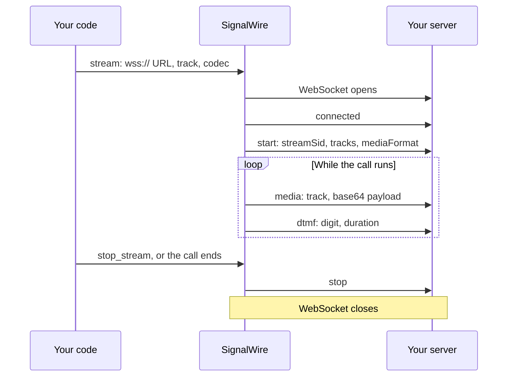

[make-and-receive-calls]: /docs/platform/voice/make-and-receive-calls
[place-swml]: /docs/platform/voice/make-and-receive-calls#place-a-call-via-swml
[place-relay]: /docs/platform/voice/make-and-receive-calls#place-a-call-via-websocket-relay
[caller-id]: /docs/platform/voice/how-to-set-caller-id-or-cnam
[trial-mode]: /docs/platform/trial-mode
[webhooks]: /docs/platform/webhooks
[call-commands]: /docs/apis/rest/calls/call-commands
[stream-status-callback]: /docs/apis/rest/webhooks/stream-status-callback
[swml-stream]: /docs/swml/reference/calling/stream
[swml-stop-stream]: /docs/swml/reference/calling/stop-stream
[swml-connect]: /docs/swml/reference/calling/connect
[swml-sleep]: /docs/swml/reference/calling/sleep
[stream-messages]: /docs/platform/voice/process-streamed-audio#read-the-stream-messages
[play-audio]: /docs/platform/voice/process-streamed-audio#play-your-own-audio-into-the-call

Call streaming sends the audio of a live call to a WebSocket server you run, so your app can
transcribe, analyze, record, or answer it in near real time. This guide shows two flows: save both
sides of a call to audio files, and echo the caller's voice back through a bidirectional stream.

## How streaming works

When a stream starts, SignalWire opens a WebSocket connection to your `wss://` URL. It sends a
`connected` message, then a `start` message that describes the audio format, then a `media`
message for each frame of audio while the call runs. A `stop` message arrives when the stream ends.
Each stream gets its own connection, so a server handling many calls tells them apart by the
`streamSid` in each `start` message.

A stream is one-way by default: SignalWire sends a copy of the call's audio, the call continues as
normal, and nothing your server sends is heard. A bidirectional stream connects the call to your
server as if the server were the other party, so audio your server sends back plays into the call.
Use it to connect a call to your own speech pipeline or a third-party voice agent.

<llms-ignore>


</llms-ignore>

<llms-only>


```mermaid
sequenceDiagram
    participant App as Your code
    participant SW as SignalWire
    participant Srv as Your server

    App->>SW: stream: wss:// URL, track, codec
    SW->>Srv: WebSocket opens
    SW->>Srv: connected
    SW->>Srv: start: streamSid, tracks, mediaFormat
    loop While the call runs
        SW->>Srv: media: track, base64 payload
        SW->>Srv: dtmf: digit, duration
    end
    App->>SW: stop_stream, or the call ends
    SW->>Srv: stop
    Note over SW,Srv: WebSocket closes
```

</llms-only>

## Choose an approach

Choose one approach for call control; each uses the same audio server below. If you're starting
fresh, use [Save call audio via SWML](#save-call-audio-via-swml).

- [SWML](#stream-call-audio-via-swml): add `stream` to your call document and stop it with
  `stop_stream`, or `connect` the call to your server for a bidirectional stream. Optionally send
  stream events to a webhook.
- [WebSocket (Relay)](#stream-call-audio-via-websocket-relay): start and stop a stream from code
  that holds a connection to the call. Stream events arrive in your code, so no webhook is needed.
- [REST](#stream-a-call-already-in-progress-via-rest): start and stop a stream by call ID from
  any process. The stream command is one-way; use SWML or Relay `connect` for the two-way examples.

## Prepare for streaming

Start with working call setup from [Make and receive calls][make-and-receive-calls]. Test with a
phone you can answer and speak into. You also need a machine that can run a small WebSocket server
and expose it to the internet over TLS; [Receive the stream on your server](#receive-the-stream-on-your-server)
provides the servers this guide uses.

<Warning title="Stream URLs must use wss://">
SignalWire connects to your server over a secure WebSocket only, and rejects a plain `ws://` URL.
During development, run the server locally and put a TLS tunnel in front of it. The
[webhooks guide][webhooks] shows how to expose a local port with a tunneling tool.
</Warning>

<Warning title="Trial projects only call verified numbers">
A [trial project][trial-mode] only places calls to numbers you've purchased or verified, and
can't call internationally.
</Warning>

Replace these values in the samples you run:

| Value | Replace with |
|---|---|
| `<YOUR_SPACE>` | Your Space's subdomain in `<YOUR_SPACE>.signalwire.com` |
| `<YOUR_PROJECT_ID>` | Your Project ID |
| `<YOUR_API_TOKEN>` | Your API token with the Voice permission, used only in server code |
| `<YOUR_CALLER_ID>` | Your SignalWire phone number, or a [verified caller ID][caller-id], in E.164 format |
| `<YOUR_DESTINATION>` | The phone you'll answer, in E.164 format |
| `<YOUR_AUDIO_STREAM_URL>` | The public `wss://` URL of your WebSocket server |

## Receive the stream on your server

Run one of the servers below, expose port `8080` through your TLS tunnel, and keep it running
while you run a call program. Use the save-audio server for the one-way examples, or the echo
server for the bidirectional examples. Both use `PCMU`, the default 8 kHz G.711 µ-law codec.

The `start` message identifies the stream and audio format. Each `media` message carries a
base64-encoded payload and an `inbound` or `outbound` track. Decode the payload to get raw audio
bytes; keep the tracks separate. See [Read the stream messages][stream-messages] for the full format.

### Save call audio to a file

This server writes each track to a separate WAV file as audio arrives. It finalizes the headers
when the stream stops or the connection closes. The `inbound` file contains the caller's voice;
the `outbound` file contains what they hear.

<CodeBlocks>
<CodeBlock title="Python — websockets">
```python
# Install: python -m pip install websockets
# Save as save_audio.py and run: python save_audio.py
import asyncio
import base64
import json
import struct

from websockets.asyncio.server import serve

HEADER_BYTES = 46


def wav_header(data_length, sample_rate):
    # WAV header for 8-bit G.711 µ-law (format tag 7), one channel.
    return struct.pack(
        "<4sI4s4sIHHIIHHH4sI",
        b"RIFF", 38 + data_length, b"WAVE",
        b"fmt ", 18, 7, 1, sample_rate, sample_rate, 1, 8, 0,
        b"data", data_length,
    )


async def handle(websocket):
    files = {}
    sample_rate = 8000
    try:
        async for message in websocket:
            event = json.loads(message)
            if event["event"] == "start":
                stream_sid = event["start"]["streamSid"]
                sample_rate = event["start"]["mediaFormat"]["sampleRate"]
                for track in event["start"]["tracks"]:
                    output = open(f"{stream_sid}-{track}.wav", "wb")
                    output.write(wav_header(0, sample_rate))
                    files[track] = output
                print(f"Recording stream {stream_sid}")
            elif event["event"] == "media":
                audio = base64.b64decode(event["media"]["payload"])
                files[event["media"]["track"]].write(audio)
            elif event["event"] == "stop":
                break
    finally:
        # Runs on stop or a dropped connection, so every file gets its final sizes.
        for output in files.values():
            data_length = output.tell() - HEADER_BYTES
            output.seek(0)
            output.write(wav_header(data_length, sample_rate))
            output.close()
            print(f"Saved {output.name}, {data_length / sample_rate:.1f} seconds")


async def main():
    async with serve(handle, "0.0.0.0", 8080):
        print("Listening on port 8080")
        await asyncio.get_running_loop().create_future()


asyncio.run(main())
```
</CodeBlock>
<CodeBlock title="JavaScript — ws">
```javascript
// Install: npm install ws
// Save as save-audio.mjs and run: node save-audio.mjs
import { closeSync, openSync, writeSync } from "node:fs";
import { WebSocketServer } from "ws";

const HEADER_BYTES = 46;

function wavHeader(dataLength, sampleRate) {
  // WAV header for 8-bit G.711 µ-law (format tag 7), one channel.
  const header = Buffer.alloc(HEADER_BYTES);
  header.write("RIFF", 0);
  header.writeUInt32LE(38 + dataLength, 4);
  header.write("WAVE", 8);
  header.write("fmt ", 12);
  header.writeUInt32LE(18, 16);
  header.writeUInt16LE(7, 20);
  header.writeUInt16LE(1, 22);
  header.writeUInt32LE(sampleRate, 24);
  header.writeUInt32LE(sampleRate, 28);
  header.writeUInt16LE(1, 32);
  header.writeUInt16LE(8, 34);
  header.writeUInt16LE(0, 36);
  header.write("data", 38);
  header.writeUInt32LE(dataLength, 42);
  return header;
}

const server = new WebSocketServer({ port: 8080 });
console.log("Listening on port 8080");

server.on("connection", (socket) => {
  const files = new Map();
  let sampleRate = 8000;

  // Runs on stop or a dropped connection, so every file gets its final sizes.
  const finish = () => {
    for (const file of files.values()) {
      writeSync(file.fd, wavHeader(file.bytes, sampleRate), 0, HEADER_BYTES, 0);
      closeSync(file.fd);
      console.log(`Saved ${file.path}, ${(file.bytes / sampleRate).toFixed(1)} seconds`);
    }
    files.clear();
  };

  socket.on("message", (data) => {
    const event = JSON.parse(data.toString());
    if (event.event === "start") {
      const { streamSid, mediaFormat, tracks } = event.start;
      sampleRate = mediaFormat.sampleRate;
      for (const track of tracks) {
        const path = `${streamSid}-${track}.wav`;
        const fd = openSync(path, "w");
        writeSync(fd, wavHeader(0, sampleRate));
        files.set(track, { fd, path, bytes: 0 });
      }
      console.log(`Recording stream ${streamSid}`);
    } else if (event.event === "media") {
      const file = files.get(event.media.track);
      const audio = Buffer.from(event.media.payload, "base64");
      writeSync(file.fd, audio);
      file.bytes += audio.length;
    } else if (event.event === "stop") {
      finish();
    }
  });
  socket.on("close", finish);
});
```
</CodeBlock>
</CodeBlocks>

With the server running, run [Save call audio via SWML](#save-call-audio-via-swml) or
[via WebSocket (Relay)](#save-call-audio-via-websocket-relay) to call your phone and record the stream.

### Send audio back into the call

A bidirectional stream lets your server receive the caller's audio and send audio back on the
same WebSocket. Each outgoing `media` message needs the `streamSid` from `start` and a base64
payload in the stream's codec, without a file header.

This server returns each payload unchanged, so you can hear your own voice. Start it, then run
[Echo the caller's voice via SWML](#echo-the-callers-voice-via-swml) or
[via WebSocket (Relay)](#echo-the-callers-voice-via-websocket-relay).

<CodeBlocks>
<CodeBlock title="Python — websockets">
```python
# Install: python -m pip install websockets
# Save as echo_server.py and run: python echo_server.py
import asyncio
import json

from websockets.asyncio.server import serve


async def handle(websocket):
    stream_sid = None
    async for message in websocket:
        event = json.loads(message)
        if event["event"] == "start":
            stream_sid = event["start"]["streamSid"]
            print(f"Echoing stream {stream_sid}")
        elif event["event"] == "media" and stream_sid:
            await websocket.send(json.dumps({
                "event": "media",
                "streamSid": stream_sid,
                "media": {"payload": event["media"]["payload"]},
            }))
        elif event["event"] == "stop":
            print("Stream stopped")


async def main():
    async with serve(handle, "0.0.0.0", 8080):
        print("Listening on port 8080")
        await asyncio.get_running_loop().create_future()


asyncio.run(main())
```
</CodeBlock>
<CodeBlock title="JavaScript — ws">
```javascript
// Install: npm install ws
// Save as echo-server.mjs and run: node echo-server.mjs
import { WebSocketServer } from "ws";

const server = new WebSocketServer({ port: 8080 });
console.log("Listening on port 8080");

server.on("connection", (socket) => {
  let streamSid;

  socket.on("message", (data) => {
    const event = JSON.parse(data.toString());
    if (event.event === "start") {
      streamSid = event.start.streamSid;
      console.log(`Echoing stream ${streamSid}`);
    } else if (event.event === "media" && streamSid) {
      socket.send(JSON.stringify({
        event: "media",
        streamSid,
        media: { payload: event.media.payload },
      }));
    } else if (event.event === "stop") {
      console.log("Stream stopped");
    }
  });
});
```
</CodeBlock>
</CodeBlocks>

Once the echo works, [play your own audio][play-audio] to send a prompt, wait for playback to
finish with `mark`, and interrupt it with `clear`.

## Stream call audio via SWML

SWML offers two ways to stream. Both run in your call document; choose by whether your server needs
to be heard on the call.

| Method | What your server receives | The stream ends when |
|---|---|---|
| [`stream`][swml-stream] | A one-way copy of the call's audio. The document continues to the next method at once | [`stop_stream`][swml-stop-stream] runs, or the call ends |
| [`connect`][swml-connect] with `to` set to `stream:<URL>` | A bidirectional stream. The call is bridged to your server, and the document waits | Your server closes the connection, or the call ends |

Give a `stream` a `control_id` and pass the same value to `stop_stream`. Omit `control_id` in both
places to stop the most recently started stream. A call can run several streams at once, each with
its own `control_id` and URL.

### Save call audio via SWML

Stream both sides of a call to the [save-audio server](#save-call-audio-to-a-file) for thirty
seconds, then stop the stream. [`sleep`][swml-sleep] keeps the call open while you talk.

The SDK programs place the call as in [Place a call via SWML][place-swml]. The SDKs' SWML builders
don't include `stream` and `stop_stream` yet, so the programs add those two methods as raw SWML.
The YAML and JSON tabs contain the equivalent complete document.

<CodeBlocks>
<CodeBlock title="Python — SWML builder">
```python
# Install: python -m pip install signalwire-sdk==3.4.1
# Save as stream_call.py and run: python stream_call.py
from signalwire import SWMLBuilder, SWMLService
from signalwire.rest import RestClient

client = RestClient(
    project="<YOUR_PROJECT_ID>",
    token="<YOUR_API_TOKEN>",
    host="<YOUR_SPACE>.signalwire.com",
)

# `stream` and `stop_stream` are not yet in the builder's bundled schema.
# Validation applies to the whole document, so turn it off and add them
# as raw SWML.
swml_builder = SWMLBuilder(
    SWMLService(name="stream-call", schema_validation=False)
)
swml_builder.service.add_verb("stream", {
    "url": "<YOUR_AUDIO_STREAM_URL>",
    "control_id": "save-audio",
    "track": "both_tracks",
    "codec": "PCMU",
})
swml_builder.say("Your call is being streamed. Say a few words.").sleep(30000)
swml_builder.service.add_verb("stop_stream", {"control_id": "save-audio"})
swml = swml_builder.say("The stream has stopped. Goodbye.").build()

call = client.calling.dial(
    from_="<YOUR_CALLER_ID>",
    to="<YOUR_DESTINATION>",
    swml=swml,
)
print(call["id"])
```
</CodeBlock>
<CodeBlock title="TypeScript — SWML builder">
```typescript
// Install: npm install @signalwire/sdk@2.0.5
// This sample also runs as JavaScript: save as stream-call.mjs,
// then run: node stream-call.mjs
import { RestClient, SwmlBuilder } from "@signalwire/sdk";

const client = new RestClient({
  project: "<YOUR_PROJECT_ID>",
  token: "<YOUR_API_TOKEN>",
  host: "<YOUR_SPACE>.signalwire.com",
});

// `stream` and `stop_stream` are not yet in the builder's bundled schema,
// so add them as raw SWML.
const swmlBuilder = new SwmlBuilder();
swmlBuilder.addVerb("stream", {
  url: "<YOUR_AUDIO_STREAM_URL>",
  control_id: "save-audio",
  track: "both_tracks",
  codec: "PCMU",
});
swmlBuilder.say("Your call is being streamed. Say a few words.").sleep(30000);
swmlBuilder.addVerb("stop_stream", { control_id: "save-audio" });
const swml = swmlBuilder.say("The stream has stopped. Goodbye.").build();

const call = await client.calling.dial({
  from: "<YOUR_CALLER_ID>",
  to: "<YOUR_DESTINATION>",
  swml,
});
console.log(call.id);
```
</CodeBlock>
<CodeBlock title="YAML">
```yaml
version: 1.0.0
sections:
  main:
    - stream:
        url: <YOUR_AUDIO_STREAM_URL>
        control_id: save-audio
        track: both_tracks
        codec: PCMU
    - play:
        url: say:Your call is being streamed. Say a few words.
    - sleep: 30000
    - stop_stream:
        control_id: save-audio
    - play:
        url: say:The stream has stopped. Goodbye.
```
</CodeBlock>
<CodeBlock title="JSON">
```json
{
  "version": "1.0.0",
  "sections": {
    "main": [
      {
        "stream": {
          "url": "<YOUR_AUDIO_STREAM_URL>",
          "control_id": "save-audio",
          "track": "both_tracks",
          "codec": "PCMU"
        }
      },
      { "play": { "url": "say:Your call is being streamed. Say a few words." } },
      { "sleep": 30000 },
      { "stop_stream": { "control_id": "save-audio" } },
      { "play": { "url": "say:The stream has stopped. Goodbye." } }
    ]
  }
}
```
</CodeBlock>
</CodeBlocks>

Run the save-audio server, then the program, and answer your phone. The server prints
`Recording stream` as soon as you answer. Say a few words; after thirty seconds the server saves one
WAV file per track and you hear the goodbye. The `inbound` file holds your voice and the `outbound`
file holds the announcements.

If the server never prints `Recording stream`, SignalWire couldn't reach your URL. Check that the
URL begins with `wss://`, that the tunnel is running and points at port `8080`, and that the URL has
no query string. Add `status_url`, as shown in [Track a stream via SWML](#track-a-stream-via-swml),
to receive the stream's events even when the WebSocket never connects.

### Echo the caller's voice via SWML

Play an announcement, connect the call to the [echo server](#send-audio-back-into-the-call), and
hang up once your server closes the connection. Set `to` to your `wss://` URL with a `stream:` prefix.
The examples use `realtime: true` to limit playback delay; audio sent too far ahead can be dropped.
The echo server sends each frame as it arrives. See [Pace outgoing audio][play-audio] when sending
a file or generated speech.

<CodeBlocks>
<CodeBlock title="Python — SWML builder">
```python
# Install: python -m pip install signalwire-sdk==3.4.1
# Save as echo_call.py and run: python echo_call.py
from signalwire import SWMLBuilder, SWMLService
from signalwire.rest import RestClient

client = RestClient(
    project="<YOUR_PROJECT_ID>",
    token="<YOUR_API_TOKEN>",
    host="<YOUR_SPACE>.signalwire.com",
)

# The stream-specific `connect` properties are not yet in the builder's
# bundled schema, so turn off validation.
swml = (
    SWMLBuilder(SWMLService(name="echo-call", schema_validation=False))
    .say("You are connected to the echo server. Speak, and you will hear yourself.")
    .connect(
        to="stream:<YOUR_AUDIO_STREAM_URL>",
        codec="PCMU",
        realtime=True,
        name="echo",
    )
    .hangup()
    .build()
)

call = client.calling.dial(
    from_="<YOUR_CALLER_ID>",
    to="<YOUR_DESTINATION>",
    swml=swml,
)
print(call["id"])
```
</CodeBlock>
<CodeBlock title="TypeScript — SWML builder">
```typescript
// Install: npm install @signalwire/sdk@2.0.5
// This sample also runs as JavaScript: save as echo-call.mjs,
// then run: node echo-call.mjs
import { RestClient, SwmlBuilder } from "@signalwire/sdk";

const client = new RestClient({
  project: "<YOUR_PROJECT_ID>",
  token: "<YOUR_API_TOKEN>",
  host: "<YOUR_SPACE>.signalwire.com",
});

const swml = new SwmlBuilder()
  .say("You are connected to the echo server. Speak, and you will hear yourself.")
  .connect({
    to: "stream:<YOUR_AUDIO_STREAM_URL>",
    codec: "PCMU",
    realtime: true,
    name: "echo",
  })
  .hangup()
  .build();

const call = await client.calling.dial({
  from: "<YOUR_CALLER_ID>",
  to: "<YOUR_DESTINATION>",
  swml,
});
console.log(call.id);
```
</CodeBlock>
<CodeBlock title="YAML">
```yaml
version: 1.0.0
sections:
  main:
    - play:
        url: say:You are connected to the echo server. Speak, and you will hear yourself.
    - connect:
        to: stream:<YOUR_AUDIO_STREAM_URL>
        codec: PCMU
        realtime: true
        name: echo
    - hangup: {}
```
</CodeBlock>
<CodeBlock title="JSON">
```json
{
  "version": "1.0.0",
  "sections": {
    "main": [
      { "play": { "url": "say:You are connected to the echo server. Speak, and you will hear yourself." } },
      {
        "connect": {
          "to": "stream:<YOUR_AUDIO_STREAM_URL>",
          "codec": "PCMU",
          "realtime": true,
          "name": "echo"
        }
      },
      { "hangup": {} }
    ]
  }
}
```
</CodeBlock>
</CodeBlocks>

Answer the call and speak. You hear the announcement, then your own voice echoed back a moment
after you say each word. Hang up to end the call; the server prints `Stream stopped`. If you hear
silence, check that the server sends the `streamSid` from the `start` message and that the call
uses `connect`, since a stream started with `stream` ignores anything you send back.

A stream can't be the `to` of a `dial`, so an outbound bidirectional stream always dials the person
first and runs `connect` when they answer. When your server closes the connection, `connect`
finishes and the document continues with the next method, here `hangup`; put a `play` or any other
method there to keep the call going instead.

### Track a stream via SWML

Add `status_url` to `stream` to receive JSON webhooks as the stream starts and finishes. On a
`stream:` `connect`, `status_url` is notified as the stream connects and ends. Set `status_url_method` to `GET` if your endpoint can't accept `POST`. See the
[webhooks guide][webhooks] for endpoint setup and testing.

| Webhook field | Value |
|---|---|
| `event_type` | `calling.call.stream` |
| `params.call_id` | The call ID |
| `params.control_id` | The stream's `control_id` |
| `params.state` | `streaming` when the stream starts, then `finished` |
| `params.url` | The stream's WebSocket URL |

```json
{
  "event_type": "calling.call.stream",
  "params": {
    "call_id": "2e1e66e5-5d07-413d-9668-55542992eec0",
    "control_id": "save-audio",
    "state": "streaming",
    "url": "wss://example.com/audio-stream"
  }
}
```

The [stream status callback reference][stream-status-callback] lists every field.

## Stream call audio via WebSocket (Relay)

Start a one-way stream on an answered call with `call.stream()`. It returns a stream action that
keeps the `control_id` for you; call its `stop()` method to end the stream, or await its `wait()`
method, which returns when the stream finishes. For a bidirectional stream, pass a device of type
`stream` to `call.connect()`. It must be the only device in the list.

Stream events arrive in your code over the same connection:

| Event | What to read | Typical action |
|---|---|---|
| `calling.call.stream` | `state` is `streaming` when the stream starts, then `finished`; `control_id` identifies the stream | Log it, or clean up when the stream finishes |
| `calling.call.connect` | `connect_state` moves from `connecting` to `connected` while audio flows, then `disconnected`, or `failed` if SignalWire couldn't reach your URL | Retry or hang up on `failed` |

### Save call audio via WebSocket (Relay)

Dial your phone, stream both sides to the [save-audio server](#save-call-audio-to-a-file) for
thirty seconds, then stop the stream and hang up after the goodbye. Call setup follows
[Place a call via WebSocket (Relay)][place-relay].

<CodeBlocks>
<CodeBlock title="Python — Relay client">
```python
# Install: python -m pip install signalwire-sdk==3.4.1
# Save as stream_call_relay.py and run: python stream_call_relay.py
import asyncio
from signalwire.relay import RelayClient, StreamEvent

client = RelayClient(
    project="<YOUR_PROJECT_ID>",
    token="<YOUR_API_TOKEN>",
    host="<YOUR_SPACE>.signalwire.com",
    contexts=["default"],
)

async def main():
    async with client:
        call = await client.dial(
            devices=[[{
                "type": "phone",
                "params": {
                    "from_number": "<YOUR_CALLER_ID>",
                    "to_number": "<YOUR_DESTINATION>",
                    "timeout": 30,
                },
            }]],
        )

        def on_stream(event: StreamEvent):
            print(f"Stream {event.control_id} is {event.state}")

        call.on("calling.call.stream", on_stream)
        stream = await call.stream(
            url="<YOUR_AUDIO_STREAM_URL>",
            track="both_tracks",
            codec="PCMU",
        )

        await call.play([{
            "type": "tts",
            "params": {"text": "Your call is being streamed. Say a few words."},
        }])
        await asyncio.sleep(30)
        await stream.stop()

        async def hang_up_after_playback(_event):
            if call.state != "ended":
                await call.hangup()

        await call.play(
            [{"type": "tts", "params": {"text": "The stream has stopped. Goodbye."}}],
            on_completed=hang_up_after_playback,
        )
        await call.wait_for_ended()

asyncio.run(main())
```
</CodeBlock>
<CodeBlock title="TypeScript — Relay client">
```typescript
// Install: npm install @signalwire/sdk@2.0.5
// This sample also runs as JavaScript: save as stream-call-relay.mjs,
// then run: node stream-call-relay.mjs
import { RelayClient } from "@signalwire/sdk";

const client = new RelayClient({
  project: "<YOUR_PROJECT_ID>",
  token: "<YOUR_API_TOKEN>",
  host: "<YOUR_SPACE>.signalwire.com",
  contexts: ["default"],
});

await client.connect();

try {
  const call = await client.dial([[{
    type: "phone",
    params: {
      from_number: "<YOUR_CALLER_ID>",
      to_number: "<YOUR_DESTINATION>",
      timeout: 30,
    },
  }]]);

  call.on("calling.call.stream", (event) => {
    console.log(`Stream ${event.params.control_id} is ${event.params.state}`);
  });
  const stream = await call.stream("<YOUR_AUDIO_STREAM_URL>", {
    track: "both_tracks",
    codec: "PCMU",
  });

  await call.play([
    { type: "tts", text: "Your call is being streamed. Say a few words." },
  ]);
  await new Promise((resolve) => setTimeout(resolve, 30_000));
  await stream.stop();

  await call.play([{ type: "tts", text: "The stream has stopped. Goodbye." }], {
    onCompleted: async () => {
      if (call.state !== "ended") await call.hangup();
    },
  });
  await call.waitForEnded();
} finally {
  await client.disconnect();
}
```
</CodeBlock>
</CodeBlocks>

Answer and speak. The program prints `streaming` when the stream starts and `finished` after thirty
seconds, and the save-audio server writes one WAV file per track. If the program never prints
`streaming`, check the URL as described under [Save call audio via SWML](#save-call-audio-via-swml).

### Echo the caller's voice via WebSocket (Relay)

Dial, play the announcement, then connect the call to the
[echo server](#send-audio-back-into-the-call) through a `stream` device. `connect()` returns as soon as
SignalWire accepts the request, so the program follows the bridge through `calling.call.connect`
events, hangs up when the bridge ends, and waits for the call to end before disconnecting the client.

<CodeBlocks>
<CodeBlock title="Python — Relay client">
```python
# Install: python -m pip install signalwire-sdk==3.4.1
# Save as echo_call_relay.py and run: python echo_call_relay.py
import asyncio
from signalwire.relay import ConnectEvent, RelayClient

client = RelayClient(
    project="<YOUR_PROJECT_ID>",
    token="<YOUR_API_TOKEN>",
    host="<YOUR_SPACE>.signalwire.com",
    contexts=["default"],
)

async def main():
    async with client:
        call = await client.dial(
            devices=[[{
                "type": "phone",
                "params": {
                    "from_number": "<YOUR_CALLER_ID>",
                    "to_number": "<YOUR_DESTINATION>",
                    "timeout": 30,
                },
            }]],
        )

        async def on_connect(event: ConnectEvent):
            print(f"Stream bridge: {event.connect_state}")
            # The bridge ends when your server closes the connection.
            if event.connect_state in ("disconnected", "failed") and call.state != "ended":
                await call.hangup()

        call.on("calling.call.connect", on_connect)
        announcement = await call.play([{
            "type": "tts",
            "params": {"text": "You are connected to the echo server. Speak, and you will hear yourself."},
        }])
        await announcement.wait()
        await call.connect(
            devices=[[{
                "type": "stream",
                "params": {
                    "url": "<YOUR_AUDIO_STREAM_URL>",
                    "codec": "PCMU",
                    "realtime": True,
                    "name": "echo",
                },
            }]],
        )
        await call.wait_for_ended()

asyncio.run(main())
```
</CodeBlock>
<CodeBlock title="TypeScript — Relay client">
```typescript
// Install: npm install @signalwire/sdk@2.0.5
// This sample also runs as JavaScript: save as echo-call-relay.mjs,
// then run: node echo-call-relay.mjs
import { RelayClient } from "@signalwire/sdk";

const client = new RelayClient({
  project: "<YOUR_PROJECT_ID>",
  token: "<YOUR_API_TOKEN>",
  host: "<YOUR_SPACE>.signalwire.com",
  contexts: ["default"],
});

await client.connect();

try {
  const call = await client.dial([[{
    type: "phone",
    params: {
      from_number: "<YOUR_CALLER_ID>",
      to_number: "<YOUR_DESTINATION>",
      timeout: 30,
    },
  }]]);

  call.on("calling.call.connect", async (event) => {
    const state = event.params.connect_state;
    console.log(`Stream bridge: ${state}`);
    // The bridge ends when your server closes the connection.
    if ((state === "disconnected" || state === "failed") && call.state !== "ended") {
      await call.hangup();
    }
  });
  const announcement = await call.play([
    { type: "tts", text: "You are connected to the echo server. Speak, and you will hear yourself." },
  ]);
  await announcement.wait();
  await call.connect([[{
    type: "stream",
    params: {
      url: "<YOUR_AUDIO_STREAM_URL>",
      codec: "PCMU",
      realtime: true,
      name: "echo",
    },
  }]]);
  await call.waitForEnded();
} finally {
  await client.disconnect();
}
```
</CodeBlock>
</CodeBlocks>

Answer and speak to hear your voice echoed back. The program prints `connected` while audio flows,
then `disconnected` when you hang up. A `failed` state means SignalWire couldn't reach your URL.
The call stays bridged until your server closes the connection, the call ends, or you call
`call.disconnect()`, which unbridges the call and lets it continue. To keep the call going after
the bridge ends, play audio or connect it elsewhere instead of hanging up.

## Stream a call already in progress via REST

If another process needs to start a stream, send [`calling.stream`][call-commands] with the
answered call's ID, a `control_id`, and the stream's `url`. The other stream settings, such as
`track`, `codec`, and `status_url`, sit alongside them in `params`. The call ID is the `id` from
the `dial` response, or the `call_id` delivered to your SWML endpoint or status webhook.

<EndpointRequestSnippet endpoint="POST /api/calling/calls" example="calling.stream" />

The command returns immediately and doesn't echo the `control_id`, so keep the value you sent.
Send `calling.stream.stop` with the same `control_id` to stop the stream when your server has what
it needs. Add `status_url` to receive the `calling.call.stream` events described in
[Track a stream via SWML](#track-a-stream-via-swml).

<EndpointRequestSnippet endpoint="POST /api/calling/calls" example="calling.stream.stop" />

A bidirectional stream has no `control_id`, so `calling.stream.stop` doesn't apply to it. End it by
closing the WebSocket from your server, or send `calling.disconnect` to unbridge the call and let it
continue.

## Next steps

<CardGroup cols={2}>

<Card title="Process streamed audio" href="/docs/platform/voice/process-streamed-audio" icon="regular waveform-lines">
  Buffer audio for processing, play your own prompts, and interrupt playback.
</Card>

<Card title="Streaming options" href="/docs/swml/reference/calling/stream" icon="regular code">
  Configure tracks, codecs, custom parameters, and status callbacks.
</Card>

</CardGroup>
