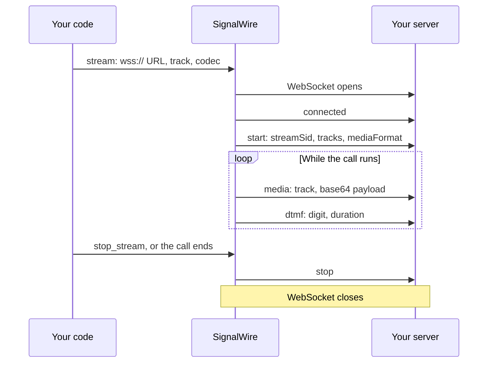

[make-and-receive-calls]: /docs/platform/voice/make-and-receive-calls
[place-swml]: /docs/platform/voice/make-and-receive-calls#place-a-call-via-swml
[place-relay]: /docs/platform/voice/make-and-receive-calls#place-a-call-via-websocket-relay
[caller-id]: /docs/platform/voice/how-to-set-caller-id-or-cnam
[trial-mode]: /docs/platform/trial-mode
[webhooks]: /docs/platform/webhooks
[call-commands]: /docs/apis/rest/calls/call-commands
[stream-status-callback]: /docs/apis/rest/webhooks/stream-status-callback
[swml-stream]: /docs/swml/reference/calling/stream
[swml-stop-stream]: /docs/swml/reference/calling/stop-stream
[swml-connect]: /docs/swml/reference/calling/connect
[swml-sleep]: /docs/swml/reference/calling/sleep
[swml-join-conference]: /docs/swml/reference/calling/join-conference

Call streaming sends the audio of a live call to a WebSocket server you run, so your app can
transcribe, analyze, record, or answer it in near real time. This guide first covers what every
stream has in common: the messages your server receives, how to process the audio, and the
difference between one-way and bidirectional streams. It then shows how to start each kind of
stream with SWML, Relay, or REST.

## How call streaming works

When a stream starts, SignalWire opens a WebSocket connection to your `wss://` URL. It sends a
`connected` message, then a `start` message that describes the audio format, then a `media`
message for each frame of audio while the call runs. A `stop` message arrives when the stream ends.
Each stream gets its own connection, so a server handling many calls tells them apart by the
`streamSid` in each `start` message.

The messages and the audio format are the same whether SWML, Relay, or REST starts the stream, so
the server code in this guide works with every approach. A stream is one-way by default; a
bidirectional stream also plays audio your server sends back, as described in
[One-way and bidirectional streams](#one-way-and-bidirectional-streams).

<llms-ignore>


</llms-ignore>

<llms-only>


```mermaid
sequenceDiagram
    participant App as Your code
    participant SW as SignalWire
    participant Srv as Your server

    App->>SW: stream: wss:// URL, track, codec
    SW->>Srv: WebSocket opens
    SW->>Srv: connected
    SW->>Srv: start: streamSid, tracks, mediaFormat
    loop While the call runs
        SW->>Srv: media: track, base64 payload
        SW->>Srv: dtmf: digit, duration
    end
    App->>SW: stop_stream, or the call ends
    SW->>Srv: stop
    Note over SW,Srv: WebSocket closes
```

</llms-only>

## Messages your server receives

SignalWire sends each message as JSON text on the stream's WebSocket. Every message has an `event`
field that names its type, so your server parses each message and branches on `event`. Most
messages also carry a `sequenceNumber`, a string counter that starts at `"1"` and increments with
each message on the connection.

<Tabs>
<Tab title="connected">

Sent once, right after the WebSocket opens. `protocol` is always `Call`, and `version` is the
protocol version, currently `0.2.0`. No audio details arrive yet, so wait for `start`.

```json
{
  "event": "connected",
  "protocol": "Call",
  "version": "0.2.0"
}
```

</Tab>
<Tab title="start">

Sent once, before any audio. Set up your per-stream state here:

- `start.streamSid` identifies the stream. A bidirectional stream needs it on every message your
  server sends back.
- `start.callSid` is the ID of the call being streamed.
- `start.tracks` lists the tracks that will arrive: `inbound`, `outbound`, or both.
- `start.mediaFormat` describes the audio: `encoding` names the codec, `sampleRate` is in hertz, and
  `channels` is always `1`.
- `start.customParameters` holds the custom parameters you set when you started the stream, if any.

```json
{
  "event": "start",
  "sequenceNumber": "1",
  "start": {
    "streamSid": "7d56cc11-536d-4a45-b4fb-ed3d55be843b",
    "callSid": "76ac3c36-56da-4a3e-a0d6-b5f8df6da9ad",
    "tracks": ["inbound", "outbound"],
    "customParameters": {"session_id": "abc123"},
    "mediaFormat": {"encoding": "audio/x-mulaw", "sampleRate": 8000, "channels": 1}
  }
}
```

</Tab>
<Tab title="media">

Sent for each frame of audio while the call runs:

- `media.track` is `inbound`, what the person on the call says, or `outbound`, what they hear.
- `media.chunk` counts frames on that track, starting at `"1"`.
- `media.timestamp` is milliseconds since the stream began.
- `media.payload` is the base64-encoded audio. [Process streamed audio](#process-streamed-audio)
  shows how to decode it.

```json
{
  "event": "media",
  "sequenceNumber": "42",
  "media": {
    "track": "inbound",
    "chunk": "41",
    "timestamp": "820",
    "payload": "<BASE64_AUDIO>"
  }
}
```

</Tab>
<Tab title="dtmf">

Sent when a key is pressed on the call. `dtmf.digit` is one of `0` to `9`, `*`, `#`, or `A` to `D`,
and `dtmf.duration` is how long the key was held, in milliseconds. On a bidirectional stream, the
message also carries the `streamSid`.

```json
{
  "event": "dtmf",
  "sequenceNumber": "123",
  "streamSid": "7d56cc11-536d-4a45-b4fb-ed3d55be843b",
  "dtmf": {
    "digit": "5",
    "duration": 2000
  }
}
```

</Tab>
<Tab title="mark">

Sent only on a bidirectional stream, in reply to a `mark` your server sent. It arrives once the audio
you queued before that mark has played, or been cleared, and `mark.name` echoes the name you sent.
[Messages your server sends back](#messages-your-server-sends-back) covers how to use it.

```json
{
  "event": "mark",
  "streamSid": "7d56cc11-536d-4a45-b4fb-ed3d55be843b",
  "mark": {
    "name": "prompt-done"
  }
}
```

</Tab>
<Tab title="stop">

Sent once, when the stream stops or the call ends. Nothing further arrives on the connection, so
finish your per-stream work here: close files, flush buffers, and release resources.

```json
{
  "event": "stop",
  "sequenceNumber": "999"
}
```

</Tab>
</Tabs>

### Identify the call on your server

Two stream settings connect a WebSocket to the rest of your application:

- `custom_parameters` is an object you set when you start the stream. Its keys arrive as
  `start.customParameters`, so pass your own session or customer IDs here rather than in the URL,
  which accepts no query string.
- `authorization_bearer_token` is sent as `Authorization: Bearer <token>` on the WebSocket
  handshake. Reject connections that don't carry the token you expect.

## Process streamed audio

Decode `media.payload` from base64 to get raw audio bytes with no file header, in the format the
`start` message's `mediaFormat` describes. `L16` audio is 16-bit signed samples in little-endian
byte order.

Each `media` message carries one frame of audio for one track, 20 ms by default: 160 bytes of
`PCMU`, or 640 bytes of `L16` at 16 kHz. With `both_tracks`, frames for the two tracks arrive
interleaved, so keep a separate buffer per track. To align or mix the tracks, use
`media.timestamp` rather than arrival order.

The servers in this guide listen on port `8080`. Run one at a time behind a TLS tunnel, as
described in [Prepare for streaming](#prepare-for-streaming); the tunnel's `wss://` URL is the
`<YOUR_AUDIO_STREAM_URL>` in the call programs.

### Choose a codec and track

Set `codec` when you start the stream. The default is `PCMU`, 8 kHz G.711 µ-law, and it is always
available. For speech models that expect linear PCM, request `L16` with a sample rate modifier
instead. A bidirectional stream also accepts `PCMA` and `G722`, and a packet-time modifier such as
`PCMU@40i`; see the [`connect` reference][swml-connect] for the accepted forms.

| `codec` | `mediaFormat.encoding` | `mediaFormat.sampleRate` |
|---|---|---|
| `PCMU` (default) | `audio/x-mulaw` | 8000 |
| `PCMA` | `audio/x-alaw` | 8000 |
| `L16@16000h` | `audio/x-L16` | 16000 |
| `L16@24000h` | `audio/x-L16` | 24000 |

`track` selects which side of the conversation a one-way stream sends. `inbound_track`, the default,
is what the person on the call says; `outbound_track` is what they hear; `both_tracks` sends both,
labeled per `media` message. A bidirectional stream sends only the `inbound` track.

### Save call audio to a file

This server writes each track to its own WAV file as audio arrives, so memory use stays flat on a
long call. It fills in the WAV header's sizes when the stream stops, or when the connection drops
without a `stop` message. The `inbound` file contains the caller's voice; the `outbound` file
contains what they hear.

<CodeBlocks>
<CodeBlock title="Python — websockets">
```python
# Install: python -m pip install websockets
# Save as save_audio.py and run: python save_audio.py
import asyncio
import base64
import json
import struct

from websockets.asyncio.server import serve

HEADER_BYTES = 46


def wav_header(data_length, sample_rate):
    # WAV header for 8-bit G.711 µ-law (format tag 7), one channel.
    return struct.pack(
        "<4sI4s4sIHHIIHHH4sI",
        b"RIFF", 38 + data_length, b"WAVE",
        b"fmt ", 18, 7, 1, sample_rate, sample_rate, 1, 8, 0,
        b"data", data_length,
    )


async def handle(websocket):
    files = {}
    sample_rate = 8000
    try:
        async for message in websocket:
            event = json.loads(message)
            if event["event"] == "start":
                stream_sid = event["start"]["streamSid"]
                sample_rate = event["start"]["mediaFormat"]["sampleRate"]
                for track in event["start"]["tracks"]:
                    output = open(f"{stream_sid}-{track}.wav", "wb")
                    output.write(wav_header(0, sample_rate))
                    files[track] = output
                print(f"Recording stream {stream_sid}")
            elif event["event"] == "media":
                audio = base64.b64decode(event["media"]["payload"])
                files[event["media"]["track"]].write(audio)
            elif event["event"] == "stop":
                break
    finally:
        # Runs on stop or a dropped connection, so every file gets its final sizes.
        for output in files.values():
            data_length = output.tell() - HEADER_BYTES
            output.seek(0)
            output.write(wav_header(data_length, sample_rate))
            output.close()
            print(f"Saved {output.name}, {data_length / sample_rate:.1f} seconds")


async def main():
    async with serve(handle, "0.0.0.0", 8080):
        print("Listening on port 8080")
        await asyncio.get_running_loop().create_future()


asyncio.run(main())
```
</CodeBlock>
<CodeBlock title="JavaScript — ws">
```javascript
// Install: npm install ws
// Save as save-audio.mjs and run: node save-audio.mjs
import { closeSync, openSync, writeSync } from "node:fs";
import { WebSocketServer } from "ws";

const HEADER_BYTES = 46;

function wavHeader(dataLength, sampleRate) {
  // WAV header for 8-bit G.711 µ-law (format tag 7), one channel.
  const header = Buffer.alloc(HEADER_BYTES);
  header.write("RIFF", 0);
  header.writeUInt32LE(38 + dataLength, 4);
  header.write("WAVE", 8);
  header.write("fmt ", 12);
  header.writeUInt32LE(18, 16);
  header.writeUInt16LE(7, 20);
  header.writeUInt16LE(1, 22);
  header.writeUInt32LE(sampleRate, 24);
  header.writeUInt32LE(sampleRate, 28);
  header.writeUInt16LE(1, 32);
  header.writeUInt16LE(8, 34);
  header.writeUInt16LE(0, 36);
  header.write("data", 38);
  header.writeUInt32LE(dataLength, 42);
  return header;
}

const server = new WebSocketServer({ port: 8080 });
console.log("Listening on port 8080");

server.on("connection", (socket) => {
  const files = new Map();
  let sampleRate = 8000;

  // Runs on stop or a dropped connection, so every file gets its final sizes.
  const finish = () => {
    for (const file of files.values()) {
      writeSync(file.fd, wavHeader(file.bytes, sampleRate), 0, HEADER_BYTES, 0);
      closeSync(file.fd);
      console.log(`Saved ${file.path}, ${(file.bytes / sampleRate).toFixed(1)} seconds`);
    }
    files.clear();
  };

  socket.on("message", (data) => {
    const event = JSON.parse(data.toString());
    if (event.event === "start") {
      const { streamSid, mediaFormat, tracks } = event.start;
      sampleRate = mediaFormat.sampleRate;
      for (const track of tracks) {
        const path = `${streamSid}-${track}.wav`;
        const fd = openSync(path, "w");
        writeSync(fd, wavHeader(0, sampleRate));
        files.set(track, { fd, path, bytes: 0 });
      }
      console.log(`Recording stream ${streamSid}`);
    } else if (event.event === "media") {
      const file = files.get(event.media.track);
      const audio = Buffer.from(event.media.payload, "base64");
      writeSync(file.fd, audio);
      file.bytes += audio.length;
    } else if (event.event === "stop") {
      finish();
    }
  });
  socket.on("close", finish);
});
```
</CodeBlock>
</CodeBlocks>

The WAV header describes G.711 µ-law, the default `PCMU` codec. For `L16`, change the header to
format tag `1`, 16 bits per sample, a block align of `2`, and a byte rate of twice the sample rate.
Test the server with [Save call audio via SWML](#save-call-audio-via-swml) or
[via WebSocket (Relay)](#save-call-audio-via-websocket-relay).

### Buffer audio for processing

Speech-to-text services, voice agents, and analytics usually want audio in fixed-size pieces rather
than one `media` message at a time. Buffer each track by bytes, not by message count, and cut a
window whenever the buffer holds enough audio. The `start` message's `sampleRate` tells you how many
bytes make up a window: with `PCMU`, one byte is one sample, so a one-second window is `sampleRate`
bytes.

This server measures each window's loudness and estimates talk time using a volume threshold.
Replace `analyze` with your processing. It queues at most five windows and drops new windows with
a log message if processing falls behind, keeping memory and delay bounded. Use the
[save-audio server](#save-call-audio-to-a-file) when you need to retain every frame.

Await network requests in the worker so the receive loop can keep reading. An async function
still runs CPU work on the event loop; move expensive computation to a worker thread or process.

<CodeBlocks>
<CodeBlock title="Python — websockets">
```python
# Install: python -m pip install websockets
# Save as process_audio.py and run: python process_audio.py
import asyncio
import base64
import json
import math

from websockets.asyncio.server import serve

WINDOW_MS = 1000
SPEECH_DBFS = -45
MAX_PENDING_WINDOWS = 5


def mulaw_to_linear(value):
    # Decode one G.711 µ-law byte to a 16-bit sample.
    value = ~value & 0xFF
    exponent = (value >> 4) & 0x07
    sample = ((((value & 0x0F) << 3) + 0x84) << exponent) - 0x84
    return -sample if value & 0x80 else sample


async def analyze(windows):
    talk_ms = {}
    while (item := await windows.get()) is not None:
        track, window = item
        samples = [mulaw_to_linear(value) for value in window]
        rms = math.sqrt(sum(sample * sample for sample in samples) / len(samples))
        level = 20 * math.log10(max(rms, 1) / 32768)
        if level > SPEECH_DBFS:
            talk_ms[track] = talk_ms.get(track, 0) + WINDOW_MS
        print(f"{track}: {level:.0f} dBFS, talking for {talk_ms.get(track, 0) / 1000:.0f} s")


async def handle(websocket):
    windows = asyncio.Queue(maxsize=MAX_PENDING_WINDOWS)
    worker = asyncio.create_task(analyze(windows))
    buffers = {}
    window_bytes = 8000
    try:
        async for message in websocket:
            event = json.loads(message)
            if event["event"] == "start":
                window_bytes = event["start"]["mediaFormat"]["sampleRate"] * WINDOW_MS // 1000
                buffers = {track: bytearray() for track in event["start"]["tracks"]}
            elif event["event"] == "media":
                track = event["media"]["track"]
                buffer = buffers[track]
                buffer += base64.b64decode(event["media"]["payload"])
                while len(buffer) >= window_bytes:
                    if windows.full():
                        print(f"Processing behind: dropped {track} window")
                    else:
                        windows.put_nowait((track, bytes(buffer[:window_bytes])))
                    del buffer[:window_bytes]
            elif event["event"] == "stop":
                break
    finally:
        await windows.put(None)
        await worker


async def main():
    async with serve(handle, "0.0.0.0", 8080):
        print("Listening on port 8080")
        await asyncio.get_running_loop().create_future()


asyncio.run(main())
```
</CodeBlock>
<CodeBlock title="JavaScript — ws">
```javascript
// Install: npm install ws
// Save as process-audio.mjs and run: node process-audio.mjs
import { WebSocketServer } from "ws";

const WINDOW_MS = 1000;
const SPEECH_DBFS = -45;
const MAX_PENDING_WINDOWS = 5;

function mulawToLinear(byte) {
  // Decode one G.711 µ-law byte to a 16-bit sample.
  const value = ~byte & 0xff;
  const exponent = (value >> 4) & 0x07;
  const sample = ((((value & 0x0f) << 3) + 0x84) << exponent) - 0x84;
  return value & 0x80 ? -sample : sample;
}

const server = new WebSocketServer({ port: 8080 });
console.log("Listening on port 8080");

server.on("connection", (socket) => {
  const buffers = new Map();
  const talkMs = new Map();
  let windowBytes = 8000;
  let pending = 0;
  // Process windows in order, with a bounded backlog.
  let processing = Promise.resolve();

  async function analyze(track, window) {
    let sum = 0;
    for (const byte of window) sum += mulawToLinear(byte) ** 2;
    const rms = Math.sqrt(sum / window.length);
    const level = 20 * Math.log10(Math.max(rms, 1) / 32768);
    if (level > SPEECH_DBFS) talkMs.set(track, (talkMs.get(track) ?? 0) + WINDOW_MS);
    console.log(`${track}: ${level.toFixed(0)} dBFS, talking for ${((talkMs.get(track) ?? 0) / 1000).toFixed(0)} s`);
  }

  socket.on("message", (data) => {
    const event = JSON.parse(data.toString());
    if (event.event === "start") {
      windowBytes = (event.start.mediaFormat.sampleRate * WINDOW_MS) / 1000;
      for (const track of event.start.tracks) buffers.set(track, Buffer.alloc(0));
    } else if (event.event === "media") {
      const track = event.media.track;
      let buffer = Buffer.concat([buffers.get(track), Buffer.from(event.media.payload, "base64")]);
      while (buffer.length >= windowBytes) {
        const window = buffer.subarray(0, windowBytes);
        if (pending >= MAX_PENDING_WINDOWS) {
          console.log(`Processing behind: dropped ${track} window`);
        } else {
          pending += 1;
          processing = processing
            .then(() => analyze(track, window))
            .catch((error) => console.error("Processing failed:", error))
            .finally(() => { pending -= 1; });
        }
        buffer = buffer.subarray(windowBytes);
      }
      buffers.set(track, buffer);
    }
  });
});
```
</CodeBlock>
</CodeBlocks>

Run either save-audio call program with this server and speak. The server prints a line per second
for each track, with the level rising while that side talks. The decoder assumes the default
`PCMU` codec. `L16` audio is already linear 16-bit PCM, so skip the decoding and read two bytes per
sample; a window then holds twice as many bytes. The example discards the final partial window.

## One-way and bidirectional streams

Every stream is one of two types. Choose by whether your server needs to be heard on the call.

| | One-way stream | Bidirectional stream |
|---|---|---|
| Your server receives | A copy of the tracks you choose | The caller's audio, on the `inbound` track |
| Your server sends | Nothing; anything sent is ignored | Audio, marks, `clear`, and key presses |
| Start it with | SWML `stream`, Relay `call.stream()`, or the REST `calling.stream` command | SWML `connect`, or Relay `call.connect()`, with a stream as the destination |
| It ends when | You stop it, or the call ends | Your server closes the connection, the call is unbridged, or the call ends |

### One-way streams

A one-way stream sends a copy of the call's audio while the call continues as normal: the people on
the call keep talking to each other, or to your call flow, and nothing your server sends is heard.
Use it for recording, transcription, and analytics. A call can run several one-way streams at once,
each with its own `control_id` and URL. The [save-audio](#save-call-audio-to-a-file) and
[processing](#buffer-audio-for-processing) servers above are one-way servers.

### Bidirectional streams

A bidirectional stream connects the call to your server as if the server were the other party.
SignalWire sends the caller's audio, and plays the audio your server sends back into the call. Use
it to connect a call to your own speech pipeline or a third-party voice agent. The call stays
connected to your server until your server closes the connection, your app unbridges the call, or
the call ends.

The stream's `realtime` setting decides what happens to audio your server sends faster than it
plays:

- `realtime: false` (the default): SignalWire buffers the audio and plays it in order. Sending
  faster than playback builds a backlog and delays later audio.
- `realtime: true`: SignalWire limits playback delay by dropping new audio when its queue backs
  up. Pace your sends at the audio's playback rate.

### Messages your server sends back

On a bidirectional stream, your server sends JSON messages to SignalWire on the same connection.
Every message carries the `streamSid` from the `start` message.

<Tabs>
<Tab title="media">

Plays `media.payload`, base64-encoded raw audio in the stream's codec, into the call. SignalWire
queues these messages and plays them in order. Send raw audio only: a payload that includes a file
header, such as a WAV header, plays as noise.

```json
{
  "event": "media",
  "streamSid": "<STREAM_SID_FROM_START>",
  "media": { "payload": "<BASE64_AUDIO>" }
}
```

</Tab>
<Tab title="mark">

Asks SignalWire to send a `mark` message with the same `mark.name` back once everything queued before
it has played, or at once if nothing is queued. Use it to learn when a prompt has finished.

```json
{
  "event": "mark",
  "streamSid": "<STREAM_SID_FROM_START>",
  "mark": { "name": "prompt-done" }
}
```

</Tab>
<Tab title="clear">

Stops playback and empties the queue, so you can interrupt what the caller hears, for example when
they start talking or press a key. Marks still waiting in the queue come back at once, so after a
`clear`, treat returned marks as acknowledgments of cleared audio, not proof that the caller heard it.

```json
{
  "event": "clear",
  "streamSid": "<STREAM_SID_FROM_START>"
}
```

</Tab>
<Tab title="dtmf">

Sends `dtmf.digit`, one of `0` to `9`, `*`, `#`, or `A` to `D`, into the call as a key press. Add
`dtmf.duration` in milliseconds to set how long the key is held.

```json
{
  "event": "dtmf",
  "streamSid": "<STREAM_SID_FROM_START>",
  "dtmf": { "digit": "1" }
}
```

</Tab>
</Tabs>

Send audio in small chunks, and pace long prompts in either `realtime` mode. Buffering is limited;
sending an entire file at once can exceed message or playback-buffer limits and end the stream or
call.

### Echo the caller's audio back

This server returns each `media` payload unchanged, so the caller hears their own voice a moment
later. It confirms that audio flows in both directions before you plug in a real speech pipeline.
Test it with [Echo the caller's voice via SWML](#echo-the-callers-voice-via-swml) or
[via WebSocket (Relay)](#echo-the-callers-voice-via-websocket-relay).

<CodeBlocks>
<CodeBlock title="Python — websockets">
```python
# Install: python -m pip install websockets
# Save as echo_server.py and run: python echo_server.py
import asyncio
import json

from websockets.asyncio.server import serve


async def handle(websocket):
    stream_sid = None
    async for message in websocket:
        event = json.loads(message)
        if event["event"] == "start":
            stream_sid = event["start"]["streamSid"]
            print(f"Echoing stream {stream_sid}")
        elif event["event"] == "media" and stream_sid:
            await websocket.send(json.dumps({
                "event": "media",
                "streamSid": stream_sid,
                "media": {"payload": event["media"]["payload"]},
            }))
        elif event["event"] == "stop":
            print("Stream stopped")


async def main():
    async with serve(handle, "0.0.0.0", 8080):
        print("Listening on port 8080")
        await asyncio.get_running_loop().create_future()


asyncio.run(main())
```
</CodeBlock>
<CodeBlock title="JavaScript — ws">
```javascript
// Install: npm install ws
// Save as echo-server.mjs and run: node echo-server.mjs
import { WebSocketServer } from "ws";

const server = new WebSocketServer({ port: 8080 });
console.log("Listening on port 8080");

server.on("connection", (socket) => {
  let streamSid;

  socket.on("message", (data) => {
    const event = JSON.parse(data.toString());
    if (event.event === "start") {
      streamSid = event.start.streamSid;
      console.log(`Echoing stream ${streamSid}`);
    } else if (event.event === "media" && streamSid) {
      socket.send(JSON.stringify({
        event: "media",
        streamSid,
        media: { payload: event.media.payload },
      }));
    } else if (event.event === "stop") {
      console.log("Stream stopped");
    }
  });
});
```
</CodeBlock>
</CodeBlocks>

### Play your own audio into the call

To play audio your server produces, such as a recorded prompt or text-to-speech output, convert it
to the stream's codec, split it into frames, and send each frame as a `media` message. This server
plays a prompt when the stream starts, lets the caller skip it with any key, and closes the
connection once the prompt has finished or been skipped.

The server sends 160-byte frames of 8 kHz µ-law audio about every 20 ms. After the final frame,
it sends a `mark` and waits for the acknowledgment before closing. On a key press, it stops
sending, sends `clear`, and closes. Receiving continues while audio plays.

Convert your prompt to raw 8 kHz µ-law with no header first, for example with
`ffmpeg -i prompt.mp3 -ar 8000 -ac 1 -f mulaw prompt.ulaw`, and save `prompt.ulaw` next to the server.

<CodeBlocks>
<CodeBlock title="Python — websockets">
```python
# Install: python -m pip install websockets
# Save as play_audio.py next to prompt.ulaw and run: python play_audio.py
import asyncio
import base64
import json

from websockets.asyncio.server import serve

FRAME_BYTES = 160  # 20 ms of 8 kHz µ-law audio
SAMPLE_RATE = 8000

with open("prompt.ulaw", "rb") as prompt_file:
    PROMPT = prompt_file.read()


async def play(websocket, stream_sid, audio):
    for offset in range(0, len(audio), FRAME_BYTES):
        frame = audio[offset:offset + FRAME_BYTES]
        await websocket.send(json.dumps({
            "event": "media",
            "streamSid": stream_sid,
            "media": {"payload": base64.b64encode(frame).decode()},
        }))
        # Pace each frame; don't send a catch-up burst if processing was delayed.
        await asyncio.sleep(len(frame) / SAMPLE_RATE)
    # SignalWire sends this mark back once everything before it has played.
    await websocket.send(json.dumps({
        "event": "mark",
        "streamSid": stream_sid,
        "mark": {"name": "prompt-done"},
    }))


async def handle(websocket):
    stream_sid = None
    player = None
    try:
        async for message in websocket:
            event = json.loads(message)
            if event["event"] == "start":
                stream_sid = event["start"]["streamSid"]
                player = asyncio.create_task(play(websocket, stream_sid, PROMPT))
            elif event["event"] == "dtmf" and player:
                # Any key skips the prompt: stop sending, then drop what is queued.
                player.cancel()
                await websocket.send(json.dumps({"event": "clear", "streamSid": stream_sid}))
                print(f"Prompt skipped with {event['dtmf']['digit']}")
                await websocket.close()
            elif event["event"] == "mark" and event["mark"]["name"] == "prompt-done":
                print("Prompt finished")
                await websocket.close()
    finally:
        if player:
            player.cancel()


async def main():
    async with serve(handle, "0.0.0.0", 8080):
        print("Listening on port 8080")
        await asyncio.get_running_loop().create_future()


asyncio.run(main())
```
</CodeBlock>
<CodeBlock title="JavaScript — ws">
```javascript
// Install: npm install ws
// Save as play-audio.mjs next to prompt.ulaw and run: node play-audio.mjs
import { readFileSync } from "node:fs";
import { WebSocketServer } from "ws";

const FRAME_BYTES = 160; // 20 ms of 8 kHz µ-law audio
const FRAME_MS = 20;
const PROMPT = readFileSync("prompt.ulaw");

const server = new WebSocketServer({ port: 8080 });
console.log("Listening on port 8080");

server.on("connection", (socket) => {
  let streamSid;
  let timer;

  function play(audio) {
    let offset = 0;
    const sendDue = () => {
      if (offset < audio.length) {
        socket.send(JSON.stringify({
          event: "media",
          streamSid,
          media: { payload: audio.subarray(offset, offset + FRAME_BYTES).toString("base64") },
        }));
        offset += FRAME_BYTES;
        // Pace each frame; don't send a catch-up burst after a delay.
        timer = setTimeout(sendDue, FRAME_MS);
        return;
      }
      // SignalWire sends this mark back once everything before it has played.
      socket.send(JSON.stringify({ event: "mark", streamSid, mark: { name: "prompt-done" } }));
    };
    sendDue();
  }

  socket.on("message", (data) => {
    const event = JSON.parse(data.toString());
    if (event.event === "start") {
      streamSid = event.start.streamSid;
      play(PROMPT);
    } else if (event.event === "dtmf") {
      // Any key skips the prompt: stop sending, then drop what is queued.
      clearTimeout(timer);
      socket.send(JSON.stringify({ event: "clear", streamSid }));
      console.log(`Prompt skipped with ${event.dtmf.digit}`);
      socket.close();
    } else if (event.event === "mark" && event.mark.name === "prompt-done") {
      console.log("Prompt finished");
      socket.close();
    }
  });
  socket.on("close", () => clearTimeout(timer));
});
```
</CodeBlock>
</CodeBlocks>

Start the call with the same echo call programs; they connect the call to whichever server is
running. You hear the announcement, then your prompt. Let it finish, or press a key to cut it short;
either way the server prints the outcome and closes the connection, and the program hangs up. If
the prompt plays as loud static, the file has a header or isn't 8 kHz µ-law.

## Choose an approach

Each approach starts and stops streams in its own way, and all of them use the servers above.
Follow the section for your app's approach:

- [SWML](#stream-call-audio-via-swml): add `stream` to your call document and stop it with
  `stop_stream`, or `connect` the call to your server for a bidirectional stream. Optionally send
  stream events to a webhook.
- [WebSocket (Relay)](#stream-call-audio-via-websocket-relay): start and stop a stream from code
  that holds a connection to the call. Stream events arrive in your code, so no webhook is needed.
- [REST](#stream-a-call-already-in-progress-via-rest): start and stop a one-way stream by call ID
  from any process.

## Prepare for streaming

Start with working call setup from [Make and receive calls][make-and-receive-calls]. Test with a
phone you can answer and speak into. You also need a machine that can run one of the servers above
and expose it to the internet over TLS.

<Warning title="Stream URLs must use wss://">
SignalWire connects to your server over a secure WebSocket only, and rejects a plain `ws://` URL.
During development, run the server locally and put a TLS tunnel in front of it. The
[webhooks guide][webhooks] shows how to expose a local port with a tunneling tool.
</Warning>

<Warning title="Trial projects only call verified numbers">
A [trial project][trial-mode] only places calls to numbers you've purchased or verified, and
can't call internationally.
</Warning>

Replace these values in the samples you run:

| Value | Replace with |
|---|---|
| `<YOUR_SPACE>` | Your Space's subdomain in `<YOUR_SPACE>.signalwire.com` |
| `<YOUR_PROJECT_ID>` | Your Project ID |
| `<YOUR_API_TOKEN>` | Your API token with the Voice permission, used only in server code |
| `<YOUR_CALLER_ID>` | Your SignalWire phone number, or a [verified caller ID][caller-id], in E.164 format |
| `<YOUR_DESTINATION>` | The phone you'll answer, in E.164 format |
| `<YOUR_AUDIO_STREAM_URL>` | The public `wss://` URL of your WebSocket server |

## Stream call audio via SWML

SWML offers two ways to stream. Both run in your call document; choose by whether your server needs
to be heard on the call.

| Method | What your server receives | The stream ends when |
|---|---|---|
| [`stream`][swml-stream] | A one-way copy of the call's audio. The document continues to the next method at once | [`stop_stream`][swml-stop-stream] runs, or the call ends |
| [`connect`][swml-connect] with `to` set to `stream:<URL>` | A bidirectional stream. The call is bridged to your server, and the document waits | Your server closes the connection, or the call ends |

Give a `stream` a `control_id` and pass the same value to `stop_stream`. Omit `control_id` in both
places to stop the most recently started stream.

### Save call audio via SWML

Stream both sides of a call to the [save-audio server](#save-call-audio-to-a-file) for thirty
seconds, then stop the stream. [`sleep`][swml-sleep] keeps the call open while you talk.

The SDK programs place the call as in [Place a call via SWML][place-swml]. The SDKs' SWML builders
don't include `stream` and `stop_stream` yet, so the programs add those two methods as raw SWML.
The YAML and JSON tabs contain the equivalent complete document.

<CodeBlocks>
<CodeBlock title="Python — SWML builder">
```python
# Install: python -m pip install signalwire-sdk==3.4.1
# Save as stream_call.py and run: python stream_call.py
from signalwire import SWMLBuilder, SWMLService
from signalwire.rest import RestClient

client = RestClient(
    project="<YOUR_PROJECT_ID>",
    token="<YOUR_API_TOKEN>",
    host="<YOUR_SPACE>.signalwire.com",
)

# `stream` and `stop_stream` are not yet in the builder's bundled schema.
# Validation applies to the whole document, so turn it off and add them
# as raw SWML.
swml_builder = SWMLBuilder(
    SWMLService(name="stream-call", schema_validation=False)
)
swml_builder.service.add_verb("stream", {
    "url": "<YOUR_AUDIO_STREAM_URL>",
    "control_id": "save-audio",
    "track": "both_tracks",
    "codec": "PCMU",
})
swml_builder.say("Your call is being streamed. Say a few words.").sleep(30000)
swml_builder.service.add_verb("stop_stream", {"control_id": "save-audio"})
swml = swml_builder.say("The stream has stopped. Goodbye.").build()

call = client.calling.dial(
    from_="<YOUR_CALLER_ID>",
    to="<YOUR_DESTINATION>",
    swml=swml,
)
print(call["id"])
```
</CodeBlock>
<CodeBlock title="TypeScript — SWML builder">
```typescript
// Install: npm install @signalwire/sdk@2.0.5
// This sample also runs as JavaScript: save as stream-call.mjs,
// then run: node stream-call.mjs
import { RestClient, SwmlBuilder } from "@signalwire/sdk";

const client = new RestClient({
  project: "<YOUR_PROJECT_ID>",
  token: "<YOUR_API_TOKEN>",
  host: "<YOUR_SPACE>.signalwire.com",
});

// `stream` and `stop_stream` are not yet in the builder's bundled schema,
// so add them as raw SWML.
const swmlBuilder = new SwmlBuilder();
swmlBuilder.addVerb("stream", {
  url: "<YOUR_AUDIO_STREAM_URL>",
  control_id: "save-audio",
  track: "both_tracks",
  codec: "PCMU",
});
swmlBuilder.say("Your call is being streamed. Say a few words.").sleep(30000);
swmlBuilder.addVerb("stop_stream", { control_id: "save-audio" });
const swml = swmlBuilder.say("The stream has stopped. Goodbye.").build();

const call = await client.calling.dial({
  from: "<YOUR_CALLER_ID>",
  to: "<YOUR_DESTINATION>",
  swml,
});
console.log(call.id);
```
</CodeBlock>
<CodeBlock title="YAML">
```yaml
version: 1.0.0
sections:
  main:
    - stream:
        url: <YOUR_AUDIO_STREAM_URL>
        control_id: save-audio
        track: both_tracks
        codec: PCMU
    - play:
        url: say:Your call is being streamed. Say a few words.
    - sleep: 30000
    - stop_stream:
        control_id: save-audio
    - play:
        url: say:The stream has stopped. Goodbye.
```
</CodeBlock>
<CodeBlock title="JSON">
```json
{
  "version": "1.0.0",
  "sections": {
    "main": [
      {
        "stream": {
          "url": "<YOUR_AUDIO_STREAM_URL>",
          "control_id": "save-audio",
          "track": "both_tracks",
          "codec": "PCMU"
        }
      },
      { "play": { "url": "say:Your call is being streamed. Say a few words." } },
      { "sleep": 30000 },
      { "stop_stream": { "control_id": "save-audio" } },
      { "play": { "url": "say:The stream has stopped. Goodbye." } }
    ]
  }
}
```
</CodeBlock>
</CodeBlocks>

Run the save-audio server, then the program, and answer your phone. The server prints
`Recording stream` as soon as you answer. Say a few words; after thirty seconds the server saves one
WAV file per track and you hear the goodbye. The `inbound` file holds your voice and the `outbound`
file holds the announcements.

If the server never prints `Recording stream`, SignalWire couldn't reach your URL. Check that the
URL begins with `wss://`, that the tunnel is running and points at port `8080`, and that the URL has
no query string. Add `status_url`, as shown in [Track a stream via SWML](#track-a-stream-via-swml),
to receive the stream's events even when the WebSocket never connects.

### Echo the caller's voice via SWML

Play an announcement, connect the call to the [echo server](#echo-the-callers-audio-back), and
hang up once your server closes the connection. Set `to` to your `wss://` URL with a `stream:`
prefix; the stream properties `codec`, `realtime`, `name`, `status_url`,
`authorization_bearer_token`, and `custom_parameters` sit alongside it. The same document works
with the [play-audio server](#play-your-own-audio-into-the-call).

<CodeBlocks>
<CodeBlock title="Python — SWML builder">
```python
# Install: python -m pip install signalwire-sdk==3.4.1
# Save as echo_call.py and run: python echo_call.py
from signalwire import SWMLBuilder, SWMLService
from signalwire.rest import RestClient

client = RestClient(
    project="<YOUR_PROJECT_ID>",
    token="<YOUR_API_TOKEN>",
    host="<YOUR_SPACE>.signalwire.com",
)

# The stream-specific `connect` properties are not yet in the builder's
# bundled schema, so turn off validation.
swml = (
    SWMLBuilder(SWMLService(name="echo-call", schema_validation=False))
    .say("You are connected to the echo server. Speak, and you will hear yourself.")
    .connect(
        to="stream:<YOUR_AUDIO_STREAM_URL>",
        codec="PCMU",
        realtime=True,
        name="echo",
    )
    .hangup()
    .build()
)

call = client.calling.dial(
    from_="<YOUR_CALLER_ID>",
    to="<YOUR_DESTINATION>",
    swml=swml,
)
print(call["id"])
```
</CodeBlock>
<CodeBlock title="TypeScript — SWML builder">
```typescript
// Install: npm install @signalwire/sdk@2.0.5
// This sample also runs as JavaScript: save as echo-call.mjs,
// then run: node echo-call.mjs
import { RestClient, SwmlBuilder } from "@signalwire/sdk";

const client = new RestClient({
  project: "<YOUR_PROJECT_ID>",
  token: "<YOUR_API_TOKEN>",
  host: "<YOUR_SPACE>.signalwire.com",
});

const swml = new SwmlBuilder()
  .say("You are connected to the echo server. Speak, and you will hear yourself.")
  .connect({
    to: "stream:<YOUR_AUDIO_STREAM_URL>",
    codec: "PCMU",
    realtime: true,
    name: "echo",
  })
  .hangup()
  .build();

const call = await client.calling.dial({
  from: "<YOUR_CALLER_ID>",
  to: "<YOUR_DESTINATION>",
  swml,
});
console.log(call.id);
```
</CodeBlock>
<CodeBlock title="YAML">
```yaml
version: 1.0.0
sections:
  main:
    - play:
        url: say:You are connected to the echo server. Speak, and you will hear yourself.
    - connect:
        to: stream:<YOUR_AUDIO_STREAM_URL>
        codec: PCMU
        realtime: true
        name: echo
    - hangup: {}
```
</CodeBlock>
<CodeBlock title="JSON">
```json
{
  "version": "1.0.0",
  "sections": {
    "main": [
      { "play": { "url": "say:You are connected to the echo server. Speak, and you will hear yourself." } },
      {
        "connect": {
          "to": "stream:<YOUR_AUDIO_STREAM_URL>",
          "codec": "PCMU",
          "realtime": true,
          "name": "echo"
        }
      },
      { "hangup": {} }
    ]
  }
}
```
</CodeBlock>
</CodeBlocks>

Answer the call and speak. You hear the announcement, then your own voice echoed back a moment
after you say each word. Hang up to end the call; the server prints `Stream stopped`. If you hear
silence, check that the server sends the `streamSid` from the `start` message and that the call
uses `connect`, since a stream started with `stream` ignores anything you send back.

A stream can't be the `to` of a `dial`, so an outbound bidirectional stream always dials the person
first and runs `connect` when they answer. When your server closes the connection, `connect`
finishes and the document continues with the next method, here `hangup`; put a `play` or any other
method there to keep the call going instead. To stream a whole conference in both directions,
give [`join_conference`][swml-join-conference] a `stream` object with the same properties.

### Track a stream via SWML

Add `status_url` to `stream` to receive JSON webhooks as the stream starts and finishes. On a
`stream:` `connect`, `status_url` is notified as the stream connects and ends. Set `status_url_method` to `GET` if your endpoint can't accept `POST`. See the
[webhooks guide][webhooks] for endpoint setup and testing.

| Webhook field | Value |
|---|---|
| `event_type` | `calling.call.stream` |
| `params.call_id` | The call ID |
| `params.control_id` | The stream's `control_id` |
| `params.state` | `streaming` when the stream starts, then `finished` |
| `params.url` | The stream's WebSocket URL |

```json
{
  "event_type": "calling.call.stream",
  "params": {
    "call_id": "2e1e66e5-5d07-413d-9668-55542992eec0",
    "control_id": "save-audio",
    "state": "streaming",
    "url": "wss://example.com/audio-stream"
  }
}
```

The [stream status callback reference][stream-status-callback] lists every field.

## Stream call audio via WebSocket (Relay)

Start a one-way stream on an answered call with `call.stream()`. It returns a stream action that
keeps the `control_id` for you; call its `stop()` method to end the stream, or await its `wait()`
method, which returns when the stream finishes. For a bidirectional stream, pass a device of type
`stream` to `call.connect()`. It must be the only device in the list.

Stream events arrive in your code over the same connection:

| Event | What to read | Typical action |
|---|---|---|
| `calling.call.stream` | `state` is `streaming` when the stream starts, then `finished`; `control_id` identifies the stream | Log it, or clean up when the stream finishes |
| `calling.call.connect` | `connect_state` moves from `connecting` to `connected` while audio flows, then `disconnected`, or `failed` if SignalWire couldn't reach your URL | Retry or hang up on `failed` |

### Save call audio via WebSocket (Relay)

Dial your phone, stream both sides to the [save-audio server](#save-call-audio-to-a-file) for
thirty seconds, then stop the stream and hang up after the goodbye. Call setup follows
[Place a call via WebSocket (Relay)][place-relay].

<CodeBlocks>
<CodeBlock title="Python — Relay client">
```python
# Install: python -m pip install signalwire-sdk==3.4.1
# Save as stream_call_relay.py and run: python stream_call_relay.py
import asyncio
from signalwire.relay import RelayClient, StreamEvent

client = RelayClient(
    project="<YOUR_PROJECT_ID>",
    token="<YOUR_API_TOKEN>",
    host="<YOUR_SPACE>.signalwire.com",
    contexts=["default"],
)

async def main():
    async with client:
        call = await client.dial(
            devices=[[{
                "type": "phone",
                "params": {
                    "from_number": "<YOUR_CALLER_ID>",
                    "to_number": "<YOUR_DESTINATION>",
                    "timeout": 30,
                },
            }]],
        )

        def on_stream(event: StreamEvent):
            print(f"Stream {event.control_id} is {event.state}")

        call.on("calling.call.stream", on_stream)
        stream = await call.stream(
            url="<YOUR_AUDIO_STREAM_URL>",
            track="both_tracks",
            codec="PCMU",
        )

        await call.play([{
            "type": "tts",
            "params": {"text": "Your call is being streamed. Say a few words."},
        }])
        await asyncio.sleep(30)
        await stream.stop()

        async def hang_up_after_playback(_event):
            if call.state != "ended":
                await call.hangup()

        await call.play(
            [{"type": "tts", "params": {"text": "The stream has stopped. Goodbye."}}],
            on_completed=hang_up_after_playback,
        )
        await call.wait_for_ended()

asyncio.run(main())
```
</CodeBlock>
<CodeBlock title="TypeScript — Relay client">
```typescript
// Install: npm install @signalwire/sdk@2.0.5
// This sample also runs as JavaScript: save as stream-call-relay.mjs,
// then run: node stream-call-relay.mjs
import { RelayClient } from "@signalwire/sdk";

const client = new RelayClient({
  project: "<YOUR_PROJECT_ID>",
  token: "<YOUR_API_TOKEN>",
  host: "<YOUR_SPACE>.signalwire.com",
  contexts: ["default"],
});

await client.connect();

try {
  const call = await client.dial([[{
    type: "phone",
    params: {
      from_number: "<YOUR_CALLER_ID>",
      to_number: "<YOUR_DESTINATION>",
      timeout: 30,
    },
  }]]);

  call.on("calling.call.stream", (event) => {
    console.log(`Stream ${event.params.control_id} is ${event.params.state}`);
  });
  const stream = await call.stream("<YOUR_AUDIO_STREAM_URL>", {
    track: "both_tracks",
    codec: "PCMU",
  });

  await call.play([
    { type: "tts", text: "Your call is being streamed. Say a few words." },
  ]);
  await new Promise((resolve) => setTimeout(resolve, 30_000));
  await stream.stop();

  await call.play([{ type: "tts", text: "The stream has stopped. Goodbye." }], {
    onCompleted: async () => {
      if (call.state !== "ended") await call.hangup();
    },
  });
  await call.waitForEnded();
} finally {
  await client.disconnect();
}
```
</CodeBlock>
</CodeBlocks>

Answer and speak. The program prints `streaming` when the stream starts and `finished` after thirty
seconds, and the save-audio server writes one WAV file per track. If the program never prints
`streaming`, check the URL as described under [Save call audio via SWML](#save-call-audio-via-swml).

### Echo the caller's voice via WebSocket (Relay)

Dial, play the announcement, then connect the call to the
[echo server](#echo-the-callers-audio-back) through a `stream` device. `connect()` returns as soon as
SignalWire accepts the request, so the program follows the bridge through `calling.call.connect`
events, hangs up when the bridge ends, and waits for the call to end before disconnecting the client.

<CodeBlocks>
<CodeBlock title="Python — Relay client">
```python
# Install: python -m pip install signalwire-sdk==3.4.1
# Save as echo_call_relay.py and run: python echo_call_relay.py
import asyncio
from signalwire.relay import ConnectEvent, RelayClient

client = RelayClient(
    project="<YOUR_PROJECT_ID>",
    token="<YOUR_API_TOKEN>",
    host="<YOUR_SPACE>.signalwire.com",
    contexts=["default"],
)

async def main():
    async with client:
        call = await client.dial(
            devices=[[{
                "type": "phone",
                "params": {
                    "from_number": "<YOUR_CALLER_ID>",
                    "to_number": "<YOUR_DESTINATION>",
                    "timeout": 30,
                },
            }]],
        )

        async def on_connect(event: ConnectEvent):
            print(f"Stream bridge: {event.connect_state}")
            # The bridge ends when your server closes the connection.
            if event.connect_state in ("disconnected", "failed") and call.state != "ended":
                await call.hangup()

        call.on("calling.call.connect", on_connect)
        announcement = await call.play([{
            "type": "tts",
            "params": {"text": "You are connected to the echo server. Speak, and you will hear yourself."},
        }])
        await announcement.wait()
        await call.connect(
            devices=[[{
                "type": "stream",
                "params": {
                    "url": "<YOUR_AUDIO_STREAM_URL>",
                    "codec": "PCMU",
                    "realtime": True,
                    "name": "echo",
                },
            }]],
        )
        await call.wait_for_ended()

asyncio.run(main())
```
</CodeBlock>
<CodeBlock title="TypeScript — Relay client">
```typescript
// Install: npm install @signalwire/sdk@2.0.5
// This sample also runs as JavaScript: save as echo-call-relay.mjs,
// then run: node echo-call-relay.mjs
import { RelayClient } from "@signalwire/sdk";

const client = new RelayClient({
  project: "<YOUR_PROJECT_ID>",
  token: "<YOUR_API_TOKEN>",
  host: "<YOUR_SPACE>.signalwire.com",
  contexts: ["default"],
});

await client.connect();

try {
  const call = await client.dial([[{
    type: "phone",
    params: {
      from_number: "<YOUR_CALLER_ID>",
      to_number: "<YOUR_DESTINATION>",
      timeout: 30,
    },
  }]]);

  call.on("calling.call.connect", async (event) => {
    const state = event.params.connect_state;
    console.log(`Stream bridge: ${state}`);
    // The bridge ends when your server closes the connection.
    if ((state === "disconnected" || state === "failed") && call.state !== "ended") {
      await call.hangup();
    }
  });
  const announcement = await call.play([
    { type: "tts", text: "You are connected to the echo server. Speak, and you will hear yourself." },
  ]);
  await announcement.wait();
  await call.connect([[{
    type: "stream",
    params: {
      url: "<YOUR_AUDIO_STREAM_URL>",
      codec: "PCMU",
      realtime: true,
      name: "echo",
    },
  }]]);
  await call.waitForEnded();
} finally {
  await client.disconnect();
}
```
</CodeBlock>
</CodeBlocks>

Answer and speak to hear your voice echoed back. The program prints `connected` while audio flows,
then `disconnected` when you hang up. A `failed` state means SignalWire couldn't reach your URL.
The call stays bridged until your server closes the connection, the call ends, or you call
`call.disconnect()`, which unbridges the call and lets it continue. To keep the call going after
the bridge ends, play audio or connect it elsewhere instead of hanging up.

## Stream a call already in progress via REST

If another process needs to start a stream, send [`calling.stream`][call-commands] with the
answered call's ID, a `control_id`, and the stream's `url`. The other stream settings, such as
`track`, `codec`, and `status_url`, sit alongside them in `params`. The call ID is the `id` from
the `dial` response, or the `call_id` delivered to your SWML endpoint or status webhook.

<EndpointRequestSnippet endpoint="POST /api/calling/calls" example="calling.stream" />

The command returns immediately and doesn't echo the `control_id`, so keep the value you sent.
Send `calling.stream.stop` with the same `control_id` to stop the stream when your server has what
it needs. Add `status_url` to receive the `calling.call.stream` events described in
[Track a stream via SWML](#track-a-stream-via-swml).

<EndpointRequestSnippet endpoint="POST /api/calling/calls" example="calling.stream.stop" />

A bidirectional stream has no `control_id`, so `calling.stream.stop` doesn't apply to it. End it by
closing the WebSocket from your server, or send `calling.disconnect` to unbridge the call and let it
continue.

## Next steps

<CardGroup cols={2}>

<Card title="One-way stream options" href="/docs/swml/reference/calling/stream" icon="regular code">
  Configure tracks, codecs, custom parameters, and status callbacks for a one-way stream.
</Card>

<Card title="Bidirectional stream options" href="/docs/swml/reference/calling/connect" icon="regular arrows-left-right">
  Configure the codec, `realtime` setting, and authentication for a bidirectional stream.
</Card>

</CardGroup>
