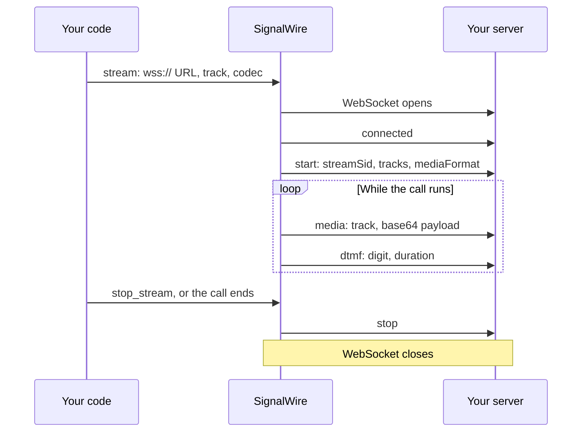

[make-and-receive-calls]: /docs/platform/voice/make-and-receive-calls
[prepare-calls]: /docs/platform/voice/make-and-receive-calls#prepare-for-your-first-call
[place-relay]: /docs/platform/voice/make-and-receive-calls#place-a-call-via-websocket-relay
[caller-id]: /docs/platform/voice/how-to-set-caller-id-or-cnam
[trial-mode]: /docs/platform/trial-mode
[webhooks]: /docs/platform/webhooks
[server-sdks]: /docs/server-sdks
[relay-guide]: /docs/server-sdks/guides/relay-client
[swml-intro]: /docs/swml
[call-commands]: /docs/apis/rest/calls/call-commands
[stream-status-callback]: /docs/apis/rest/webhooks/stream-status-callback
[swml-stream]: /docs/swml/reference/calling/stream
[swml-stop-stream]: /docs/swml/reference/calling/stop-stream
[swml-connect]: /docs/swml/reference/calling/connect
[swml-answer]: /docs/swml/reference/calling/answer
[sip-addresses]: /docs/platform/addresses#sip-addresses
[swml-join-conference]: /docs/swml/reference/calling/join-conference

Call streaming sends the audio of a live call to a WebSocket server you run, so your app can
transcribe, analyze, record, or answer it in near real time. Start by streaming a call to your own
phone into a small server that prints what arrives, then save or process the audio, and talk back to
the caller on a bidirectional stream.

## Choose an approach

Each approach starts and stops streams in its own way. All of them stream to the same kind of
WebSocket server, so the server code on this page works with every approach. Follow the section for
your app's approach:

- [SWML][swml-intro]: add `stream` to your call document and stop it with `stop_stream`, or
  `connect` the call to your server for a bidirectional stream. Optionally send stream events to a
  webhook.
- [WebSocket (Relay)][relay-guide]: start and stop a stream from code that holds a connection to
  the call. Stream events arrive in your code, so no webhook is needed.
- [REST](#stream-a-call-already-in-progress-via-rest): start and stop a one-way stream by call ID
  from any process.

## Prepare for streaming

Start with working call setup from [Make and receive calls][make-and-receive-calls]. Have these
values ready:

- Your Space URL, such as `<YOUR_SPACE>.signalwire.com`.
- Your Project ID and an API token with the **Voice** permission.
- A phone number in your Space, or a [verified caller ID][caller-id].
- A phone you can answer and speak into.
- A machine that can run a small WebSocket server, and a tunnel such as
  [ngrok](https://ngrok.com/) that gives it a public URL.

<Warning title="Stream URLs must use wss://">
SignalWire connects to your server over a secure WebSocket only, and rejects a plain `ws://` URL.
During development, run the server locally and put a TLS tunnel in front of it, as
[Run a WebSocket server](#run-a-websocket-server) shows.
</Warning>

<Warning title="Trial projects only call verified numbers">
A [trial project][trial-mode] only places calls to numbers you've purchased or verified, and
can't call internationally. [Prepare for your first call][prepare-calls] shows how to verify the
phone you'll test with.
</Warning>

Replace these values in the samples you run:

| Value | Replace with |
|---|---|
| `<YOUR_SPACE>` | Your Space's subdomain in `<YOUR_SPACE>.signalwire.com` |
| `<YOUR_PROJECT_ID>` | Your Project ID |
| `<YOUR_API_TOKEN>` | Your API token with the Voice permission, used only in server code |
| `<YOUR_CALLER_ID>` | Your SignalWire phone number, or a [verified caller ID][caller-id], in E.164 format |
| `<YOUR_DESTINATION>` | The phone you'll answer, in E.164 format |
| `<YOUR_AUDIO_STREAM_URL>` | The public `wss://` URL of your WebSocket server |
| `<YOUR_CALL_ID>` | The `id` of a live call, when you start a stream over REST |

## How call streaming works

When a stream starts, SignalWire opens a WebSocket connection to your `wss://` URL and sends JSON
messages on it: `connected`, then `start` with the audio format, then a `media` message for each
frame of audio, and `stop` when the stream ends. Each stream gets its own connection. The messages
are the same whichever approach starts the stream.

<llms-ignore>


</llms-ignore>

<llms-only>


```mermaid
sequenceDiagram
    participant App as Your code
    participant SW as SignalWire
    participant Srv as Your server

    App->>SW: stream: wss:// URL, track, codec
    SW->>Srv: WebSocket opens
    SW->>Srv: connected
    SW->>Srv: start: streamSid, tracks, mediaFormat
    loop While the call runs
        SW->>Srv: media: track, base64 payload
        SW->>Srv: dtmf: digit, duration
    end
    App->>SW: stop_stream, or the call ends
    SW->>Srv: stop
    Note over SW,Srv: WebSocket closes
```

</llms-only>

Every stream is one of two types. A one-way stream sends a copy of the call's audio while the call
carries on as normal; use it for recording, transcription, and analytics. A bidirectional stream
connects the call to your server as if the server were the other party, so the caller hears what
your server sends back; use it for your own speech pipeline or a third-party voice agent.

| | One-way stream | Bidirectional stream |
|---|---|---|
| Your server receives | A copy of the tracks you choose | The caller's audio, on the `inbound` track |
| Your server sends | Nothing; anything sent is ignored | Audio, marks, `clear`, and key presses |
| Start it with | SWML `stream`, Relay `call.stream()`, or the REST `calling.stream` command | SWML `connect`, or Relay `call.connect()`, with a stream as the destination |
| It ends when | You stop it, or the call ends | Your server closes the connection, or the call ends |

A call can run several one-way streams at once, each with its own `control_id` and URL. Two
streams on one call can't share a `control_id`.

## Run a WebSocket server

Every stream in this guide connects to a server you run. Start with one that prints what arrives,
so you can see a stream working before you write any processing code.

<Steps>

<Step title="Run the stream server" id="run-the-stream-server">

This server prints the stream's format when it starts, then a line for each second of audio it
receives on each track.

<CodeBlocks>
<CodeBlock title="Python — websockets">
```python
# Install: python -m pip install websockets
# Save as stream_server.py and run: python stream_server.py
import asyncio
import json

from websockets.asyncio.server import serve

FRAMES_PER_SECOND = 50  # each media message carries 20 ms of audio


async def handle(websocket):
    frames = {}
    async for message in websocket:
        event = json.loads(message)
        if event["event"] == "start":
            start = event["start"]
            media_format = start["mediaFormat"]
            print(f"Stream {start['streamSid']} started: tracks {start['tracks']}, "
                  f"{media_format['encoding']} at {media_format['sampleRate']} Hz")
        elif event["event"] == "media":
            track = event["media"]["track"]
            frames[track] = frames.get(track, 0) + 1
            if frames[track] % FRAMES_PER_SECOND == 0:
                print(f"{track}: {frames[track] // FRAMES_PER_SECOND} s of audio")
        elif event["event"] == "stop":
            print("Stream stopped")


async def main():
    async with serve(handle, "0.0.0.0", 8080):
        print("Listening on port 8080")
        await asyncio.get_running_loop().create_future()


asyncio.run(main())
```
</CodeBlock>
<CodeBlock title="JavaScript — ws">
```javascript
// Install: npm install ws
// Save as stream-server.mjs and run: node stream-server.mjs
import { WebSocketServer } from "ws";

const FRAMES_PER_SECOND = 50; // each media message carries 20 ms of audio

const server = new WebSocketServer({ port: 8080 });
console.log("Listening on port 8080");

server.on("connection", (socket) => {
  const frames = new Map();

  socket.on("message", (data) => {
    const event = JSON.parse(data.toString());
    if (event.event === "start") {
      const { streamSid, tracks, mediaFormat } = event.start;
      console.log(`Stream ${streamSid} started: tracks ${tracks}, ` +
        `${mediaFormat.encoding} at ${mediaFormat.sampleRate} Hz`);
    } else if (event.event === "media") {
      const track = event.media.track;
      const count = (frames.get(track) ?? 0) + 1;
      frames.set(track, count);
      if (count % FRAMES_PER_SECOND === 0) {
        console.log(`${track}: ${count / FRAMES_PER_SECOND} s of audio`);
      }
    } else if (event.event === "stop") {
      console.log("Stream stopped");
    }
  });
});
```
</CodeBlock>
</CodeBlocks>

</Step>

<Step title="Give the server a public wss:// URL" id="give-the-server-a-public-wss-url">

In a second terminal, put a tunnel in front of port `8080`:

```bash
ngrok http 8080
```

ngrok prints an `https://` **Forwarding** URL. Replace `https://` with `wss://` to get your
`<YOUR_AUDIO_STREAM_URL>`, such as `wss://example.ngrok-free.app`. Keep the server and the tunnel
running while you test; a new tunnel usually means a new hostname.

</Step>

</Steps>

### Run an echo server for bidirectional streams

A bidirectional stream needs a server that sends audio back. This one returns each `media` payload
unchanged, so the caller hears their own voice a moment later. It confirms that audio flows in both
directions before you plug in a real speech pipeline. Run it in place of the stream server, on the
same port and tunnel, when you reach a "Talk back" section.

<CodeBlocks>
<CodeBlock title="Python — websockets">
```python
# Install: python -m pip install websockets
# Save as echo_server.py and run: python echo_server.py
import asyncio
import json

from websockets.asyncio.server import serve


async def handle(websocket):
    stream_sid = None
    async for message in websocket:
        event = json.loads(message)
        if event["event"] == "start":
            stream_sid = event["start"]["streamSid"]
            print(f"Echoing stream {stream_sid}")
        elif event["event"] == "media" and stream_sid:
            await websocket.send(json.dumps({
                "event": "media",
                "streamSid": stream_sid,
                "media": {"payload": event["media"]["payload"]},
            }))
        elif event["event"] == "stop":
            print("Stream stopped")


async def main():
    async with serve(handle, "0.0.0.0", 8080):
        print("Listening on port 8080")
        await asyncio.get_running_loop().create_future()


asyncio.run(main())
```
</CodeBlock>
<CodeBlock title="JavaScript — ws">
```javascript
// Install: npm install ws
// Save as echo-server.mjs and run: node echo-server.mjs
import { WebSocketServer } from "ws";

const server = new WebSocketServer({ port: 8080 });
console.log("Listening on port 8080");

server.on("connection", (socket) => {
  let streamSid;

  socket.on("message", (data) => {
    const event = JSON.parse(data.toString());
    if (event.event === "start") {
      streamSid = event.start.streamSid;
      console.log(`Echoing stream ${streamSid}`);
    } else if (event.event === "media" && streamSid) {
      socket.send(JSON.stringify({
        event: "media",
        streamSid,
        media: { payload: event.media.payload },
      }));
    } else if (event.event === "stop") {
      console.log("Stream stopped");
    }
  });
});
```
</CodeBlock>
</CodeBlocks>

## Stream call audio via SWML

SWML offers two ways to stream. [`stream`][swml-stream] starts a one-way stream and moves on to the
next method at once, so the rest of the document runs while audio streams.
[`connect`][swml-connect] with `to` set to `stream:<URL>` bridges the call to your server for a
bidirectional stream, and the document waits there until the stream ends.

### Stream a call via SWML

Send a REST `dial` request with a SWML document that starts a stream, then keeps the call open
while you talk. SignalWire runs the document when you answer.

<Steps>

<Step title="Place the call" id="place-the-call-via-swml">

<CodeBlocks>
<CodeBlock title="Python — REST client">
```python
# Install: python -m pip install signalwire-sdk==3.4.1
# Save as stream_call.py and run: python stream_call.py
from signalwire import SWMLBuilder, SWMLService
from signalwire.rest import RestClient

client = RestClient(
    project="<YOUR_PROJECT_ID>",
    token="<YOUR_API_TOKEN>",
    host="<YOUR_SPACE>.signalwire.com",
)

# `stream` is not yet in the builder's bundled schema. Validation is one
# setting for the whole service, so turn it off and add `stream` as raw SWML.
swml_builder = SWMLBuilder(SWMLService(name="stream-call", schema_validation=False))
swml_builder.service.add_verb("stream", {"url": "<YOUR_AUDIO_STREAM_URL>"})
swml = (
    swml_builder
    .say("Your call is being streamed. Say a few words.")
    .sleep(20000)
    .say("Goodbye.")
    .build()
)

call = client.calling.dial(
    from_="<YOUR_CALLER_ID>",
    to="<YOUR_DESTINATION>",
    swml=swml,
)
print(call["id"])
```
</CodeBlock>
<CodeBlock title="TypeScript — REST client">
```typescript
// Install: npm install @signalwire/sdk@2.0.5
// This sample also runs as JavaScript: save as stream-call.mjs,
// then run: node stream-call.mjs
import { RestClient, SwmlBuilder } from "@signalwire/sdk";

const client = new RestClient({
  project: "<YOUR_PROJECT_ID>",
  token: "<YOUR_API_TOKEN>",
  host: "<YOUR_SPACE>.signalwire.com",
});

// `stream` is not yet in the builder's bundled schema, so add it as raw SWML.
const swmlBuilder = new SwmlBuilder();
swmlBuilder.addVerb("stream", { url: "<YOUR_AUDIO_STREAM_URL>" });
const swml = swmlBuilder
  .say("Your call is being streamed. Say a few words.")
  .sleep(20000)
  .say("Goodbye.")
  .build();

const call = await client.calling.dial({
  from: "<YOUR_CALLER_ID>",
  to: "<YOUR_DESTINATION>",
  swml,
});
console.log(call.id);
```
</CodeBlock>
<CodeBlock title="cURL — Calling API">
```bash
curl -X POST "https://<YOUR_SPACE>.signalwire.com/api/calling/calls" \
  -u "<YOUR_PROJECT_ID>:<YOUR_API_TOKEN>" \
  -H "Content-Type: application/json" \
  -d '{
    "command": "dial",
    "params": {
      "from": "<YOUR_CALLER_ID>",
      "to": "<YOUR_DESTINATION>",
      "swml": {
        "version": "1.0.0",
        "sections": {
          "main": [
            { "stream": { "url": "<YOUR_AUDIO_STREAM_URL>" } },
            { "play": { "url": "say:Your call is being streamed. Say a few words." } },
            { "sleep": 20000 },
            { "play": { "url": "say:Goodbye." } }
          ]
        }
      }
    }
  }'
```
</CodeBlock>
</CodeBlocks>

The cURL example sends the `dial` command to [Call commands][call-commands]. The REST API returns a
call `id` and status `queued`, which confirms that SignalWire accepted the request. Save the `id`
to identify this call.

<EndpointResponseSnippet endpoint="POST /api/calling/calls" />

</Step>

<Step title="Answer and speak" id="answer-and-speak-via-swml">

Answer your phone and say a few words. The server prints a `started` line as you answer, then a line
for each second of audio:

```text
Stream 7d56cc11-536d-4a45-b4fb-ed3d55be843b started: tracks ['inbound'], audio/x-mulaw at 8000 Hz
inbound: 1 s of audio
inbound: 2 s of audio
```

After twenty seconds you hear "Goodbye.", the call ends, and the server prints `Stream stopped`.
The stream carries only the `inbound` track, your voice, until you
[choose other tracks](#stream-options-track-and-custom-parameters).

- **The call plays normally but the server prints nothing.** SignalWire couldn't reach your URL,
  and the call carried on without a stream. Check that the URL begins with `wss://`, and that the
  tunnel is running and points at port `8080`.
- **The phone never rings.** Check that `<YOUR_CALLER_ID>` is a number in your Space or a verified
  caller ID, and that a trial project has verified the destination.

</Step>

</Steps>

The same document in YAML, for a hosted SWML Script or your own SWML server:

```yaml
version: 1.0.0
sections:
  main:
    - stream:
        url: <YOUR_AUDIO_STREAM_URL>
    - play:
        url: say:Your call is being streamed. Say a few words.
    - sleep: 20000
    - play:
        url: say:Goodbye.
```

### Talk back on a bidirectional stream via SWML

Run the [echo server](#run-an-echo-server-for-bidirectional-streams) instead of the stream server.
This document plays an announcement, connects the call to your server, and hangs up once your
server closes the connection. Set `to` to your `wss://` URL with a `stream:` prefix. The stream's
settings, such as `codec`, `realtime`, and `name`, sit alongside `to`.

<CodeBlocks>
<CodeBlock title="Python — SWML builder">
```python
# Install: python -m pip install signalwire-sdk==3.4.1
# Save as echo_call.py and run: python echo_call.py
from signalwire import SWMLBuilder, SWMLService
from signalwire.rest import RestClient

client = RestClient(
    project="<YOUR_PROJECT_ID>",
    token="<YOUR_API_TOKEN>",
    host="<YOUR_SPACE>.signalwire.com",
)

# The stream-specific `connect` properties are not yet in the builder's
# bundled schema, so turn off validation.
swml = (
    SWMLBuilder(SWMLService(name="echo-call", schema_validation=False))
    .say("You are connected to the echo server. Speak, and you will hear yourself.")
    .connect(
        to="stream:<YOUR_AUDIO_STREAM_URL>",
        codec="PCMU",
        realtime=True,
        name="echo",
    )
    .hangup()
    .build()
)

call = client.calling.dial(
    from_="<YOUR_CALLER_ID>",
    to="<YOUR_DESTINATION>",
    swml=swml,
)
print(call["id"])
```
</CodeBlock>
<CodeBlock title="TypeScript — SWML builder">
```typescript
// Install: npm install @signalwire/sdk@2.0.5
// This sample also runs as JavaScript: save as echo-call.mjs,
// then run: node echo-call.mjs
import { RestClient, SwmlBuilder } from "@signalwire/sdk";

const client = new RestClient({
  project: "<YOUR_PROJECT_ID>",
  token: "<YOUR_API_TOKEN>",
  host: "<YOUR_SPACE>.signalwire.com",
});

const swml = new SwmlBuilder()
  .say("You are connected to the echo server. Speak, and you will hear yourself.")
  .connect({
    to: "stream:<YOUR_AUDIO_STREAM_URL>",
    codec: "PCMU",
    realtime: true,
    name: "echo",
  })
  .hangup()
  .build();

const call = await client.calling.dial({
  from: "<YOUR_CALLER_ID>",
  to: "<YOUR_DESTINATION>",
  swml,
});
console.log(call.id);
```
</CodeBlock>
<CodeBlock title="YAML">
```yaml
version: 1.0.0
sections:
  main:
    - play:
        url: say:You are connected to the echo server. Speak, and you will hear yourself.
    - connect:
        to: stream:<YOUR_AUDIO_STREAM_URL>
        codec: PCMU
        realtime: true
        name: echo
    - hangup: {}
```
</CodeBlock>
<CodeBlock title="JSON">
```json
{
  "version": "1.0.0",
  "sections": {
    "main": [
      { "play": { "url": "say:You are connected to the echo server. Speak, and you will hear yourself." } },
      {
        "connect": {
          "to": "stream:<YOUR_AUDIO_STREAM_URL>",
          "codec": "PCMU",
          "realtime": true,
          "name": "echo"
        }
      },
      { "hangup": {} }
    ]
  }
}
```
</CodeBlock>
</CodeBlocks>

Answer the call and speak. You hear the announcement, then your own voice echoed back a moment
after you say each word. Hang up to end the call; the server prints `Stream stopped`. If you hear
silence, check that the document uses `connect` rather than `stream`, since a one-way stream
ignores anything your server sends.

A stream can't be the `to` of a `dial`, so an outbound bidirectional stream always dials the person
first and runs `connect` when they answer. When your server closes the connection, `connect`
finishes and the document continues with the next method, here `hangup`. Put a `play` or any other
method there to keep the call going instead.

To stream a whole conference in both directions, give [`join_conference`][swml-join-conference] a
`stream` object; its reference lists the settings it accepts.

### Stop a stream via SWML

A one-way stream runs until the call ends unless you stop it. Give `stream` a `control_id`, and
run [`stop_stream`][swml-stop-stream] with the same value when your server has what it needs. This
version of the [Stream a call via SWML](#stream-a-call-via-swml) document stops the stream after
twenty seconds and keeps the call open:

<CodeBlocks>

```python title="Python — SWML builder" {1,3-4}
swml_builder.service.add_verb("stream", {"url": "<YOUR_AUDIO_STREAM_URL>", "control_id": "my-stream"})
swml_builder.say("Your call is being streamed. Say a few words.").sleep(20000)
# `stop_stream` is not yet in the builder's bundled schema either.
swml_builder.service.add_verb("stop_stream", {"control_id": "my-stream"})
swml = swml_builder.say("The stream has stopped. Goodbye.").build()
```

```typescript title="TypeScript — SWML builder" {1,3-4}
swmlBuilder.addVerb("stream", { url: "<YOUR_AUDIO_STREAM_URL>", control_id: "my-stream" });
swmlBuilder.say("Your call is being streamed. Say a few words.").sleep(20000);
// `stop_stream` is not yet in the builder's bundled schema either.
swmlBuilder.addVerb("stop_stream", { control_id: "my-stream" });
const swml = swmlBuilder.say("The stream has stopped. Goodbye.").build();
```

```yaml title="YAML" {6,10-11}
version: 1.0.0
sections:
  main:
    - stream:
        url: <YOUR_AUDIO_STREAM_URL>
        control_id: my-stream
    - play:
        url: say:Your call is being streamed. Say a few words.
    - sleep: 20000
    - stop_stream:
        control_id: my-stream
    - play:
        url: say:The stream has stopped. Goodbye.
```

```json title="JSON" {8,13}
{
  "version": "1.0.0",
  "sections": {
    "main": [
      {
        "stream": {
          "url": "<YOUR_AUDIO_STREAM_URL>",
          "control_id": "my-stream"
        }
      },
      { "play": { "url": "say:Your call is being streamed. Say a few words." } },
      { "sleep": 20000 },
      { "stop_stream": { "control_id": "my-stream" } },
      { "play": { "url": "say:The stream has stopped. Goodbye." } }
    ]
  }
}
```

</CodeBlocks>

The server prints `Stream stopped` before you hear "The stream has stopped." Omit `control_id` in
both places to stop the most recently started stream. A bidirectional stream has no `stop_stream`;
your server ends it by closing the connection.

### Track a stream via SWML

Add `status_url` to `stream` to receive a JSON webhook when the stream starts and another when it
finishes. On a `stream:` `connect`, `status_url` must be an `https://` URL; it is notified only if
the stream connects. See the [webhooks guide][webhooks] for endpoint setup and testing.

| Webhook field | Value |
|---|---|
| `event_type` | `calling.call.stream` |
| `params.call_id` | The call ID |
| `params.control_id` | The stream's `control_id` |
| `params.state` | `streaming` when the stream starts, then `finished` |
| `params.url` | The stream's WebSocket URL |

```json
{
  "event_type": "calling.call.stream",
  "params": {
    "call_id": "2e1e66e5-5d07-413d-9668-55542992eec0",
    "control_id": "my-stream",
    "state": "streaming",
    "url": "wss://example.com/audio-stream"
  }
}
```

On a one-way stream, `streaming` means SignalWire started the stream, not that your server accepted
the connection, so confirm the connection from your server's output. The
[stream status callback reference][stream-status-callback] lists every field.

## Stream call audio via WebSocket (Relay)

Start a one-way stream on an answered call with `call.stream()`. It returns a stream action that
keeps the `control_id` for you; call its `stop()` method to end the stream. For a bidirectional
stream, pass a device of type `stream` to `call.connect()`. It must be the only device in the
list.

### Stream a call via WebSocket (Relay)

Dial your phone, start a stream, and keep the call open for twenty seconds while you talk. Call
setup follows [Place a call via WebSocket (Relay)][place-relay].

<Steps>

<Step title="Run the call program" id="run-the-call-program-via-websocket-relay">

<CodeBlocks>
<CodeBlock title="Python — Relay client">
```python
# Install: python -m pip install signalwire-sdk==3.4.1
# Save as stream_call_relay.py and run: python stream_call_relay.py
import asyncio
from signalwire.relay import RelayClient

client = RelayClient(
    project="<YOUR_PROJECT_ID>",
    token="<YOUR_API_TOKEN>",
    host="<YOUR_SPACE>.signalwire.com",
    contexts=["default"],
)

async def main():
    async with client:
        call = await client.dial(
            devices=[[{
                "type": "phone",
                "params": {
                    "from_number": "<YOUR_CALLER_ID>",
                    "to_number": "<YOUR_DESTINATION>",
                    "timeout": 30,
                },
            }]],
        )

        await call.stream(url="<YOUR_AUDIO_STREAM_URL>")
        await call.play([{
            "type": "tts",
            "params": {"text": "Your call is being streamed. Say a few words."},
        }])
        await asyncio.sleep(20)

        async def hang_up_after_playback(_event):
            if call.state != "ended":
                await call.hangup()

        await call.play(
            [{"type": "tts", "params": {"text": "Goodbye."}}],
            on_completed=hang_up_after_playback,
        )
        await call.wait_for_ended()

asyncio.run(main())
```
</CodeBlock>
<CodeBlock title="TypeScript — Relay client">
```typescript
// Install: npm install @signalwire/sdk@2.0.5
// This sample also runs as JavaScript: save as stream-call-relay.mjs,
// then run: node stream-call-relay.mjs
import { RelayClient } from "@signalwire/sdk";

const client = new RelayClient({
  project: "<YOUR_PROJECT_ID>",
  token: "<YOUR_API_TOKEN>",
  host: "<YOUR_SPACE>.signalwire.com",
  contexts: ["default"],
});

await client.connect();

try {
  const call = await client.dial([[{
    type: "phone",
    params: {
      from_number: "<YOUR_CALLER_ID>",
      to_number: "<YOUR_DESTINATION>",
      timeout: 30,
    },
  }]]);

  await call.stream("<YOUR_AUDIO_STREAM_URL>");
  await call.play([
    { type: "tts", text: "Your call is being streamed. Say a few words." },
  ]);
  await new Promise((resolve) => setTimeout(resolve, 20_000));

  await call.play([{ type: "tts", text: "Goodbye." }], {
    onCompleted: async () => {
      if (call.state !== "ended") await call.hangup();
    },
  });
  await call.waitForEnded();
} finally {
  await client.disconnect();
}
```
</CodeBlock>
</CodeBlocks>

</Step>

<Step title="Answer and speak" id="answer-and-speak-via-websocket-relay">

Answer your phone and say a few words. The stream server prints a `started` line, then a line for
each second of `inbound` audio. After twenty seconds you hear "Goodbye.", the call ends, and the
server prints `Stream stopped`.

If the call plays normally but the server prints nothing, SignalWire couldn't reach your URL.
Check that it begins with `wss://` and that the tunnel points at port `8080`.

</Step>

</Steps>

### Talk back on a bidirectional stream via WebSocket (Relay)

Run the [echo server](#run-an-echo-server-for-bidirectional-streams) instead of the stream server.
This program dials, plays an announcement, then connects the call to your server through a `stream`
device. `connect()` returns as soon as SignalWire accepts the request, so the program follows the
bridge through `calling.call.connect` events and hangs up when the bridge ends.

<CodeBlocks>
<CodeBlock title="Python — Relay client">
```python
# Install: python -m pip install signalwire-sdk==3.4.1
# Save as echo_call_relay.py and run: python echo_call_relay.py
import asyncio
from signalwire.relay import ConnectEvent, RelayClient

client = RelayClient(
    project="<YOUR_PROJECT_ID>",
    token="<YOUR_API_TOKEN>",
    host="<YOUR_SPACE>.signalwire.com",
    contexts=["default"],
)

async def main():
    async with client:
        call = await client.dial(
            devices=[[{
                "type": "phone",
                "params": {
                    "from_number": "<YOUR_CALLER_ID>",
                    "to_number": "<YOUR_DESTINATION>",
                    "timeout": 30,
                },
            }]],
        )

        async def on_connect(event: ConnectEvent):
            print(f"Stream bridge: {event.connect_state}")
            # The bridge ends when your server closes the connection.
            if event.connect_state in ("disconnected", "failed") and call.state != "ended":
                await call.hangup()

        call.on("calling.call.connect", on_connect)
        announcement = await call.play([{
            "type": "tts",
            "params": {"text": "You are connected to the echo server. Speak, and you will hear yourself."},
        }])
        await announcement.wait()
        await call.connect(
            devices=[[{
                "type": "stream",
                "params": {
                    "url": "<YOUR_AUDIO_STREAM_URL>",
                    "codec": "PCMU",
                    "realtime": True,
                    "name": "echo",
                },
            }]],
        )
        await call.wait_for_ended()

asyncio.run(main())
```
</CodeBlock>
<CodeBlock title="TypeScript — Relay client">
```typescript
// Install: npm install @signalwire/sdk@2.0.5
// This sample also runs as JavaScript: save as echo-call-relay.mjs,
// then run: node echo-call-relay.mjs
import { RelayClient } from "@signalwire/sdk";

const client = new RelayClient({
  project: "<YOUR_PROJECT_ID>",
  token: "<YOUR_API_TOKEN>",
  host: "<YOUR_SPACE>.signalwire.com",
  contexts: ["default"],
});

await client.connect();

try {
  const call = await client.dial([[{
    type: "phone",
    params: {
      from_number: "<YOUR_CALLER_ID>",
      to_number: "<YOUR_DESTINATION>",
      timeout: 30,
    },
  }]]);

  call.on("calling.call.connect", async (event) => {
    const state = event.params.connect_state;
    console.log(`Stream bridge: ${state}`);
    // The bridge ends when your server closes the connection.
    if ((state === "disconnected" || state === "failed") && call.state !== "ended") {
      await call.hangup();
    }
  });
  const announcement = await call.play([
    { type: "tts", text: "You are connected to the echo server. Speak, and you will hear yourself." },
  ]);
  await announcement.wait();
  await call.connect([[{
    type: "stream",
    params: {
      url: "<YOUR_AUDIO_STREAM_URL>",
      codec: "PCMU",
      realtime: true,
      name: "echo",
    },
  }]]);
  await call.waitForEnded();
} finally {
  await client.disconnect();
}
```
</CodeBlock>
</CodeBlocks>

Answer and speak to hear your voice echoed back. The program prints `connected` while audio flows,
then `disconnected` when you hang up. A `failed` state means SignalWire couldn't reach your URL.

The call stays bridged to your server until your server closes the connection or the call ends.
This program hangs up when the bridge ends; to keep the call going instead, play audio or connect
it elsewhere.

### Stop a stream via WebSocket (Relay)

Keep the action that `call.stream()` returns, and call its `stop()` method when your server has
what it needs. In the [Stream a call via WebSocket (Relay)](#stream-a-call-via-websocket-relay)
program, replace the stream and sleep lines with these:

<CodeBlocks>

```python title="Python — Relay client" {1,7}
stream = await call.stream(url="<YOUR_AUDIO_STREAM_URL>")
await call.play([{
    "type": "tts",
    "params": {"text": "Your call is being streamed. Say a few words."},
}])
await asyncio.sleep(20)
await stream.stop()
```

```typescript title="TypeScript — Relay client" {1,6}
const stream = await call.stream("<YOUR_AUDIO_STREAM_URL>");
await call.play([
  { type: "tts", text: "Your call is being streamed. Say a few words." },
]);
await new Promise((resolve) => setTimeout(resolve, 20_000));
await stream.stop();
```

</CodeBlocks>

To stop a stream from a process that doesn't hold the call, use the REST
[`calling.stream.stop`](#stream-a-call-already-in-progress-via-rest) command with the stream's
`control_id`, which the action exposes as `control_id` in Python and `controlId` in TypeScript.

### Track a stream via WebSocket (Relay)

Stream events arrive in your code over the same connection:

| Event | What to read | Typical action |
|---|---|---|
| `calling.call.stream` | `state` is `streaming` when the stream starts, then `finished`; `control_id` identifies the stream | Log it, or clean up when the stream finishes |
| `calling.call.connect` | `connect_state` moves from `connecting` to `connected` while audio flows, then `disconnected`, or `failed` if SignalWire couldn't reach your URL | Retry or hang up on `failed` |

To log one-way stream events, register a handler before you call `call.stream()`:

<CodeBlocks>

```python title="Python — Relay client"
from signalwire.relay import StreamEvent

def on_stream(event: StreamEvent):
    print(f"Stream {event.control_id} is {event.state}")

call.on("calling.call.stream", on_stream)
```

```typescript title="TypeScript — Relay client"
call.on("calling.call.stream", (event) => {
  console.log(`Stream ${event.params.control_id} is ${event.params.state}`);
});
```

</CodeBlocks>

As with the SWML webhook, `streaming` means SignalWire started the stream, not that your server
accepted the connection.

## Stream a call already in progress via REST

When a process that doesn't hold the call needs to stream it, send the `calling.stream` command
with the answered call's ID, a `control_id`, and the stream's `url`. The call ID is the `id` from
the `dial` response, or the `call_id` delivered to your SWML endpoint or status webhook. To try it,
start the [Stream a call via SWML](#stream-a-call-via-swml) program, and run this one with the `id`
it prints while the call is up. The [Server SDKs][server-sdks] wrap both commands; this program
streams the call for ten seconds, then sends `calling.stream.stop` with the same `control_id`:

<CodeBlocks>
<CodeBlock title="Python — REST client">
```python
# Install: python -m pip install signalwire-sdk==3.4.1
# Save as stream_rest.py and run: python stream_rest.py
import time

from signalwire.rest import RestClient

client = RestClient(
    project="<YOUR_PROJECT_ID>",
    token="<YOUR_API_TOKEN>",
    host="<YOUR_SPACE>.signalwire.com",
)

client.calling.stream(
    "<YOUR_CALL_ID>",
    url="<YOUR_AUDIO_STREAM_URL>",
    control_id="rest-stream",
)
time.sleep(10)
client.calling.stream_stop("<YOUR_CALL_ID>", control_id="rest-stream")
print("Stream stopped")
```
</CodeBlock>
<CodeBlock title="TypeScript — REST client">
```typescript
// Install: npm install @signalwire/sdk@2.0.5
// This sample also runs as JavaScript: save as stream-rest.mjs,
// then run: node stream-rest.mjs
import { RestClient } from "@signalwire/sdk";

const client = new RestClient({
  project: "<YOUR_PROJECT_ID>",
  token: "<YOUR_API_TOKEN>",
  host: "<YOUR_SPACE>.signalwire.com",
});

await client.calling.stream("<YOUR_CALL_ID>", {
  url: "<YOUR_AUDIO_STREAM_URL>",
  control_id: "rest-stream",
});
await new Promise((resolve) => setTimeout(resolve, 10_000));
await client.calling.streamStop("<YOUR_CALL_ID>", { control_id: "rest-stream" });
console.log("Stream stopped");
```
</CodeBlock>
</CodeBlocks>

The server prints a second `started` line for the REST stream, and `Stream stopped` ten seconds
later while the call carries on. The other stream settings, such as `track`, `codec`, and
`status_url`, sit alongside `url`. In Python, pass `status_url` through `extras`.

The command doesn't echo the `control_id`, so keep the value you sent. To call the REST API
directly, send these requests to [Call commands][call-commands]:

<EndpointRequestSnippet endpoint="POST /api/calling/calls" example="calling.stream" />

<EndpointRequestSnippet endpoint="POST /api/calling/calls" example="calling.stream.stop" />

`calling.stream.stop` stops one-way streams only. A bidirectional stream ends when your server
closes the WebSocket.

## Handle stream audio on your server

The stream server prints what arrives; a real app decodes it. This section covers the messages in
full, the stream settings that shape the audio, and two servers you can swap in for the stream
server: one saves the audio and one processes it as it arrives. Both work with the call programs
above unchanged.

### Messages your server receives

SignalWire sends each message as JSON text. Every message has an `event` field that names its type,
so your server parses each message and branches on `event`. Every message after `connected` also
carries a `sequenceNumber`, a string counter that starts at `"1"` and increments with each message
on the connection.

| `event` | When it arrives | Fields you use |
|---|---|---|
| `connected` | Once, when the WebSocket opens | None; wait for `start` |
| `start` | Once, before any audio | `start.streamSid`, `start.callSid`, `start.tracks`, `start.mediaFormat`, `start.customParameters` |
| `media` | For each frame of audio on each track | `media.track`, `media.chunk`, `media.timestamp`, `media.payload` |
| `dtmf` | When a key is pressed on the call | `dtmf.digit`, one of `0` to `9`, `*`, `#`, or `A` to `D`; `dtmf.duration` |
| `mark` | Bidirectional streams only, in reply to a `mark` your server sent | `mark.name` |
| `stop` | Once, when the stream stops or the call ends | None; finish your per-stream work |

Set up your per-stream state on `start`:

```json
{
  "event": "start",
  "sequenceNumber": "1",
  "start": {
    "streamSid": "7d56cc11-536d-4a45-b4fb-ed3d55be843b",
    "callSid": "76ac3c36-56da-4a3e-a0d6-b5f8df6da9ad",
    "tracks": ["inbound", "outbound"],
    "customParameters": {"session_id": "abc123"},
    "mediaFormat": {"encoding": "audio/x-mulaw", "sampleRate": 8000, "channels": 2}
  }
}
```

- `streamSid` identifies the stream. Each stream gets its own connection, so a server handling many
  calls tells them apart by it. Send it back on every message to a bidirectional stream.
- `callSid` is the ID of the call being streamed.
- `tracks` lists the tracks that will arrive: `inbound`, `outbound`, or both.
- `mediaFormat` describes the audio. `encoding` names the codec and `sampleRate` is in hertz.
  `channels` is the number of tracks; each `media` message still carries a single track.
- `customParameters` holds the custom parameters you set when you started the stream, if any.

Each `media` message carries one frame of one track:

```json
{
  "event": "media",
  "sequenceNumber": "42",
  "media": {
    "track": "inbound",
    "chunk": "41",
    "timestamp": "820",
    "payload": "<BASE64_AUDIO>"
  }
}
```

- `track` is `inbound`, what the person on the call says, or `outbound`, what they hear.
- `chunk` counts frames on that track, starting at `"1"`.
- `timestamp` is in milliseconds and advances one frame per message. Both tracks share it, so use
  it rather than arrival order to align or mix them.
- `payload` is the base64-encoded audio.

### Choose a stream codec for the call

The stream has its own codec, separate from the codec the call uses. SignalWire converts the call's
audio to the stream's `codec` before sending it to your server, and on a bidirectional stream
converts the audio your server sends back into the call's codec. When you don't set `codec`, every
stream uses `PCMU`, 8 kHz G.711 µ-law, whatever the call type.

A stream can't carry more detail than the call does. Streaming a call that uses an 8 kHz codec at
16 kHz only resamples the same audio. Choose the stream codec from the call's own codec:

| The call's codec | Audio the call carries | Stream `codec` to request |
|---|---|---|
| `PCMU`, `PCMA`, or `G729` | 8 kHz narrowband | `PCMU`, the default |
| `G722` or `AMR-WB` | 16 kHz wideband | `L16@16000h` |
| `OPUS` | Up to 48 kHz | `L16@16000h`, or `L16@24000h` when your speech model accepts it |

Where the call's codec comes from depends on the call type:

- Calls to and from phone numbers use a codec SignalWire sets, and the `codecs` settings in SWML
  have no effect on them. Stream them with the default `PCMU`.
- SIP calls use a codec from the list your SIP endpoint or [SIP Address][sip-addresses] allows. In
  SWML, `codecs` on [`answer`][swml-answer] or [`connect`][swml-connect] sets the codecs offered,
  for example `G722` when you want wideband audio to stream.
- Browser SDK calls use WebRTC, and browsers support `OPUS`, so these calls can carry wideband
  audio.

Request `L16` when your speech model expects linear PCM, at the sample rate the model wants, even
on an 8 kHz call. Other codecs and packet-time modifiers are listed in the
[`connect` reference][swml-connect]. SignalWire doesn't start a stream whose codec it doesn't accept.

| Stream `codec` | `mediaFormat.encoding` | `mediaFormat.sampleRate` |
|---|---|---|
| `PCMU` (default) | `audio/x-mulaw` | 8000 |
| `L16@16000h` | `audio/x-L16` | 16000 |
| `L16@24000h` | `audio/x-L16` | 24000 |

A decoded `payload` is raw audio with no file header. Each frame is 20 ms by default: 160 bytes of
`PCMU`, or 640 bytes of `L16` at 16 kHz. `L16` audio is 16-bit signed samples in little-endian byte
order.

### Stream options: track and custom parameters

`track` selects which side of the conversation a one-way stream sends. `inbound_track`, the default,
is what the person on the call says; `outbound_track` is what they hear; `both_tracks` sends both,
with each `media` message labeled by track. A bidirectional stream sends only the `inbound` track.

Two more settings connect a WebSocket to the rest of your application:

- `custom_parameters` is an object you set when you start the stream. Its keys arrive as
  `start.customParameters`, so pass your own session or customer IDs here rather than in the URL.
- `authorization_bearer_token` is sent as `Authorization: Bearer <token>` on the WebSocket
  handshake. Reject connections that don't carry the token you expect.

### Save call audio to a file

This server writes each track to its own WAV file as audio arrives, so memory use stays flat on a
long call. It fills in the WAV header's sizes when the stream stops, or when the connection drops
without a `stop` message. Run it in place of the stream server, then rerun your Stream a call
program. Add `track: both_tracks` to the stream to get a second file with what the caller hears.

<CodeBlocks>
<CodeBlock title="Python — websockets">
```python
# Install: python -m pip install websockets
# Save as save_audio.py and run: python save_audio.py
import asyncio
import base64
import json
import struct

from websockets.asyncio.server import serve

HEADER_BYTES = 46


def wav_header(data_length, sample_rate):
    # WAV header for 8-bit G.711 µ-law (format tag 7), one channel.
    return struct.pack(
        "<4sI4s4sIHHIIHHH4sI",
        b"RIFF", 38 + data_length, b"WAVE",
        b"fmt ", 18, 7, 1, sample_rate, sample_rate, 1, 8, 0,
        b"data", data_length,
    )


async def handle(websocket):
    files = {}
    sample_rate = 8000
    try:
        async for message in websocket:
            event = json.loads(message)
            if event["event"] == "start":
                stream_sid = event["start"]["streamSid"]
                sample_rate = event["start"]["mediaFormat"]["sampleRate"]
                for track in event["start"]["tracks"]:
                    output = open(f"{stream_sid}-{track}.wav", "wb")
                    output.write(wav_header(0, sample_rate))
                    files[track] = output
                print(f"Recording stream {stream_sid}")
            elif event["event"] == "media":
                audio = base64.b64decode(event["media"]["payload"])
                files[event["media"]["track"]].write(audio)
            elif event["event"] == "stop":
                break
    finally:
        # Runs on stop or a dropped connection, so every file gets its final sizes.
        for output in files.values():
            data_length = output.tell() - HEADER_BYTES
            output.seek(0)
            output.write(wav_header(data_length, sample_rate))
            output.close()
            print(f"Saved {output.name}, {data_length / sample_rate:.1f} seconds")


async def main():
    async with serve(handle, "0.0.0.0", 8080):
        print("Listening on port 8080")
        await asyncio.get_running_loop().create_future()


asyncio.run(main())
```
</CodeBlock>
<CodeBlock title="JavaScript — ws">
```javascript
// Install: npm install ws
// Save as save-audio.mjs and run: node save-audio.mjs
import { closeSync, openSync, writeSync } from "node:fs";
import { WebSocketServer } from "ws";

const HEADER_BYTES = 46;

function wavHeader(dataLength, sampleRate) {
  // WAV header for 8-bit G.711 µ-law (format tag 7), one channel.
  const header = Buffer.alloc(HEADER_BYTES);
  header.write("RIFF", 0);
  header.writeUInt32LE(38 + dataLength, 4);
  header.write("WAVE", 8);
  header.write("fmt ", 12);
  header.writeUInt32LE(18, 16);
  header.writeUInt16LE(7, 20);
  header.writeUInt16LE(1, 22);
  header.writeUInt32LE(sampleRate, 24);
  header.writeUInt32LE(sampleRate, 28);
  header.writeUInt16LE(1, 32);
  header.writeUInt16LE(8, 34);
  header.writeUInt16LE(0, 36);
  header.write("data", 38);
  header.writeUInt32LE(dataLength, 42);
  return header;
}

const server = new WebSocketServer({ port: 8080 });
console.log("Listening on port 8080");

server.on("connection", (socket) => {
  const files = new Map();
  let sampleRate = 8000;

  // Runs on stop or a dropped connection, so every file gets its final sizes.
  const finish = () => {
    for (const file of files.values()) {
      writeSync(file.fd, wavHeader(file.bytes, sampleRate), 0, HEADER_BYTES, 0);
      closeSync(file.fd);
      console.log(`Saved ${file.path}, ${(file.bytes / sampleRate).toFixed(1)} seconds`);
    }
    files.clear();
  };

  socket.on("message", (data) => {
    const event = JSON.parse(data.toString());
    if (event.event === "start") {
      const { streamSid, mediaFormat, tracks } = event.start;
      sampleRate = mediaFormat.sampleRate;
      for (const track of tracks) {
        const path = `${streamSid}-${track}.wav`;
        const fd = openSync(path, "w");
        writeSync(fd, wavHeader(0, sampleRate));
        files.set(track, { fd, path, bytes: 0 });
      }
      console.log(`Recording stream ${streamSid}`);
    } else if (event.event === "media") {
      const file = files.get(event.media.track);
      const audio = Buffer.from(event.media.payload, "base64");
      writeSync(file.fd, audio);
      file.bytes += audio.length;
    } else if (event.event === "stop") {
      finish();
    }
  });
  socket.on("close", finish);
});
```
</CodeBlock>
</CodeBlocks>

When the call ends, the server prints `Saved` with each file's length; play the file to hear your
side of the call. Audio from the moment before your server accepts the connection isn't streamed,
so a file can start a fraction of a second into the call.

The WAV header describes G.711 µ-law, the default `PCMU` codec. For `L16`, change the header to
format tag `1`, 16 bits per sample, a block align of `2`, and a byte rate of twice the sample rate.

### Buffer audio for processing

Speech-to-text services, voice agents, and analytics usually want audio in fixed-size pieces rather
than one `media` message at a time. Buffer each track by bytes, not by message count, and cut a
window whenever the buffer holds enough audio. With `PCMU`, one byte is one sample, so a one-second
window is `sampleRate` bytes.

This server measures each window's loudness and estimates talk time using a volume threshold.
Replace `analyze` with your processing. It queues at most five windows and drops new windows with
a log message if processing falls behind, keeping memory and delay bounded. Use the
[save-audio server](#save-call-audio-to-a-file) when you need to retain every frame.

Await network requests in the worker so the receive loop can keep reading. An async function
still runs CPU work on the event loop; move expensive computation to a worker thread or process.

<CodeBlocks>
<CodeBlock title="Python — websockets">
```python
# Install: python -m pip install websockets
# Save as process_audio.py and run: python process_audio.py
import asyncio
import base64
import json
import math

from websockets.asyncio.server import serve

WINDOW_MS = 1000
SPEECH_DBFS = -45
MAX_PENDING_WINDOWS = 5


def mulaw_to_linear(value):
    # Decode one G.711 µ-law byte to a 16-bit sample.
    value = ~value & 0xFF
    exponent = (value >> 4) & 0x07
    sample = ((((value & 0x0F) << 3) + 0x84) << exponent) - 0x84
    return -sample if value & 0x80 else sample


async def analyze(windows):
    talk_ms = {}
    while (item := await windows.get()) is not None:
        track, window = item
        samples = [mulaw_to_linear(value) for value in window]
        rms = math.sqrt(sum(sample * sample for sample in samples) / len(samples))
        level = 20 * math.log10(max(rms, 1) / 32768)
        if level > SPEECH_DBFS:
            talk_ms[track] = talk_ms.get(track, 0) + WINDOW_MS
        print(f"{track}: {level:.0f} dBFS, talking for {talk_ms.get(track, 0) / 1000:.0f} s")


async def handle(websocket):
    windows = asyncio.Queue(maxsize=MAX_PENDING_WINDOWS)
    worker = asyncio.create_task(analyze(windows))
    buffers = {}
    window_bytes = 8000
    try:
        async for message in websocket:
            event = json.loads(message)
            if event["event"] == "start":
                window_bytes = event["start"]["mediaFormat"]["sampleRate"] * WINDOW_MS // 1000
                buffers = {track: bytearray() for track in event["start"]["tracks"]}
            elif event["event"] == "media":
                track = event["media"]["track"]
                buffer = buffers[track]
                buffer += base64.b64decode(event["media"]["payload"])
                while len(buffer) >= window_bytes:
                    if windows.full():
                        print(f"Processing behind: dropped {track} window")
                    else:
                        windows.put_nowait((track, bytes(buffer[:window_bytes])))
                    del buffer[:window_bytes]
            elif event["event"] == "stop":
                break
    finally:
        await windows.put(None)
        await worker


async def main():
    async with serve(handle, "0.0.0.0", 8080):
        print("Listening on port 8080")
        await asyncio.get_running_loop().create_future()


asyncio.run(main())
```
</CodeBlock>
<CodeBlock title="JavaScript — ws">
```javascript
// Install: npm install ws
// Save as process-audio.mjs and run: node process-audio.mjs
import { WebSocketServer } from "ws";

const WINDOW_MS = 1000;
const SPEECH_DBFS = -45;
const MAX_PENDING_WINDOWS = 5;

function mulawToLinear(byte) {
  // Decode one G.711 µ-law byte to a 16-bit sample.
  const value = ~byte & 0xff;
  const exponent = (value >> 4) & 0x07;
  const sample = ((((value & 0x0f) << 3) + 0x84) << exponent) - 0x84;
  return value & 0x80 ? -sample : sample;
}

const server = new WebSocketServer({ port: 8080 });
console.log("Listening on port 8080");

server.on("connection", (socket) => {
  const buffers = new Map();
  const talkMs = new Map();
  let windowBytes = 8000;
  let pending = 0;
  // Process windows in order, with a bounded backlog.
  let processing = Promise.resolve();

  async function analyze(track, window) {
    let sum = 0;
    for (const byte of window) sum += mulawToLinear(byte) ** 2;
    const rms = Math.sqrt(sum / window.length);
    const level = 20 * Math.log10(Math.max(rms, 1) / 32768);
    if (level > SPEECH_DBFS) talkMs.set(track, (talkMs.get(track) ?? 0) + WINDOW_MS);
    console.log(`${track}: ${level.toFixed(0)} dBFS, talking for ${((talkMs.get(track) ?? 0) / 1000).toFixed(0)} s`);
  }

  socket.on("message", (data) => {
    const event = JSON.parse(data.toString());
    if (event.event === "start") {
      windowBytes = (event.start.mediaFormat.sampleRate * WINDOW_MS) / 1000;
      for (const track of event.start.tracks) buffers.set(track, Buffer.alloc(0));
    } else if (event.event === "media") {
      const track = event.media.track;
      let buffer = Buffer.concat([buffers.get(track), Buffer.from(event.media.payload, "base64")]);
      while (buffer.length >= windowBytes) {
        const window = buffer.subarray(0, windowBytes);
        if (pending >= MAX_PENDING_WINDOWS) {
          console.log(`Processing behind: dropped ${track} window`);
        } else {
          pending += 1;
          processing = processing
            .then(() => analyze(track, window))
            .catch((error) => console.error("Processing failed:", error))
            .finally(() => { pending -= 1; });
        }
        buffer = buffer.subarray(windowBytes);
      }
      buffers.set(track, buffer);
    }
  });
});
```
</CodeBlock>
</CodeBlocks>

Run it in place of the stream server, rerun your Stream a call program, and speak. The server prints
a line per second for each track, with the level rising while that side talks. The decoder assumes
the default `PCMU` codec. `L16` audio is already linear 16-bit PCM, so skip the decoding and read
two bytes per sample; a window then holds twice as many bytes. The example discards the final
partial window.

## Send audio back on a bidirectional stream

On a bidirectional stream, SignalWire plays the audio your server sends into the call. The stream's
`realtime` setting decides what happens to audio your server sends faster than it plays:

- `realtime: false` (the default): SignalWire queues the audio and plays it in order. The queue is
  bounded; once it fills, new audio and marks are dropped.
- `realtime: true`: SignalWire keeps the queue short and drops new audio while it backs up, so
  playback stays close to live.

In either mode, send audio in small chunks at about the rate it plays. Sending an entire file at
once fills the queue, and a very large backlog ends the stream.

### Messages your server sends back

Your server sends JSON messages to SignalWire on the same connection. Include the `streamSid` from
the `start` message on each one, as the samples do.

<Tabs>
<Tab title="media">

Plays `media.payload`, base64-encoded raw audio in the stream's codec, into the call. SignalWire
queues these messages and plays them in order. Send raw audio only: a payload that includes a file
header, such as a WAV header, plays as noise.

```json
{
  "event": "media",
  "streamSid": "<STREAM_SID_FROM_START>",
  "media": { "payload": "<BASE64_AUDIO>" }
}
```

</Tab>
<Tab title="mark">

Asks SignalWire to send a `mark` message with the same `mark.name` back once everything queued
before it has played, or right away if nothing is queued. Use it to learn when a prompt has
finished.

```json
{
  "event": "mark",
  "streamSid": "<STREAM_SID_FROM_START>",
  "mark": { "name": "prompt-done" }
}
```

</Tab>
<Tab title="clear">

Stops playback and empties the queue, including key presses your server queued, so you can
interrupt what the caller hears, for example when they start talking or press a key. Marks still
waiting in the queue come back at once, so after a `clear`, treat returned marks as acknowledgments
of cleared audio, not proof that the caller heard it.

```json
{
  "event": "clear",
  "streamSid": "<STREAM_SID_FROM_START>"
}
```

</Tab>
<Tab title="dtmf">

Sends `dtmf.digit`, one of `0` to `9`, `*`, `#`, or `A` to `D`, into the call as a key press. Add
`dtmf.duration` to set how long the key is held.

```json
{
  "event": "dtmf",
  "streamSid": "<STREAM_SID_FROM_START>",
  "dtmf": { "digit": "1" }
}
```

</Tab>
</Tabs>

### Play your own audio into the call

To play audio your server produces, such as a recorded prompt or text-to-speech output, convert it
to the stream's codec, split it into frames, and send each frame as a `media` message. This server
plays a prompt when the stream starts, lets the caller skip it with any key, and closes the
connection once the prompt has finished or been skipped.

The server sends 160-byte frames of 8 kHz µ-law audio about every 20 ms. After the final frame,
it sends a `mark` and waits for the acknowledgment before closing. On a key press, it stops
sending, sends `clear`, and closes. Receiving continues while audio plays.

Convert your prompt to raw 8 kHz µ-law with no header first, for example with
`ffmpeg -i prompt.mp3 -ar 8000 -ac 1 -f mulaw prompt.ulaw`, and save `prompt.ulaw` next to the server.

<CodeBlocks>
<CodeBlock title="Python — websockets">
```python
# Install: python -m pip install websockets
# Save as play_audio.py next to prompt.ulaw and run: python play_audio.py
import asyncio
import base64
import json

from websockets.asyncio.server import serve

FRAME_BYTES = 160  # 20 ms of 8 kHz µ-law audio
SAMPLE_RATE = 8000

with open("prompt.ulaw", "rb") as prompt_file:
    PROMPT = prompt_file.read()


async def play(websocket, stream_sid, audio):
    for offset in range(0, len(audio), FRAME_BYTES):
        frame = audio[offset:offset + FRAME_BYTES]
        await websocket.send(json.dumps({
            "event": "media",
            "streamSid": stream_sid,
            "media": {"payload": base64.b64encode(frame).decode()},
        }))
        # Pace each frame; don't send a catch-up burst if processing was delayed.
        await asyncio.sleep(len(frame) / SAMPLE_RATE)
    # SignalWire sends this mark back once everything before it has played.
    await websocket.send(json.dumps({
        "event": "mark",
        "streamSid": stream_sid,
        "mark": {"name": "prompt-done"},
    }))


async def handle(websocket):
    stream_sid = None
    player = None
    try:
        async for message in websocket:
            event = json.loads(message)
            if event["event"] == "start":
                stream_sid = event["start"]["streamSid"]
                player = asyncio.create_task(play(websocket, stream_sid, PROMPT))
            elif event["event"] == "dtmf" and player:
                # Any key skips the prompt: stop sending, then drop what is queued.
                player.cancel()
                await websocket.send(json.dumps({"event": "clear", "streamSid": stream_sid}))
                print(f"Prompt skipped with {event['dtmf']['digit']}")
                await websocket.close()
            elif event["event"] == "mark" and event["mark"]["name"] == "prompt-done":
                print("Prompt finished")
                await websocket.close()
    finally:
        if player:
            player.cancel()


async def main():
    async with serve(handle, "0.0.0.0", 8080):
        print("Listening on port 8080")
        await asyncio.get_running_loop().create_future()


asyncio.run(main())
```
</CodeBlock>
<CodeBlock title="JavaScript — ws">
```javascript
// Install: npm install ws
// Save as play-audio.mjs next to prompt.ulaw and run: node play-audio.mjs
import { readFileSync } from "node:fs";
import { WebSocketServer } from "ws";

const FRAME_BYTES = 160; // 20 ms of 8 kHz µ-law audio
const FRAME_MS = 20;
const PROMPT = readFileSync("prompt.ulaw");

const server = new WebSocketServer({ port: 8080 });
console.log("Listening on port 8080");

server.on("connection", (socket) => {
  let streamSid;
  let timer;

  function play(audio) {
    let offset = 0;
    const sendDue = () => {
      if (offset < audio.length) {
        socket.send(JSON.stringify({
          event: "media",
          streamSid,
          media: { payload: audio.subarray(offset, offset + FRAME_BYTES).toString("base64") },
        }));
        offset += FRAME_BYTES;
        // Pace each frame; don't send a catch-up burst after a delay.
        timer = setTimeout(sendDue, FRAME_MS);
        return;
      }
      // SignalWire sends this mark back once everything before it has played.
      socket.send(JSON.stringify({ event: "mark", streamSid, mark: { name: "prompt-done" } }));
    };
    sendDue();
  }

  socket.on("message", (data) => {
    const event = JSON.parse(data.toString());
    if (event.event === "start") {
      streamSid = event.start.streamSid;
      play(PROMPT);
    } else if (event.event === "dtmf") {
      // Any key skips the prompt: stop sending, then drop what is queued.
      clearTimeout(timer);
      socket.send(JSON.stringify({ event: "clear", streamSid }));
      console.log(`Prompt skipped with ${event.dtmf.digit}`);
      socket.close();
    } else if (event.event === "mark" && event.mark.name === "prompt-done") {
      console.log("Prompt finished");
      socket.close();
    }
  });
  socket.on("close", () => clearTimeout(timer));
});
```
</CodeBlock>
</CodeBlocks>

Run it in place of the echo server, then rerun your Talk back program. You hear the announcement,
then your prompt. Let it finish, or press a key to cut it short; either way the server prints the
outcome and closes the connection, and the program hangs up. If the prompt plays as loud static,
the file has a header or isn't 8 kHz µ-law.

## Next steps

<CardGroup cols={2}>

<Card title="One-way stream options" href="/docs/swml/reference/calling/stream" icon="regular code">
  Configure tracks, codecs, custom parameters, and status callbacks for a one-way stream.
</Card>

<Card title="Bidirectional stream options" href="/docs/swml/reference/calling/connect" icon="regular arrows-left-right">
  Configure the codec, `realtime` setting, and authentication for a bidirectional stream.
</Card>

</CardGroup>
